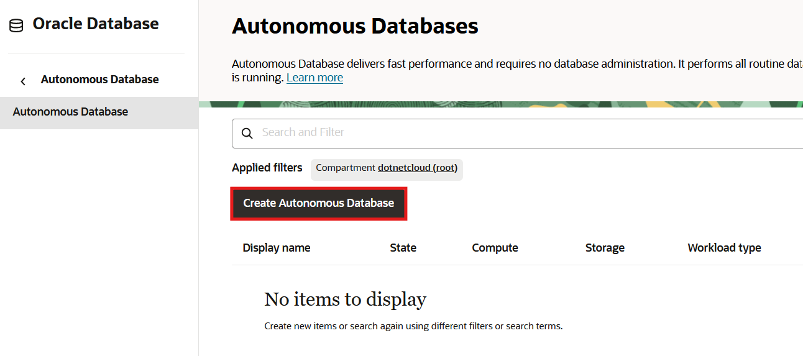
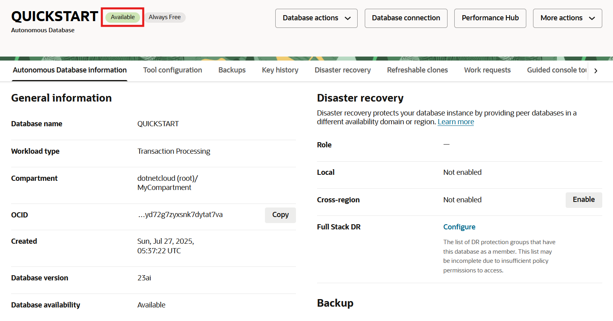

# Provision an Oracle Autonomous Database

## Introduction

This lab walks you through the steps to quickly provision an Oracle Autonomous Database (either Autonomous Transaction Processing [ATP] or Autonomous Data Warehouse [ADW]) on Oracle Cloud. You will use this database in subsequent labs of this workshop.

Estimated lab time: 10 minutes

_Note: While this lab uses ATP, the steps are identical for creating and connecting to an ADW database._

### Objectives

- Provision a new Autonomous Transaction Processing instance.

### Prerequisites

- This lab requires completion of the **Get Started** section in the Contents menu on the left.

## Task 1: Choosing an Autonomous Database from the Services Menu

1. Log in to the Oracle Cloud, as shown in the previous lab.
2. Once you are logged in, you are taken to the cloud services dashboard where you can see all the services available to you. Click the navigation menu in the upper left to show top level navigation choices.

   **Note:** You can directly create your Autonomous Transaction Processing or Autonomous Data Warehouse service in the **Build** section of the dashboard as well.

   

3. The following steps apply similarly to either Autonomous Data Warehouse or Autonomous Transaction Processing. This lab shows provisioning of an Autonomous Transaction Processing database, so click **Oracle Database** --> **Autonomous Database**.

   

4. This console shows that no databases yet exist in the compartment. If there were a long list of databases, you could filter the list by the **State** of the database (available, stopped, terminated, and so on) or **Display name**.
   

## Task 2: Creating the Autonomous Database Instance

1. Click **Create Autonomous Database** to start the instance creation process.

   

2. This brings up the **Create Autonomous Database Serverless** screen where you will specify the configuration of the instance.
3. Provide basic information for the autonomous database:

   **Display name** - Enter a memorable, user-friendly name for the database for display purposes. For this lab, use **QUICKSTART**.  
   **Database name** - Enter a database name for this instance. For this lab, use **QUICKSTART**.  
   **Compartment** - Select your root compartment or another compartment for the database from the drop-down list. In the example below, **MyCompartment** was created ahead of time and chosen. If you want to learn how to create a new compartment, click [here](https://docs.cloud.oracle.com/iaas/Content/Identity/Tasks/managingcompartments.htm#Working). To learn more about compartments, click [here](https://docs.cloud.oracle.com/en-us/iaas/Content/GSG/Concepts/settinguptenancy.htm#Setting_Up_Your_Tenancy). Avoid the use of the **ManagedCompartmentforPaaS** compartment as this is an Oracle default used for Oracle Platform Services. 

   

4. Select the workload type for your database from the choices:

   **Transaction Processing** - For this lab, choose **Transaction Processing** as the workload type.  
   **Data Warehouse** - Alternately, you could chose Data Warehouse as the workload type.

   

5. Configure the database:

   **Always Free** - If your cloud account offers it, leave this option enabled to create an always free autonomous database, which comes with 1 CPU and 20 GB of storage.  
   **Choose database version** - Select a database version from the available versions. Oracle recommends version **23ai**.

   

6. Create administrator credentials:

   **Password** and **Confirm Password** - Specify the password for ADMIN user of the service instance. The password must meet the following requirements:  
   1) The password must be between 12 and 30 characters long and must include at least one uppercase letter, one lowercase letter, and one numeric character.  
   2) The password cannot contain the username.  
   3) The password cannot contain the double quote (") character.  

   

7. Choose network access:

   For this lab, accept the default, **Secure access from everywhere**.  
   If you want to allow traffic only from the IP addresses and VCNs you specify where access to the database from all public IPs or VCNs is blocked, select **Secure access from allowed IPs and VCNs only**.  
   If you want to restrict access to a private endpoint within an OCI VCN, select **Private endpoint access only**.  
   If the **Require mutual TLS (mTLS) authentication** option is selected, mTLS will be required to authenticate connections to your Autonomous Database. TLS connections allows Oracle Data Provider for .NET to connect to your Autonomous Database without a wallet. See the [documentation for network options](https://docs.oracle.com/en/cloud/paas/autonomous-database/adbsa/support-tls-mtls-authentication.html#GUID-3F3F1FA4-DD7D-4211-A1D3-A74ED35C0AF5) for options to allow TLS, or to require only mutual TLS (mTLS) authentication.

   

8. For this lab, do not provide a contact email address. The **Contact email** field allows you to list contacts to receive operational notices and announcements as well as unplanned maintenance notifications.

9. Click **Create** to create the autonomous database.

    

10. Your instance will begin provisioning. In a few minutes, the state will turn from *Provisioning* to *Available*. At this point, your Autonomous Transaction Processing database is ready to use! Have a look at your instance's details here including its name, database version, workload type, and compartment.

    
    Provisioning an Autonomous Database instance.  

    A **Check database lifecycle state** informational box is displayed. You can navigate through this tour or skip it.

    
    Autonomous Database instance successfully provisioned.

You may now **proceed to the next lab.**

## Want to Learn More?

Click [here](https://docs.oracle.com/en/cloud/paas/autonomous-database/serverless/adbsb/index.html) for documentation on using Oracle Autonomous Database Serverless.

## Acknowledgements

- **Author** - Richard Green, Alex Keh
- **Last Updated By/Date** - Alex Keh, September 2025
