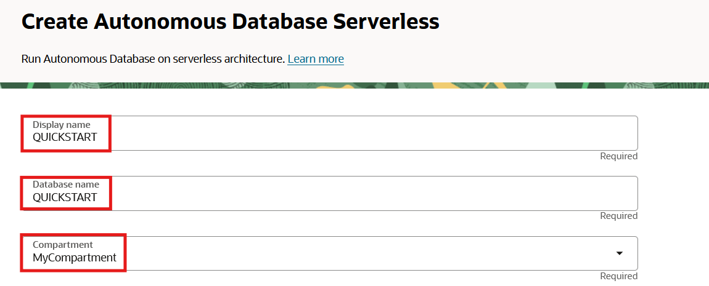
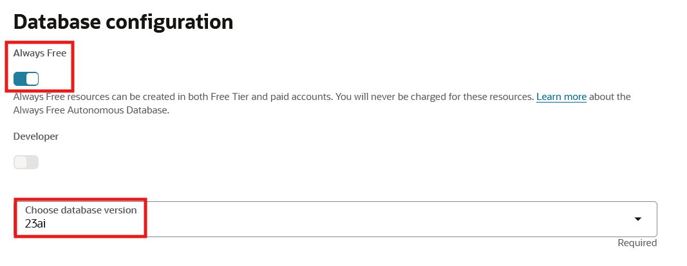
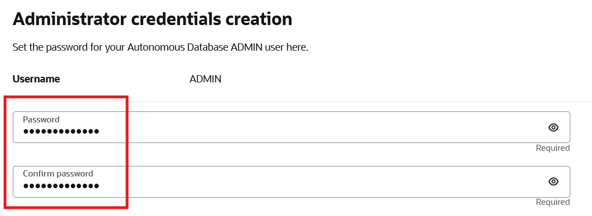
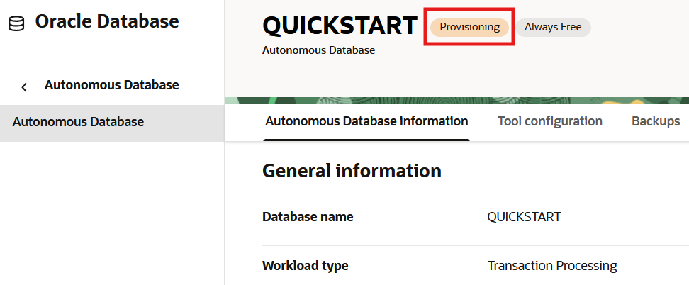

# Provision an Oracle Autonomous Database

## Introduction

This lab walks you through the steps to quickly provision an Oracle Autonomous Database (either Autonomous Transaction Processing [ATP] or Autonomous Data Warehouse [ADW]) on Oracle Cloud. You will use this database in subsequent labs of this workshop.

Estimated lab time: 10 minutes

*Note: While this lab uses ATP, the steps are identical for creating and connecting to an ADW database.*

### Objectives

-   Provision a new Autonomous Transaction Processing instance.

### Prerequisites

-   This lab requires completion of the **Get Started** section in the Contents menu on the left.  

## Task 1: Choosing ATP or ADW from the Services Menu

1. Log in to the Oracle Cloud, as shown in the previous lab.
2. Once you are logged in, you are taken to the cloud services dashboard where you can see all the services available to you. Click the navigation menu in the upper left to show top level navigation choices.

    __Note:__ You can also directly access your Autonomous Transaction Processing or Autonomous Data Warehouse service in the __Quick Actions__ section of the dashboard.

    

3. The following steps apply similarly to either Autonomous Data Warehouse or Autonomous Transaction Processing. This lab shows provisioning of an Autonomous Transaction Processing database, so click **Oracle Database** -> **Autonomous Transaction Processing**.

    

4. On the left side, make sure your **Workload Type** is __Transaction Processing__ or __All__ to see your Autonomous Transaction Processing instances. You can use the __Compartment__ drop-down menu to select a compartment. Select your root compartment, or another compartment of your choice where you will create your new ATP instance. If you want to learn how to create a new compartment, click [here](https://docs.cloud.oracle.com/iaas/Content/Identity/Tasks/managingcompartments.htm#Working). To learn more about compartments, click [here](https://docs.cloud.oracle.com/en-us/iaas/Content/GSG/Concepts/settinguptenancy.htm#Setting_Up_Your_Tenancy).

 __Note__ - Avoid the use of the ManagedCompartmentforPaaS compartment as this is an Oracle default used for Oracle Platform Services.

    

5. This console in the last screenshot shows that no databases yet exist. If there were a long list of databases, you could filter the list by the state of the databases (available, stopped, terminated, and so on). You can also sort by __Workload Type__. Here, the __Transaction Processing__ workload type is selected.

## Task 2: Creating the Autonomous Database Instance

1. Click **Create Autonomous Database** to start the instance creation process.

    

2.  This brings up the __Create Autonomous Database__ screen where you will specify the configuration of the instance.
3. Provide basic information for the autonomous database:

    - __Compartment__ - Select a compartment for the database from the drop-down list. In the example below, **MyCompartment** was created ahead of time and chosen.
    - __Display Name__ - Enter a memorable name for the database for display purposes. For this lab, use __QUICKSTART__.
    - __Database Name__ - Use letters and numbers only, starting with a letter. Maximum length is 14 characters. (Underscores not initially supported.) For this lab, use __QUICKSTART__.

    

4. Choose a workload type. Select the workload type for your database from the choices:

    - __Transaction Processing__ - For this lab, choose __Transaction Processing__ as the workload type.
    - __Data Warehouse__ - Alternately, you could have chosen Data Warehouse as the workload type.

    

5. Choose a deployment type. Select the deployment type for your database from the choices:

    - __Shared Infrastructure__ - For this lab, choose __Shared Infrastructure__ as the deployment type.
    - __Dedicated Infrastructure__ - Alternately, you could have chosen Dedicated Infrastructure as the workload type.

    

6. Configure the database:

    - __Always Free__ - If your cloud account offers it, select this option to create an always free autonomous database, which comes with 1 CPU and 20 GB of storage.
    - __Choose database version__ - Select a database version from the available versions.
    - __OCPU count__ - Number of CPUs for your service. For this lab, specify __1 CPU__.  An Always Free database comes with 1 CPU.
    - __Storage (TB)__ - Select your storage capacity in terabytes. For this lab, specify __0.02 TB__ of storage (20 GB). An Always Free database comes with 20 GB of storage.
    - __OCPU Auto Scaling__ - For this lab, you can disable OCPU auto scaling. Auto scaling allows the system to automatically use up to three times more CPU and IO resources to meet workload demand. The Always Free database does not scale up/down.
    - __Storage Auto Scaling__ - For this lab, you can disable storage auto scaling. The Always Free database does not scale up/down.
    - __New Database Preview__ - If a checkbox is available to preview a new database version, do __not__ select it.

    

7. Create administrator credentials:

    - __Password and Confirm Password__ - Specify the password for ADMIN user of the service instance. The password must meet the following requirements:
    - The password must be between 12 and 30 characters long and must include at least one uppercase letter, one lowercase letter, and one numeric character.
    - The password cannot contain the username.
    - The password cannot contain the double quote (") character.
    - The password must be different from the last 4 passwords used.
    - The password must not be the same password that is set less than 24 hours ago.
    - Re-enter the password to confirm it. Make a note of this password.

    
8. Choose network access:
    - For this lab, accept the default, "Secure access from everywhere."
    - If you want to allow traffic only from the IP addresses and VCNs you specify where access to the database from all public IPs or VCNs is blocked, select "Secure access from allowed IPs and VCNs only" in the Choose network access area.
    - If you want to restrict access to a private endpoint within an OCI VCN, select "Private endpoint access only" in the Choose network access area.
    - If the "Require mutual TLS (mTLS) authentication" option is selected, mTLS will be required to authenticate connections to your Autonomous Database. TLS connections allows Oracle Data Provider for .NET to connect to your Autonomous Database without a wallet. See the [documentation for network options](https://docs.oracle.com/en/cloud/paas/autonomous-database/adbsa/support-tls-mtls-authentication.html#GUID-3F3F1FA4-DD7D-4211-A1D3-A74ED35C0AF5) for options to allow TLS, or to require only mutual TLS (mTLS) authentication.

    

9. Choose a license type. For this lab, choose __License Included__. The two license types are:

    - __Bring Your Own License (BYOL)__ - Select this type when your organization has existing database licenses.
    - __License Included__ - Select this type when you want to subscribe to new database software licenses and the database cloud service.
    

10. For this lab, do not provide a contact email address. The "Contact Email" field allows you to list contacts to receive operational notices and announcements as well as unplanned maintenance notifications.

    

10. Click __Create Autonomous Database__.

    

11.  Your instance will begin provisioning. In a few minutes the state will turn from Provisioning to Available. At this point, your Autonomous Transaction Processing database is ready to use! Have a look at your instance's details here including its name, database version, CPU count and storage size.

    
    Provisioning an Autonomous Database instance.

    
    Autonomous Database instance successfully provisioned.

You may now **proceed to the next lab.**

## Want to Learn More?

Click [here](https://docs.oracle.com/en/cloud/paas/autonomous-data-warehouse-cloud/user/autonomous-workflow.html#GUID-5780368D-6D40-475C-8DEB-DBA14BA675C3) for documentation on the typical workflow for using Autonomous Database.

## Acknowledgements

- **Author** - Richard Green, Alex Keh
- **Last Updated By/Date** - Alex Keh, June 2023