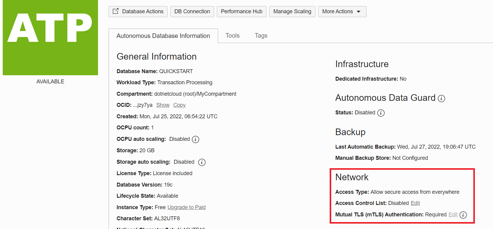
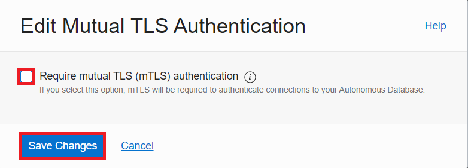

# Enable one-way TLS without wallets

## Introduction

Oracle Autonomous Database on Shared Exadata Infrastructure secures connectionsby using the Transport Layer Security (TLS) protocol. TLS encrypts ODP.NET and database communication and enables both sides to authenticate each other. For Oracle Autonomous Database TLS, there are are two options available:
- mutual TLS (mTLS)
- one-way TLS

mTLS connections enable the database client and server to authenticate each other. It is used by Oracle Autonomous Database by default and requires wallets.

One-way TLS feature just the client authenticating against the database server. The key differences are that it does not require wallets and its connection latency is better compared to mTLS. One-way TLS connections remain secure since they can only be used only with
- Private endpoints
- Public endpoints with an Access Control List (ACL) that has at least one IP or VCN rule

In this lab, you will enable one-way TLS without wallets to simplify web application set up easier with Oracle Autonomous Database. You will add the web server's IP to the ACL. You will also record the database's connect descriptor. With just the connect descriptor information, you will be able to connect to the database without having to deploy wallet, sqlnet.ora, nor tnsnames.ora files in the next lab when you deploy a web application.

Estimated Time: 5 minutes

### Objectives
In this lab, you will:
- Add the web server's IP address to the database's ACL
- Enable one-way TLS for your Oracle Autonomous Database isntance
- Retrieve the database's connect descriptor

### Prerequisites

* Complete the preceding labs that create the Oracle Autonomous Database instance and configure the web server.

## Task 1: Add the Web Server to the ACL and Enable One-Way TLS

Connect to the Oracle Autonomous Database instance you created in a previous lab to enable one-way TLS connectivity with the web server.

1. From the cloud console, click the navigation menu in the upper left to show top level navigation choices. Then, click **Oracle Database** -> **Autonomous Database**.

    

2. Click on the **QUICKSTART** instance you created previusly.

    

3.  In the **Network** section, click **Edit** on the **Access Control List** line.

    

4.  Let's add the web server to the database's one-way TLS ACL allow-list. For the **IP Notation Type** "IP Address", add the web server's IP address that you recorded earlier after creating the web server VM under **Values** text box. Then, click the **Save Changes** button.

    

5. In the **Network** section, click the **Edit** on the **Mutual TLS (mTLS) Authentication** line.

    

6.  Uncheck the **Require mutual TLS (mTLS) authentication** box and click the **Save Changes** button.

    

The web server can now connect to Oracle Autonomous Database via one-way TLS without a wallet.

## Task 2: Retrieve the Database Connect Descriptor

Now that a wallet is no longer needed, you will record the database's connect descriptor information, which will eliminate the need to deploy sqlnet.ora and tnsnames.ora on the web server.

1. Click on the **DB Connection** button near the top of the page.

    

2. Scroll down to the **Connection Strings** section. Choose **TLS** from the **TLS Authentication** drop down box. This selection provides a connection string value for each of the database TNS Names. Click on **Copy** next to the connection string text value you plan to use for your web application (e.g. quickstart_tpurgent).

    

3. Paste this connection string to a file for use when configuring the .NET web application connection in the next lab. **Some versions of cloud console** use a connect descriptor that includes the distinguished name in double quotes. If present, remove the two double quotes that enclose the distinguished name and save the file. The end of the connection string should now look similar to the following:

        ```
        ...(ssl_server_cert_dn=CN=adwc.uscom-east-1.oraclecloud.com, OU=Oracle BMCS US, O=Oracle Corporation, L=Redwood City, ST=California, C=US)))
        ``` 

You may now **proceed to the next lab.**

## Acknowledgements

- **Author** - Alex Keh 
- **Last Updated By/Date** - Alex Keh, June 2022