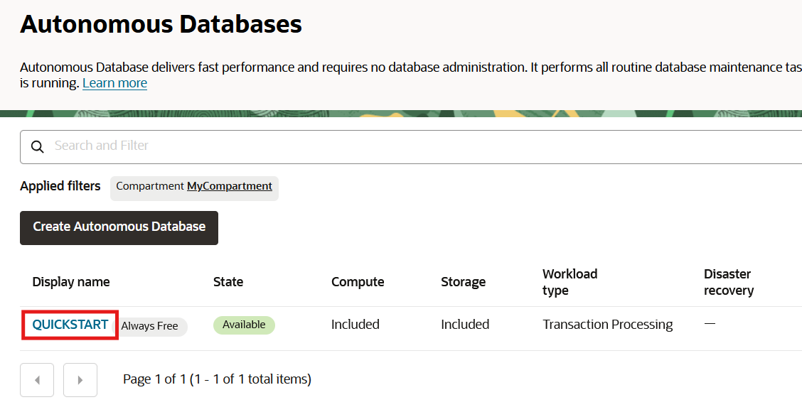
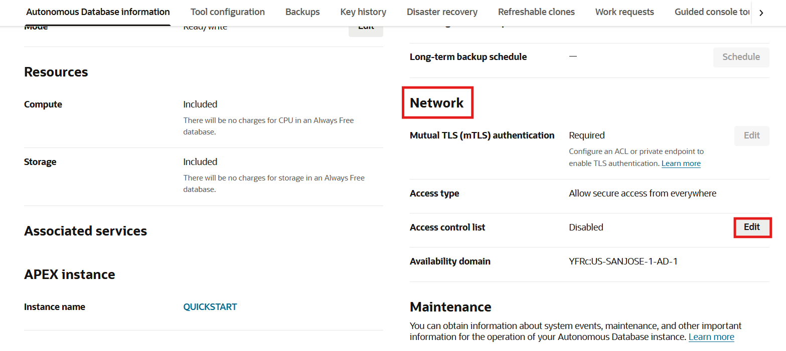
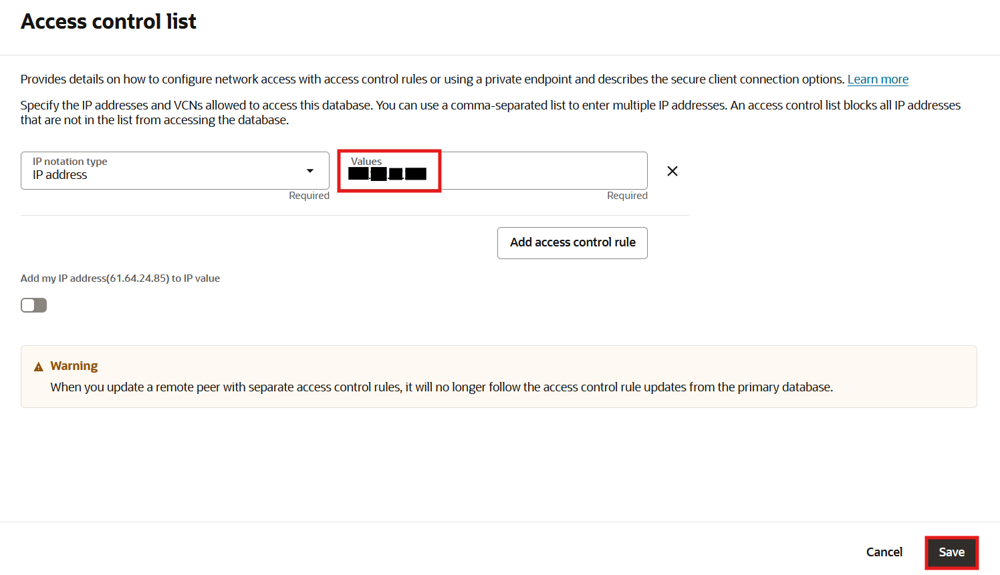
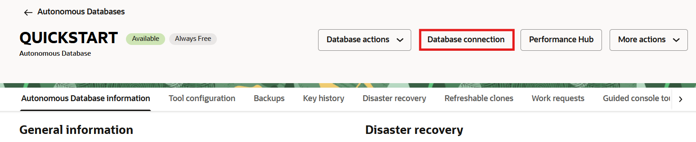
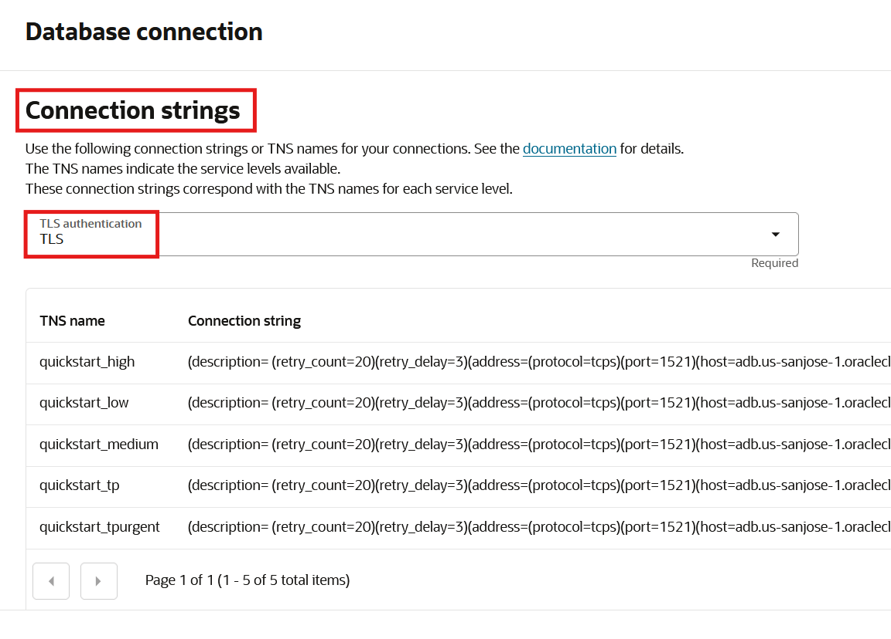

# Enable one-way TLS without wallets

## Introduction

Oracle Autonomous Database Serverless secures connections by using the Transport Layer Security (TLS) protocol. TLS encrypts ODP.NET and database communication and enables both sides to authenticate each other. With Oracle Autonomous Database, there are are two TLS options available:
- mutual TLS (mTLS)
- one-way TLS

mTLS connections enable the database client and server to authenticate each other. It is used by Oracle Autonomous Database by default and requires wallets.

One-way TLS features just the client authenticating against the database server. The key differences are that it does not require wallets and lower connection latency compared to mTLS. One-way TLS connections remain secure since they can only be used only with
- Private endpoints
- Public endpoints with an Access Control List (ACL) that has at least one IP or VCN rule

In this lab, you will enable one-way TLS without wallets to simplify web application set up easier with Oracle Autonomous Database. You will add the web server's IP to the ACL. You will also record the database's connect descriptor. With just the connect descriptor information, you will be able to connect to the database without having to deploy wallet, sqlnet.ora, nor tnsnames.ora files in the web application lab.

Estimated lab time: 5 minutes

### Objectives
In this lab, you will:
- Add the web server's IP address to the database's ACL
- Enable one-way TLS for your Oracle Autonomous Database instance
- Retrieve the database's connect descriptor

### Prerequisites

* Complete the preceding labs that create the Oracle Autonomous Database instance and configure the web server.

## Task 1: Add the Web Server to the ACL and Enable One-Way TLS

Connect to the Oracle Autonomous Database instance you created in a previous lab to enable one-way TLS connectivity with the web server.

1. From the cloud console, click the navigation menu in the upper left to show top level navigation choices. Then, click **Oracle Database** -> **Autonomous Database**.

    

2. Verify you are in the correct compartment (i.e., MyCompartment). Click on the **QUICKSTART** instance previously created.

    

3.  Scroll down to the **Network** section, click **Edit** on the **Access control list** line.

    

4.  Add the web server IP address to the database's one-way TLS ACL allow-list. For the **IP notation type** "IP Address", enter the web server's public IP address in the **Values** text box. You recorded the IP earlier after creating the web server in the last lab. When finished, click the **Save** button.

    

5. The Oracle Autonomous Database instance will take a moment to make the update. When the update completes, go back to the **Network** section, click the **Edit** on the **Mutual TLS (mTLS) Authentication** line.

    

6.  Move the **Require mutual TLS (mTLS) authentication** slider left to the off position and click the **Save** button.

    

The web server can now connect to Oracle Autonomous Database via one-way TLS without a wallet.

## Task 2: Retrieve the Database Connect Descriptor

Retrieve the database's connect descriptor information. By using this descriptor, you do not need to deploy the sqlnet.ora and tnsnames.ora files on the web server.

1. Click on the **Database Connection** button near the top of the page.

    

2. Scroll down to the **Connection strings** section. Choose **TLS** from the **TLS Authentication** drop down box. This selection provides a connection string value for each database TNS name. 

    

3. Below the **TLS Authentication** drop down box is a table containing the Oracle Autonomous Database TNS names and connection strings.   Scroll right to the end of the table and click on the first ellipsis. A **Copy** command appears. Click it and then paste the connection string to a file. We will use the connection string in the next lab.   Click the **Cancel** button when finished.

    

Some versions of cloud console use a connection string with the distinguished name in double quotes. If present, remove the two double quotes that enclose the distinguished name and save the string. If there is no distinguished name in your connection string, then this change doesn't apply to your connection string.

You may now **proceed to the next lab.**

## Acknowledgements

- **Author** - Alex Keh 
- **Last Updated By/Date** - Alex Keh, September 2025