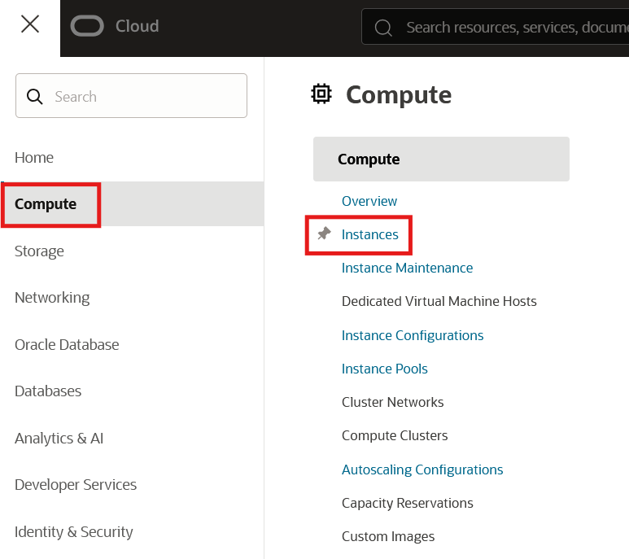
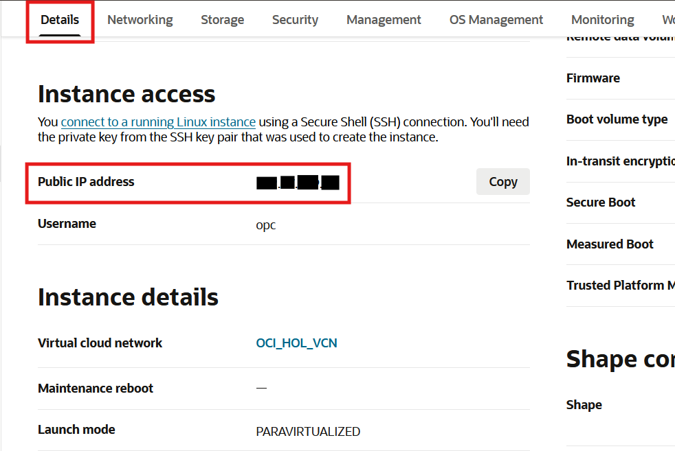
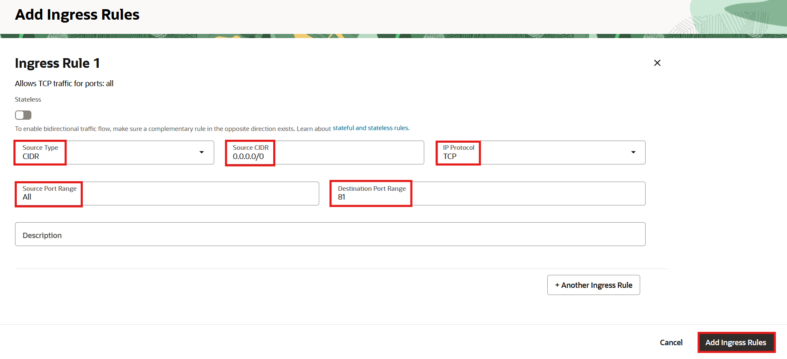

# Provision and Set Up the Web Server and Networking

## Introduction

In this lab, you will provision and configure an Oracle Cloud Infrastructure Linux compute host and NGINX web server. You will then setup ASP.NET Core support for NGINX and tests the web server is working properly. Finally, you will configure the Virtual Cloud Network to setup connectivity between the compute and database layers.

Oracle Cloud Infrastructure Compute lets you provision and manage compute hosts, known as instances. You can launch instances as needed to meet your compute and application requirements. After you launch an instance, you can access it securely from your computer, restart it, attach and detach volumes, and terminate it when you're done with it. Any changes made to the instance's local drives are lost when you terminate it. Any saved changes to volumes attached to the instance are retained.

Oracle Cloud Infrastructure (OCI) Compute lets you create multiple Virtual Cloud Networks (VCNs). These VCNs will contain security lists, compute instances, load balancers and many other types of network assets.

Be sure to review [Best Practices for Your Compute Instance](https://docs.cloud.oracle.com/iaas/Content/Compute/References/bestpracticescompute.htm) for important information about working with your Oracle Cloud Infrastructure Compute instance.

Estimated Time: 20 minutes

[](youtube:09kahbIF0Ew)

### Objectives
In this lab, you will:
- Create a compute instance
- Connect to the compute instance
- Install and configure NGINX web server
- Create and configure the VCN

### Prerequisites

-   This lab requires completion of the **Getting Started** section in the Contents menu on the left.
  
## Task 1: Create <if type="freetier">a Web Server on </if>a Compute Instance

Oracle Cloud Infrastructure  offers both Bare Metal and Virtual Machine instances:

- **Bare Metal**  - A bare metal compute instance gives you dedicated physical server access for highest performance and strong isolation.
- **Virtual Machine**  - A Virtual Machine (VM) is an independent computing environment that runs on top of physical bare metal hardware. The virtualization makes it possible to run multiple VMs that are isolated from each other. VMs are ideal for running applications that do not require the performance and resources (CPU, memory, network bandwidth, storage) of an entire physical machine.

An Oracle Cloud Infrastructure VM compute instance runs on the same hardware as a Bare Metal instance, leveraging the same cloud-optimized hardware, firmware, software stack, and networking infrastructure.

1. Click the **Navigation Menu** in the upper left. Navigate to **Compute**, and select **Instances**.

	

2. On the drop-down menu on the left side of the web page, select the compartment that you wish to create the VM instance. Then, click the **Create Instance** button. This will launch a VM instance for this lab.
  

3. The Create Compute Instance wizard will launch.
    Enter **Web-Server** as the name of the server. Click **Edit** on the **Image and Shape** area of the page. 

    

    LL - Enter your username + *-Instance* as the name of the server.

    
   
<if type="livelabs"></if>
<if type="freetier"></if>
4. LL - Click *Change Shape* to choose a VM shape.

    

5. LL - Click **Edit** on the **Networking** area of the page.

    

4. Click *Change image* to choose a VM image.

    

5. In the Change Image section, allow the **Platform Images** in the image sources to load. Select the **Oracle Linux Cloud Developer** check box and accept the default values. This Linux image has .NET Core Software Development Kit and Visual Studio Code installed. Select the checkbox indicating that you have reviewed the image's terms and conditions. Click the **Select Image** button.

    

6. Move to the next section on networking. Click **Edit** on the **Networking** area of the page. 

    

7. Scroll down and select the **Assign a public IPv4 address** option.

    

    LL - 

    **Note:** You need a public IP address to be able to SSH into the running instance later in this lab.

8. Scroll down to the **Add SSH keys** area of the page. Select **Generate a key pair for me**. Click on the **Save Private Key** and **Save Public Key** buttons that appear to save the two files: **ssh-key-&lt;date&gt;.key** (private key) and **ssh-key-&lt;date&gt;.key.pub** (public key). Keep the private key safe and don't share its content with anyone. The public key will be needed for use with Oracle Cloud Shell to secure cloud communications.

    

9. Press the **Create** button to create your instance. 

    

    Launching an instance is simple and intuitive with few options to select. The provisioning of the compute instance will complete in less than a minute, and the instance state will change from *PROVISIONING* to *RUNNING*.

9. Once the instance state changes to *RUNNING*, you can SSH to the Public IP address of the instance. The Public IP address is noted under *Instance Access*. Record this IP address for use when you SSH and set up one-way TLS without wallets later on.

    

    LL - 

## Task 2: Connect to the Instance and Install NGINX Web Server

>**Note**: You may need to log in as the *admin* user to use cloud shell.

1. To connect to the instance, use Cloud Shell and enter the following command:

    >**Note:** For Oracle Linux VMs, the default username is **opc**

    ```
    <copy>ssh -i <private_ssh_key> opc@<public_ip_address></copy>
    ```

    
   
2. For this lab, we are going to install an NGINX web server and try to connect to it over the public Internet. *Make sure you have SSH'ed into the Linux instance* and run following commands:

    >**Note:** NGINX web server is a free, open-source web server. The NGINX server hosts web content, and responds to requests for this content from web browsers.

    - Install NGINX and its dependencies

        ```
        <copy>sudo dnf install -y nginx</copy>
        ```

    - Change the default incoming TCP port to 81 by by opening the file, <i>/etc/nginx/conf.d/default.conf</i>, for editing. Modify the following two lines:

        ```
        listen 80 default_server;
        listen [::]:80 default_server;
        ```
to use port 81:

        ```
        <copy>listen 81 default_server;
        listen [::]:81 default_server;</copy>
        ```

    - Start the NGINX server and configure it to start after system reboots

        ```
        <copy>sudo systemctl enable --now nginx.service</copy>
        ```

    - Run a quick check on NGINX status

        ```
        <copy>sudo systemctl status nginx</copy>
        ```

    - Create firewall rules to allow access to the ports on which the HTTP server listens

        ```
        <copy>sudo firewall-cmd --add-service=http --permanent
	sudo firewall-cmd --reload</copy>
        ```

    - (Delete?)Create an index file for your web server

        ```
        <copy>sudo bash -c 'echo This is my web server running on Oracle Cloud Infrastructure >> /usr/share/nginx/html/index.html'</copy>
        ```

3. Let's now open port 81 in the VCN security list. Click the **Navigation Menu** in the upper left. Navigate to **Networking**, and select **Virtual Cloud Networks**. Then click on the VCN name you created for this workshop.

	

4. Now click **Security Lists** on the left navigation bar for the VCN.
 
     

5. Click on the **Default Security List**.

6. Here you need to open port 81. Click **Add Ingress Rules** and add the following values as shown below:

    - **Source Type:** CIDR
    - **Source CIDR**: 0.0.0.0/0
    - **IP Protocol:** TCP
    - **Source Port Range:** All
    - **Destination Port Range:** 81
    - Click **Add Ingress Rules** at the bottom

    

7. Navigate to `http://<public_ip_address>` (the IP address of the Linux VM) in your browser. And now you should see the index page of the web server we created above.

    

You have completed this lab. You may now **proceed to the next lab.**
## Troubleshooting

1. If you are unable to see the web server on your browser, possible scenarios include:

    - VCN Security Lists is blocking traffic, Check VCN Security List for ingress rule for port 81
    - Firewall on the linux instance is blocking traffic

        - `# sudo firewall-cmd --zone=public --list-services` (this should show http service as part of the public zone)
        - `# sudo netstat -tulnp | grep httpd` (an httpd service should be listening on the port 81, if it’s a different port, open up that port on your VCN SL)

    - Your company VPN is blocking traffic

2. If you cannot successfully run the `sudo` commands, please make sure you have SSH'ed into your compute instance by following Task 2 -> Step 1.

## Acknowledgements

- **Author** - Rajeshwari Rai, Prasenjit Sarkar, Alex Keh
- **Last Updated By/Date** - Alex Keh, June 2022