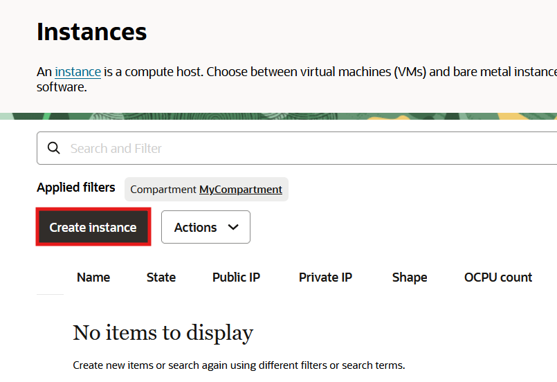
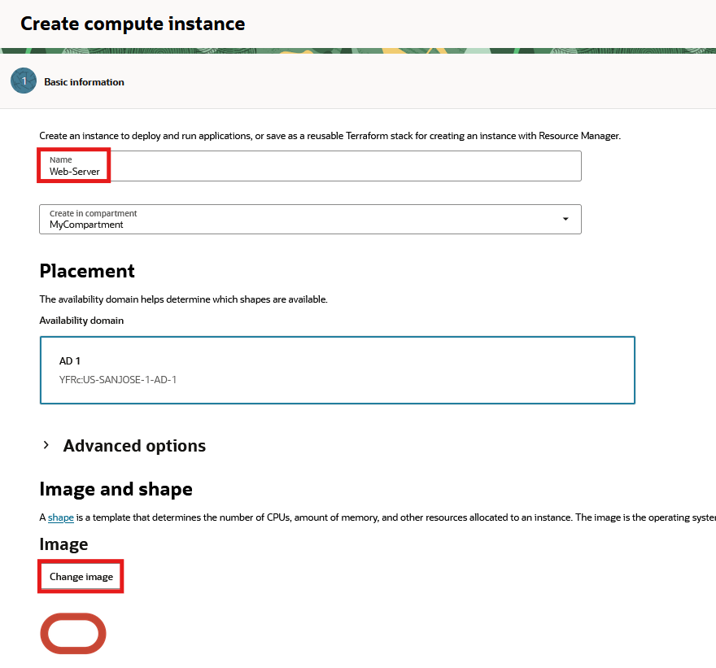
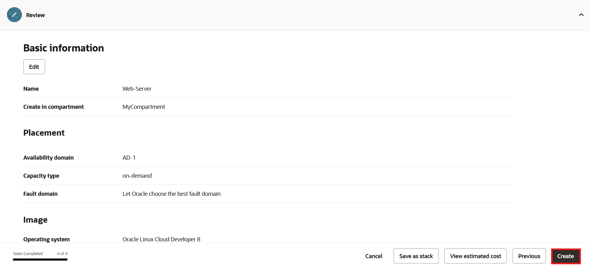
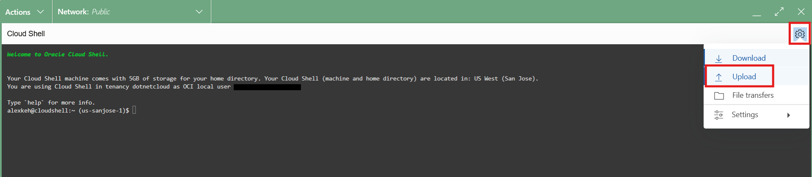
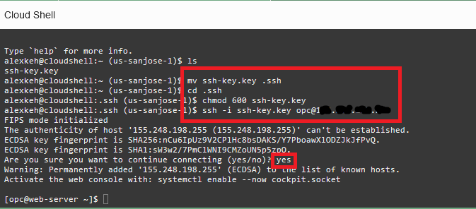
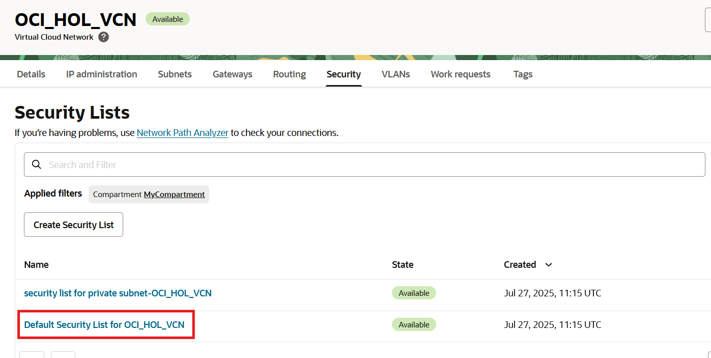

# Provision and set up the web server

## Introduction

In this lab, you will provision and configure an Oracle Cloud Infrastructure Linux compute host and NGINX web server. You will then setup ASP.NET Core for NGINX and test the web server is working properly. Finally, you will complete Virtual Cloud Network configuration for connectivity between the compute and database layers.

Oracle Cloud Infrastructure Compute lets you provision and manage compute hosts, known as instances. You can launch instances as needed to meet your compute and application requirements. After you launch an instance, you can access it securely from your computer, restart it, attach and detach volumes, and terminate it when you're done with it. Any changes made to the instance's local drives are lost when you terminate it. Any saved changes to volumes attached to the instance are retained.

Oracle Cloud Infrastructure (OCI) Compute lets you create multiple Virtual Cloud Networks (VCNs). These VCNs will contain security lists, compute instances, load balancers and many other types of network assets.

Be sure to review [Best Practices for Your Compute Instance](https://docs.cloud.oracle.com/iaas/Content/Compute/References/bestpracticescompute.htm) for important information about working with your Oracle Cloud Infrastructure Compute instance.

Estimated lab time: 20 minutes

Watch the video below for a quick walk-through of the lab.
[Provision and set up the web server](videohub:1_yg1f33ir)

### Objectives
In this lab, you will:
- Create a compute instance
- Connect to the compute instance
- Install and configure NGINX web server
- Create and configure the VCN

### Prerequisites

-   This lab requires completion of the **Get started** section and networking lab in the Contents menu on the left.
  
## Task 1: Create a Compute Instance

Oracle Cloud Infrastructure  offers both Bare Metal and Virtual Machine instances:

- **Bare Metal**  - A bare metal compute instance gives you dedicated physical server access for highest performance and strong isolation.
- **Virtual Machine**  - A Virtual Machine (VM) is an independent computing environment that runs on top of physical bare metal hardware. The virtualization makes it possible to run multiple VMs that are isolated from each other. VMs are ideal for running applications that do not require the performance and resources (CPU, memory, network bandwidth, storage) of an entire physical machine.

An Oracle Cloud Infrastructure VM compute instance runs on the same hardware as a Bare Metal instance, leveraging the same cloud-optimized hardware, firmware, software stack, and networking infrastructure.

1. Click the **Navigation Menu** in the upper left. Navigate to **Compute**, and select **Instances**.

	

2. On the **Compartment** drop-down menu on the left side of the web page, select the compartment that you wish to create the VM instance (e.g. MyCompartment). Then, click the **Create Instance** button. This will launch a VM instance for this lab.

    

3. The Create Compute Instance wizard will launch.
    Enter **Web-Server** as the name of the server. Click **Edit** on the right side of the **Image and Shape** area of the page. 

    
   
4. The **Image and Shape** section expands. Click the **Change image** button to select an operating system image to install on the compute instance.

    

5. Select **Oracle Linux Cloud Developer** image check box and accept the default values. This image includes Oracle Linux, .NET (Core) Software Development Kit, Visual Studio Code, and PowerShell. Review the *Oracle Linux Cloud Developer Image Terms of Use*. Select the check box if you accept the terms. Click the **Select image** button.

    

6. Move to the next section on networking. Click **Edit** on the **Networking** area of the page. 

    

7. Scroll down and select the **Assign a public IPv4 address** option if it's not already been selected.

    

    **Note:** You need a public IP address to be able to SSH into the running instance later in this lab.

8. Scroll down to the **Add SSH keys** area of the page. Select **Generate a key pair for me**. Click on the **Save Private Key** and **Save Public Key** links that appear to save the two files: **ssh-key-<date>.key** (private key) and **ssh-key-<date>.key.pub** (public key). Keep the private key safe and don't share its content with anyone. The public key will be needed for use with Oracle Cloud Shell to secure cloud communications.

    

9. Press the **Create** button at the bottom of the page to create your instance. 

    

    Launching an instance is simple and intuitive with few options to select. The provisioning of the compute instance will complete in less than a minute, and the instance state will change from *PROVISIONING* to *RUNNING*.

10. Once the instance state changes to *RUNNING*, you can SSH to the Public IP address of the instance. The Public IP address is noted under *Instance Access*. Record this IP address for use when you SSH and set up one-way TLS without wallets later on.

    

## Task 2: Connect to the Instance via SSH

>**Note**: You may need to log in as the *admin* user to use Cloud Shell.

1. To connect to the instance, open Cloud Shell by clicking on its icon on the top right part of the menu bar.

    

2. Cloud Shell will open. Open the Cloud Shell menu in the upper right of Cloud Shell. Click **Upload** to begin uploading the private key to the compute instance.

    

3. Upload the private key through Cloud Shell that you auto-generated in the last task. Its default name is in the format, **ssh-key-<date>.key**. Either drop the file into the window or navigate to its location on your local machine. When completed, click the **Upload** button.

    

4. We will use SSH to securely connect to the compute instance. In Cloud Shell, move the private key to the **.ssh** directory and change into that directory. If the **.ssh** directory is not available, you can skip this step.

    ```
    <copy>mv <private_ssh_key> .ssh</copy>
    ```
    ```
    <copy>cd .ssh</copy>
     ```

5. Since this is a private key, assign permissions to protect the key from other users. Enter the following into Cloud Shell:

    ```
    <copy>chmod 600 <private_ssh_key></copy>
    ```

6. SSH into the compute instance. In Oracle Cloud Linux VMs, the default username is **opc**. The compute instance's public IP address is available from the cloud console. Run the following command from Cloud Shell:

    ```
    <copy>ssh -i <private_ssh_key> opc@<public_ip_address></copy>
    ```

    


## Task 3: Install and Configure NGINX Web Server and Setup VCN
   
For this lab, we are going to install an NGINX web server and connect to it over the public Internet. *Make sure you have completed the prior tasks so that you are SSH'ed into the Linux instance*.

NGINX web server is a popular, free, and open-source web server. The NGINX server hosts web content, and responds to requests for this content from web browsers.

1. Run the following commands in Cloud Shell:

    - Install NGINX and its dependencies. This command can take some time to complete.

        ```
        <copy>sudo dnf install -y nginx</copy>
        ```

    - Edit the NGINX configuration file in a text editor, such as Nano, from Cloud Shell, to set the listening port to 81. This step is unnecessary if you intend to keep port 80 as the HTTP port. However, later lab steps assume port 81 is now the listening port.

        ```
        <copy>sudo nano /etc/nginx/nginx.conf</copy>
        ```

      After the text editor opens, search for the following two lines that use port 80 in the *server* context area:

        ```
        listen 80 default_server;
        listen [::]:80 default_server;
        ```

      Modify them to use port 81.

        ```
        <copy>listen 81 default_server;
        listen [::]:81 default_server;</copy>
        ```

      Exit Nano and save the file by typing **Ctrl-X**, then **Y**, and finally the carriage return.

    - Create firewall rules to allow access to HTTP on port 81.

        ```
        <copy>sudo firewall-cmd --permanent --add-service=http</copy>
        ```
        ```
        <copy>sudo firewall-cmd --permanent --add-port=81/tcp</copy>
        ```
        ```
	<copy>sudo firewall-cmd --reload</copy></copy>
        ```

    - Start the NGINX server and load the new web server settings.

        ```
        <copy>sudo systemctl start nginx</copy>
        ```

    - Run a quick check on NGINX status.

        ```
        <copy>sudo systemctl status nginx</copy>
        ```

2. Let's now open port 81 in the VCN security list. Click the **Navigation Menu** in the upper left. Navigate to **Networking**, and select **Virtual Cloud Networks**. 

     

3. Click on the VCN you created earlier (i.e. OCI\_HOL\_VCN) under the **Virtual Cloud Networks** page area.

4. Now click **Security Lists** on the left navigation bar for the VCN.
 
     

5. The compartment's security lists will appear. Click on the **Default Security List**.

     

6. Open port 81 by clicking **Add Ingress Rules** and add the following values as shown below:

    - **Source Type:** CIDR
    - **Source CIDR**: 0.0.0.0/0
    - **IP Protocol:** TCP
    - **Source Port Range:** All
    - **Destination Port Range:** 81

    Click **Add Ingress Rules** at the bottom.

    

7. In your browser, navigate to *http://&lt;public_ip_address&gt;:81*. Use the Linux VM's IP address with the port to use appended since we're using a non-standard HTTP port. You should see the text you added to the web server's index page.

    

You have completed this lab. You may now **proceed to the next lab.**
## Troubleshooting

1. If you are unable to see the web server on your browser, possible scenarios include:

    - VCN Security Lists is blocking traffic, Check VCN Security List for ingress rule for port 81
    - Firewall on the linux instance is blocking traffic

        - `# sudo firewall-cmd --zone=public --list-services` (This should show http service as part of the public zone.)
        - `# sudo netstat -tulnp | grep nginx` (An NGINX service should be listening on the port 81. If it’s a different port, open up that port on your VCN security list.)

    - Your company VPN is blocking traffic

2. If you cannot successfully run the `sudo` commands, make sure you can SSH into your compute instance by following Task 2.

## Acknowledgements

- **Author** - Rajeshwari Rai, Prasenjit Sarkar, Alex Keh
- **Last Updated By/Date** - Alex Keh, August 2022