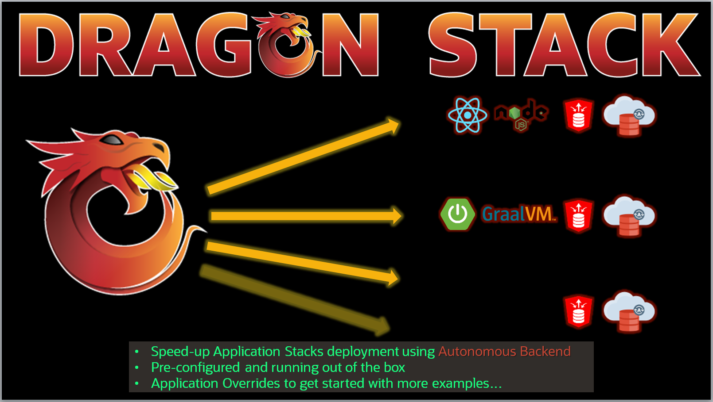

# Introduction

## About this Workshop

This workshop introduces the Oracle DRAGON stack project, a simple way to deploy applications using an Oracle Autonomous Database, using an Always Free Oracle Autonomous Transaction Processing (ATP), Oracle Autonomous JSON Database, or Oracle Autonomous Data Warehouse. In this short workshop, you'll download the DRAGON Stack manager and deploy a React based stack on Oracle Cloud.

Estimated Workshop Time: 30 minutes

### About the DRAGON Stack manager
The DRAGON Stack manager is an open-source project which provides the fastest way to build and run applications connected to an Autonomous Database shared infrastructure. It can indeed:
 - provision and configure an Autonomous Database as well as load JSON data into collections while taking care of the side resources such as Oracle Cloud Infrastructure Object Storage buckets
 - integrates SQL Developer Web and Oracle REST Data Services integration with standard application development frameworks such as React or Spring-Boot
 - generates project source code to start coding as soon as possible!  

  

### Prerequisites

* An Oracle Cloud Account - Please view this workshop's LiveLabs landing page to see which environments are supported

*Note: If you have a **Free Trial** account, when your Free Trial expires your account will be converted to an **Always Free** account. You will not be able to conduct Free Tier workshops unless the Always Free environment is available. **[Click here for the Free Tier FAQ page.](https://www.oracle.com/cloud/free/faq.html)***

You may now [proceed to the next lab](#next).

## Learn More

* [DRAGON Stack manager portal](https://bit.ly/DRAGONStackManager)
* [DRAGON Stack manager on GitHub](https://bit.ly/DragonStack)

## Acknowledgements
* **Author** - Loic Lefevre, Principal Product Manager
* **Last Updated By/Date** - Tom McGinn, Database Product Management, November 2020

