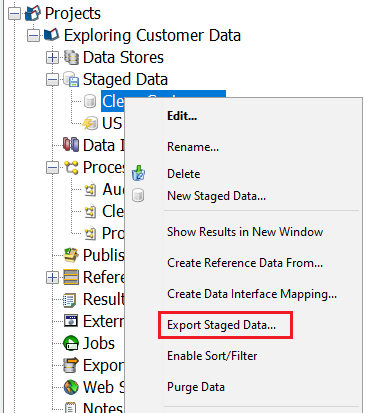
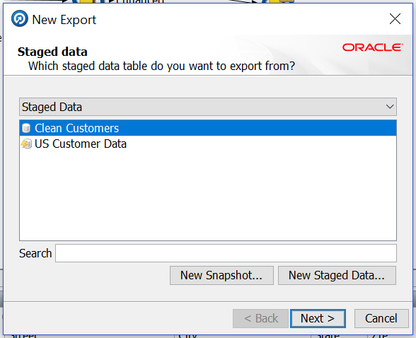
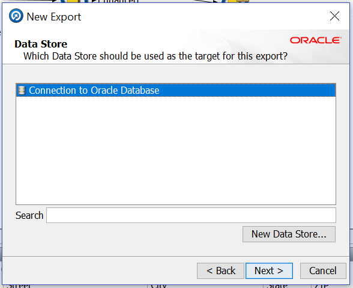
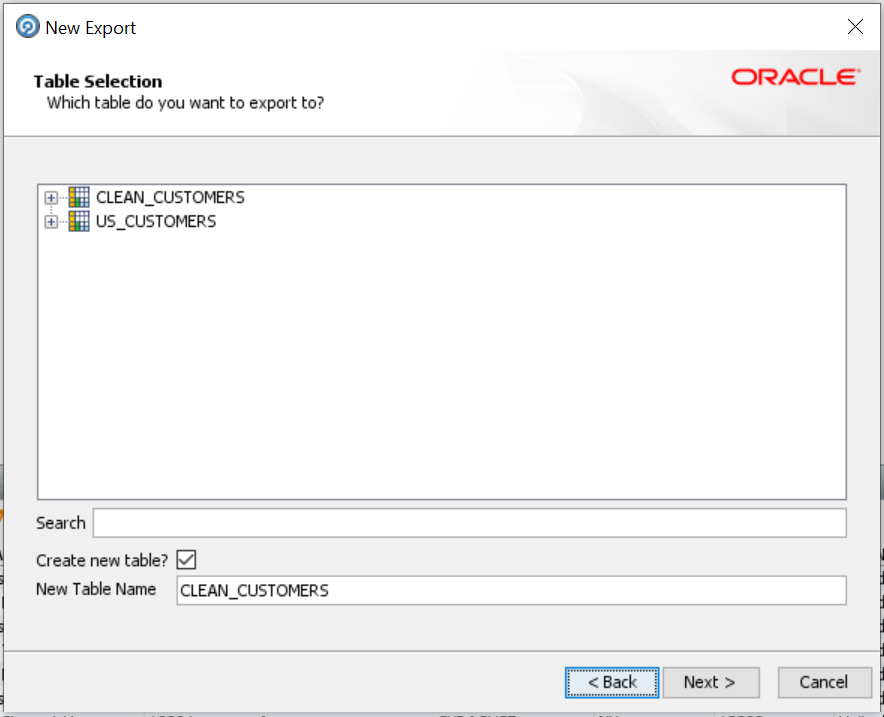
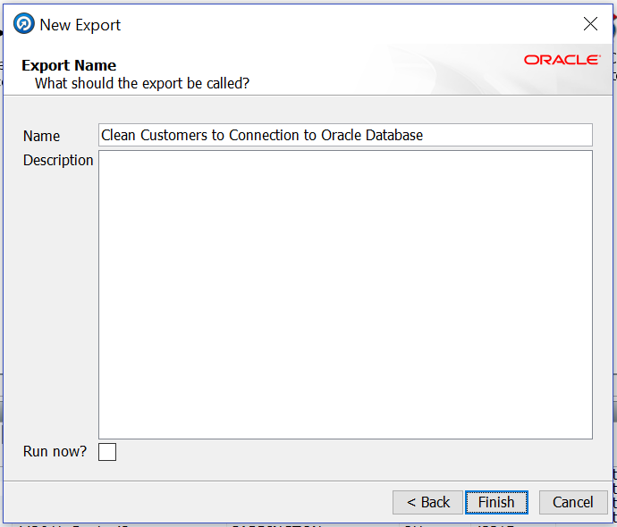
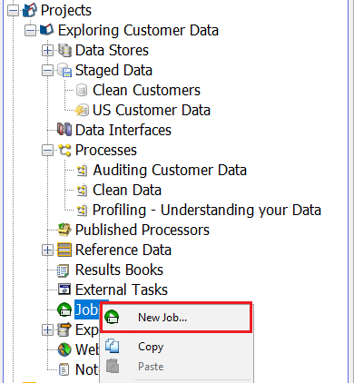
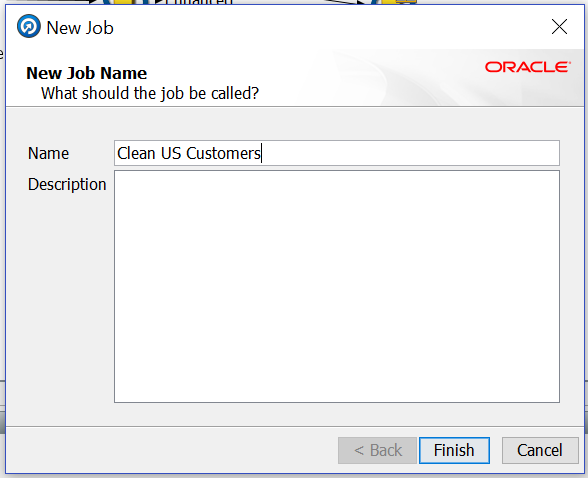
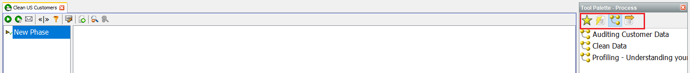
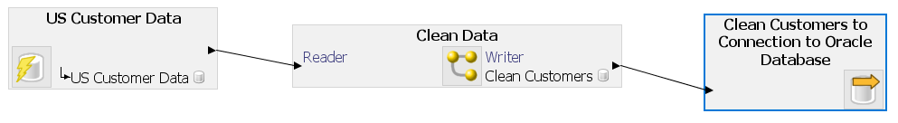

# Prepare EDQ Process for ODI Consumption

## Introduction

This lab describes how to work with jobs in Oracle EDQ. You will work on exporting the data from EDQ using jobs. Once the data is exported, the data can be used for ODI consumption.

*Estimated Lab Time*: 15 minutes

### Objectives
This lab includes the following sections:
  * Export Cleansed Data
  * Create EDQ Jobs

### Prerequisites
This lab assumes you have:
- A Free Tier, Paid or LiveLabs Oracle Cloud account
- You have completed:
    - Lab: Prepare Setup (*Free-tier* and *Paid Tenants* only)
    - Lab: Environment Setup
    - Lab: Initialize Environment
    - Lab: Data Profiling
    - Lab: Reference Data
    - Lab: Data Auditing
    - Lab: Data Standardization

## Task 1:  Export Cleansed Data
We will create a job that runs data through the process we just created. This job can be called from an ODI package to automate the Data Quality project.
1.	The first step is direct EDQ to export the output file. Navigate to the “Project Browser” on the left side of the screen and right-click on "Clean Customers” under the “Staged Data” category (expand the “Staged Data” category if you do not see it). Right click on it and select “Export Staged Data…”.

    

2.	 Click “Next” on the first window of the dialog since the Staged Data is already selected.

    

3.	Select “Connection to Oracle Database” for Output data store. Click “Next”.

    

4.	Select "Create New Table"  and provide the table name as “CLEAN_CUSTOMERS” table. Click on “Next”.

    

5.	You can leave the default name or assign a new one. For now we will use the default name. Make sure “Run now?” box is NOT checked. Click “Finish”.

    

## Task 2: EDQ Jobs

1.	We now need to create a job that could be invoked externally. Navigate to the “Project Browser”, and select the “Jobs” category, right-click on it and select “New Job…”.

    

2.	Name the job by typing “Clean US Customers”, click “Finish”.

    

3.	The “Job Canvas” is displayed next with a slightly different “Tool Palette”. The “Tool Palette” consists of all the runnable configuration tasks in the project including snapshots, processes, exports, etc. Notice the icons at the top of the “Tool Palette” are different – click through them to explore.

    

4.	Click the   icon in the “Tool Palette” to display the “Snapshots” and drag the “`US Customer Data`” snapshot onto the canvas.

5.	Next, click the icon in the “Tool Palette” to display the “Processes” and drag the “Clean Data” process onto the canvas.

    

6.	Lastly, click the  icon on the right side of the “Tool Palette” to display the “Exports”. Drag and drop the “Clean Customers to Connection to Oracle” for output export onto the canvas.

    

7.	Click the "Run" icon in the toolbar to run the job. Note the "Tasks Window" in the bottom left of the "Director" to monitor the job status.

Now, this job can be executed from ODI (or) you can schedule this job to run periodically.

**This concludes this lab.**

## Acknowledgements
* **Author** - Ravi Lingam, Sri Vishnu Gullapalli, Data Integration Team, Oracle, August 2020
* **Contributors** - Meghana Banka, Rene Fontcha, Narayanan Ramakrishnan
* **Last Updated By/Date** - Sri Vishnu Gullapalli, Senior solution engineer, NA Technology, March 2023

