# Data Profiling

## Introduction

Data profiling is a process of understanding the data in EDQ. The first step in improving the quality of your data is to understand it. You have data but is it good data? EDQ allows to quickly assess, find, investigate and understand anomalies regarding data content, standardization, relationships and duplication among others.

*Estimated Lab Time*: 30 minutes

### Objectives
* Work with Quickstats Profiler - A Bird's-eye view of the data
* Work with Frequency Profiler - Number of occurrences
* Work with Record Duplication Profiler - Identify duplicates in data

### Prerequisites
This lab assumes you have:
- A Free Tier, Paid or LiveLabs Oracle Cloud account
- You have completed:
    - Lab: Prepare Setup (*Free-tier* and *Paid Tenants* only)
    - Lab: Environment Setup
    - Lab: Initialize Environment

## Task 1: Quickstats Profiler
1.	In the Project Browser, right-click on “Processes” under your project, then select “New Process”.

    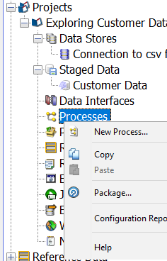

2.	Select the previously created stage data set “US Customer Data”, then click “Next >”.

    

3.	Leave "Add Profiling" checkbox unchecked and click "Next >" to continue.

    **Note.** Selecting "Add Profiling" when a new process is created, data will be profiled for all profilers selected. When you are creating a process for a large or wide dataset, it is recommended to add profilers separately after creating the process, as it may take long time to execute all the profilers as they are compute intensive.

    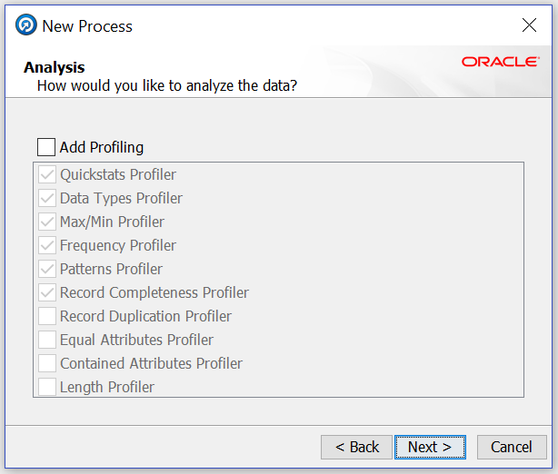

4.	Provide the following information:
    - **Name**: Profiling – Understanding your Data
    - **Description**: Understanding US CUSTOMERS Data

5.	Click on “Finish” button.

    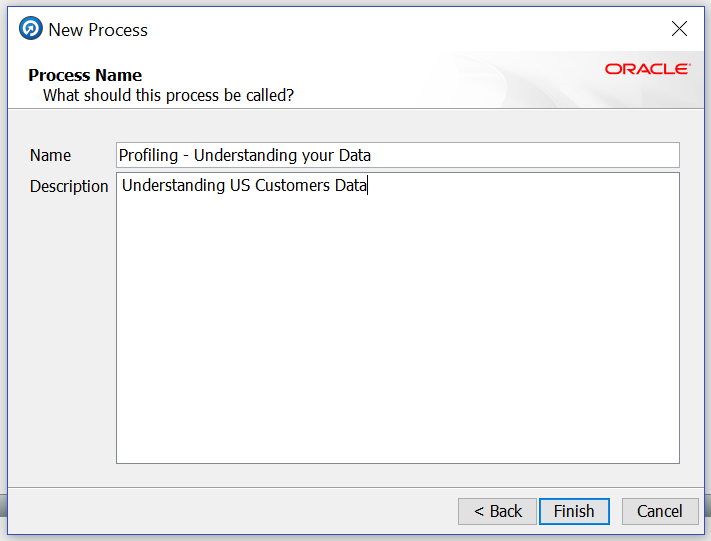

6.	In the "Tool Palette", find the "Profiling" category.

    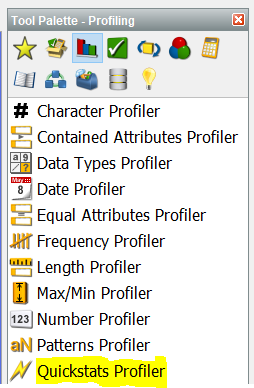

7.	Find “Quickstats Profiler” among the profiling processor family.

8.	Drag and drop “Quickstats Profiler” icon into the “Project Canvas” area.

    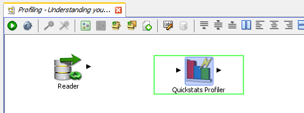

9.	Connect the “Reader” icon to the “Quick Stats” icon. Click and drag from the output triangle of the “Reader” processor to the input triangle of the “Quickstats Profiler”. Upon successful connection, the configuration applet will come up.

    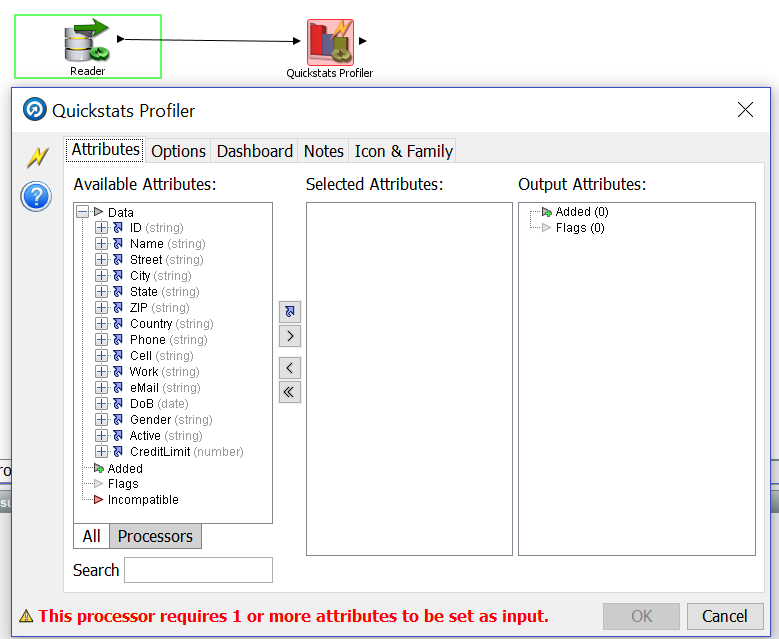

10.	Click on “Select All” icon then click “OK” button to save.

    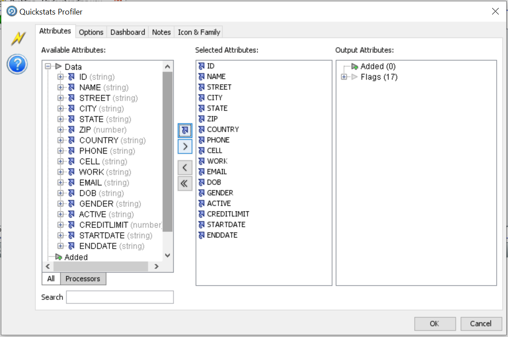

    **Note**: The green circular arrows on any processor means it is yet to be executed.

11.	Click the “Run” icon in the toolbar (top of the "Project" Canvas) to run the process. The progress can be observed in the "Task Bar" in the bottom-left of the "Director" as the process runs.

    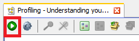

    **Note**: When the process has finished, the green circular arrows will disappear.

12.	Click on the “Reader” processor to see the raw input data, stored in the staged data snapshot. This will be displayed in the "Results Browser" panel.

    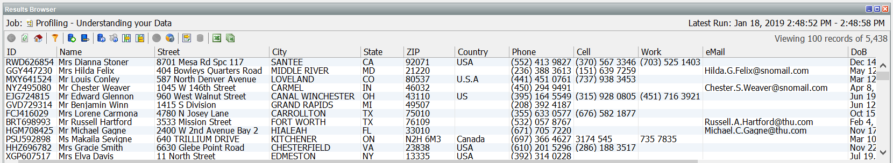

13.	Now click the “Quickstats Profiler” to see the output of the processor.

    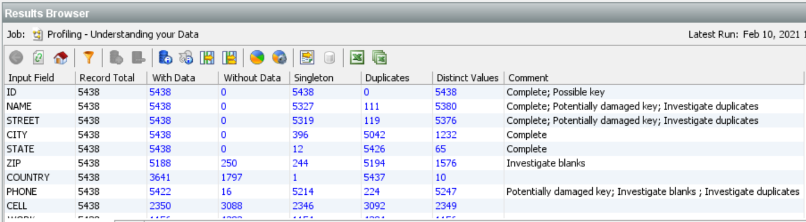

    The “Quickstats Profiler” provides fundamental quality metrics for the selected attributes. It highlights:

    - Candidate key columns
    - Completeness and missing data
    - Duplication
    - Uniqueness and diversity of values

    For each selected attribute, the number of records (Record Total), With Data, Without Data, Singleton, Duplicates, and Distinct Values are shown. These results can be observed and investigated to quickly find data anomalies. For instance, there are 4 Distinct Values for the Gender attribute, when there should really be two: Male and Female. You can also drill down on any blue text to see the data underneath.

14.	Click the number 3113 listed for “eMail” under the “Duplicates” column in the Results Browser.

    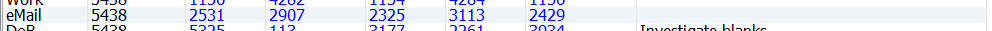

15.	Click the "Count" hyperlink for the “eMail” containing no content / blank.

    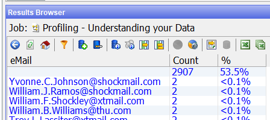

    The large number of empty email values (53.5%) may also represent a "Data Fit for Use" issue depending on the requirements or data SLAs of the customer.

16.	Click the “Back” icon in the "Results Browser" panel to return to the previous view. Now drill-down on one of the non-null values.

    

    We observe that there are a number of duplicate “eMail” values (Count of 2) in the system that may require further investigation (from a duplicate record standpoint).

    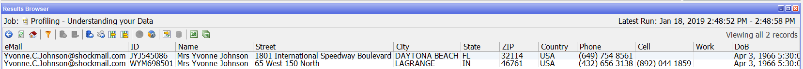

17.	Click the “Back” icon in the "Results Browser" panel as many times as needed to return to the results of the “Quickstats Profiler”.

## Task 2: Frequency Profiler
1.	In the "Tool Palette" find the “Frequency Profiler” processor.

    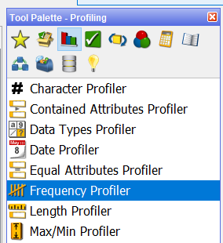

2.	Drag and drop the “Frequency Profiler” processor onto the "Project Canvas".

3.	 Link the output triangle of the “Quickstats Profiler” to the input of the “Frequency Profiler”, the dialog applet will come up.

    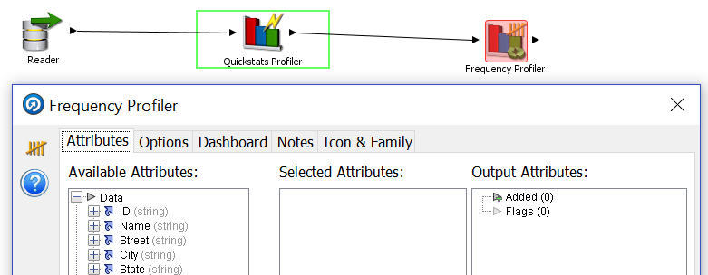

4.	Multi-select the Country, DoB, and Gender and click on the “Select” icon to add the attributes to the “Selected Attributes” section, then click “OK”.

    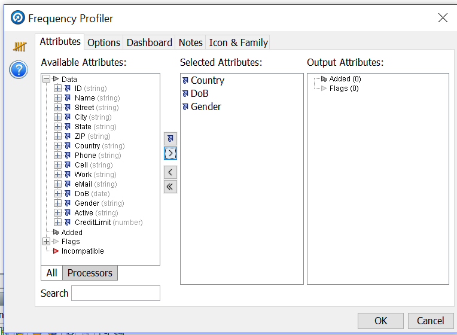

5.	Processors can be renamed by double-clicking on the name of the processor within the canvas. Double click on the existing label of the Frequency Profiler and enter “Frequency Profile Country, DoB, and Gender”.

    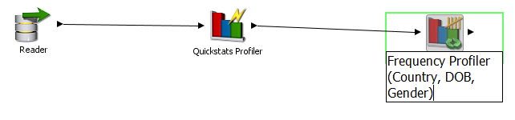

6.	Click the “Run” icon in the toolbar (top of the "Project Canvas") to run the process.
7.	Once the process finishes, click the “Frequency Profile Country, DoB, and Gender” processor to view the results in the "Results Browser" panel. Notice the 4 distinct tabs at the bottom left corner: Country, DoB, Gender and Data.

    

    **Note:** This specific processor happens to tell us a lot about our data set just by observing the different values. Notice how many different representations of United States of America there are: USA, US, U.S.A, United States, and U.S. This discrepancy can cause major issues with Business Intelligence (BI) dashboard authors and analytics dashboards results.

    If the BI team is asked to report on United States sales, the Business Intelligence dashboard author must do one of the following (neither of which are appealing):
    - Undercount US Sales because he/she picks “USA” to look for and does not know there are 5 (and perhaps rising over time) different (but similar) valid representations of United States in the Country column. Such an approach results in the undercounting of US Sales (a 55% undercounting to be exact).
    - Have to ask “Which United States?”.
    - Be put under the burden to identify all the variants of acceptable representations of “United States” in the Country column. And not just Country column, all Columns can have standardization content issues - putting the onus on the Business Intelligence report and dashboard authors to ferret out and identify all possible acceptable variants and incorporate that logic in the Business Intelligence report/dashboard implementations. Why put ‘dirty data’ in the Data Lake – why not clean the water before it is put in the Lake?

    Finally, there are over 27% of the rows with no data in the "Country" column. While we will not do so in this workshop, one could easily create "States" Reference Data and if Country is blank and the "State" column is one of the valid 50 states – set the Country to the standardized value of “United States” – furthering the efforts in transforming the Customer dataset from something more than “just data”, but "Data Fit for Use”. Not just “Analytics”, but “Accurate Analytics”.

8.	Click on the “DoB” tab in the bottom of the "Results Browser" panel to view the results of the Frequency Profiler.

    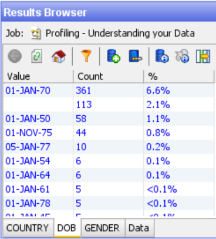

    **Note:** The columns can be sorted by clicking on the various column headers (click on Count - if not already sorted by count, keep clicking count until it is sorted from high to low). Column sorting in the "Results Browser" can be another good exploratory technique to quickly identify additional issues with your data. For instance, you will notice many individuals with a birthday on Jan 1. This may indicate that there was some sort of default value used with Jan 1 and that the quality of the "DoB" column may be low.

    As another example, if you saw one "DoB" value entry showing an unusually high percentage of the total row counts (such as 6.6% having Jan 1, 1970) – this would represent another hidden issue with the data (likely a spurious default value used by the source data system if the value were whitespace). Every single row with Jan 1, 1970 of course inserted into the source database just fine … but the data is not "Fit for Use" for age banding or other age analysis of the data unless attempts are made to fix / enrich the "DoB" field.

    Lack of "Fit for Use" data (default, blank and null values for "DoB" ) limits "Fit for Use" reports. Dashboard consumers losing confidence in their Reports/Dashboards is the number one cause of Data Warehouse / Data Mart / Data Governance project failures (Gartner).

9.	Click the Gender tab in the bottom of the "Results Browser" panel to view the results of the "Frequency Profiler".

    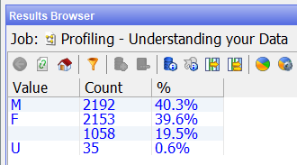

    By now, you will surely see that this dataset needs some fine tuning to make it usable for accurate analytics. For instance, 19.5% of the gender values above are blank.

## Task 3: Record Completeness Profiler

1.	Now, Let’s explore record completeness profiler. In the “Profiling Tool Palette" find “Record Completeness” processor and “Record Duplication” processor. Drag and drop each processor to the "Project Canvas".

    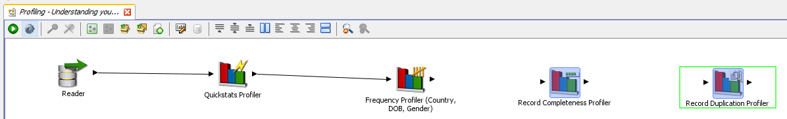

2.	Connect the “Record Completeness” processor to the “Frequency Profile” processor, the dialog applet will come up.
3.	Click the “Select All” icon to have all the data columns participate, then click “OK”.

    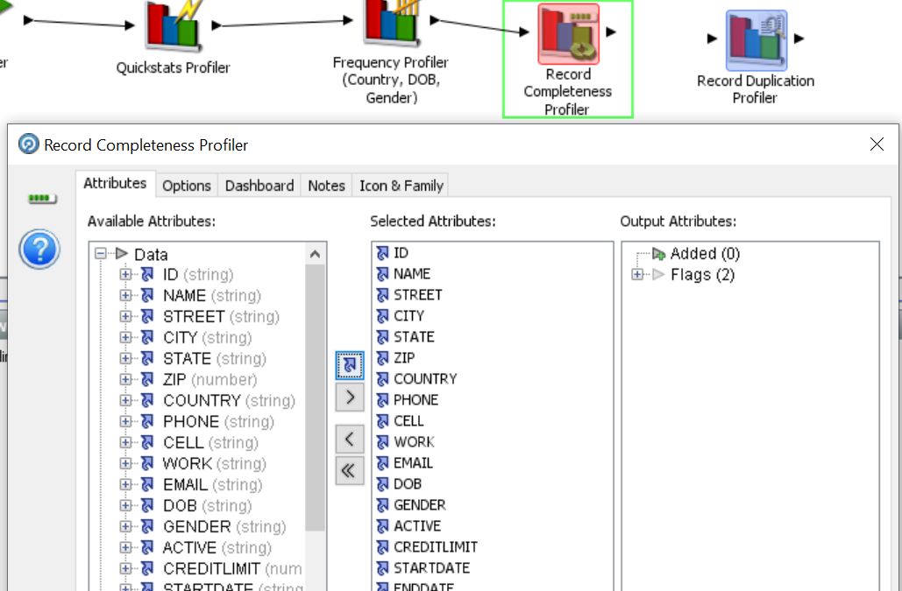

4.	Connect the “Record Completeness” processor to the “Record Duplication Profile” processor, the dialog applet will come up.
5.	Click and select the “Name” and “Zip” attributes from “Available Attributes” section, then click the “Select” icon to move the attribute to the “Selected Attributes” section. Click "OK".

    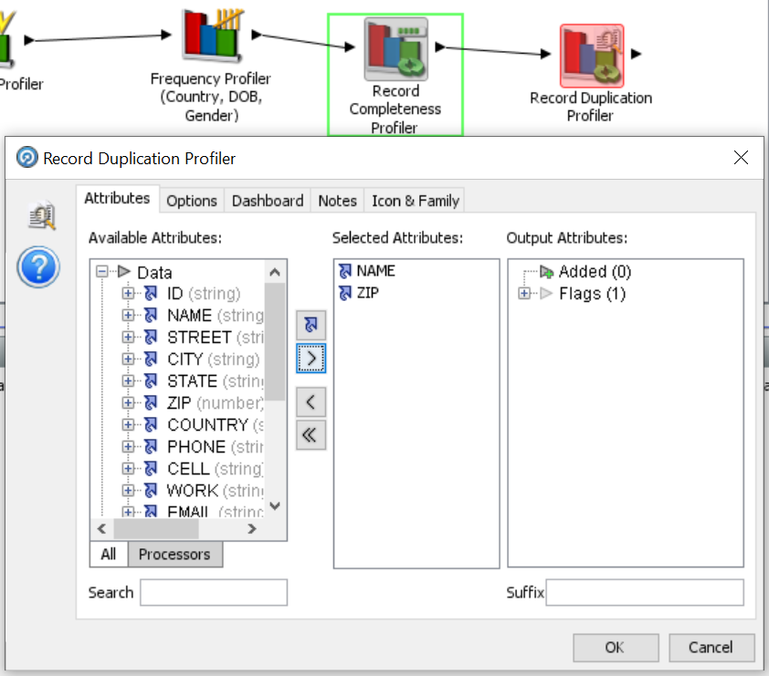

6.	Click the “Run” icon in the toolbar (top of the Project Canvas) to run the process.
7.	Click on the “Record Completeness Profiler” processor to view the results in the Results Browser. You can see that only 196 of the customers have all 17 of 17 attributes filled. Click the "Show Additional Information" icon.

    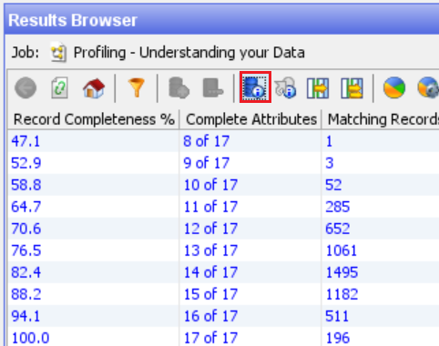

    Notice that those 196 complete records only make up 3.6% of the entire dataset.

    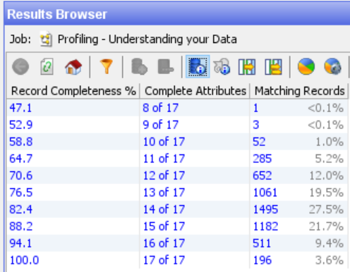

8.	Click on the “Record Duplication Profiler” processor to view the results. Drill down on the 14 representing Duplicated records.

    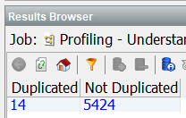

9.	In the “Profiling Tool Palette" find “Pattern Profiler” processor. Drag and drop it into the "Project Canvas".

    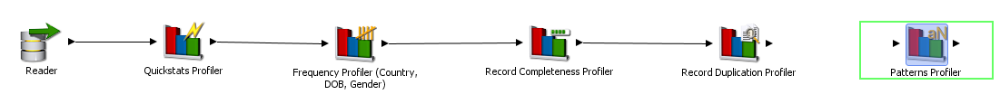

10.	Connect the “Record Duplication” processor to “Pattern Profiler” processor, the dialog applet will come up.
11.	Click on “Cell” from “Available Attributes” section, then click the “Select” icon to move the attribute to the “Selected Attributes” section. Click "OK".

    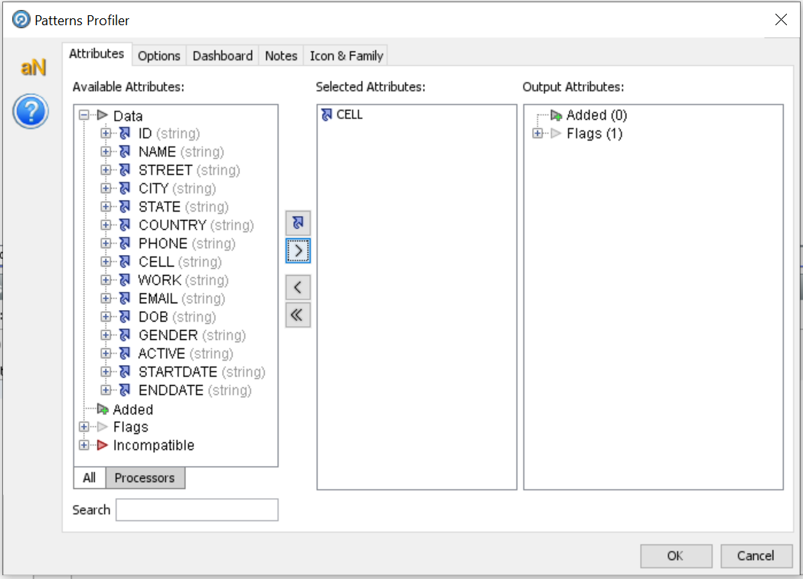

12.	Click the “Run” icon in the toolbar (top of the Project Canvas) to run the process.

    While we can continue to add Profilers to further investigate the data, perhaps it is best to move on to explore the next family of EDQ Processors: Audit – which will help us check and standardize the data.

You may now proceed to the next lab.

## Learn More
- [Oracle Enterprise Data Quality](https://docs.oracle.com/en/middleware/fusion-middleware/enterprise-data-quality/index.html)

## Acknowledgements
* **Author** - Ravi Lingam, Sri Vishnu Gullapalli, Data Integration Team, Oracle, August 2020
* **Contributors** - Meghana Banka, Rene Fontcha, Narayanan Ramakrishnan
* **Last Updated By/Date** - Sri Vishnu Gullapalli, Senior solution engineer, NA Technology, March 2023

