# Work with Reference Data

## Introduction

This lab describes how to work with reference data in Enterprise Data Quality. The demonstration environment includes importing and creating a reference data.

*Estimated Lab Time*: 15 minutes

### Objectives
In this lab you will learn the following:
* How to generate reference data
* How to copy reference data

### Prerequisites
This lab assumes you have:
- A Free Tier, Paid or LiveLabs Oracle Cloud account
- You have completed:
    - Lab: Prepare Setup (*Free-tier* and *Paid Tenants* only)
    - Lab: Environment Setup
    - Lab: Initialize Environment
    - Lab: Data Profiling


## Task 1:  Generate Reference Data

### Generate Reference Data

We will take advantage of the results generated while we were profiling the data to create reference data that will be used later.

1.	Click on the “Frequency Profile Country, DoB, and Gender” processor, then click on the "Gender" tab in the bottom left corner of the "Results Browser" panel.
2.	Hold down CTRL key and click on the M and F values.

    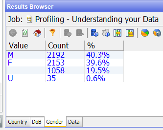

3.	Right-click and select “Create Reference Data”.

    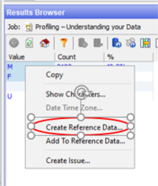

4.	The "New Reference Data" dialog appears. Rename the attribute name to “Gender”, click “Next”.

    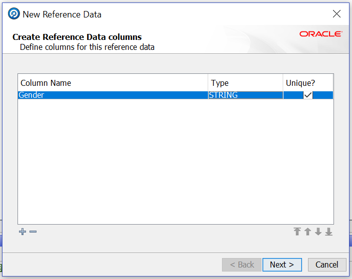

5.	Add “Gender” to the Lookup Column using the ">" button, then click “Next”. Click “Next” on the next two screens to keep the defaults.

    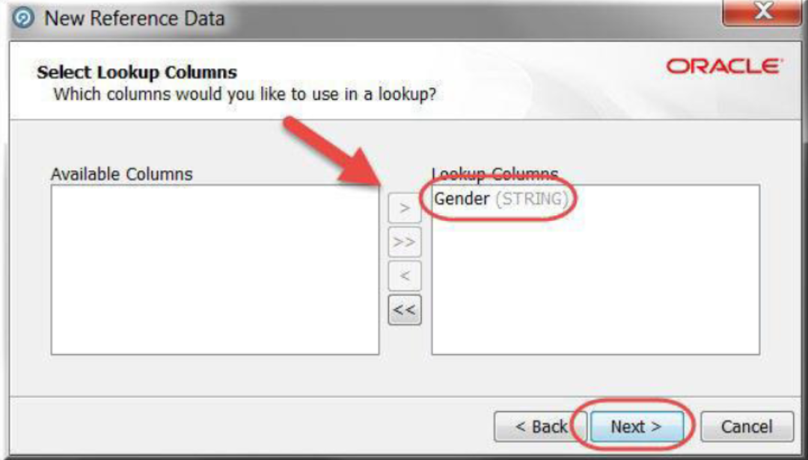

6.	Provide the following information and click “Finish”:
    - Name: Valid Genders
    - Description: Valid Genders


    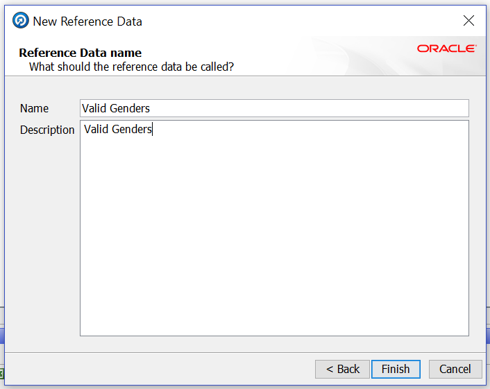

7.	The "Reference Data Editor" appears next. Here, you can modify the reference data to add rows or delete rows. EDQ comes with many different types of reference data out of the box which can dramatically speed up the time it takes to create data check processes. Click "OK" to return to the "Project Canvas".

    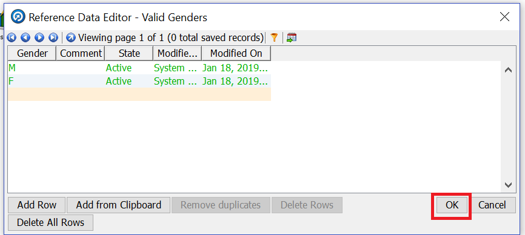

8.	Next, we will need to create Reference Data for the invalid types of Cell numbers. To easily create this reference data, we will use the results of the "Pattern Profiler"; click the "Pattern Profiler" processor and view the results in "Results Browser" panel.

    **Note**: "N" signifies a number, "p" signifies punctuation, "a" signifies an alpha character, and `"_"` signifies a space.

    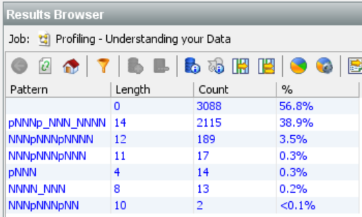

9.	This is pattern information from which we can create reference data. Since we are looking for invalid pattern, click on "pNNN", then right-click and select “Create Reference Data”.

    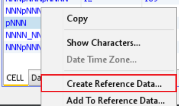

    **Note**: There are null values in cell number. In this example, we are only considering invalid pattern. You can even consider null values as invalid pattern based on your business needs.

10.	The "New Reference Data" dialog appears. Rename the attribute name to Cell Pattern and click “Next”.

    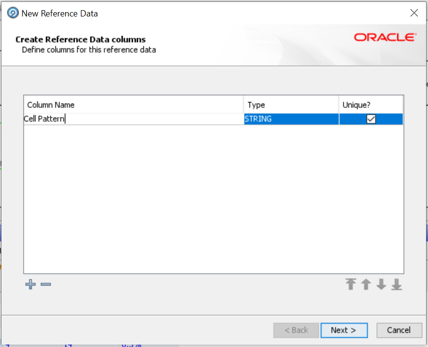

11.	Add Cell Pattern to the Lookup Column using the ">" icon, then click “Next”. Click “Next” on the next two screens to keep the defaults.

    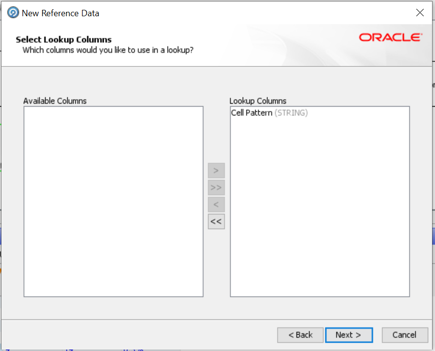

12.	Provide the following information and click “Finish”:
    - Name: Invalid Cell Pattern
    - Description: Invalid Cell Pattern

    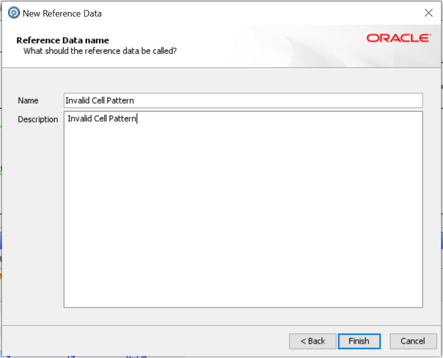

13.	The "Reference Data Editor" appears next. Click "OK" to return to the "Project Canvas".

    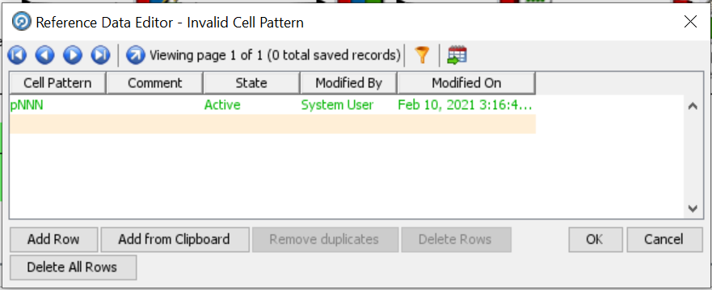


## Task 2: Copy Reference Data
Now, we will copy reference data previously created into our project, which will be used in further labs.

1. We will use Examples.dxi package which is located in below path.

    ```
    Path: <copy>/home/oracle/Downloads</copy>
    ```
    ```
    File Name: <copy>Examples.dxi</copy>
    ```

2. Click on "File" in Director and select "Open Package File...". Browse to the appropriate directory and select the examples.dxi file.

    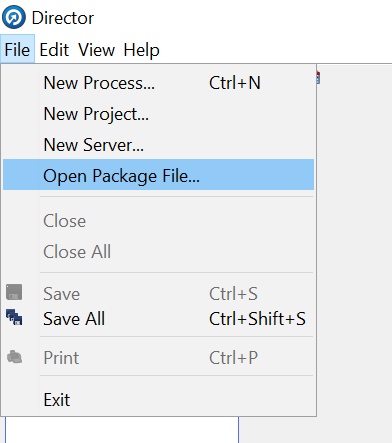

3. Select the Examples.dxi file in the pop up box and click open.

    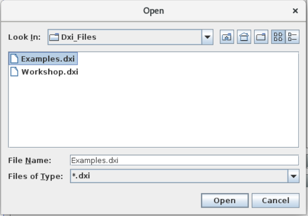

4.	In the “Project Browser” find a project titled “Examples”, expand it.

5.	Expand the “Reference Data” item and right-click on “City to Country Mappings” then select “Copy”.

    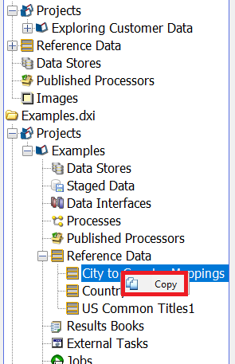

6.	Return to your project (Exploring Customer Data) and find the “Reference Data” item, right-click and select “Paste”.

    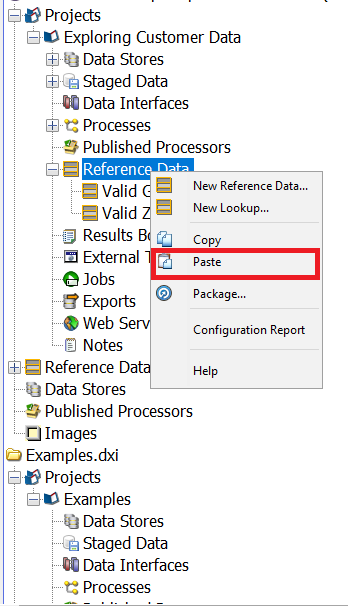

7.	Repeat these steps to copy “Country Variants” and “US Common Titles1” under “Reference Data” of your project (Exploring Customer Data).

    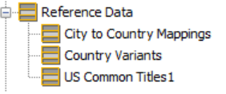

8.	In the “Reference Data” section of your project (Exploring Customer Data), click on “City to Country Mappings”. Notice in the “Results Browser” that this is a two column Reference Data set. The “City” (yellow) column signifies the Lookup Column, similar to the two sets of reference data we created in previous steps for “Gender” and “Cell number”. The “Country” (green) column signifies the Return Column. This means, wherever the Lookup Column value contains data, the “City to Country Mappings” Reference Data set can be used to return the “Country” that “City” is in. This will help us standardize the values found in the “Country” column.

     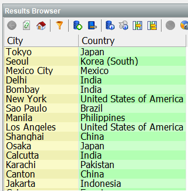

1.  Right click on the Examples.dxi package and select "Close Package File". This action will close the package file in EDQ director.

    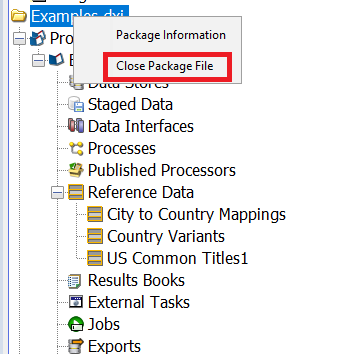

This Completes your lab on reference data. Let's use this reference data in our next lab.

You may now proceed to the next lab.

## Learn More
- [Oracle Enterprise Data Quality](https://docs.oracle.com/en/middleware/fusion-middleware/enterprise-data-quality/index.html)


## Acknowledgements
* **Author** - Ravi Lingam, Sri Vishnu Gullapalli, Data Integration Team, Oracle, August 2020
* **Contributors** - Meghana Banka, Rene Fontcha, Narayanan Ramakrishnan
* **Last Updated By/Date** - Sri Vishnu Gullapalli, Senior solution engineer, NA Technology, March 2023


