# Initialize Environment

## Introduction
This lab will show you how to access your EDQ instance and create a new project.

*Estimated Lab Time*: 30 minutes

### Objectives
* Access an EDQ Instance through Apache Guacamole
* Start EDQ Director
* Create New Project
* Create a Data Store and a Snapshot in EDQ

### Prerequisites
This lab assumes you have:
- A Free Tier, Paid or LiveLabs Oracle Cloud account
- You have completed:
    - Lab: Prepare Setup (*Free-tier* and *Paid Tenants* only)
    - Lab: Environment Setup

## Task 1: Validate That Required Processes are Up and Running.
1. Now with access to your remote desktop session, proceed as indicated below to validate your environment before you start executing the subsequent labs. The following Processes should be up and running:

    - Database Listeners
    - Database Server Instances
    - EDQ Services

    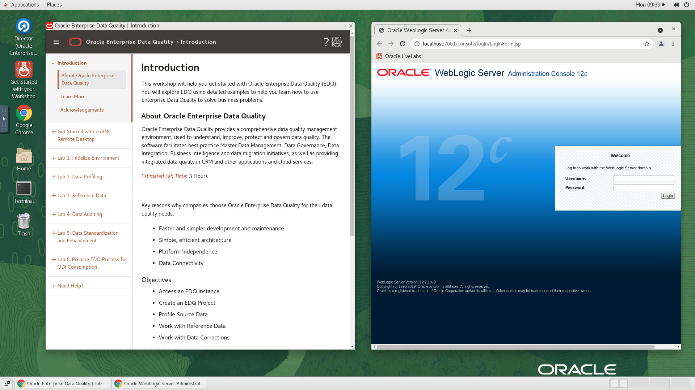

2. On the web browser window on the right preloaded with *Weblogic Server Administration Console* login page, click on the *Username* field and provide the credentials below to login.

    - Username

    ```
    <copy>weblogic</copy>
    ```

    - Password

    ```
    <copy>oraedq123</copy>
    ```

    

3. Confirm successful login. Please note that it takes about 10 minutes after instance provisioning for all processes to fully start.

    - Weblogic Server Administration Console.
    
    In the landing home page, click on *servers* and Confirm that EDQ server and Admin server are running.

    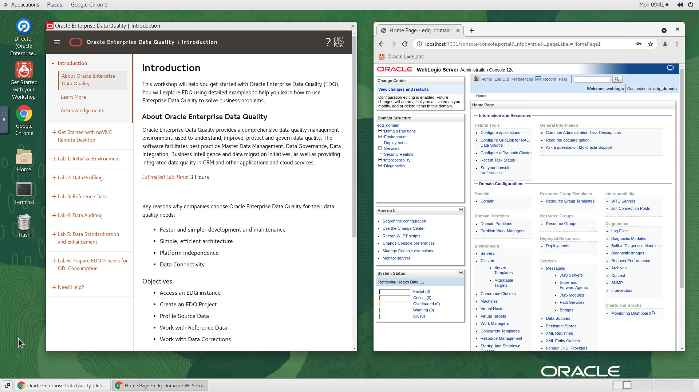
    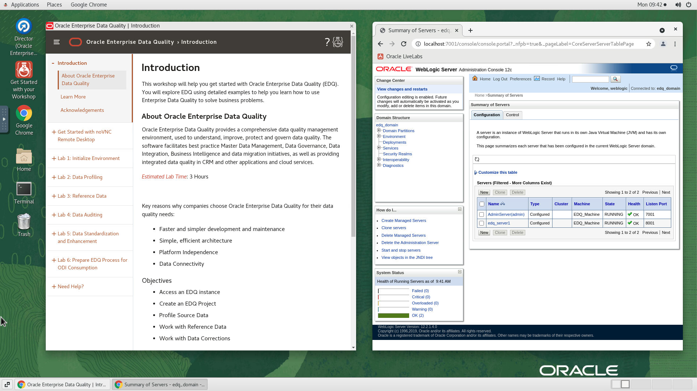

    If successful, the page above is displayed and as a result your environment is now ready.  

4. If you are still unable to login or the login page is not functioning after reloading , open a terminal session and proceed as indicated below to validate the services.

    - Database and Listener
    ```
    <copy>
    sudo systemctl status oracle-database
    </copy>
    ```

    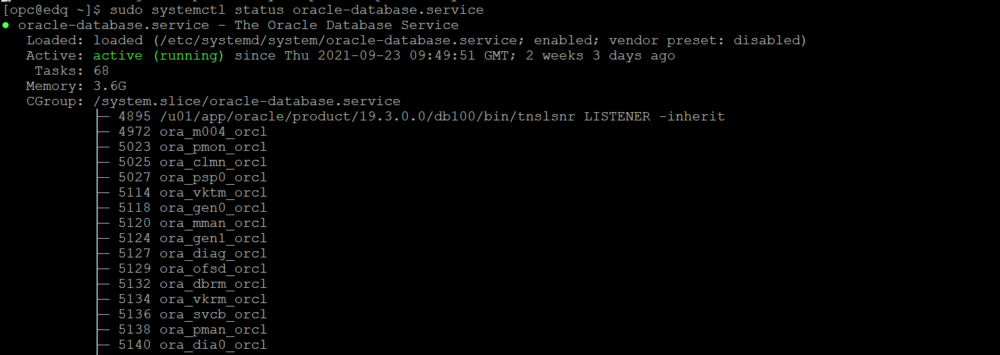
    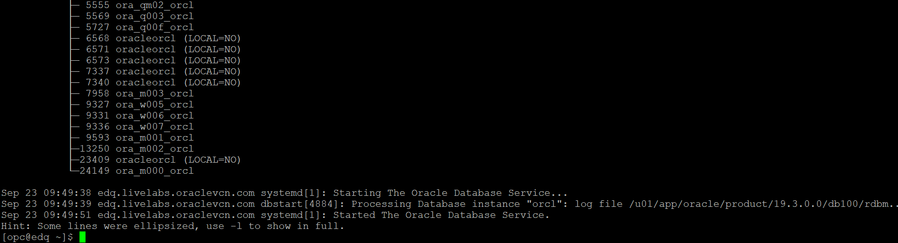

    - WLS Admin Server, EDQ Service
    ```
    <copy>
    sudo systemctl status edq.services
    </copy>
    ```

    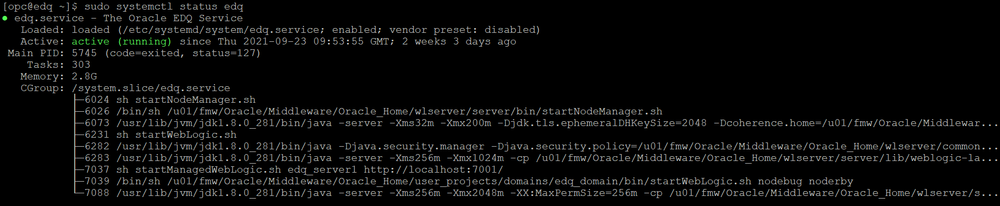

5. If you see questionable output(s), failure or down component(s), restart the corresponding service(s) accordingly

    - Database and Listener

    ```
    <copy>
    sudo systemctl restart oracle-database
    </copy>
    ```

    - WLS Admin Server, EDQ service

    ```
    <copy>
    sudo systemctl restart edq
    </copy>
    ```

## Task 2: Create New Project in EDQ

1.	On the desktop, double click on *Director* icon.

    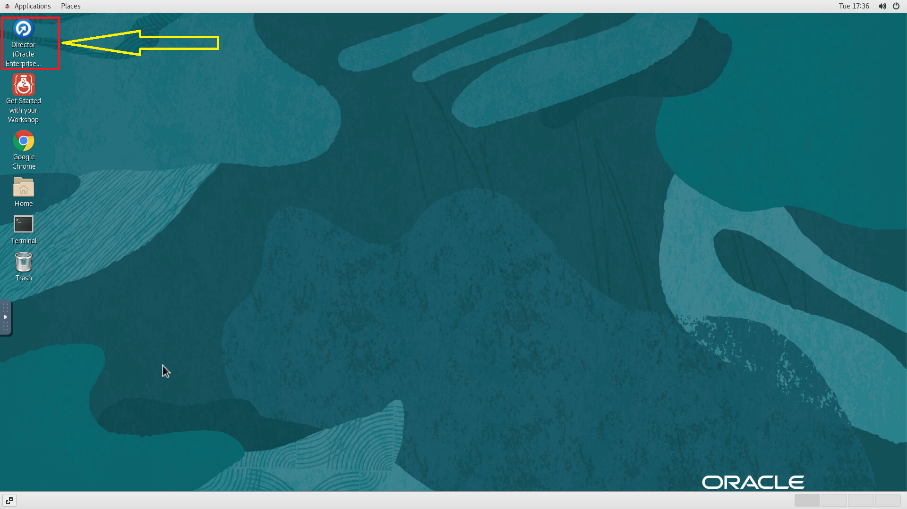

2.	Select "Later" if prompted for the java update option.

    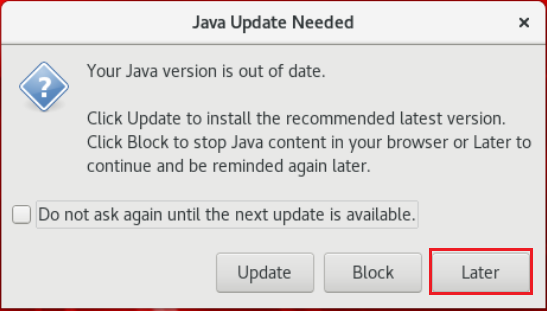

3.	Wait a few minutes, you will receive a new message, click on *“Run”*.

    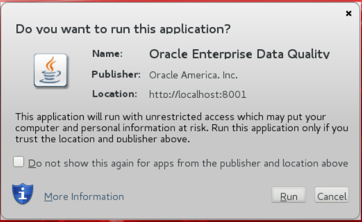

4.	EDQ director will appear on your screen. Provide the Director login credentials.

    ```
    Username: <copy>weblogic</copy>
    ```
    ```
    Password: <copy>oraedq123</copy>
    ```

5. Take a moment to familiarize yourself with the Terminology of each of the four different areas of the Director application.

    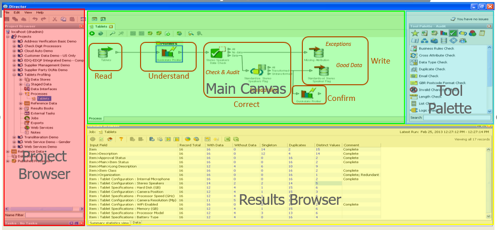

6.	In the "Project Browser", right-click "Projects" and select "New Project…" to start the wizard.

    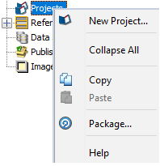

7.	Provide the following information:

    ```
    Name: <copy>Exploring Customer Data</copy>
    ```
    ```
    Description: <copy>Data Quality Project to Profile, Standardize, Match and Merge customer data</copy>
    ```

8.	Click on “Next >” button located at the bottom right corner.

    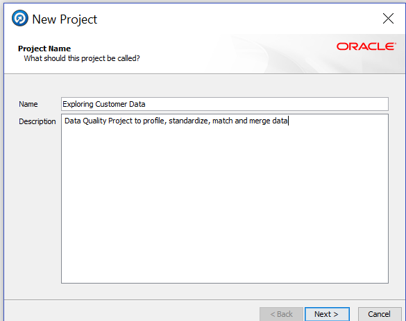

9.	Ensure the “All Groups” checkbox is selected in “Project Permissions”; then click “Finish” button located at the bottom right.

    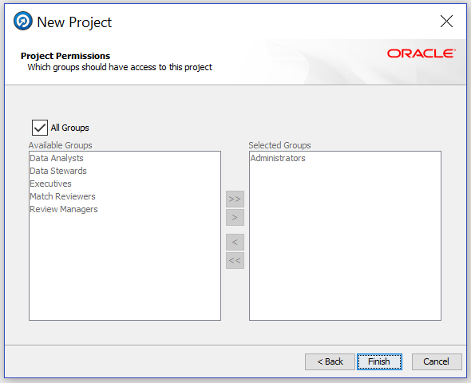

The “Exploring Customer Data” project now appears in the Projects list!

## Task 3: Create Data Store and Snapshot
Now that we have created a project, the next step is creating a Data Store. A Data Store is a connection to a source of data, whether the data is stored in a database or in one or more files.

1.	Expand the newly created project “Exploring Customer Data”, right click “Data Stores”, and select “New Data Store” to launch the wizard.

    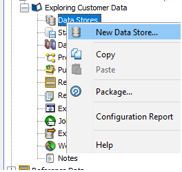

2.	Select "Server" on “Data is accessed from” field.
3.	Select “Database” on “Category” field.
4.	Select “Oracle” on the “Type” list and click “Next >” to continue.

    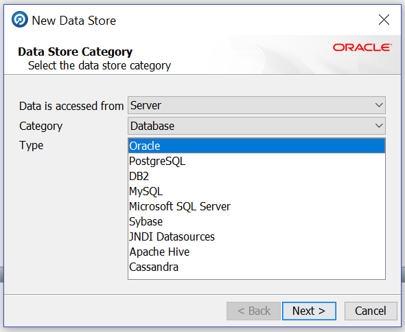

5.	Provide the following data:
    ```
    Database host: localhost
    Port: 1521
    Database name: orcl
    Name type: Service
    User name: EDQ_SRC
    Password: oraedq
    Schema:
    ```

6.	Click on “Test…” button located on the bottom right corner.

    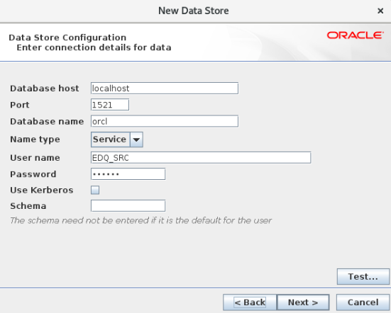

7.	When all information is correct, you will receive a message about connection success, click “OK”.

    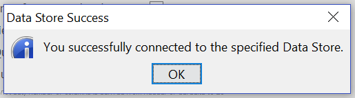

8.	Click on “Next > ” button located on the bottom right corner.
9.	Provide the following information as given below.
    ```
    Name: <copy>Connection to Oracle Database</copy>
    ```
    ```
    Description: <copy>Connection to US Customer Data</copy>
    ```

10.	Click on “Finish” button located on the bottom right corner.

    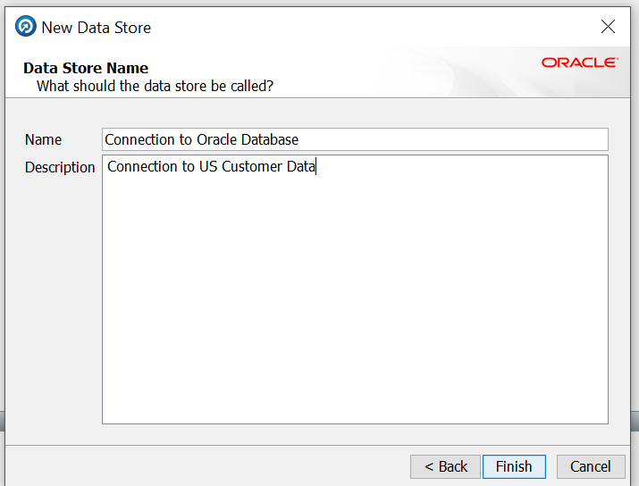

11.	Now we will use this new connection and select a table for profiling and cleansing; the goal is to stage some of the data so we can begin to understand it. Right click “Staged Data” under your project and select “New Snapshot…”.

    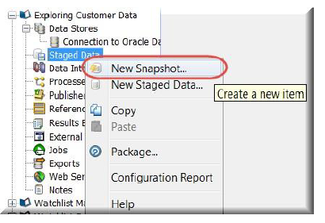

12.	Select the newly created database connection, then click “Next >” to continue.

    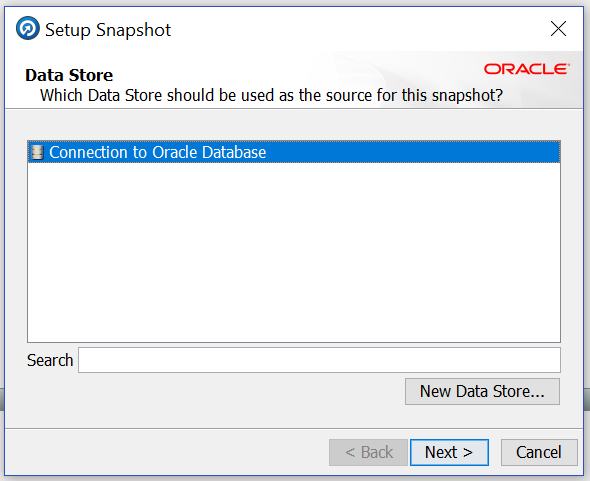

13.	In “Table Selection”, select "`US_Customers`" from the list.  Click “Next >” to continue.

    

14.	In “Column Selection”, ensure all columns are selected, then click “Next >” to continue.

    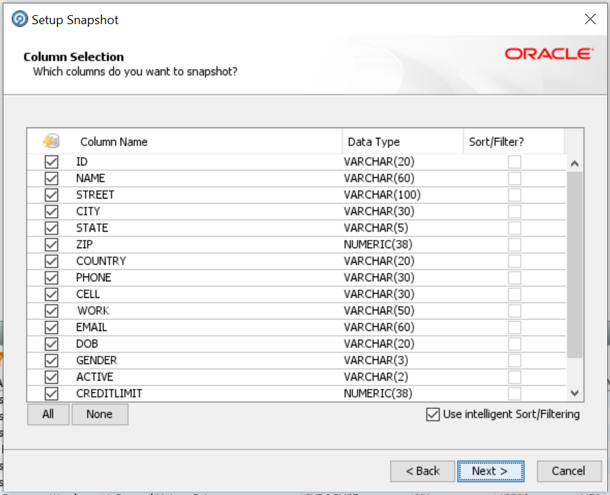

15.	In “Filter Options”, leave the default value of Simple and click “Next >” to continue.

    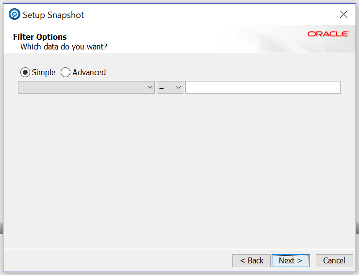

16.	Sampling Options allows to specify the amount of data brought to the snapshot. If needed, it is possible to specify a certain “Count” or “Percentage” of data to be read for the snapshot. Leave the default and click “Next >“.

    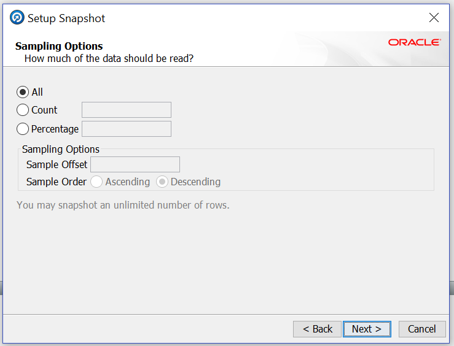

17.	Leave the default empty value for the ‘No Data’ Reference Data field, click on “Next >“.

    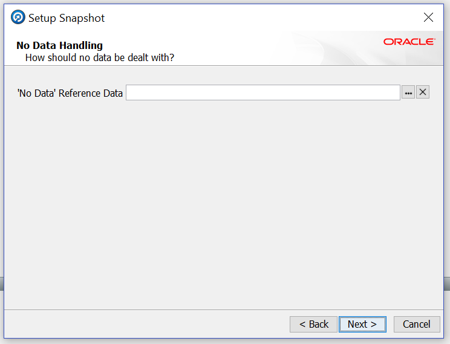

18.	Provide the following data:
    ```
    Name: <copy>US Customer Data</copy>
    ```
    ```
    Description: <copy>Connection to Oracle Database.US_CUSTOMERS</copy>
    ```

19.	Verify that checkbox “Run Now?” is checked and click on “Finish”.

    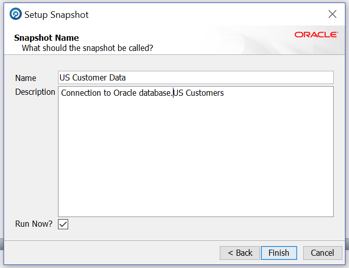

After a short delay, the Results Browser panel is populated. Taking the Snapshot causes EDQ to stage the data from the database into the EDQ data repository. From now on we will be working with the data residing in the "`US_Customer`" Data Snapshot and we will not be modifying or in any way accessing the source data.

You may now proceed to the next lab.

## Appendix 1: Troubleshooting
### **Optional:** If EDQ is not running, use EDQ Start Script to start the Services

1. From the remote desktop session, Click on the *Terminal* Desktop icon to open a terminal session

2. Run the *`edq_start_up.sh`* script to start the EDQ application.

    ```
   <copy>
    sh /home/oracle/scripts/edq_start_up.sh
   </copy>
    ```

    This script will approximately take 10 minutes to start the Node Manager, Weblogic and EDQ Services.

3. After about 10 minutes, go back to the browser tab and check if the page is working.

4. If the page is still not working, run the following to check if all required services are running.

    ```
    <copy>
    systemctl status edq
    systemctl status oracle-database
    </copy>
    ```

    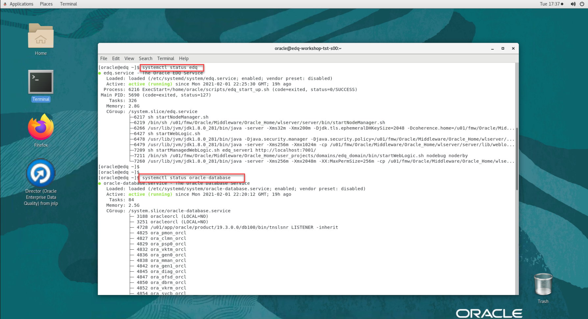

5. For any service failure, login as user *"opc"* from an SSH client using the private SSH key from the key pair you used while requesting your instance, and restart the problematic services accordingly

    ```
    <copy>
    sudo systemctl start edq
    sudo systemctl start oracle-database
    </copy>
    ```

## Appendix 2: Managing Startup Services

1. Database Service (Database and Listener).

    - Start

    ```
    <copy>sudo systemctl start oracle-database</copy>
    ```

    - Stop

    ```
    <copy>sudo systemctl stop oracle-database</copy>
    ```

    - Status

    ```
    <copy>sudo systemctl status oracle-database</copy>
    ```

    - Restart

    ```
    <copy>sudo systemctl restart oracle-database</copy>
    ```

2. EDQ Service (WLS Admin Server, EDQ service)

    - Start

    ```
    <copy>sudo systemctl start edq</copy>
    ```

    - Stop

    ```
    <copy>sudo systemctl stop edq</copy>
    ```

    - Status

    ```
    <copy>sudo systemctl status edq</copy>
    ```

    - Restart

    ```
    <copy>sudo systemctl restart edq</copy>
    ```

## Learn More
- [Oracle Enterprise Data Quality](https://docs.oracle.com/en/middleware/fusion-middleware/enterprise-data-quality/index.html)

## Acknowledgements
* **Author** - Ravi Lingam, Sri Vishnu Gullapalli, Data Integration Team, Oracle, August 2020
* **Contributors** - Meghana Banka, Narayanan Ramakrishnan, Rene Fontcha
* **Last Updated By/Date** - Sri Vishnu Gullapalli, Senior solution engineer, NA Technology, March 2023

