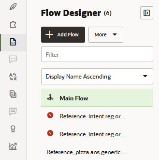

## Introduction

In this lab you will import (if not done already) the **AIServiceStarterSkill.zip** and open the skill by clicking on the tile. Explore all the availbale artifacts.

## Task 1: Review the Starter Skill

1.  -- **Intents**: Take a look at the **pizza.reg.orderPizza**, **pizza.reg.cancelPizza**, **pizza.ans.calories**, and **ans.proc.vegetarianPizza** intents. Note the conversation names for the pizza.ans.calories, and ans.proc.vegetarianPizza intents. In this tutorial, you'll either create flows for these intents, or reference them when you branch the dialog flow.
	
2.  -- **Entities**: You'll declare variables for two of the composite bag entities: cbe.pizza, which supports the pizza menu, and cbe.confirmation, which is used to branch the flow. The resolution logic for cbePizza is executed through an entity event handler.	
	
3.  -- **Resource Bundles**: Following best practices, the prompts in this tutorial are executed through resource bundles, not through text strings. You'll reference the following resource bundles in your flow:
 | Property | Value |
 | ----------- | ----------------- |
 | answerIntentIntroMessage1 | Hello! You were asking about |
 | answerIntentIntroMessage2 | Here's your answer: |
 | cbe.confirmation.message | Your order is on the way. |
 | cbe.confirmation.prompt1 | You ordered a {0} {1} pizza. Is that right? |
 | pizza.messages.orderPizzaStart | Hey, there! Let's get this order started! |
 | systemFlowName_ans.about.calories | the calorie content of our pizzas |
 | systemFlowName_ans.proc.vegetarianPizza | vegetarian pizza |

 
 4.  -- **Reference flows**: This skill includes a set of reference flows to help you out if you run into problems. These flows are meant only as guides, not as functioning flows. Because they are not mapped to any events or reference any variables, the Visual Flow Designer notes these flows as having errors . You can ignore them.

  
