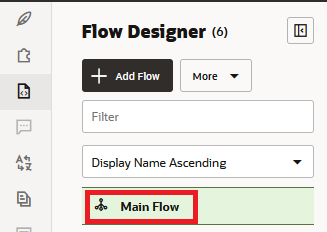
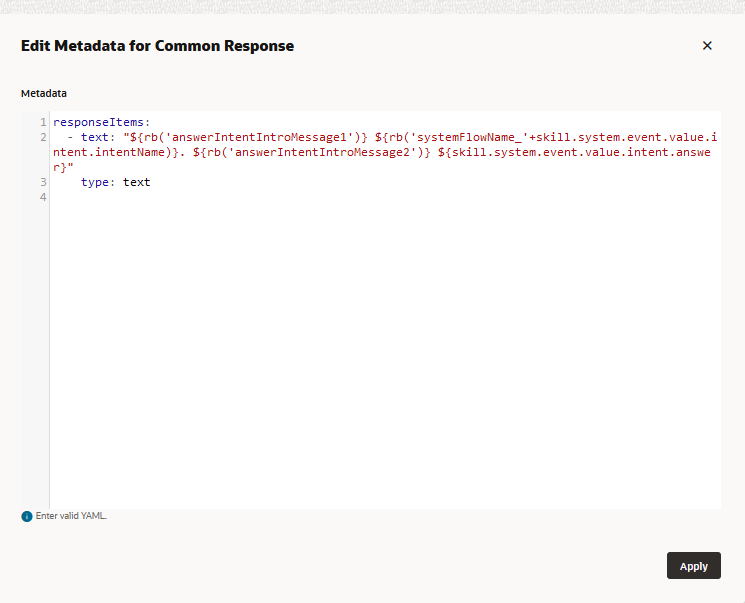

## Introduction

In this lab you will build the dialog flows to manage the ordering of a pizza and also a custom answer intent dialog.
## Task 1: Build the Answer Intent Flow

### <u>Create Skill-Level Variables</u>

You're going to start off by declaring a variable for the cbe.pizza entity.  
This variable will set the values for the pizza size and type. Because both the parent flow and the child flows need these values, you must create a skill-level variable so that all flows can access the values.  

1.  Click **Flows**  in the left navbar.
2.  Click **Main Flow**.

3.  Click **Skill Variables**.

4.  Click **Add Variable** (located under **Custom Variables**).

5.  For the name, enter `pizza`.
6.  For the description, enter `Resolves the pizza menu`.
7.  Select **Entity** as the variable type, then select **cbe.pizza** as the entity name.
8.  Click **Apply**.

### <u>Build the Answer Intent Flow</u>
In this step, you're going to create an answer intent that handles user questions about calories and vegetarian options. In Visual Flow Designer, you don't need to create generic answer intent flow like this because the Main Flow presents answer intents automatically. But through the simple answer intent flow that you'll create in this step, you learn about creating and customizing a flow for a standard event, the group of Main Flow-level events for handling standard use cases like unresolved intent, answer intent, and dialog error.

1.  Click **Add Flow**.


2.  In the Create Flow dialog, enter `pizza.ans.genericHandler` as the name.
3.  For the description, enter `Generic answer intent flow`. Then click **Create**.


4.  In the dialog flow editor, hover over the Start node, click the menu , then click **Add start state**.


5.  Select **User messaging**, then **Display Multimedia Messages**.


6.  Choose **Display Intent answer**.
7.  Accept the default name (displayIntentAnswer).
8.  For the description, enter General answer. Then click **Insert**.


When you're done, the flow should include the displayIntentAnswer state:


9.  Click the displayIntentAnswer state to open its property inspector.
10.  Click **Component** in the property inspector. Then click **Edit Response Items**.


11.  Take a look at the default message at the Apache FreeMarker expression for the `text` property that references an answer intent:

    ```
	${skill.system.event.value.intent.answer}
	```
    
12.  The default expression returns only the answer. To create a friendlier message that includes a greeting, and the conversation name, update the `text` property with the following expression. Then click **Apply**.
    
    Copy
    
    ```
	${rb('answerIntentIntroMessage1')} ${rb('systemFlowName\_'+skill.system.event.value.intent.intentName)}. ${rb('answerIntentIntroMessage2')} ${skill.system.event.value.intent.answer}
	```
    
    This expression references the following resource bundles to enable the skill to output "Hello! You were asking about <conversation name>. Here is your answer: <answer text>.
    
    *   `answerIntentIntroMessage1` -- `Hello! You were asking about`
    *   `systemFlowName_` -- Resource bundle for conversation name strings.
    *   `answerIntentIntroMessage2`" -- `Here's your answer:`
    
    


<!-- 
====================================================================
= MAP ANSWER INTENT TO AN EVENT                                    =
====================================================================
-->
### <u>Map The Answer Intent To An Event</u>
You've completed the answer intent flow, but it can't yet display any answers. To trigger this flow when users ask about calories or vegetarian options, you need to return to the Main Flow to map it to an event that's dedicated to handling answer intents.

1.  Click **Main Flow**.
2.  If it's not already open, click **Events**.
3.  Click  next to Built-In Events.
            
4.  Select **Answer Intent** from the Unhandled Event Type list.
5.  Select **pizza.ans.genericHandler** as the mapped flow. Then click **Create**.


<!-- 
====================================================================
= TEST THE ANSWER INTENT                                           =
====================================================================
-->
## Task 2: Test The Answer Intent

Now we'll use the Skill Tester to make sure that the intent is resolved correctly and also see how the flow works.

1.  Before you can chat with the skill, be sure that it's been trained with Trainer Tm:
    *   Click **Train**.
    *   Choose **Trainer Tm**, then click **Submit**.
2.  Click **Preview** to open the Skill Tester.

3.  Enter _How many calories?_


4.  Click **Reset**, then enter _Can I get a vegetarian pizza?_
5.  For both of these responses, take a look at the traversal from the Main Flow to the displayIntentAnswer state of the pizza.ans.genericHandler flow.


9.  When you're done, click **Reset** and then close the Skill Tester.


***Tip:***

If you run into problems, take a look at the `Reference_pizza.ans.genericHandler` flow. This flow does not function because it is not mapped to the Answer Intent event.

In this step, you've created a flow that handles all answer intents. If you want to add actions related to the answer, then you can create a flow dedicated to just one answer intent. The `pizza.ans.proc.veggiePizza` flow in the [sample skill](https://docs.oracle.com/en/cloud/paas/digital-assistant/tutorial-visual-flow-designer-sample/), PizzaSkill - Visual Flow Designer, is an example of using an answer intent as an entry point to a transactional flow: users asking for vegetarian options get routed to the order pizza flow, where the pizza menu is filtered for its vegetarian options.


<!-- 
====================================================================
= CREATE THE ORDER PIZZA FLOW                                           =
====================================================================
-->
## Task 3: Create The Order Pizza Flow
In this step, you're going to create the skill's primary flow.

1.  Click **Flows** in the left navbar (if it's not already open), then click **Add Flow**.
2.  Enter `intent.reg.order` as the flow name.
3.  Enter `Order pizza` flow as the description.
4.  Select **pizza.reg.orderPizza** as the Intent Name. Then click **Create**.


<!-- 
====================================================================
= CREATE THE ORDER PIZZA FLOW                                      =
====================================================================
-->
### <u>Create The Flow Level Variable</u>
In this step, you're going to declare a variable for the cbe.confirmation entity, whose yes and no values support the branching action that you'll add to the flow later on. Because the branching action is unique to this flow, the value set for this variable needs to be confined to this flow only. Not only is its usefulness limited to the flow, but its lifespan is also. Unlike the skill-scoped pizza variable you created earlier, you're going to create this flow-scoped variable within the intent.reg.order flow, not within the main flow.

1.  Click **intent.reg.order**.
2.  Click **Configuration**.


3.  Click **Add Variable**.
4.  Complete the dialog by adding the following values before clicking **Apply**.
    *   **Name** - `confirmation`
    *   **Description** - `Flow branching variable`
    *   **Variable Type** - **Entity**
    *   **Variable Name** - **cbe.confirmation**
    
    


<!-- 
====================================================================
= BUILD OUT THE ORDER PIZZA FLOW                                   =
====================================================================
-->

### <u>Build The Order Pizza Flow</u>
For this short flow, you'll create a state for the skill-scoped composite bag pizza entity along with two other states that output text messages for greeting the user and confirming the order.

1.  Click **Flow**.
2.  Hover over the menu in the Start node, then click **Add start state**.
3.  Select **Send Message**.


4.  Name the state `startPizzaOrder`.
5.  For the description, enter `Greeting message` and then click **Insert**.
6.  Click the **startPizzaOrder** state to open its property inspector. Click **Component** if the Component page is not already open.
7.  Instead of entering a text string for the greeting message, reference the resource bundle:
    
    Copy
    ```
    ${rb('pizza.messages.orderPizzaStart')}
    ```


8.  Hover over the startPizzaOrder state to display its menu icon . Click the menu icon, then click **Add state**.


9.  Choose **Resolve Composite Bag**.
10.  Name the state `resolvePizza`.
11.  Enter `Pizza menu` as then description. Then click **Insert**.


Note the next transition line that's inserted automatically as you add states.


12.  In the Component page, select **pizza** as the composite bag entity variable.


13.  Click the menu in the resolvePizza state, then click **Add state**.
14.  Select **Send Message**.
15.  Name the state `confirmMessage`.
16.  Enter `Confirmation message` as the description. Then click **Insert**.
17.  In the Component page of the property inspector, reference the confirmation message resource bundle:
    
    Copy
    ```
    ${rb('cbe.confirmation.message')}
    ```
    When you're done, the flow should look like this:
    
    


<!-- 
====================================================================
= TEST OUT THE FLOW                                                =
====================================================================
-->
## Task 4: Test The Order Pizza Flow
Now we're going to test out the flow so far.

1.  Open the Skill Tester.


2.  Enter _Order pizza_. Then complete the order by selecting the pizza type and size.


3.  Note the routing from the Main Flow to the intent.reg.order flow and the subsequent traversal from the startPizzaOrder state to the confirmMessage state.


7.  Click **Reset** and then close the Skill Tester.

In this step, you learned how to create an intent event flow that references a skill-level variable and resource bundles.

If you're having trouble completing this flow, take a look at the Reference\_intent.reg.orderPizza\_1 flow. This flow does not function because it is not mapped to an intent and does not reference the pizza variable.

## Task 5: Call Another Flow
To handle the situation where a user decides to cancel their order before it is sent, you're going to branch the conversation to the pre-existing cancel order flow, intent.reg.cancelOrder (accessed by clicking **Flows** > **intent.reg.cancelOrder** in the left navbar). This simple flow outputs "All right, you can peacefully forget about your pizza." using a Send Message state that references the `pizza.messages.cancelOrder` resource bundle.


If you were writing the dialog definition in YAML instead of the Visual Flow Designer, the order pizza and cancel pizza flows would be part of a monolithic block of code. Because of the modular approach afforded by the Visual Flow Designer, you create separate flows which you link together.

1.  Hover over the next transition line between the resolvePizza and the confirmMessage states. Then click  to add a state to the next transition.


2.  From the Add State dialog, select the Resolve Entity template by selecting **User Messaging** > **Resolve Entities** > **Resolve Entity**, or by entering resolve entity in the Search field.


3.  Name the state `confirmSelection`. For the description, enter `Resolves Confirmation entity`. Then click **Insert**.


4.  In the Component page of the property inspector for the confirmSelection state, choose **confirmation** as the flow-scope variable.


5.  Hover over the next transition line that's between the confirmSelection state and the confirmMessage state, then click .
6.  Choose **Flow Control**. Then choose **Invoke Flow**.
7.  Name the state `cancelCurrentOrder`.
8.  For the description, enter `Calls intent.reg.cancelOrder` and then click **Insert**.


9.  In Component page, select **intent.reg.cancelOrder**, the cancel order flow, as the flow that will be called when the dialog transitions to this state. If you were passing values like pizza size and pizza toppings to the cancel order flow, then you'd also define input parameters for this component.


10.  Hover over the next transition line between the confirmSelection and cancelCurrentOrder states and click  once again.
11.  Choose **Flow Control**, then **Switch**.
12.  Name the state `routeSelection`.
13.  Enter `Branches conversation` as the description. Then click **Insert**.


14.  In the Component page of the property inspector for the routeSelection state, select **Expression**.
15.  You need to reference the Yes and No values from the confirmation variable that you created for this flow. To do this, paste the following expression into the field:
    
    Copy
   ``` 
    ${confirmation.value.confirmation.primaryLanguageValue}
    ```
    
    


16.  Open the Transitions page of the property inspector for the routeSelection state.
17.  Select **End flow (implicit)** as the Next Transition.


19.  Click to  (located next to Action) to create the Yes transition:
    *   For Action Name, enter **Yes**.
    *   For Transition to, select **ConfirmMessage**.
    *   Click **Save** .
20.  Click to  to create the No transition:
    *   For Action Name, enter **No**
    *   For Transition to, select **cancelCurrentOrder**
    *   Click **Save** .
    
    
        
    At this point, the flow should look like this. Note the No and Yes transitions branching from the routeSelection state. Note also that there's a next transition wired to the cancelCurrentOrder state.
    
    
        
21.  To prevent a transition from the cancelCurrentOrder state to the confirmMessage state:
    *   Open the property inspector for the cancelCurrentOrder state.
    *   Select the Transitions page.
    *   Select **End flow (implicit)** as the next transition.When you're done, the flow should look like this:


<!-- 
====================================================================
= TEST OUT THE FLOW                                                =
====================================================================
-->
## Task 6: Test Out The Flow
Repeat the prior conversation in the Skill Tester for both the Yes and No options.

1.  Open the Skill Tester.

2.  Enter _Order pizza_. Select the pizza type and size.
3.  When you reach the confirmSelection state, choose **Yes**.
    
    
        
    The conversation routes from the Main Flow to the intent.reg.OrderPizza flow and culminates in the confirmMessage state.
    
    
        

4.   Click **Reset**.
5.   Enter _Order pizza_ again. Select the pizza type and size.
6.  When you reach the confirmSelection state, choose **No**.
    
    The conversation gets routed from the Main Flow, through the intent\_reg.orderPizza flow, and then finally to the intent.reg.cancelOrderflow because of the No answer given for the confirmSelection state.
    
    
        

In this step, you learned how to add states to an existing flow. Specifically, you added flow control states to a flow comprised exclusively made up of user interface states. Using the flow control states, you learned how to link a parent flow to a child flow and how to set the branching logic to call that child flow. You also learned how to navigate the flow by changing the transition properties.

***Tip:***

If you run into problem check out Reference\_intent.reg.orderPizza\_2. This flow does not function because it is not mapped to an intent event.


            
