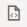

## Introduction

In this lab you will build the dialog flows to manage the ordering of a pizza and also a custom answer intent dialog.
## Task 1: Build the Answer Intent Flow

### <u>Create Skill-Level Variables</u>

You're going to start off by declaring a variable for the cbe.pizza entity.  This variable will set the values for the pizza size and type. Because both the parent flow and the child flows need these values, you must create a skill-level variable so that all flows can access the values.


1. Click **Flows** in the left navbar.
2. Click **Main Flow**.


3. Click **Skill Variables.**.


4. Click **Add Variable** (located under **Custom Variables**).


| Property | Value |
| ----------- | ----------------- |
| Name | pizza |
| Description | Resolves the pizza menu. |
| Variable Type | Select **Entity** as the variable type, then select **cbe.pizza** as the entity name |
{: title="Pizza variable"}


5. Click **[Apply]**


### TEST

You're going to start off by declaring a variable for the cbe.pizza entity.  
This variable will set the values for the pizza size and type. Because both the parent flow and the child flows need these values, you must create a skill-level variable so that all flows can access the values.  

1.  Click **Flows**  in the left navbar.
2.  Click **Main Flow**.
3
3.  Click **Skill Variables**.

4.  Click **Add Variable** (located under **Custom Variables**).

5.  For the name, enter `pizza`.
6.  For the description, enter `Resolves the pizza menu`.
7.  Select **Entity** as the variable type, then select **cbe.pizza** as the entity name.
8.  Click **Apply**.


### <u>Build the Answer Intent Flow</u>
In this step, you're going to create an answer intent that handles user questions about calories and vegetarian options. In Visual Flow Designer, you don't need to create generic answer intent flow like this because the Main Flow presents answer intents automatically. But through the simple answer intent flow that you'll create in this step, you learn about creating and customizing a flow for a standard event, the group of Main Flow-level events for handling standard use cases like unresolved intent, answer intent, and dialog error.

1. Click **Add Flow**


2. In the Create Flow dialog filling the properties as indicated tin the following table and click **[Create]**

| Property | Value |
| ----------- | ----------------- |
| Name | pizza.ans.genericHandler |
| Description | Generic answer intent flow.  |
{: title="Answer flow name"}
 

3. In the dialog flow editor, hover over the Start node, click the menu  , then click **Add start state**.

4. Select **User messaging**, then **Display Multimedia Messages**.


5. Choose **Display Intent answer** and fill in the dialog with the following, then click **[Insert]**

| Property | Value |
| ----------- | ----------------- |
| Name | Accept the default name (displayIntentAnswer). |
| Description | General answer |
{: title="Display Intent Answer"}


When you're done, the flow should include the **displayIntentAnswer**displayIntentAnswer state:


6. Select the **displayIntentAnswer** state in the flow to open its property inspector.

7. Click **Component** in the property inspector. Then click **Edit Response Items**.


8. Take a look at the Apache FreeMarker expression in the text property that generates a default message based on the answer intent:

```
${skill.system.event.value.intent.answer}
```

9. The default expression returns only the answer. To create a friendlier message that includes a greeting, and the conversation name, update the text property with the following expression. Then click **[Apply]**.

```
${rb('answerIntentIntroMessage1')} ${rb('systemFlowName_'+skill.system.event.value.intent.intentName)}. 
${rb('answerIntentIntroMessage2')} ${skill.system.event.value.intent.answer}
```

This expression references the following resource bundles to enable the skill to output "Hello! You were asking about _{conversation name}_. Here is your answer: _{answer text}_.
 - answerIntentIntroMessage1 -- Hello! You were asking about
 - systemFlowName_ -- Resource bundle for conversation name strings.
 - answerIntentIntroMessage2 -- Here's your answer:

 


<!-- 
====================================================================
= MAP ANSWER INTENT TO AN EVENT                                    =
====================================================================
-->
### <u>Map The Answer Intent To An Event</u>
You've completed the answer intent flow, but it can't yet display any answers. To trigger this flow when users ask about calories or vegetarian options, you need to return to the Main Flow to map it to an event that's dedicated to handling answer intents.

1. Click **Main Flow**Main Flow

2. If it's not already open, click **Events**.

3. Click  next to Built-In Events.


4. Select **Answer Intent** from the Unhandled Event Type list.

5. Select **pizza.ans.genericHandler** as the mapped flow. Then click Create.


<!-- 
====================================================================
= TEST THE ANSWER INTENT                                           =
====================================================================
-->
## Task 2: Test The Answer Intent
Now we'll use the Skill Tester to make sure that the intent is resolved correctly and also see how the flow works.

1. Before you can chat with the skill, be sure that it's been trained with Trainer Tm:

 - Click **Train**


 - Choose **Trainer Tm**, then click **[Submit]**	


2. Click **Preview** to open the Skill Tester.


3. Enter _How many calories?_


4. Click **Reset**, then enter _Can I get a vegetarian pizza?_

5. For both of these responses, take a look at the traversal from the Main Flow to the **displayIntentAnswer** state of the **pizza.ans.genericHandler** flow.


6. When you're done, click Reset and then close the Skill Tester.


<!-- 
====================================================================
= CREATE THE ORDER PIZZA FLOW                                           =
====================================================================
-->
## Task 3: Create The Order Pizza Flow
In this step, you're going to create the skill's primary flow.

1. Click **[+ Add Flow]** button to add a new intent-driven flow to the skill using the following properties.	

| Property | Value |
| ----------- | ----------------- |
| Name | intent.reg.order |
| Description | Order pizza |
| Description | pizza.reg.orderPizza |
{: title="Order Pizza Intent"}


 
- Check **“open created flow afterwards”** and click **[Create]**


<!-- 
====================================================================
= CREATE THE ORDER PIZZA FLOW                                      =
====================================================================
-->
### <u>Create The Flow Level Variable</u>
<p>
In this step, you're going to declare a variable for the **cbe.confirmation** entity, whose YES | NO options support the branching action that you'll add to the flow later on. Because the branching action is unique to this flow, the value set for this variable needs to be confined to this flow only. Not only is its usefulness limited to the flow, but its lifespan is also. Unlike the skill-scoped pizza variable you created earlier, you're going to create this flow-scoped variable within the **intent.reg.order** flow, not within the main flow.	

1. Click on the **intent.reg.order** flow in the list the **Configuration** Tab


2. Click **Add Variable** and complete the dialog with the following values, then click **[Apply]**

| Property | Value |
| ----------- | ----------------- |
| Name | confirmation |
| Description | Flow branching variable |
| Variable Type | Entity |
| Variable Name | cbe.confirmation |
{: title="Flow Variable"}


<!-- 
====================================================================
= BUILD OUT THE ORDER PIZZA FLOW                                   =
====================================================================
-->

### <u>Build The Order Pizza Flow</u>
For this short flow, you'll create a state for the skill-scoped composite bag pizza entity along with two other states that output text messages for greeting the user and confirming the order.

1. Click **Flow**.

2. Hover over the menu in the Start node, then click **Add start state**.  Select a **Send Message** component.

3. Set the properties for the component and click **[Insert]** to update the flow.

| Property | Value |
| ----------- | ----------------- |
| Name | startPizzaOrder |
| Description | Greeting Message |
{: title="Start pizza order"}


	
4. Click the **startPizzaOrder** state to open its property inspector. Click **Component** if the Component page is not already open.

5. Instead of entering a text string for the greeting message, reference a pre-defined resource bundle:

```
${rb('pizza.messages.orderPizzaStart')}
```


6. Hover over the Start node, click the menu , then click **Add state**.

7. Choose **Resolve Composite Bag**, and fill in the properties as:

| Property | Value |
| ----------- | ----------------- |
| Name | resolvePizza |
| Description | Pizza Menu |
{: title="resolve composite bag"}

		


Note the next transition line that's inserted automatically as you add states.


8. In the Component page, select **pizza** as the composite bag entity variable.


9. Click the menu in the **resolvePizza** state, then click **Add state** and select a **Send Message Component**.

10. Fill in the properties as below and click **[Insert]**

| Property | Value |
| ----------- | ----------------- |
| Name | confirmMessage |
| Description | Confirmation Messages |
{: title="Send message"}
		
11. In the Component page of the property inspector, reference the confirmation message resource bundle:


	```
	${rb('cbe.confirmation.message')}
	```

	<p>When you're done, the flow should look like this:


<!-- 
====================================================================
= TEST OUT THE FLOW                                                =
====================================================================
-->
## Task 4: Test The Order Pizza Flow
Now we're going to test out the flow so far.
1. Open the Skill Tester.


2. Enter _Order pizza_. Then complete the order by selecting the pizza type and size


3. Note the routing from the Main Flow to the **intent.reg.order** flow and the subsequent traversal from the **startPizzaOrder** state to the **confirmMessage** state.


4. Click **Reset** and then close the Skill Tester.
In this step, you learned how to create an intent event flow that references a skill-level variable and resource bundles.


## Task 5: Call Another Flow
To handle the situation where a user decides to cancel their order before it is sent, you're going to branch the conversation to the pre-existing cancel order flow, **intent.reg.cancelOrder** (accessed by clicking **Flows > intent.reg.cancelOrder** in the left navbar). This simple flow outputs _"All right, you can peacefully forget about your pizza."_ using a Send Message state that references the **pizza.messages.cancelOrder** resource bundle.	


<p>If you were writing the dialog definition in YAML instead of the Visual Flow Designer, the order pizza and cancel pizza flows would be part of a monolithic block of code. Because of the modular approach afforded by the Visual Flow Designer, you create separate flows which you link together.

1. Hover over the next transition line between the **resolvePizza** and the **confirmMessage** states. Then click  to add a state to the next transition.


2. From the Add State dialog, select the Resolve Entity template by selecting **User Messaging > Resolve Entities > Resolve Entity**, or by entering resolve entity in the Search field.


- Set the properties as follows
	
| Property | Value |
| ----------- | ----------------- |
| Name | confirmSelection |
| Description | Resolves the confirmation Entity |
{: title="Resolve entity"}
	


3. In the Component page of the property inspector for the **confirmSelection** state, choose **confirmation** as the flow-scope variable.


4. Hover over the next transition line that's between the **confirmSelection** state and the **confirmMessage** state, then click 


5. Choose **Flow Control**, then choose **Invoke Flow**.  Define the properties as below and click **[Insert]** to add the component to the flow.

| Property | Value |
| ----------- | ----------------- |
| Name | cancelCurrentOrder |
| Description | Calls intent.reg.cancelOrder |
{: title="cancel order"}
	


6. In Component page, select **intent.reg.cancelOrder**, the cancel order flow, as the flow that will be called when the dialog transitions to this state. If you were passing values like pizza size and pizza toppings to the cancel order flow, then you'd also define input parameters for this component.


7. Hover over the next transition line between the **confirmSelection** and **cancelCurrentOrder** states and click  once again to add another component.


8. Choose **Flow Control**, then **Switch**. Define the properties as below and click **[Insert]** to add the component to the flow.

| Property | Value |
| ----------- | ----------------- |
| Name | routeSelection |
 Description | Branches Conversation |
 {: title="route selection"}
	


9. In the Component page of the property inspector for the routeSelection state

    - Set the Request Body – **Expression** switch to **“ON”**
	
    - Reference the **Yes | No** value from the confirmation variable that you created for this flow. To do this, paste the following expression into the field
	
	```
	${confirmation.value.confirmation.primaryLanguageValue}
	```


    - Click outside the field to accept the input.


10. Navigate to the **“Transitions”** tab at the top of the **routeSelection** component Palette.


11. Select **End Flow (implicit)** as the Next Transition.


12. Click on the  next to the “Action” to enter the appropriate transition when the value of the Confirmation variable is **YES**.
	
    - For Action Name, enter **Yes**
	- For Transition to, select **ConfirmMessage**.
	- Click Save .
	
13. Click on the  again to enter transition when the value of the Confirmation variable is **NO**

    - For Action Name, enter **No**
	- For Transition to, select **ConfirmMessage**.
	- Click Save .

	

	
	At this point, the flow should look like this. Note the No and Yes transitions branching from the **routeSelection** state. Note also that there's a next transition wired to the **cancelCurrentOrder** state

	


14. To prevent a transition from the **cancelCurrentOrder** state to the **confirmMessage** state:

    - Open the property inspector for the **cancelCurrentOrder** state.
	- Select the Transitions page..
	- Select **End flow (implicit)** as the next transition.
	
	When you're done, the flow should look like this:


	This completes this flow..


<!-- 
====================================================================
= TEST OUT THE FLOW                                                =
====================================================================
-->
## Task 6: Test Out The Flow
1. Repeat the prior conversation in the Skill Tester for both the Yes and No options.

    - Open the Skill Tester.
	
	 

    - Enter _**Order pizza**_. Then complete the order by selecting the pizza type and size
	
    - When you reach the **confirmSelection** state, choose **Yes**.


	The conversation routes from the Main Flow to the **intent.reg.OrderPizza** flow and culminates in the **confirmMessage** state.
	
	- Reset the conversation and enter _**Order pizza**_ again. Select the pizza type and size
	
    - When you reach the **confirmSelection** state, choose **No**.


	The conversation gets routed from the Main Flow, through the **intent_reg.orderPizza** flow, and then finally to the **intent.reg.cancelOrderflow** because of the “No” answer given for the confirmSelection state.
	


            
