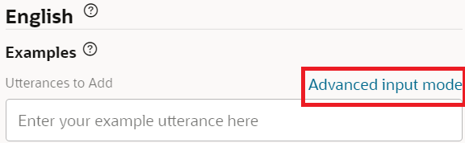

## Introduction

The Oracle Digital Assistant can manage when the users upload documents or pictures during the conversation, but it does not look into the content of those uploads. 

The OCI AI Vision service brings another AI capability that allows us to detect objects, recognize text and label images. It is also able to identify and extract data from documents such as invoices, receipts, resumes, passports, payslip, drivers license and many more.

In this LAB we will create a new intent where the user can apply a voucher, and then configure the dedicated flow that will allow the user to upload a voucher where the AI Vision service will validate the voucher.

## Task 1: Create a new Intent

1.  Click the **\+ Intent** button.
2.  Next to the **Conversation Name** field, click , and enter `Apply Pizza Voucher`.
3.  In the **Name** field, type `pizza.apply.voucher`.
4.  Select and copy all of the example sentences below to your clipboard:
    
    *   I want to use my voucher
    *   Can I get a discount?
    *   I have a voucher, how can I use it?
    *   Can I apply a discount voucher?
    *   I want to use my voucher
    *   Here is my voucher

   
5.  In the Examples section, click **Advanced input mode**.




6.  In the **Utterances to Add** field, paste the examples. Then click **Create**.

7. Train the model 


## Task 2: Use the Vision service to validate a voucher

***TODO:*** Import now, or give it already imported? ADD THE MAIN FLOW MAPPING

The type of image analysis requested. The allowed values are:
-   **IMAGE_CLASSIFICATION:** Label the image.
-   **OBJECT_DETECTION:** Identify objects in the image with bounding boxes.
-   **TEXT_DETECTION:** Recognize text in the image.

-   Let's explore the steps of the existing **apply.voucher** flow

 

1. The flow starts with a message from the assistant towards the user, asking for an upload of the voucher.

 

This is the message sent to the user
 

This state will wait until the user provides his input.
 


2. The second state will pick up the uploaded picture and encode it into a base64 (this is required as the AI Vision Service accepts base64 encoded images). 
  Behind the scenes there is a Custom Component already deployed that will take care of this. 

* ***NOTE:*** Custom components allow us to use a bot-node-js SDK to implement complex logic or integrations. It is out of scope for this HOL.

 

The output will be a base64 payload and that will be stored in a variable named **b64**

 


3. Then we call the AI Service Vision.

 

You can see there is an error in this state, which means we need to configure it properly.
   
 

Select **AnalyzeImage**

 

Select **POST**

Press **Expression** and paste:
```
{
    "features": [
        {
            "featureType": "TEXT_DETECTION"
        }
    ],
    "image": {
        "source": "INLINE",
        "data": "${b64.value}"
    },
    "compartmentId": "<get your ocid>"
	
}
```
 * **featureType**: You can see above that we have featureType: **TEXT_DETECTION**. That means we want this service to detect text in the image.
 * **data**: We passe the variable **b64** value into the request.
 * **ocid**: Replace the compartmentId with your own value, as explained in **LAB 1: Task 4**

 

Select the existing variable called **output**. 

4. The output of the REST request will contain all the extracted words, so we want to store that in a variable.

 

```
${output.value.responsePayload.imageText.words[1].text}
```

5. Then we have a Switch statement that will check the value of the variable and based on that take the appropriate transition.

 


***NOTE***: This is a very simplistic approach to the Vision service. We do not know the type of image being uploaded and may need a more robust approach to handle the REST request. The goal of this LAB was just to show the Power of the OCI AI Vision service. 

## Task 3: Test the Flow
1.	Train the Skill using “Trainer tm” and once trained open the skill in the Bot Preview

Type:
```
I have a voucher
```

 

when prompted to upload a voucher, press the **attach button** and use one of the below URL options (copy the URL):

* [Pizza Voucher for 25 $](https://objectstorage.eu-amsterdam-1.oraclecloud.com/n/idppdqf7rmfq/b/HOL/o/Pizza%2BVoucher25.png)

* [Beer Voucher](https://objectstorage.eu-amsterdam-1.oraclecloud.com/n/idppdqf7rmfq/b/HOL/o/Beer.png)

* [Pizza Voucher for 15 $](https://objectstorage.eu-amsterdam-1.oraclecloud.com/n/idppdqf7rmfq/b/HOL/o/Pizza%2BVoucher15.png)


 

 


