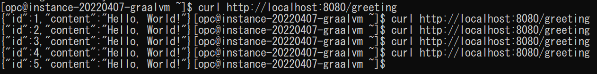
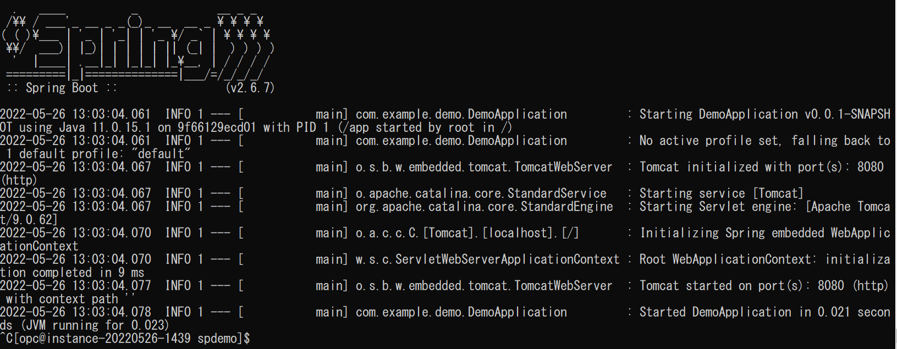

# GraalVMとDockerコンテナ

## 概要

この演習では、演習4で作成したSpring BootのRESTFulサービスをDockerコンテナとして作成、起動します。jar形式とnaitve image形式でそれぞれコンテナを作成し、両者の起動スピードおよびコンテナイメージのサイズを比較します。以下３種類のDockerイメージを作成します。
* Oracle JDKベースのfat jar用のDockerイメージ
* Oracle Linux7ベースのnative image用のDockerイメージ
* Distrolessベースのほぼ静的なnative image用のDockerイメージ

*所要時間: 15分*

### ■目標
* 3種類のベース・イメージを使用して、より軽量で高速起動するコンテナイメージを作成

### ■前提条件
* 演習4「GraalVMとJavaフレームワーク」を実施済みであること  

## Task 1: fat jarのDockerイメージ作成
1. GraalVM JDK 11のコンテナイメージをGitHubよりダウンロードし、演習4のTask2で作成したSpring BootのjarファイルをDockerコンテナにパッケージングします。spdemo配下に、Dockerfile.jdkという名前のDockerファイルを作成します。

    ```
    <copy>nano Dockerfile.jdk</copy>
    ```
       
    以下の内容をDokcerfile.jdkに貼り付け、ファイルを保存します。
    ```
    <copy>
    # FROM container-registry.oracle.com/java/jdk:11-oraclelinux7
    FROM ghcr.io/graalvm/jdk:java11-21.3

    EXPOSE 8080

    COPY target/demo-0.0.1-SNAPSHOT-exec.jar demo.jar
    CMD ["java","-jar","demo.jar"]
    </copy>
    ```
    Ctrl＋Xを押し、内容保存の確認メッセージに対し、"Y"を入力し、Enterを押下してソースファイルを保存します。
       
2. Dockerイメージを作成します。以下のコマンドをspdemo配下で実行します。

    <!--
    事前に[container-registry.oracle.com](https://container-registry.oracle.com)よりpullしたベース・イメージをVM上にダウンロードします。
    > **Note:** 通常はOracle公式のJavaのDockerイメージをOracleコンテナレジストリからpullできますが、今回ハンズオン用VMのネットワークの制限により事前pullしたイメージを配布する形を取ります。 
    
    ```
    <copy>
    wget https://objectstorage.us-ashburn-1.oraclecloud.com/p/LNAcA6wNFvhkvHGPcWIbKlyGkicSOVCIgWLIu6t7W2BQfwq2NSLCsXpTL9wVzjuP/n/c4u04/b/livelabsfiles/o/developer-library/jdkimage.tar.gz
    </copy>
    ```
    ```
    <copy>
    sudo docker load < jdkimage.tar.gz
    </copy>
    ```
    -->
    
    ```
    <copy>
    sudo docker build -f Dockerfile.jdk -t spring-jdk .
    </copy>
    ```

    生成されたコンテナイメージを確認します。  
    ```
    <copy>
    sudo docker images
    </copy>
    ```
        
    
       
3. 以下のコマンドでコンテナを起動します。
         
    ```
    <copy>
    sudo docker run --rm -p 8080:8080 spring-jdk:latest
    </copy>
    ```
    

    RESTfulサービスの起動時間を確認します。この例では1.441秒です。  

4. SSH接続されている別のターミナルから、以下のコマンドを実行し、HTTPリクエストからレスポンスが正常にリターンされることを確認します。
        
    ```      
    <copy>curl http://localhost:8080/greeting</copy>
    ```
    

5. *※重要！※* コンテナを起動したターミナルにて、Ctrl+CでDockerコンテナからexitします。

    


## Task 2: native imageのDockerイメージ作成

1. JDKを含まないOracle Linux7のコンテナイメージをダウンロードし、演習4のTask2で作成したSpring Bootのnative imageをコンテナにパッケージングします。spdemo配下に、Dockerfile.nativeという名前のDockerファイルを作成します。

    ```
    <copy>nano Dockerfile.native</copy>
    ```
       
    以下の内容をDokcerfile.nativeに貼り付け、ファイルを保存します。
    ```
    <copy>
    # FROM container-registry.oracle.com/os/oraclelinux:7-slim
    FROM ghcr.io/oracle/oraclelinux:7-slim
    COPY target/demo app
    ENTRYPOINT ["/app"]
    </copy>
    ```
    Ctrl＋Xを押し、内容保存の確認メッセージに対し、"Y"を入力し、Enterを押下してソースファイルを保存します。

2. Dockerメージをビルドします。以下のコマンドをspdemo配下で実行します。

    <!--
    ```
    <copy>
    wget https://objectstorage.us-ashburn-1.oraclecloud.com/p/LNAcA6wNFvhkvHGPcWIbKlyGkicSOVCIgWLIu6t7W2BQfwq2NSLCsXpTL9wVzjuP/n/c4u04/b/livelabsfiles/o/developer-library/ol7image.tar.gz
    </copy>
    ```
    ```
    <copy>
    sudo docker load < ol7image.tar.gz
    </copy>
    ```
    -->

    ```
    <copy>
    sudo docker build -f Dockerfile.native -t spring-native .
    </copy>
    ```

    生成されたコンテナイメージを確認します。  
    ```
    <copy>
    sudo docker images
    </copy>
    ```
    

       
3. 以下のコマンドを実行し、コンテナを起動します。

    ```
    <copy>
    sudo docker run --rm -p 8080:8080 spring-native
    </copy>
    ```
    

    RESTfulサービスの起動時間を確認します。この例では0.022秒です。fat jarのコンテナより60倍以上速く起動できました。

4. SSH接続されている別のターミナルから、以下のコマンドを実行し、HTTPリクエストからレスポンスが正常にリターンされることを確認します。
    ```      
    <copy>curl http://localhost:8080/greeting</copy>
    ```
    


5. *※重要！※* コンテナを起動したターミナルにて、Ctrl+CでDockerコンテナからexitします。
    

## Task 3: ほぼ静的なnative imageのDockerイメージ作成

1. より軽量なコンテナを作成するため、ベース・イメージをGoogleが公開しているdistrolessベース・イメージを使用します。distrolessは、パッケージマネージャやシェルを含まない、アプリケーション実行に特化したコンテナイメージです。ほぼ静的なnative imageは実行時標準Cライブラリ(glibc)のみ参照し、それ以外のすべての依存ライブラリを静的にリンクし、ビルドされます。pom.xmlに以下の部分を追加して、ぼぼ静的なnative imageとして再度ビルドします。

    spdemo配下のpom.xmlをバックアップします。

    ```
    <copy>cp pom.xml pom.backup</copy>
    ```
    pom.xmlを修正します。
    ```
    <copy>nano pom.xml</copy>
    ```
    以下の```<configuration>```部分を、```<profile>```タグ-->```<build>```タグ-->```<plugin>```タグの中に追加します。追加する箇所は下記の図を参照してください。

    ```
    <copy>
    <configuration>
        <!-- add native-image build arguments -->
        <buildArgs>
          <buildArg>-H:+StaticExecutableWithDynamicLibC</buildArg>
        </buildArgs>
    </configuration>
    </copy>
    ```
    

    ```<buildArgs>```タグの中に```StaticExecutableWithDynamicLibC```というパラメータを指定します。このパラメータによりnative imageビルド時標準Cライブラリ```libC```以外の依存ライブラリを全て事前に静的にリンクします。

    <!--
    nanoエディタの編集でソースの整形がうまくいかない場合、pom.xmlを一旦バックアップし、新規pom.xmlを作成して、下記pom.xmlの内容をそのままコピーし、保存してください。

    ```
    <copy>mv pom.xml pom.xml_backup</copy>
    ```
    ```
    <copy>nano pom.xml</copy>
    ```
    ```
    <copy>
    
    </copy>
    ```
    -->
    

    Ctrl＋Xを押し、内容保存の確認メッセージに対し、"Y"を入力し、Enterを押下してソースファイルを保存します。

2. spdemo配下に、以下のコマンドを実行し、native imageを再度ビルドします。

    ```
    <copy>./mvnw -Pnative -DskipTests package</copy>
    ```

3. ビルドが正常に終了したことを確認した上、spdemo配下に、Dockerfile.native-lightという名前のDockerファイルを作成します。

    ```
    <copy>nano Dockerfile.native-light</copy>
    ```
       
    以下の内容をDokcerfile.native-lightに貼り付け、ファイルを保存します。
    ```
    <copy>
    FROM gcr.io/distroless/base
    COPY /target/demo app
    ENTRYPOINT ["/app"]
    </copy>
    ```
       
4. Dockerコンテナをビルドします。以下のコマンドをspdemo配下で実行します。

    ```
    <copy>
    wget https://objectstorage.us-ashburn-1.oraclecloud.com/p/LNAcA6wNFvhkvHGPcWIbKlyGkicSOVCIgWLIu6t7W2BQfwq2NSLCsXpTL9wVzjuP/n/c4u04/b/livelabsfiles/o/developer-library/distroless.tar.gz
    </copy>
    ```
    ```
    <copy>
    sudo docker load < distroless.tar.gz
    </copy>
    ```

    ```
    <copy>
    sudo docker build -f Dockerfile.native-light -t spring-native-light .
    </copy>
    ```
    生成されたコンテナイメージを確認します。  
    ```
    <copy>
    sudo docker images
    </copy>
    ```
    
       
5. 以下のコマンドを実行し、コンテナを起動します。
       
    ```
    <copy>
    sudo docker run --rm -p 8080:8080 spring-native-light:latest
    </copy>
    ```

    
    RESTfulサービスの起動時間を確認します。この例では0.026秒です。

6. SSH接続されている別のターミナルから、以下のコマンドを実行し、HTTPリクエストからレスポンスが正常にリターンされることを確認します。
    ```      
    <copy>curl http://localhost:8080/greeting</copy>
    ```
    

7. *※重要！※* コンテナを起動したターミナルにて、Ctrl+CでDockerコンテナからexitします。
    


    以下は3種類のDockerコンテナイメージをベースに作成したコンテナの起動時間とイメージサイズの比較です。

    | アプリ形式 | fat jar | native image | ほぼ静的なnaitve image |
    | --- | --- | --- | --- |
    | 起動時間(秒) | 1.441 | 0.022  | 0.026 |
    | コンテナイメージサイズ(MB) | 580 | 207  | 94.1  |
  

## Troubleshooting

> **Note:** コンテナが起動したままSSH接続が切断された場合、SSH接続を再度実施した上、以下のコマンドでコンテナが実行中かどうかを確認してください。

```
<copy>sudo docker ps -a</copy>
```
コンテナが稼働中の場合、以下のコマンドでコンテナを終了してください。
```
<copy>sudo docker rm -f `sudo docker ps -a -q`</copy>
```


## Acknowledgements

- **Created By/Date** - Jun Suzuki, Java Global Business Unit, April 2022
- **Contributors** - James Connors, Madhusudhan Rao, David Start 
- **Last Updated By/Date** - Jun Suzuki, May 2022
