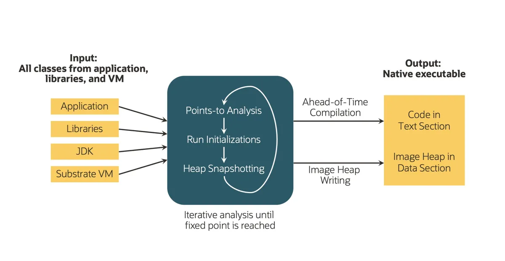
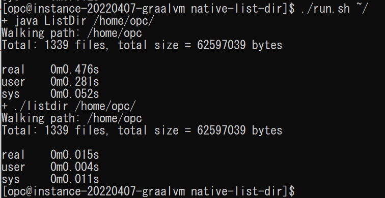

# Native Image

## 概要

この演習では、通常のJavaクラスをネイティブコンパイルした上、従来のJIT方式とネイティブ形式の実行時パフォーマンスを比較します。  
Graalコンパイラには、進化したJITコンパイラ機能に並び、ネイティブな実行ファイル(native image)を生成するAOT（Ahead-Of-Time)コンパイラ機能を持ち合わせています。Javaバイトコード（Javaクラス）を実行しながらコンパイルするJITモードとは異なり、AOTモードでは実行前のビルド時に、Javaバイトコードを静的解析をした上コンパイルされます。ネイティブな実行ファイルを生成するプロセスの中で、主に以下の作業が行われます。
* ポインタ解析（Points-to analysis）:　AOTコンパイラが、実行時に到達可能なクラス、メソッド、フィールド、依存ライブラリ、必要なJDKクラスを判別して、ネイティブ実行ファイルに格納します。
* ビルド時初期化（Initializations at build time）： ビルド時クラスを初期化し、実行時のオーバーヘッドを軽減します。
* ヒープスナップショット（Heap snapshotting）： 初期化オブジェクト、到達可能なオブジェクトをJVMヒープ上に事前に書き込みすることによって、実行時スピードを大幅に高めます。



*所要時間: 10分*

### ■目標
* GraalVMのAOTコンパイラでJavaクラスをネイティブ実行ファイル(naitve image)に変換
* JavaアプリケーションをJITモードとネイティブモードでそれぞれ実行し、パフォーマンスを比較

### ■前提条件

* 演習１「GraalVMのインストール」を実施済みであること

## Task 1: サンプルアプリケーションの導入

このサンプルはJava Stream APIを利用して、指定したディレクトリー配下のすべてのファイルを集計して、その数とファイルサイズの合計を表示するプログラムです。同じプログラムをJITモードとネイティブモードの両方で実行し、所要時間を比較します。

1. 演習１の中でGitHubよりダウンロードしたGraalVM Demosサンプルアプリケーションを利用します。  
サンプルソースをダウンロードしたフォルダー配下の"native-list-dir"フォルダーに移動してください。

    ```
    <copy>cd ~</copy>
    ```
    
    ```
    <copy>cd graalvm-demos</copy>
    ```
       
    ```
    <copy>cd native-list-dir</copy>
    ```

2. サンプルコードの中身を確認します。

   エディターでサンプルソースコードの内容を確認します。
    ```
    <copy>nano ListDir.java</copy>
    ```  
       
    ```
    import java.io.File;
    import java.nio.file.Files;
    import java.nio.file.Path;
    import java.nio.file.Paths;
    import java.util.stream.Stream;

    public class ListDir {
      public static void main(String[] args) throws java.io.IOException {
        String root = ".";
        if(args.length > 0) {
                root = args[0];
        }
        System.out.println("Walking path: " + Paths.get(root));
        long[] size = {0};
        long[] count = {0};
        try (Stream<Path> paths = Files.walk(Paths.get(root))) {
                paths.filter(Files::isRegularFile).forEach((Path p) -> {
                        File f = p.toFile();
                        size[0] += f.length();
                        count[0] += 1;
                });
        }
        System.out.println("Total: " + count[0] + " files, total size = " + size[0] + " bytes");
      }
    }
    ```

    CTRL+Xを押下し、nanoエディターからExitします。

## Task 2: サンプルアプリケーションのビルドおよび実行

1. ソースコードをビルドします。

    ```native-list-dir```配下で以下のコマンドを実行してください。  

    ```
    <copy>javac ListDir.java</copy>
    ```

    生成されたJavaクラス"ListDir.class"に対してnative imageの生成を実施します。

    ```
    <copy>native-image --no-fallback ListDir</copy>
    ```

2. JITモードでJavaクラスを実行し、その実行時間を計測します。javaコマンドの引数に任意のディレクトリーのパスを渡します。例えば、ログインユーザーのホームディレクトリー配下のファイルを集計する場合、以下のコマンドを実行します。
    ```
    <copy>time java ListDir ~/.</copy>
    ```

3. ネイティブモードで実行し、実行時間を計測します。
    ```
    <copy>time ./listdir ~/.</copy>
    ```
       
    
    任意のディレクトリーのパスをいろいろを変更して、二つのモードでの実行結果を比較してみてください。

<!--
4. 二つのモードで順番に実行するシェルで両者のパフォーマンスを比較します。  

    ```
    <copy>./run.sh ~/.</copy>
    ```
    
-->

## Task 3（オプショナル）: native imageにおけるJavaリフレクションの使用

native imageは実行する前にビルドされ、そのビルドはアクセス可能なコードの静的分析に依存します。従って動的にロードされるクラスやオブジェクトを含むアプリケーションをnative imageとして実行する場合エラーが発生する場合があります。以下のJava機能をnative imageで利用場合、GraalVMのトレース・エージェントを使用した構成支援ツールを利用する必要があります：
* Javaリフレクション
* JNI(Java Native Interface )
* 動的プロキシ・オブジェクト(java.lang.reflect.Proxy)
* クラスパス・リソース(Class.getResource)
以下のJavaリフレクションサンプルをnative imageとして実行するため、GraalVMのトレース・エージェント機能を利用します。

1. Javaリフレクションを使用したプログラム「ReflectionExmpple.java」を作成します。
    このサンプルの中でJavaリフレクションAPIを使用します。実行時にクラス名とメソッド名を引数として渡し、実行したいクラスとメソッドを動的に指定します。指定に応じて文字列の反転、あるいは大文字へ変換などの操作を行います。

    ```
    <copy>cd ~</copy>
    ```

    エディタを開き「ReflectionExample.java」のソースファイルを作成します。
    ```
    <copy>nano ReflectionExample.java</copy>
    ```
    以下のソースコードを貼り付けます。

    ```
    <copy>
    import java.lang.reflect.Method;

    class StringReverser {
        static String reverse(String input) {
            return new StringBuilder(input).reverse().toString();
        }
    }

    class StringCapitalizer {
        static String capitalize(String input) {
            return input.toUpperCase();
        }
    }

    public class ReflectionExample {
        public static void main(String[] args) throws ReflectiveOperationException {
            String className = args[0];
            String methodName = args[1];
            String input = args[2];
            Class<?> clazz = Class.forName(className);
            Method method = clazz.getDeclaredMethod(methodName, String.class);
            Object result = method.invoke(null, input);
            System.out.println(result);
        }
    }
    </copy>
    ```
    
    Ctrl＋Xを押し、内容保存の確認メッセージに対し、"Y"を入力し、Enterを押下してソースファイルを保存します。 

2. 「ReflectionExmpple.java」をコンパイルし、実行します。結果が正常に表示されていることを確認します。

    ```
    <copy>javac ReflectionExample.java</copy>
    ```
    ```
    <copy>java ReflectionExample StringReverser reverse "hello world"</copy>
    ```
    ```
    <copy>java ReflectionExample StringCapitalizer capitalize "hello world"</copy>
    ```

3. 「ReflectionExample.class」をnative imageに変換後再度実行します。

    ```
    <copy>native-image --no-fallback ReflectionExample</copy>
    ```
    ```
    <copy>./reflectionexample StringReverser reverse "hello"</copy>
    ```
    native imageを実行した結果、下記のエラーが表示されます。
    ```
    $ ./reflectionexample StringReverser reverse "hello"
    Exception in thread "main" java.lang.ClassNotFoundException: StringReverser
        at java.lang.Class.forName(DynamicHub.java:1370)
        at java.lang.Class.forName(DynamicHub.java:1345)
        at ReflectionExample.main(ReflectionExample.java:20)
    ```
    「StringReverser」クラスは実行時動的に指定されたため、native imageをビルド時の静的に分析では該当クラスを含むことはできませんした。
    この問題を解決するため、GraalVMが提供する、通常のJava VMでの実行のすべての動的使用状況を追跡するエージェント機能を利用します。

4. 以下のコマンドでトレース構成ファイルの格納場所を用意します。

    ```
    <copy>mkdir -p META-INF/native-image</copy>
    ```
    
    アプリケーション実行時にnative imageエージェント機能を有効にし、構成ファイルの出力場所を指定してアプリケーションを実行します。
    ```
    <copy>
    java -agentlib:native-image-agent=config-output-dir=META-INF/native-image ReflectionExample StringReverser reverse "hello world"
    </copy>
    ```
    
    生成されるファイルは、実行時インターセプトされたすべての動的アクセスを含むJSON形式のスタンドアロン構成ファイルです。 

    ```
    <copy>cat META-INF/native-image/reflect-config.json</copy>
    ```
    ```
    $ cat META-INF/native-image/reflect-config.json
    [opc@instance-20220522-1556 ~]$ cat META-INF/native-image/reflect-config.json
    [
    {
        "name":"StringReverser",
        "methods":[{"name":"reverse","parameterTypes":["java.lang.String"] }]}

    ]
    ```

    エージェントを複数回を呼び出し、すべての実行時クラスと呼び出しメソッドを構成します。複数の構成を１つのファイルにまとめるため、javaコマンド実行時「config-merge-dir」オプションを指定します。
    ```
    <copy>
    java -agentlib:native-image-agent=config-merge-dir=META-INF/native-image ReflectionExample StringCapitalizer capitalize "hello world"
    </copy>
    ```
    ```
    <copy>cat META-INF/native-image/reflect-config.json</copy>
    ```
    ```
    $ cat META-INF/native-image/reflect-config.json
    [
    {
    "name":"StringCapitalizer",
    "methods":[{"name":"capitalize","parameterTypes":["java.lang.String"] }]}
    ,
    {
    "name":"StringReverser",
    "methods":[{"name":"reverse","parameterTypes":["java.lang.String"] }]}

    ]
    ```

5. エージェントによる構成ファイルを作成後、再度native imageをビルドし、実行します。今度はnative imageをビルドする際、JSON形式の構成ファイルが参照され、リフレクションの実行時クラスとメソッドが解決されます。

    ```
    <copy>native-image --no-fallback ReflectionExample</copy>
    ```
    
    ```
    <copy>./reflectionexample StringReverser reverse "hello world"</copy>
    ```
    ```
    <copy>./reflectionexample StringCapitalizer capitalize "hello world"</copy>
    ```

    今度はnative imageが正常に実行されることを確認できます。
    ```
    $ [opc@instance-20220522-1556 ~]$ ./reflectionexample StringReverser reverse "hello world"
    dlrow olleh
    [opc@instance-20220522-1556 ~]$ ./reflectionexample StringCapitalizer capitalize "hello world"
    HELLO WORLD
    ```

## Learn More

*参考リンク*
* [トレース・エージェントを使用した構成支援](https://docs.oracle.com/cd/F44923_01/enterprise/21/docs/reference-manual/native-image/Agent/)
## Acknowledgements

- **Created By/Date** - Jun Suzuki, Java Global Business Unit, April 2022
- **Contributors** - James Connors, Madhusudhan Rao, David Start 
- **Last Updated By/Date** - Jun Suzuki, May 2022
