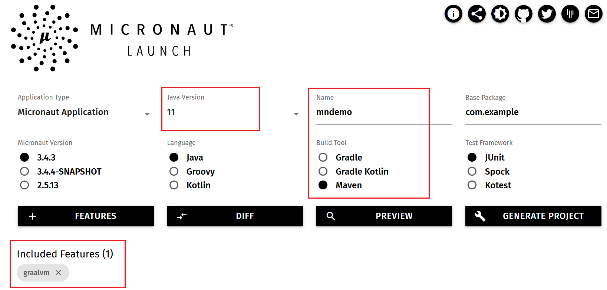

# GraalVMとJavaフレームワーク

## 概要

この演習では、代表的なマイクロサービスフレームワークMicrounautとSpring Bootを使用してRESTfulサービスを作成します。  
native imageの高速起動と小さいフットプリントはJavaベースのマイクロサービス構築には有効であるため、Spring Bootを始め現在主要なマイクロサービスフレームワークがnative image機能に対応しています。本演習で使用するMicronautとSpring Bootはそれぞれnaitve imageをビルドするためのプラグインを提供し、MavenやGradleなどのビルドツールで簡単にネイティブビルドを実現できます。

*所要時間: 15分*

### ■目標
* Micronautのサンプルアプリケーションを使用して、従来のFat jar形式とnative imageのパフォーマンスを比較します。
* Spring Bootのサンプルアプリケーションを使用して、従来のFat jar形式とnative imageのパフォーマンスを比較します。

### ■前提条件
* 演習１「GraalVMのインストール」を実施済みであること

## Task 1: Micronautアプリケーションの開発  
 Micronautはマイクロサービスとサーバレスアプリケーションを構築するためのモダンなJavaフレームワークです。フルスタックのSpring Bootに比べて、軽量で且つ高速に起動し、ランタイム時のリフレクションを回避することが特徴となっています。[micronaut.io/launch](https://micronaut.io/launch)よりJavaのバージョンやgraalvmのフィーチャなど指定してMicronautアプリケーションのテンプレートを簡単に作成することが可能です。
      
   
このタスクの中で、HTTPリクエストにHello Worldの文字列を返す簡単なRESTfulサービスを作成します。  

<!--
1. Micronautのテンプレートをダウンロードします。 プロンプトを開き、SSH接続でOCIインスタンスにアクセスします。
    ```
    <copy>ssh -i <your-private-key-file> opc@<x.x.x.x></copy>
        
    ```
   SSH接続が成立した後、以下のコマンドを発行し、Micronautプロジェクトのテンプレートをダウンロードします。
-->

1. Micronautアプリケーションのテンプレートをダウンロードします。 ホームディレクトリー配下に移動します。
    ```
    <copy>cd ~/</copy>
        
    ```

    以下のコマンドを実行を実行し、Micronautのサンプルプログラムをダウンロードします。

    <!--
    ```
    <copy>curl --location --request GET 'https://launch.micronaut.io/create/default/com.example.mndemo?lang=JAVA&build=MAVEN&test=JUNIT&javaVersion=JDK_11&features=graalvm' --output mndemo.zip</copy>
    ```
    -->

    ```
    <copy>wget https://objectstorage.us-ashburn-1.oraclecloud.com/p/LNAcA6wNFvhkvHGPcWIbKlyGkicSOVCIgWLIu6t7W2BQfwq2NSLCsXpTL9wVzjuP/n/c4u04/b/livelabsfiles/o/developer-library/mndemo.zip</copy>
    ```

    ```
    <copy>unzip mndemo.zip -d ./</copy>
    ```
    
    ```
    <copy>cd mndemo</copy>
    ```

2. エディターでJavaソースファイルを作成します。

    ```
    <copy>nano src/main/java/com/example/HelloController.java</copy>
    ```

    以下のソースを貼り付けます。
    ```
    <copy>
    package com.example;

    import io.micronaut.http.MediaType;
    import io.micronaut.http.annotation.Controller;
    import io.micronaut.http.annotation.Get;
    import io.micronaut.http.annotation.Produces;

    @Controller("/hello")  //①
    public class HelloController {
        @Get //②
        @Produces(MediaType.TEXT_PLAIN)  //③
        public String index() {
            return "Hello World\n";  //④
        }
    }
    </copy>
    ```
    Ctrl＋Xを押し、内容保存の確認メッセージに対し、"Y"を入力し、Enterを押下してソースファイルを保存します。
  | ソース箇所 | 実行内容 |
  | --- | --- |
  | ① | @Controller アノテーションがコントローラーを定義し、/helloというリクエスト・パスに対応します。 | 
  | ② |@Get アノテーションは下記index メソッドをすべてのHTTP Getリクエストに対応するようにマッピングします。| 
  | ③ |デフォルトではMicronautアプリのレスポンスのContentTypeはapplicaiton/jasonです。ここではJSONオブジェクトの代わりにStringをリターンしますので、text/plain を明示的に指定します。 |
  | ④ | "Hello World"　をリターンします。 |

3. ソースファイルをビルドします。mndemo配下で以下のコマンドを実行します。

    ```
    <copy>./mvnw clean -DskipTests package</copy>
    ```

4. Micronautアプリケーションを起動します。mndemo配下で以下のコマンドを実行します。

    ```
    <copy>java -jar target/mndemo-0.1.jar</copy>
    ```

5. RESTfulサービスの起動時間を確認します。この例では821msです。

	

    
    もう１つ別のターミナルを開き、SSHキーが保存されているディレクトリーからSSH接続でOCIインスタンスにアクセスします。x.x.x.xはOCIインスタンスのパブリックIPです。
    ```
    <copy>ssh -i <your-private-key-file> opc@x.x.x.x</copy>
    ```
        
    

    SSH接続が成立した後、以下のコマンドを発行します。RESTfulサービスに対してリクエストを発行し、”Hello World”の文字列が正常にリターンされることを確認します。
    

    ```
    <copy>curl http://localhost:8080/hello</copy>
        
    ```
    

   *※重要！※*　RESTfulサービスが起動しているターミナル画面にて、Ctrl+CでMicrounautアプリケーションを停止してください。

    


6. Native Imageをビルドします。mndemo配下で以下のコマンドを実行します。

    ```
    <copy>./mvnw package -Dpackaging=native-image</copy>
    ```

7. MicronautアプリケーションをNativeモードで起動します。mndemo配下で以下のコマンドを実行します。

    ```
    <copy>./target/mndemo</copy>
    ```

8. Micronautサービスの起動時間を確認します。この例では14msです。

	
    SSH接続されている別のターミナルから、RESTfulサービスに対してリクエストを発行し、”Hello World”の文字列が正常にリターンされることを確認します。
    ```
    <copy>curl http://localhost:8080/hello</copy>
    ```

   *※重要！※*　RESTfulサービスが起動しているターミナル画面にて、Ctrl+CでMicrounautアプリケーションを停止してください。
    


  | Column | JITモード | Nativeモード |
  | --- | --- | --- |
  | 起動時間 | 821ms | 14ms  |


## Task 2: Spring Bootアプリケーションの開発

 Spring Bootはnaitve imageをビルドするためのMavenプラグインを提供しています。[spring initializr](https://start.spring.io/)よりJavaのバージョンやgraalvmのフィーチャなど指定してSpring Bootアプリケーションのテンプレートを簡単に作成することが可能です。
      
   
 このタスクの中で、リクエストにHello Worldの文字列を返す簡単なRESTfulサービスを作成します。

1. Spring Bootアプリケーションのテンプレートをダウンロードします。 ホームディレクトリー配下に移動します。
    ```
    <copy>cd ~/</copy>
        
    ```

    <!--    
    ```
    <copy>curl https://start.spring.io/starter.zip -d dependencies=web,native -d javaVersion=11 -o spdemo.zip</copy>
    ```
    -->

    ```
    <copy>wget https://objectstorage.us-ashburn-1.oraclecloud.com/p/LNAcA6wNFvhkvHGPcWIbKlyGkicSOVCIgWLIu6t7W2BQfwq2NSLCsXpTL9wVzjuP/n/c4u04/b/livelabsfiles/o/developer-library/spdemo.zip</copy>
    ```

    ```
    <copy>unzip spdemo.zip -d ./spdemo</copy>
    ```
    ```
    <copy>cd spdemo</copy>
    ```


2. HTTPリクエストをハンドリングするResource Controllerを作成します。spdemo配下で以下のコマンドを実行します。

    ```
    <copy>nano src/main/java/com/example/demo/GreetingController.java</copy>
    ```
    
    エディターが開きましたら、以下のソースを貼り付けます。

    ```
    <copy>
    package com.example.demo;

    import java.util.concurrent.atomic.AtomicLong;

    import org.springframework.web.bind.annotation.GetMapping;
    import org.springframework.web.bind.annotation.RequestParam;
    import org.springframework.web.bind.annotation.RestController;

    @RestController
    public class GreetingController {

            private static final String template = "Hello, %s!";
            private final AtomicLong counter = new AtomicLong();

            @GetMapping("/greeting")
            public Greeting greeting(@RequestParam(value = "name", defaultValue = "World") String name) {
                return new Greeting(counter.incrementAndGet(), String.format(template, name));
            }
    }
    </copy>
    ```

    Ctrl＋Xを押し、内容保存の確認メッセージに対し、"Y"を入力し、Enterを押下してソースファイルを保存します。    
   
3. Plain Java Objectクラスを作成します。spdemo配下で以下のコマンドを実行します。

    ```
    <copy>nano src/main/java/com/example/demo/Greeting.java</copy>
    ```

    エディターが開きましたら、以下のソースを貼り付けます。

    ```
    <copy>
    package com.example.demo;

    public class Greeting {

      private final long id;
      private final String content;

      public Greeting(long id, String content) {
        this.id = id;
        this.content = content;
      }

      public long getId() {
        return id;
      }

      public String getContent() {
        return content;
      }
    }
    </copy>
    ```
     Ctrl＋Xを押し、内容保存の確認メッセージに対し、"Y"を入力し、Enterを押下してソースファイルを保存します。  

4. Mavenを使い実行可能なJARファイルにビルドし、実行します。spdemo配下で以下のコマンドを実行します。
      
    ```
    <copy>./mvnw clean -DskipTests package</copy>
    ```
        
    正常ビルド完了後、JARファイルを実行します。RESTfulサービスの起動時間を確認します。
    ```
    <copy>java -jar target/demo-0.0.1-SNAPSHOT.jar</copy>
    ```
       
    この例では、RESTfulサービスの起動時間は約1.4秒。
    
       
    SSH接続されている別のターミナルから、以下のコマンドを実行し、HTTPリクエストからレスポンスが正常にリターンされることを確認します。
        
    ```
    <copy>    
    curl http://localhost:8080/greeting
    </copy>
    ```  
               
    ```
    {"id":1,"content":"Hello, World!"}   
    ```

    *※重要！※*　RESTfulサービスが起動しているターミナル画面にて、Ctrl+CでSpring Bootアプリケーションを停止してください。
       
5. Spring Bootアプリケーションのテンプレートを作成時、dependencyをSpring Nativeを指定したため、pom.xmlの中にnative imageをビルドするためのプラグイン定義が自動的に追加されます。spdemo配下で以下のコマンドを実行し、pom.xmlの中身を確認します。
    ```
    <copy>
    cat pom.xml
    </copy>
    ```
    
   (1)Springアプリケーションをnative imageとして実行するため、Spring Frameworkより提供のSpring Native依存ライブラリ```spring-native```が指定されているのを確認します。
   
   

    <!--
    ```
    <groupId>com.example</groupId>
    <artifactId>demo</artifactId>
    <version>0.0.1-SNAPSHOT</version>
    <name>demo</name>
    <description>Demo project for Spring Boot</description>
    <properties>
        <java.version>11</java.version>
        <repackage.classifier/>
        <spring-native.version>0.11.4</spring-native.version>
    </properties>
    <dependencies>
        <dependency>
                <groupId>org.springframework.boot</groupId>
                <artifactId>spring-boot-starter-web</artifactId>
        </dependency>
        <dependency>
                <groupId>org.springframework.experimental</groupId>
                <artifactId>spring-native</artifactId>
                <version>${spring-native.version}</version>
        </dependency>
        <dependency>
                <groupId>org.springframework.boot</groupId>
                <artifactId>spring-boot-starter-test</artifactId>
                <scope>test</scope>
        </dependency>
    </dependencies>
    ```
    -->
      
   (2) SpringアプリケーションをAOTコンパイラでビルドするため、Spring Frameworkより提供の```spring-aot-maven-plugin```が```build```タグの中の```plugin```として追加されているのを確認します。

   

    <!--
    ```      
    <plugin>
        <groupId>org.springframework.experimental</groupId>
        <artifactId>spring-aot-maven-plugin</artifactId>
        <version>${spring-native.version}</version>
        <executions>
            <execution>
                    <id>test-generate</id>
                    <goals>
                            <goal>test-generate</goal>
                    </goals>
            </execution>
            <execution>
                    <id>generate</id>
                    <goals>
                            <goal>generate</goal>
                    </goals>
            </execution>
        </executions>
    </plugin>
    ```
    -->

    (3) Springアプリケーションをnative imageとしてビルドするため、GraalVMより提供の```native-maven-plugin```をprofileタグの中で指定されているのを確認します。

    
    
    <!--
    ```
    <profiles>
        <profile>
            <id>native</id>
            <properties>
                <repackage.classifier>exec</repackage.classifier>
                <native-buildtools.version>0.9.11</native-buildtools.version>
            </properties>
            <dependencies>
                <dependency>
                    <groupId>org.junit.platform</groupId>
                    <artifactId>junit-platform-launcher</artifactId>
                    <scope>test</scope>
                </dependency>
            </dependencies>
            <build>
                <plugins>
                    <plugin>
                        <groupId>org.graalvm.buildtools</groupId>
                        <artifactId>native-maven-plugin</artifactId>
                        <version>${native-buildtools.version}</version>
                        <extensions>true</extensions>
                        <executions>
                            <execution>
                                <id>test-native</id>
                                <phase>test</phase>
                                <goals>
                                    <goal>test</goal>
                                </goals>
                            </execution>
                            <execution>
                                <id>build-native</id>
                                <phase>package</phase>
                                <goals>
                                    <goal>build</goal>
                                </goals>
                            </execution>
                        </executions>
                    </plugin>
                </plugins>
            </build>
        </profile>
    </profiles>
    ```
    -->

    (4)各依存ライブラリおよびプラグインのリポジトリーも追加されているのを確認できます。
        
    ```      
    <repositories>
      <repository>
          <id>spring-release</id>
          <name>Spring release</name>
          <url>https://repo.spring.io/release</url>
		  </repository>
	  </repositories>
    ```

    ```      
    <pluginRepositories>
      <pluginRepository>
        <id>spring-release</id>
        <name>Spring release</name>
        <url>https://repo.spring.io/release</url>
      </pluginRepository>
	  </pluginRepositories>
    ```

5. spdemo配下で以下のコマンドでサンプルプロジェクトをnative imageにビルドします。ビルドが2分ほどかかりますので、しばらく待ちます。
   
    ```
    <copy>./mvnw -Pnative -DskipTests package</copy>
    ```
    

7. native imageのビルドが成功したメッセージを確認し、以下のコマンドでnative imageを実行します。
   
    ```
    <copy>target/demo</copy>
    ```
       
    RESTfulサービスの起動時間はわずか0.024秒で、従来のJITモードより60倍の速さでサービスを起動しました。
    

    SSH接続されている別のターミナルから、以下のコマンドを実行し、HTTPリクエストからレスポンスが正常にリターンされることを確認します。
        
    ```
    <copy>    
    curl http://localhost:8080/greeting
    </copy>
    ```
    
    

    *※重要！※*　RESTfulサービスが起動しているターミナル画面にて、Ctrl+CでSpring Bootアプリケーションを停止してください。
       
## Troubleshooting

> **Note:** RESTfulサービスが起動したままSSH接続が切断された場合、SSH接続を再度実施した上、以下のコマンドで8080番ポートを開いでいるjavaプロセスを特定し、終了してください。  

```
<copy>lsof -i -P | grep 8080</copy>
```

```
<copy>kill -9 プロセスID</copy>
```

## Acknowledgements

- **Created By/Date** - Jun Suzuki, Java Global Business Unit, April 2022
- **Contributors** - James Connors, Madhusudhan Rao, David Start 
- **Last Updated By/Date** - Jun Suzuki, May 2022
