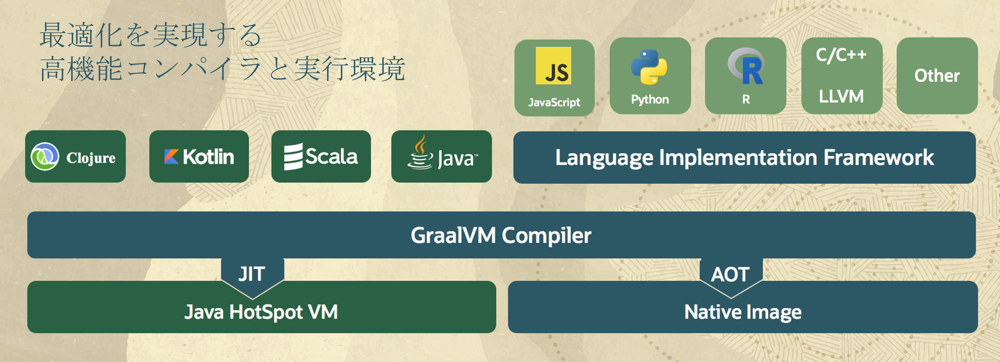

# ハンズオン概要

## 概要

GraalVM Enterprise Edition(GraalVM EE) は高い信頼性と安全性を提供するOracle JDKをベースに開発した次世代多言語実行環境です。下記はGraalVM EEのアーキテクチャ・オーバービューです。

GraalVMはJavaアプリケーションに対して二つの稼働方法を提供します。

1. Just-In-Timeコンパイラ(JIT)モード

  GraalVMのJITコンパイラの中のC2コンパイラ部分は従来のC++からJavaで書き直され、Inlining化、Escape解析、DeOptimizationなど多くの最適化手法を施すことにより、従来のJITコンパイラより高いパフォーマンスを実現しています。

    - Inlining化:   クラスに対する内部解析に基づき、getter/setterメソッドの代わりに、実際の変数を特定し代入することにより、メソッドコールの回数を減らし、実行オーバヘッドを軽減します。
    - Escape解析:   変数の適用範囲を特定し、実行オーバーヘッドの高いSynchronization作業を最低限に抑え、またローカル変数オブジェクトをJVMヒープからスタックに移動することで、JVMの使用メモリーを減らします。
    - DeOptimization: 最適化対象クラスを自動的に見直し、パフォーマンスを高め、また不要となるオブジェクトを特定してキャッシュから除去することによりメモリー負担を軽減します。

  
2. Native Imageモード

    GraalVMのAOTコンパイラ(事前コンパイラ)は、JavaクラスをOSプラットフォーム固有なネイティブ実行ファイル（Native Image）に変換します。実行時JVMを必要とせず、JITモード実行時のウォームアップが不要のため、軽量で高速に起動できるとともに、瞬時にピーク時スループットに達成することができます。

このハンズオンでは、GraalVM Enterprise Editionの導入から、GraalVMの高性能JITコンパイラの活用、Native Imageを利用してCloud Naitveアプリケーションの開発まで、GraalVMの二つの重要な機能を体験できます。

*予定時間：60分*

### ■目標

このハンズオンを実施することにより、以下を目指します：
* GraalVM Enterprise EditionをLinux環境に導入
* GraalVMのJITモードで既存Javaアプリケーションを実行
* JavaフレームワークによるNative Image開発
* コンテナ化したNative Imageのデプロイと実行

### ■前提条件

以下の項目の完了が前提としています：
* 事前にOracleアカウントを取得済みで、そのアカウントで [LiveLabs 2.0](http://bit.ly/golivelabs) より本ハンズオンの演習環境リソースを予約済みであること
* クライアントPC上にSSHキー・ペアを生成済みであること
* Javaについて基本知識や開発経験は望ましいが、必須ではない

## Learn More

*参考リンク*
* [GraalVM Enterprise product page](https://www.oracle.com/java/graalvm/)
* [GraalVM Enterprise product page(日本語)](https://www.oracle.com/jp/java/graalvm/)
* [GraalVM Enterprise downloads page](https://www.oracle.com/downloads/graalvm-downloads.html)
* [GraalVM Enterprise マニュアル](https://docs.oracle.com/en/graalvm/enterprise/21/docs/reference-manual/)
* [GraalVM Enterprise マニュアル(日本語)](https://docs.oracle.com/cd/F44923_01/index.html)
* [GraalVM Enterprise Blog](https://blogs.oracle.com/java/category/j-graalvm-technology)

## Acknowledgements
* **Author** - Jun Suzuki, Java Value Solutions Consultant, Java GBU
* **Contributors** - James Connors, Madhusudhan Rao, David Start
* **Last Updated By/Date** - Jun Suzuki, May 2022
