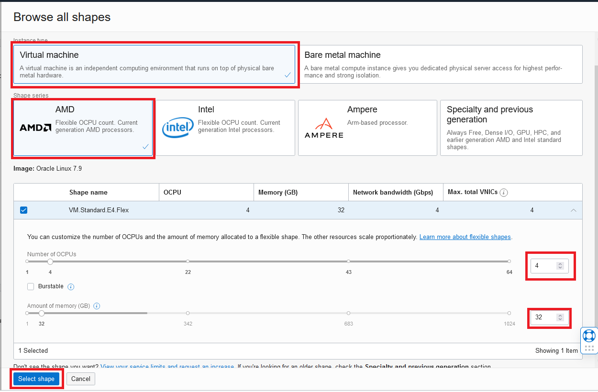

# 事前準備

## 概要

このハンズオンを実施するためには有効なOracleアカウント（OCIアカウントではありません）が必要です。Oracleアカウントを使用して演習環境のリソースの予約を行い、またその他OracleサポートやOracle一般公開コンテンツにアクセスすることができます。

事前準備作業の中で、ハンズオン参加者がOCI上に専用のVMインスタンスを構築します。  
後の演習では参加者のPCからインスタンスに対してSSH接続を行った上演習を実施して頂きます。

*所要時間: 10分*

### ■目標

* 無料のOracleアカウントを作成
* OCI上に演習用のVMインスタンスをプロビジョニング


## Task 1: Oracleアカウントの作成

Oracleアカウントは以下二つのステップで作成できます。
> **Note** 既にOracleアカウントをお持ちの場合は、下記Task2へ移動してください。  

1. ブラウザから[oracle.com](https://www.oracle.com)にアクセスします。 *View Account*をクリックして *Create an Account*を選択します。

  

2. フォーム内容を入力し、 *Create Account*をクリックします。

  

## Task 2: ハンズオンワークショップリソースの予約

1. [LiveLabs 2.0](http://bit.ly/golivelabs) へナビゲートし、「次世代Java高速実行基盤GraalVMハンズオン」のトップページにある「Run On Livelabs Sandbox」ボタンををクリックします。
　

2. Oracleアカウントログイン画面より事前に作成したユーザ名、パスワードを入力してログインします。
　

    > **Note:** Oracleアカウント未作成の場合、画面下部の「Create Account」をクリックし、Task1の手順に従ってOracleアカウントを作成してください。

3. ハンズオンの予約画面にて、「I consent to recieve reservation emails」をチェックし、「Submit Reservation」をクリックします。
　
   
   これによりクラウド上のハンズオン用環境のプロビジョニングが開始されます。次の画面より「View your reservation」をクリックして、プロビジョニング状況を確認します。
　
  
    > **Note:** プロビジョニング中、計3通のステータス確認メールが登録のメールアドレス宛に届きます。

4. プロビジョニング完了のステータスに変わりましたら、「Launch workshop」をクリックします。
　
   

5. Workshop詳細画面の内容を確認します。「User name」を確認します。「Initial password」横の「Copy Password」ボタンをクリックし、初期パスワードをコピーしてください。

    

    「Launch Console」をクリックし、OCIコンソールを開きます。

6. OCIログイン画面にて、コピーした初期パスワードをペーストして、「Sign in」をクリックします。
    

7. パスワード変更画面にて、初期パスワードを変更して、「Save New Password」をクリックします。
    

8. OCIコンソール画面にて「Instances Compute」をクリックしてインスタンス作成画面に進みます。
    

9. インスタンス作成画面上左側メニューの中の「List Scope」項目に参加者にアサインされたユーザネームに紐づいている「Compartment」を選択した上、「Create Instance」ボタンをクリックします。
    

10. 「Create compute instance」画面にて、「Image and Shape」セクションの「Change image」ボタンと「Change shape」ボタンをそれぞれ押下し、以下の条件でVMインスタンを作成してください。
    * Image name: Oracle Linux 7.9
    * Shape: AMD
    * Instance type: Virtual machine
    * Shape series: AMD
    * OCPU: count 4
    * Memory: 32GB
    
    
    

11. ネットワークはデフォルト設定のままにして、「Add SSH keys」セクションの「Generate a key pair for me」が選択されている状態を確認した上、「Save Private Key」をクリックし、SSHキー（秘密キー）をPCにダウンロードしてください。
最後に「Create」ボタンをクリックし、VMインスタンスを作成します。ここからインスタンスのプロビジョニングが開始されます。
    

    > **Note** クライアントPCがWindows10の場合ユーザディレクトリ配下（例：*C:¥Users¥<ユーザ名>*）にダウンロードしてください。MacOSおよびLinuxの場合、ダウンロードしたSSHキーを以下のように権限を変更してください。  
    ```
    <copy>chmod 600 <your-private-key-file></copy>
    ```

12. インスタンスのプロビジョニングが完了し、「RUNNING」のステータスに変わったことを確認します。パブリックIPアドレスは後の演習でSSH接続時必要になりますので、「Public IP Address」の横の「copy」ボタンをクリックするか、手元にメモをしておいてください。
    

*以上でハンズオンの事前準備が完了しましたので、次の章「ハンズオン概要」に進めてください。*

## Acknowledgements

- **Created By/Date** - Jun Suzuki, Java Global Business Unit, April 2022
- **Contributors** - James Connors, Madhusudhan Rao, David Start 
- **Last Updated By/Date** - Jun Suzuki, May 2022
