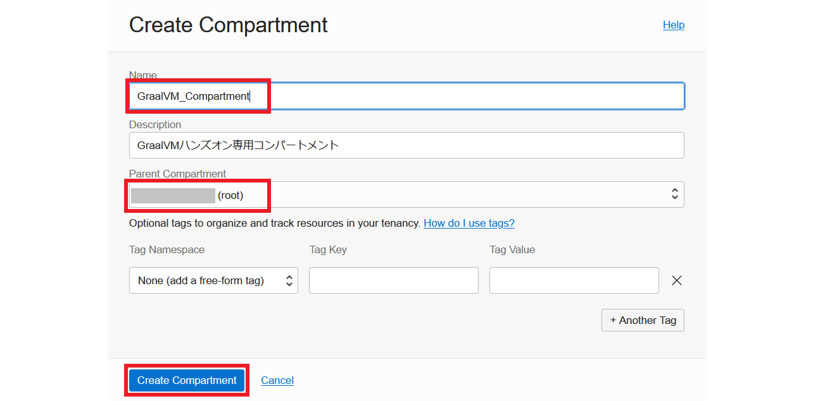

# 事前準備

## 概要

この演習では、OCI上インスタンスを作成し、演習用の環境を準備します。

*所要時間: 10 minutes*

### ■目標

このハンズオンを実施することにより、以下の目標達成を目指します：
* ハンズオン専用コンパートメントを作成
* ハンズオン専用インスタンスを作成

### ■前提条件

* 有効なOCIアカウントをお持ちであること

## Task 1: コンパートメントを作成する

1. OCIコンソール上、左上にあるナビゲーションメニューをクリックします。
    
    &nbsp;

 * ステップをよりブレークダウンする際にここに記述

  > **Note:** OCIにサインインした後、Oracleがあなた専用のテナントにルートコンパートメントを自動的的に作成します。プロジェクトごとに個別にコンパートメントを作成することをお勧めします。
  
2. **Identity & Security**をクリックします。 **Identity & Security**メニューの下にある **Compartments**をクリックします。
   
    &nbsp;

3. **Create Compartment** をクリックします。
 

4. 作成するコンパートメントの情報を入力します。
  * Name：GraalVM_Compartment
  * Parent Compartment: ルートコンパートメントを選択
  

  * **Create Compartment** をクリックします。
  

## Task 2: インスタンスを作成する

1.  OCIコンソール上、左上にあるナビゲーションメニューをクリックし、**Compute** → **instance** をクリックします。
  

2. インスタンス作成画面にて、**GraalvM_Compartment**を選択した状態で、**Create instance**ボタンをクリックします。 

3. インスタンス作成画面にて、インスタンス名の**Name**フィールドに任意の名前を入力し、**Placement**セクションの内容をデフォルトのままにします。**Image and Shape** セクションの**Edit** をクリックします。

4. 以下のスペック選択し、**Select Shape** をクリックしてインスタンスを作成します。
    - **Image** Oracle Linux 8
    - **Shape** AMDかIntelのいずれか
    - **OCPU count** 4
    - **Memory** 32GB
    - **Network**
  

5. SSHキーをダウンロードします。最後に**Create**をクリックします。

  

6. 数分後、インスタンスがプロビジョニングされたことを確認します。

  

## Acknowledgements

- **Created By/Date** - Jun Suzuki, Java Global Business Unit, April 2022
- **Contributors** - James Connors, Madhusudhan Rao, David Start 
- **Last Updated By/Date** - Jun Suzuki, May 2022
