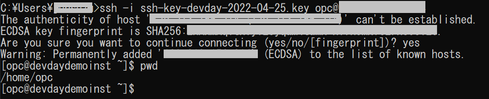
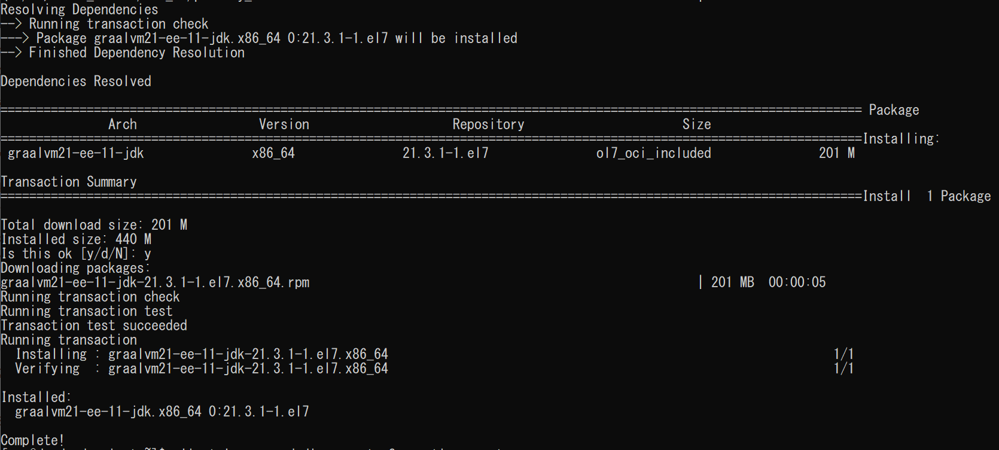
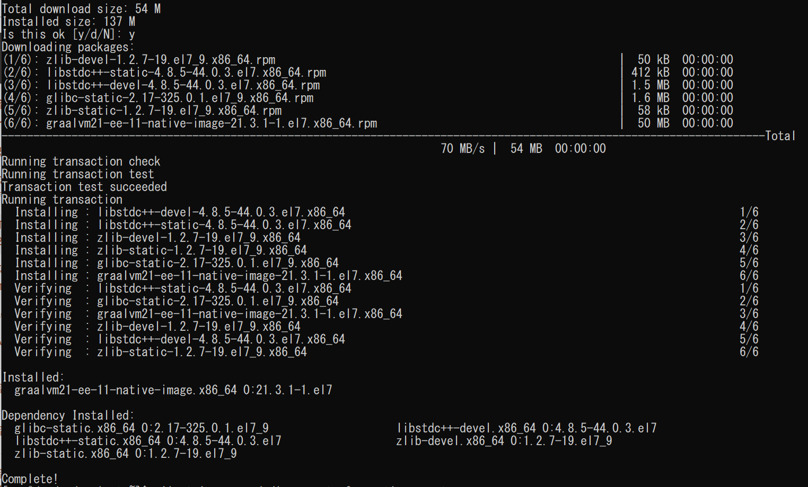

# GraalVMのインストール

## 概要

この演習では、OCI上に事前にプロビジョニング済みの演習用インスタンスにSSH接続を行い、GraalVM Enterprise Editionをインストールします。

*所要時間: 10分*

### ■目標
* GraalVM Enterprise Edtion をOracle Linux7.9上にインストール
* GraalVMのNative Image機能をインストール
* 開発用にMaven、Git、Dockerをインストール

### ■前提条件

* 「事前準備」の手順が完了、OCI上に演習専用のインスタンスが作成済みであること
* インスタンス作成時生成されたSSHキー(秘密キー）がクライアントPCにダウンロード済みであること

## Task 1: SSH接続でインスタンスにアクセス
以下の手順はWindows10を前提にしていますが、MacOSとLinuxの場合もそれに準ずる手順となります。

1. コマンドプロンプトを起動し、SSHキーを保存してある*C:¥Users¥<ユーザ名>*配下に移動します。以下のコマンドを用いて演習用インスタンスに対してアクセスします。

    ``` 
    <copy>ssh -i <your-private-key-file> opc@<x.x.x.x></copy>
        
    ```
    

    > **Note:** 
    x.x.x.xは接続先インスタンスのパブリックIPです。  
    SSH接続を確立する際の確認メッセージが表示されたら、yesと入力してください。
   
## Task 2: GraalVM Enterprise Edition 21.3をインストール

1. ホームディレクトリ配下に移動します。以下のコマンドを入力します。
    ```
    <copy>cd ~</copy>
    ```

    GraalVM Enterprise Edition コア・パッケージを導入します。確認メッセージに対して、yesと入力してインストールを開始します。

    ```
    <copy>sudo yum install graalvm21-ee-11-jdk</copy>
    ```
    

    インストールが正常終了の場合*Complete!*のメッセージが表示されます。
    
    > **Note:** プラットフォーム別の導入ガイドは[GraalVM Enterpriseのインストール](https://docs.oracle.com/cd/F44923_01/enterprise/21/docs/getting-started/#install-graalvm-enterprise)をご参照ください。


2. 以下のコマンドを入力します。GraalVM のディレクトリを指すように環境変数を設定します。

    ```
    <copy>echo "export JAVA_HOME=/usr/lib64/graalvm/graalvm21-ee-java11" >> ~/.bashrc</copy>
    ```

    ```
    <copy>echo 'export PATH=$JAVA_HOME/bin:$PATH' >> ~/.bashrc</copy>
    ```

    ```
    <copy>source ~/.bashrc</copy>
    ```

    以下のコマンドでインストールしたGraalVMのバージョンを確認します。
    ```
    <copy>java -version</copy>
    ```
    以下の出力メッセージよりGraalVMのバージョンを確認します。
    ```
    [opc@devdaydemoinst ~]$ java -version
    java version "11.0.14" 2022-01-18 LTS
    Java(TM) SE Runtime Environment GraalVM EE 21.3.1 (build 11.0.14+8-LTS-jvmci-21.3-b07)
    Java HotSpot(TM) 64-Bit Server VM GraalVM EE 21.3.1 (build 11.0.14+8-LTS-jvmci-21.3-b07, mixed mode, sharing)
    ```
   
3. 以下のコマンドを入力し、native imageを導入します。

    ```
    <copy>sudo yum install graalvm21-ee-11-native-image</copy>
    ```
    

    以下のコマンドで導入したnative imageのバージョンを確認します。
    ```
    <copy>native-image --version</copy>
    ```
    以下の出力メッセージよりnative imageのバージョンを確認します。
    ```
    [opc@devdaydemoinst ~]$ native-image --version
    GraalVM 21.3.1 Java 11 EE (Java Version 11.0.14+8-LTS-jvmci-21.3-b07)
    ```

## Task 3: 演習用に必要なその他ソフトをインストール

1. Mavenのインストール   
    以降の演習でJavaアプリケーションをビルドするため、Mavenを導入します。以下のコマンドを実行します。導入時の確認メッセージに対して、yesと入力してインストールを開始します。

    ```
    <copy>sudo yum install maven</copy>
    ```

    *Complete!*　のメッセージを確認し、Mavenが正常に導入されることを確認します。

2. gitのインストール  
    以降の演習でGitHubよりサンプルソースコードをダウンロードする必要がありますので、gitを導入します。以下のコマンドを実行します。導入時の確認メッセージに対して、yesと入力してインストールを開始します。

    ```
    <copy>sudo yum install git</copy>
    ```

    *Complete!*　のメッセージを確認し、gitが正常に導入されることを確認します。

3. Dockerのインストール。  
    以降の演習でJavaアプリケーションをコンテナ化する作業があるため、Dockerを導入します。以下のコマンドを実行します。導入時の確認メッセージに対して、yesと入力してインストールを開始します。

    ```
    <copy>sudo yum install docker-engine</copy>
    ```

    *Complete!*　のメッセージを確認し、Dockerが正常に導入されることを確認します。
    
    以下のコマンドでDockerを起動します。
    ```
    <copy>sudo systemctl enable docker</copy>
    ```
    ```
    <copy>sudo systemctl start docker</copy>
    ```

    <!--
    以下のコマンドで導入されたDockerのバージョンを確認します。
    ```
    <copy>sudo docker version</copy>
    ```
    -->

以上で本演習のタスクがすべて完了しました。次の演習に進めてください。
## Learn More

*参考リンク*
* [GraalVM Enterprise product page](https://www.oracle.com/java/graalvm/)
* [GraalVM Enterprise product page(日本語)](https://www.oracle.com/jp/java/graalvm/)
* [GraalVM Enterprise downloads page](https://www.oracle.com/downloads/graalvm-downloads.html)
* [GraalVM Enterprise マニュアル](https://docs.oracle.com/en/graalvm/enterprise/21/docs/reference-manual/)
* [GraalVM Enterprise マニュアル(日本語)](https://docs.oracle.com/cd/F44923_01/index.html)
* [GraalVM Enterprise Blog](https://blogs.oracle.com/java/category/j-graalvm-technology)

## Acknowledgements

- **Created By/Date** - Jun Suzuki, Java Global Business Unit, April 2022
- **Contributors** - James Connors, Madhusudhan Rao, David Start
- **Last Updated By/Date** - Jun Suzuki, May 2022
