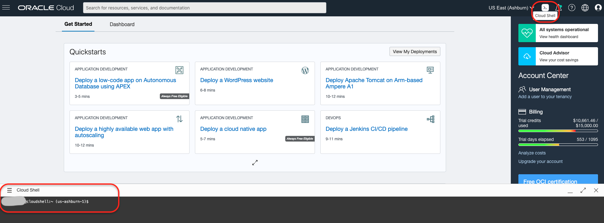
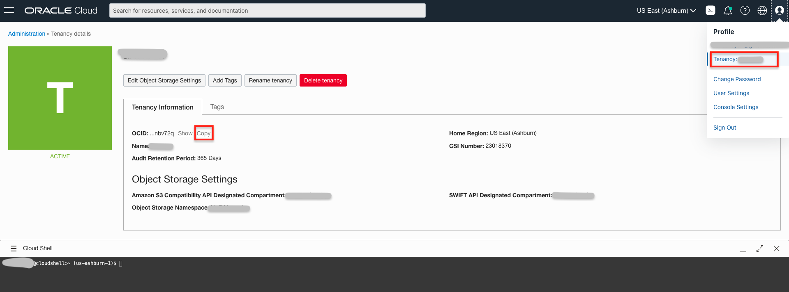
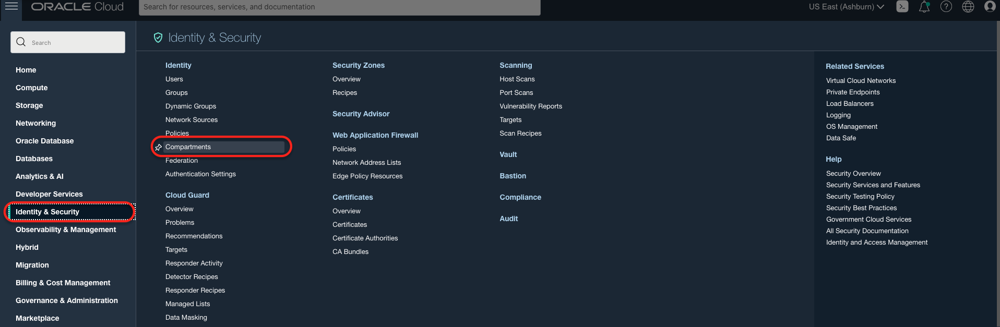
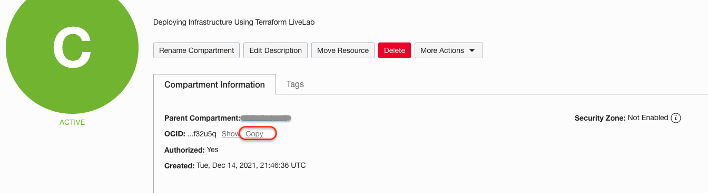
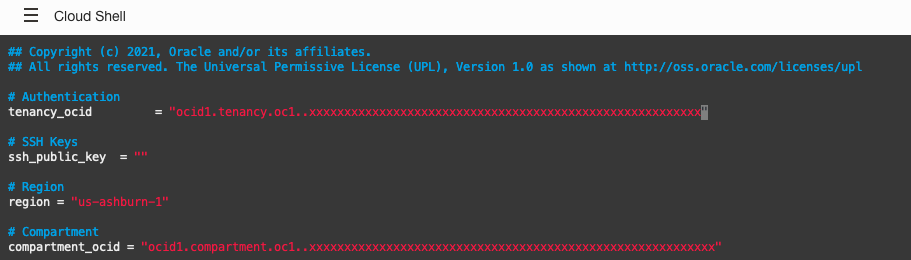
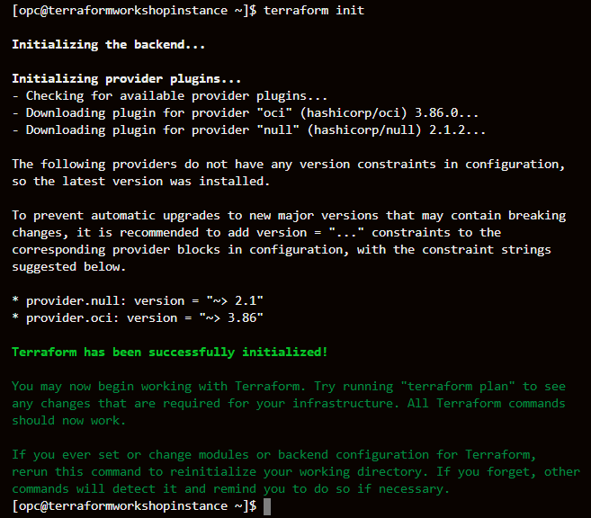
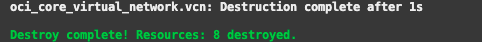

# Deploying Infrastructure Using Terraform

## Introduction
In this lab we will use pre-configured terraform scripts to deploy VCN, Subnet and Compute Instance. We will then delete all these infrastructure resources.

Estimated Time: 30 minutes

**Key points:**
- We recommend using Chrome or Edge as the browser.
- You will be asked to record some information during this workshop. It is recommended that you paste the information into a text file when prompted.

### Pre-Requisites

1. [OCI Training](https://cloud.oracle.com/en_US/iaas/training)
2. [Familiarity with OCI console](https://docs.us-phoenix-1.oraclecloud.com/Content/GSG/Concepts/console.htm)
3. [Overview of Networking](https://docs.us-phoenix-1.oraclecloud.com/Content/Network/Concepts/overview.htm)
4. [Familiarity with Compartment](https://docs.us-phoenix-1.oraclecloud.com/Content/GSG/Concepts/concepts.htm)
5. [Cloud Shell](https://docs.cloud.oracle.com/en-us/iaas/Content/API/Concepts/cloudshellintro.htm)

## Task 1: Access OCI Cloud Shell

1. From the OCI Console, click on the **cloud shell** icon as shown below. This should launch a cloud shell session for the user.

    

    *NOTE: Ensure the correct Compartment is selected under COMPARTMENT list*

2. Next you will need to get your tenancy OCID. Click the human icon in the top right and then your tenancy. Then click the copy button to copy your tenancy OCID. Record your tenancy OCID for later use.

    

3. Next you will need to get your region identifier. Click your region and then click manage regions. Then copy your region identifier and record it.

    

4. Next you will need to get your compartment identifier. Click on Identity & Security in the left Hamburger button. Click on Compartments. Next, copy your compartment OCID and record it.

    
    

## Task 2: Terraform configuration

1. Next, download the Terraform sample code. Enter the following command into the cloud shell.

    ```
    <copy>curl https://objectstorage.us-ashburn-1.oraclecloud.com/p/W7d4rKt71E8pOkTyB1ca5lbuerxDcyL0ZjuIMIRQ15-i-JW7KJOC6TMKSnD-_bZO/n/ociobenablement/b/lab/o/terraform_demo.zip -o terraform-demo.zip</copy>
    ```

    This will download the sample terraform zip file.

2. Next unzip the file:

    ```
    <copy>unzip terraform-demo.zip</copy>
    ```

3. We will need to modify **terraform.tfvars** file. Enter the following command.

    ```
    <copy>cd terraform_demo</copy>
    ```

4. Now edit the terraform.tfvars file. We will update these variables :- tenancy_ocid, region, compartment_ocid. Keep the ssk_public_key blank and as it is.

    Make sure to have the values ready which was saved in earlier steps.

    ```
    <copy>vi terraform.tfvars</copy>
    ```

    Next, type **i** to edit and populate the values for the above variables.

    As you see these variables have blank values. Make sure to fill those up.

5. After updating the terraform.tfvars file the content will look like the image below.

    

    To save the file and exit, type **:wq!**.

6. Now initialize terraform with the following command.

    ```
    <copy>terraform init</copy>
    ```

    Verify successful initialization.

    

7. To see the deployment plan enter the following command.

    ```
    <copy>terraform plan</copy>
    ```

    This will provide details on what will be configured in OCI.

8. Finally apply the plan to create the infrastructure. Enter the following command.

    ```
    <copy>terraform apply</copy>
    ```

    *NOTE: You must type yes when prompted.*

    

9. This script will take some time to execute. You can switch to the OCI console and observe the creation of the VCN, Compute instance.

10. Finally, destroy the infrastructure that we created. Enter the following command.

    ```
    <copy>terraform destroy</copy>
    ```

    *NOTE: You must type yes when prompted.*

    You can switch to the OCI console and observe deletion of VCN, Compute instance.

    

    *Congratulations! You have successfully completed the lab.*

## Acknowledgements

- **Author** - Flavio Pereira, Larry Beausoleil
- **Adapted by** -  Yaisah Granillo, Cloud Solution Engineer
- **Contributors** - Jaden McElvey, Technical Lead - Oracle LiveLabs Intern
- **Last Updated By/Date** - Kamryn Vinson, August 2020

