# Develop SOA Composite App "Validate Payment"

## Introduction
In this module, you will build your first Oracle SOA Suite 12c composite to validate a credit card payment.
In this composite, credit card payments will be validated and the payment status will be returned. If the payment is denied, the order will not be processed.

Avitek, a fictitious company, has embarked upon a modernization project to align with business goals of improving customer satisfaction. A key area of improvement will be streamlining the order process to provide better visibility tracking orders through credit approvals, fulfillment, shipment and delivery.

The challenge in the current application is that credit card payments are often denied for various, sometimes minor reasons, such as expiration date, etc. Since the process to correct these issues varies across Avitek’s order entry systems, on-premise or new adopted Cloud SaaS application there is no consistent follow-up and resolution with customers. Orders may end up lost or delayed in the system leading to customer dissatisfaction.

The business has indicated a new credit card fraud detection system must be put in place before year’s end to thwart credit card abuses. A consistent fraud mechanism will require the credit validation process to be consolidated across all order entry systems.

The validate payment solution will look as the following from an architectural perspective:

  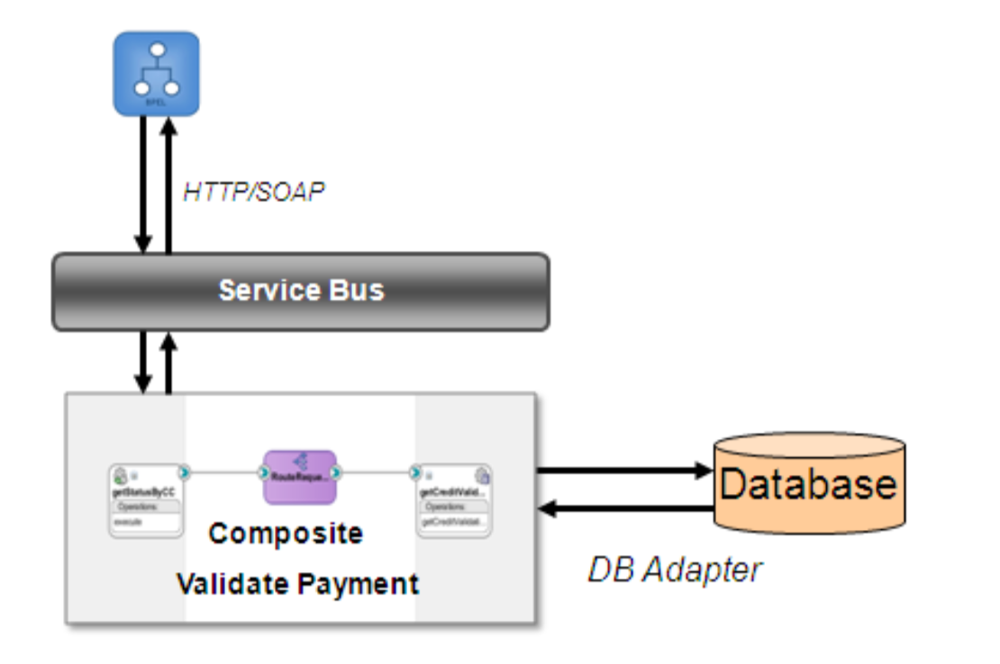

*Estimated Lab Time*: 90 minutes

### Objectives

**Construct Payment Validation orchestration**

The validation process flow outlines:
- The payment information is retrieved from the database, using the credit card number quoted in the order message as the key. If there is no data available with this credit card number, payment is denied.
- If data for the credit card number is available, the expiry date in the database record is compared to the expiry date listed in the order message. If they are not the same, the payment is also denied.
- The last check compares if the total order amount is less than the daily limit on the credit card in the database.
- When all tests are successful, the payment is authorized. Otherwise it’s denied.
- The implementation of this service uses a BPEL (Business Process Execution Language), a process orchestrator to retrieve the credit card data from the database and perform the tests outlined above. The service will return either Authorized or Denied as the payment status.

### Prerequisites
This lab assumes you have:
- A Free Tier, Paid or LiveLabs Oracle Cloud account
- SSH Private Key to access the host via SSH
- You have completed:
    - Lab: Generate SSH Keys
    - Lab: Prepare Setup
    - Lab: Environment Setup
    - Lab: Initialize Environment

## Task 1:  Create a New SOA Composite Application

Let's name the application `e2e-1201-composites` and the SOA project in JDeveloper, ValidatePayment.

To start designing the SOA composites, SOA 12c has a number of new features to improve sharing of common “code” between teams, departments or even from a partner to a customer. Part of that is the new SOA Templates feature.

SOA templates can be used as starting points to accelerate the development of SOA applications. These templates will either be the foundation of a project or can be added to an existing project. All changes made after the import point will not be reflected in the original template.

The SOA templates come in three flavors:
- Project templates: They include a complete project with all components and resources used and will be used when creating a new project in your SOA application.
- Component templates: A component with all references resources and components. For example, a BPEL process that calls a business rule or adapter can be packaged as component template.
- Custom activity templates: A scope in a BPEL process, which may include an invoke/receive from/to a partnerlink, can be packaged as a custom BPEL activity. For example, an assign activity and a call to an adapter.

To make sure of the templates, please follow the steps below:
1. SOA templates that are located in the default directory (e.g. `$MW_HOME/jdeveloper/integration/templates`) will be recognized automatically. Additional directories can be added.
2. As the templates used for the labs have been unpacked into the `/home/opc/e2e-1201-orderprocessing/templates/`, we will add this directory to the list of folders that are scanned for templates.
3. In the main JDeveloper menu, please go to `Tools --> Preferences`.

    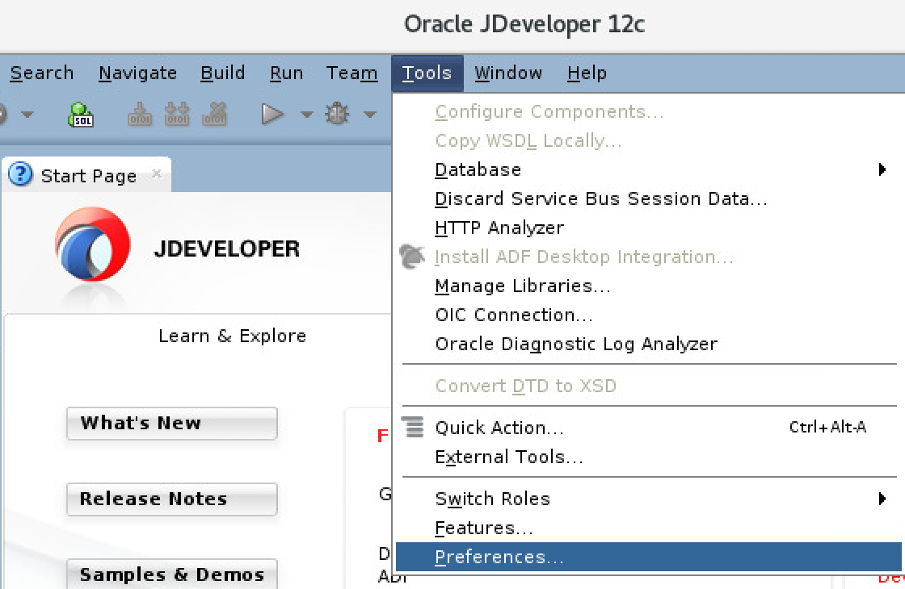

4. In the Preferences window, go to `SOA --> Templates`. (If you do not see ‘SOA’ in the preferences, then you could create a new application, or open an existing one. This will load up SOA libraries, SOA preference will show up).

    

5. Click the `+` button, to add folder.
6. Navigate to `/home/opc/e2e-1201-orderprocessing/templates/`.

    

7. Click Select to accept your choice.

   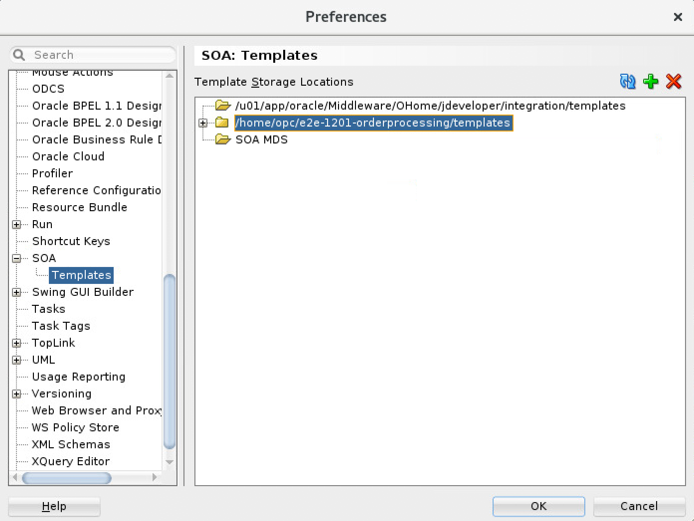

8. Click OK to close the Preferences window.

## Task 2:  Use a New Template to Create the ValidatePayment Composite.

Create a new SOA application and project. There are various ways and shortcuts to do this, and in this case choose `File > New > Application...` from the menu.
1. From the Categories tree, click on `General > Applications`.
2. Select SOA Application from the Items field.

   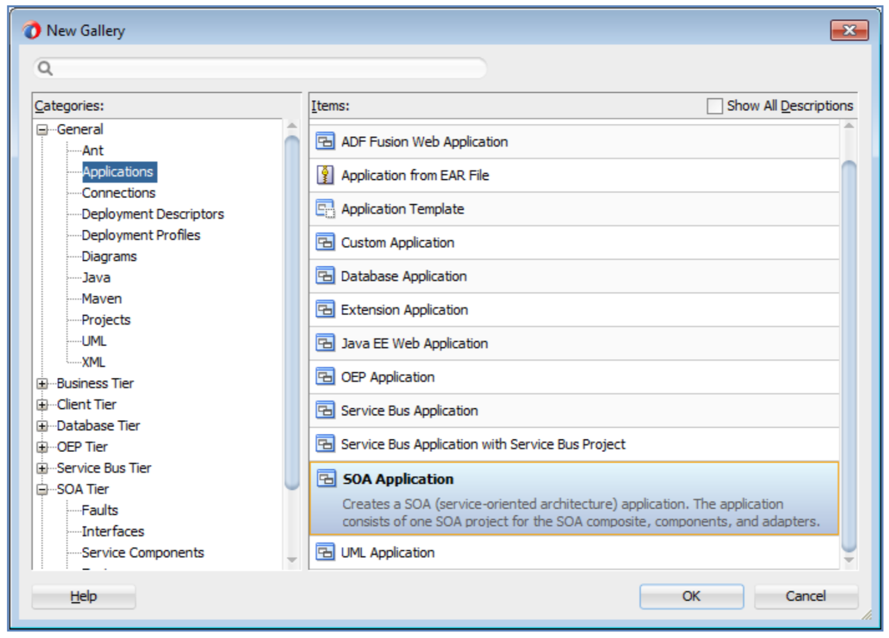

3. Click OK.
4. In the subsequent dialog for Create SOA Application, set the following fields, leaving the others with their default values:
      - Application Name: `e2e-1201-composites`
      - Directory of your choice, as shown below
   

5. Click Next.

6. When you create a new application, you are prompted to create a new project. Set the following fields:
      - Project Name: *ValidatePayment*
      - Keep the default Directory
      - Project Features: SOA Suite

   

7. Click Next.
8. The next step is to pick a ‘Standard Composite’, or a ‘SOA Template’. Choose ‘SOA Template’.

   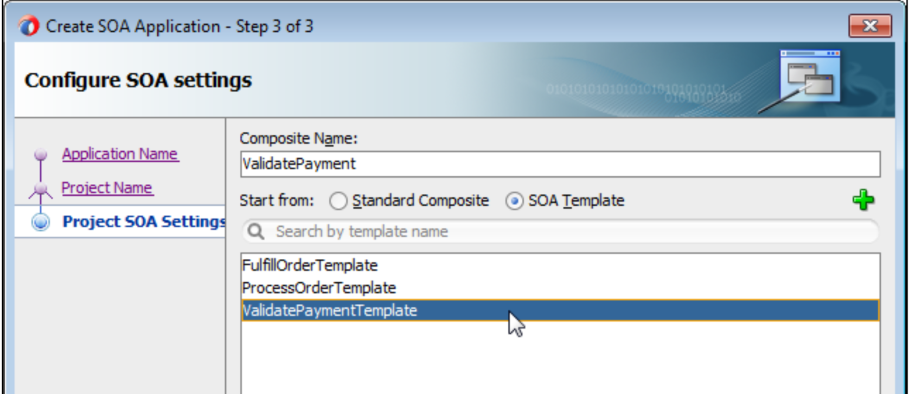

9. Select “ValidatePaymentTemplate”. Click Finish.

A new project “ValidatePayment” is created with some predefined components as derived from the template. A canvas displaying three swim lanes: services, components, and references; shown below

   

On the left hand side, you will see the Application Navigator, which shows all resources included in a SOA project. This Navigator has been reorganized in SOA Suite 12c to make it easier to find all files related to SOA, and also to provide the option to customize the folder structure.

You will see a SOA folder under the project root. This is where all SOA related files and folders are stored, such as BPEL processes, schema files, WSDL files.

The composite.xml, which defines the structure of the composite, is located directly under the SOA folder. In previous releases, this file was just shown as composite.xml. This became confusing when several composite.xml files from different projects were open at the same time.

## Task 3:  Review the Various Components of the Composite.

In SOA Suite 12c, the project name is displayed in the navigator and in the composite tab label. It is displayed as ValidatePayment here.

1. The SOA folder has a number of subfolders with default names, which hold common SOA artifacts viz. BPEL, XML schemas, WSDL files, transformation-related files and events.

You will see new subfolders created when creating new components. The structure and names of the subfolders can be customized to your liking, as long as all folders are located under SOA.

2. The composite diagram is shown here:

The External References swim lane contains the getpaymentInformation database adapter.

3. The next step will retrieve the payment information from the database, using the credit card number as the key. Based on expiry date, daily limit, and total amount of order, the app calculates whether the payment is authorized or denied. The database adapter will process choices, and provides a service that implements the operation specified. The WSDL file to represent that service is *getPaymentInformation.wsdl*.

4. In the center (components swim lane) is the validatePayment BPEL Process. This is the component that implement the orchestration in the SOA Suite.

5. In SOA 12c, This BPEL process will make use of two resource files: *ValidatePayment-concrete.wsdl* and *CanonicalOrder.xsd*.

6. On the left-side of swim lane, a  *`validatepaymentprocess_client_ep`* is the external client web service that input to the BPEL process.

## Task 4:  Add a Database Connection to Java DB

The Java DB is an embedded database inside JDeveloper 12c. The embedded weblogic requires to be started prior to establishing connection to the embedded database). Otherwise, Java DB will not be available.

The database adapter getpaymentInformation will connect to the SOA database. In order to do that, it needs a connection which contains all the details needed to connect to the database. The template does not carry the connection information – it leverages the connection(s) configured for the application.

  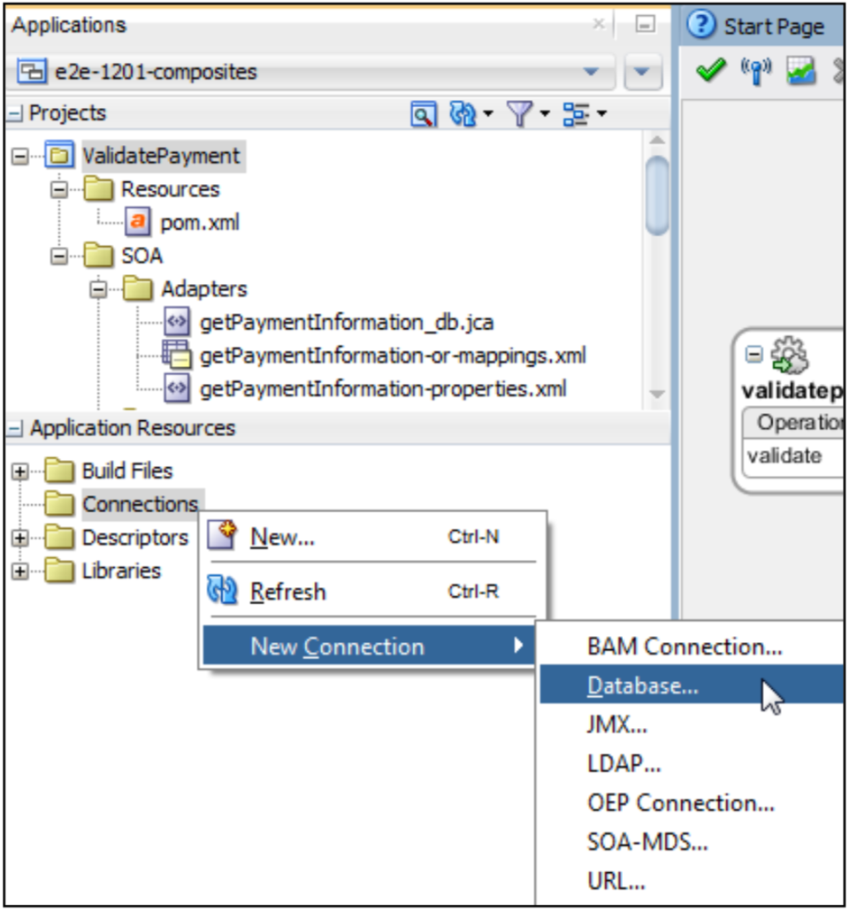

1. In the Create Database Connection dialog, enter the following details:
      - Create Connection In: Application Resources
      - Connection Name: SOA
      - Connection Type: Java DB / Apache Derby

   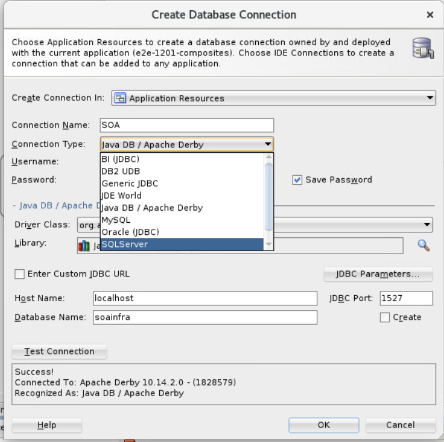

2. Input Server Name (localhost), Port (1527) and Database (soainfra) for the preconfigured Java DB / Apache Derby are filled in automatically. Click the Test Connection button and verify that your connection works.
You should see “Success!” like in the screenshot below

   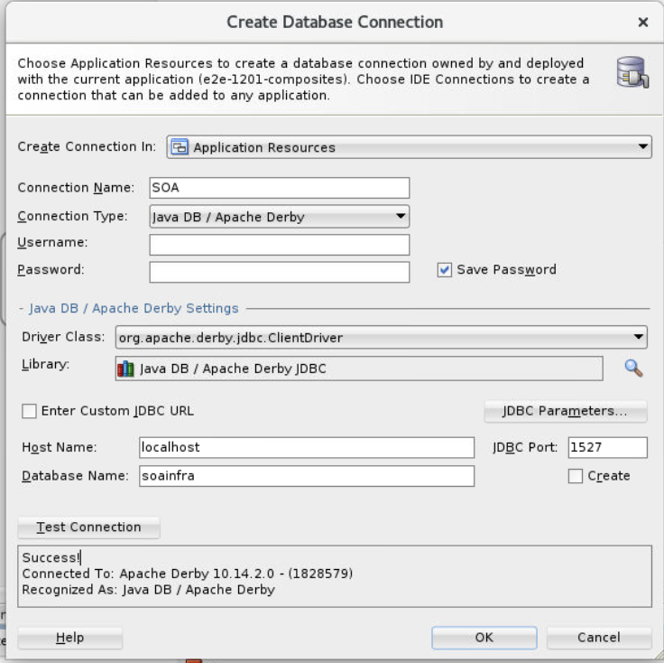

3. Click OK.
4. Ensure to save all changes by clicking the Save All icon at the top of JDeveloper.

   

Now build your project:

5. Click on Build in the main menu
6. Select Make ValidatePayment.jpr

   

You will see the build result in the Messages – Log window (at the bottom of JDeveloper)

If your log looks like this, everything is fine:

   

**Let's review the validate payment BPEL process.**
7.  Double-click the BPEL process to open the BPEL designer shown here:

   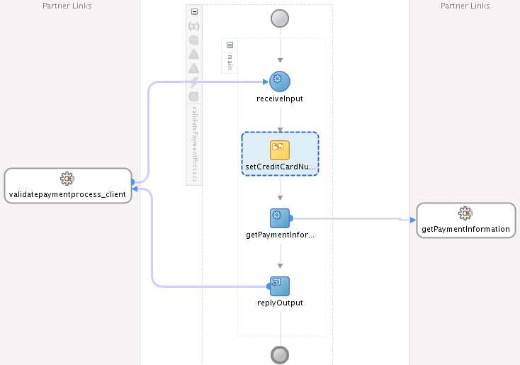

   - The *getPaymentInformation* partnerlink is already in the Partner Links swim lane. It is also connected via the Invoke activity.
   - The input and output variables for the adapter call are also defined. They are leveraged when the DB adapter is invoked. Invoke activity is used when communicating with services, like adapters and web services.

8. When defining an invoke activity, you can have the input (and output) variable created automatically. You can review these invoke activity and the variables using the new Property Inspector

9. If the Property Inspector window is not open, go to `Window --> Properties`.

10. If the window is open on the right hand side, you may want to drag and drop it into the middle at the bottom. On the left hand side of the property inspector you will see the same tabs as you would see when opening the activity for editing.

11. The variable designated for the **input** will contain the data (the credit card number) that will be sent to the service when it is invoked. It is automatically created with the correct type expected by the service.

12. The name of the variable is a concatenation of the partner link name, the operation and *InputVariable*.
Similarly inspect the Output Variable by changing to the Output tab.

   
   

13. In the BPEL process, just above the invoke activity, is the Assign activity `setCreditCardNumber`. Use an Assign activity to assign data to a variable. In this case, the credit card number is assigned that was passed into the BPEL process to the `getPaymentInformation` service.

14. Double-click on the assign activity, to launch the Assign Editor:

   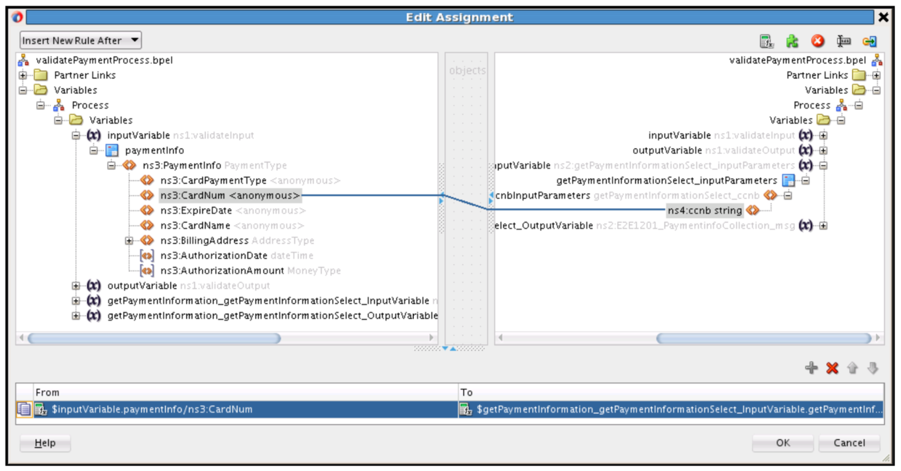

15.  On the left hand side (source), expand *`Variables > Process > Variables > inputVariable > paymentInfo > ns3:PaymentInfo > ns3:CardNum`*
16. On the right hand side (target), expand *`Variables > Process > Variables > getPaymentInformation_getPaymentInformationSelect_InputVariable > getPaymentInformationSelect_inputParameters > ns4:ccnb`*

Note the mapping from `ns3:CardNum` on the left to `ns4:ccnb` on the right. This creates a new copy rule, which can be seen at the bottom of the editor.

17. Click OK to return to the BPEL process.

We don’t need an assign activity for the output variable as we will define an XSLT map to determine if the payment is valid, based on the information returned by the database adapter.

18. Ensure to save everything before you continue.

## Task 5: Import a Custom Activity Template with an XSLT Map

This activity is to determine the payment status (Authorized or Denied), based on the daily limit and the total amount of order. Step 5 is to calculate payment status using an XSLT map (custom activity template)

- An XSLT transformation is provided to determine if the payment is valid, based on the daily limit (retrieved from the database) and the total order amount (authorization amount in the order message, which has been calculated in the process order project by multiplying price and amount of every order item and adding them up).
- The total amount of the order has to be smaller than the daily limit on the credit card.

The XSLT transformation is provided as a custom activity template.

To use the customer BPEL activity template, the directory should be included in the *`Tools --> Preferences --> SOA --> Templates`*. We already mapped the folder in a prior section when project template was used.

1. In your BPEL process, expand the Custom Activity Templates section in the BPEL activity palette.
2. If you don’t see the template, close and reopen the BPEL process.
3. You should see the `CalculatePaymentStatusScope` template in the list.

   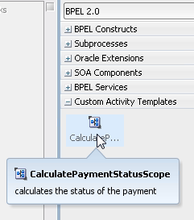

4. Drag and drop the `CalculatePaymentStatusScope` template under the `getPaymentInformation` invoke activity in the `validatePaymentProcess` BPEL process.

   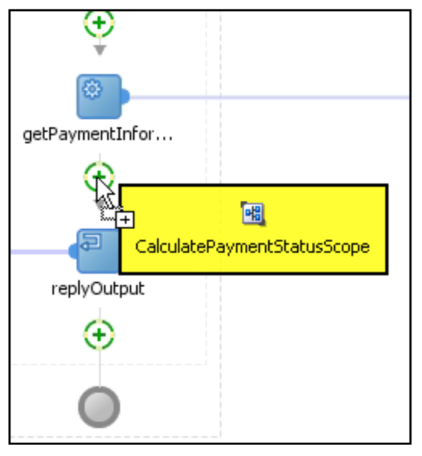

5. The template dialog shows you the Name and the Description of the template and all artifacts that are included. You will also see a list of conflicts: The template includes the `CanonicalOrder.xsd`, `getPaymentInformation_table.xsd`, and `getPaymentInformation.wsdl` which are already present in the composite:

   

6. You have the option to skip all conflict files, meaning you keep the ones in the composite, or overwrite all with those in the template. You can also make this decision individually. In this case we know that the files are identical and will skip all:

   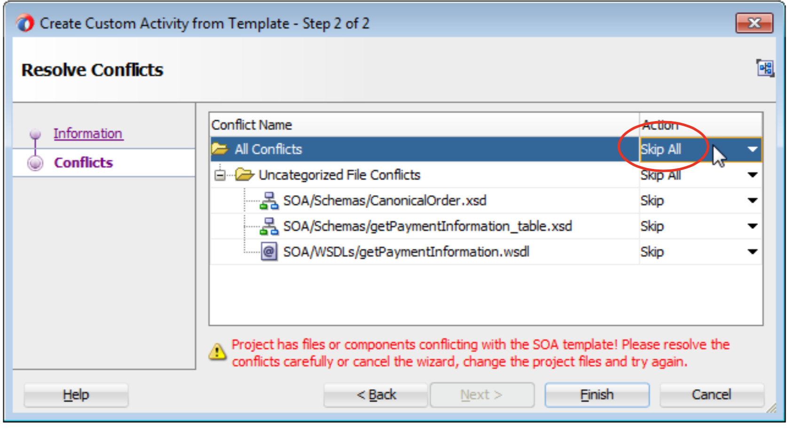

7. Select “Skip All” and click OK. Adding the custom activity template creates a new scope, which includes an XSLT transformation calculatePaymentStatus.xsl.

8. Select the transform activity `calculatePaymentStatus`, and check out the property inspector window.

You will see that the transformation expects two input variables: The output variable of the database adapter, which includes the payment information stored in the database, and the input variable of the BPEL process, which includes the total order amount.

The output is the status field in the process output message, which will either be set to “Denied” or “Authorized”.

   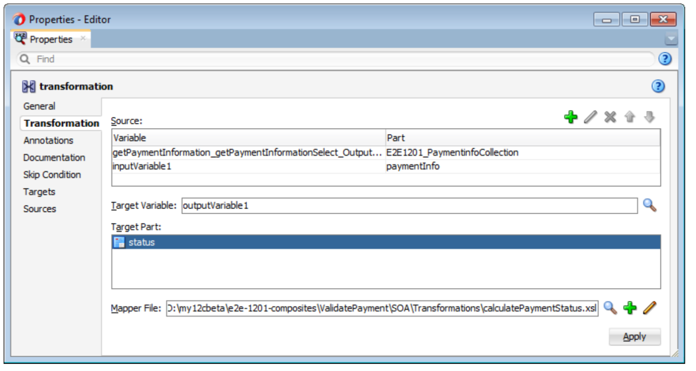

9. If you want to see the definition of the XSLT file, click the edit button at the bottom:

   

   This opens the mapper file.
10. Click Expand All Child Nodes on Source and Target and click on the little plus sign next to the function in the middle.

   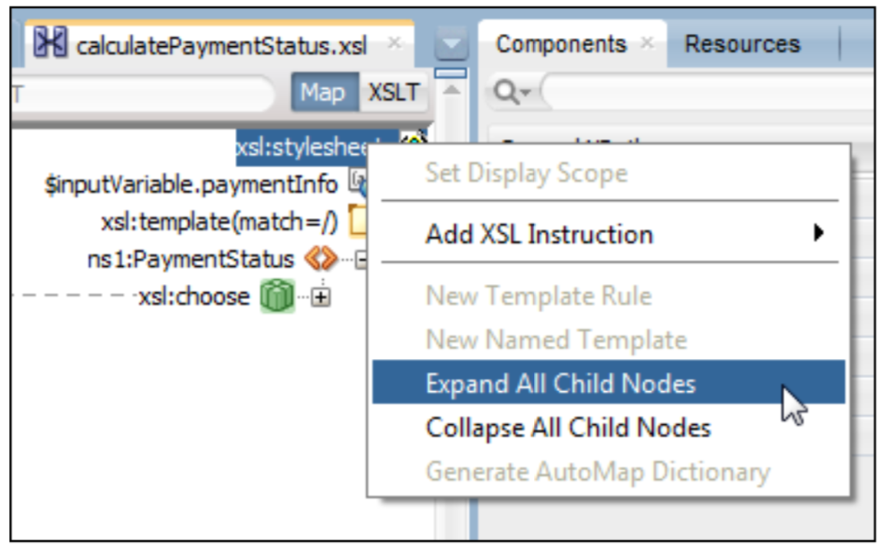

 The XSLT map checks whether
      - expireDate in order input and DB are the same AND
      - AuthorizationAmount (= total order price) is smaller than daily limit on credit card

11.  Save All and close the XSLT Map.

   

One more step to get the map to work -- (remember previously an error message?)

You may have noticed that the transformation activity uses scope variables, not global variables, as source and target. That is the case because all variables used in a template are converted into scope variables.

As the BPEL process already includes variables that can be used in this transformation, you will edit the transform activity to use global variables instead of scope variables.

12. Select the transform activity in the BPEL process and in the property inspector, select the first source variable and click the pencil icon to edit:

   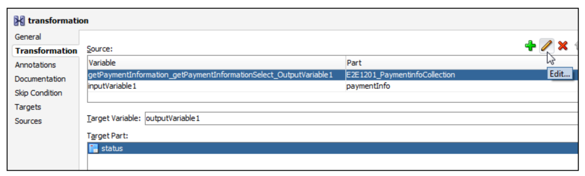

13. Select the browse button next to the Source Variable field.

   

14. Select the global variable *`getPaymentInformation_getPaymentInformationSelect_OutputVariable`* in the Variable Chooser.

   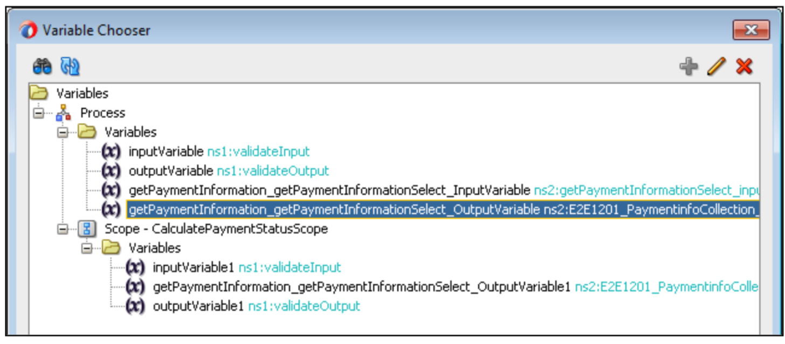

15. Click OK.
16. The Source Part for the variable will be automatically selected.

   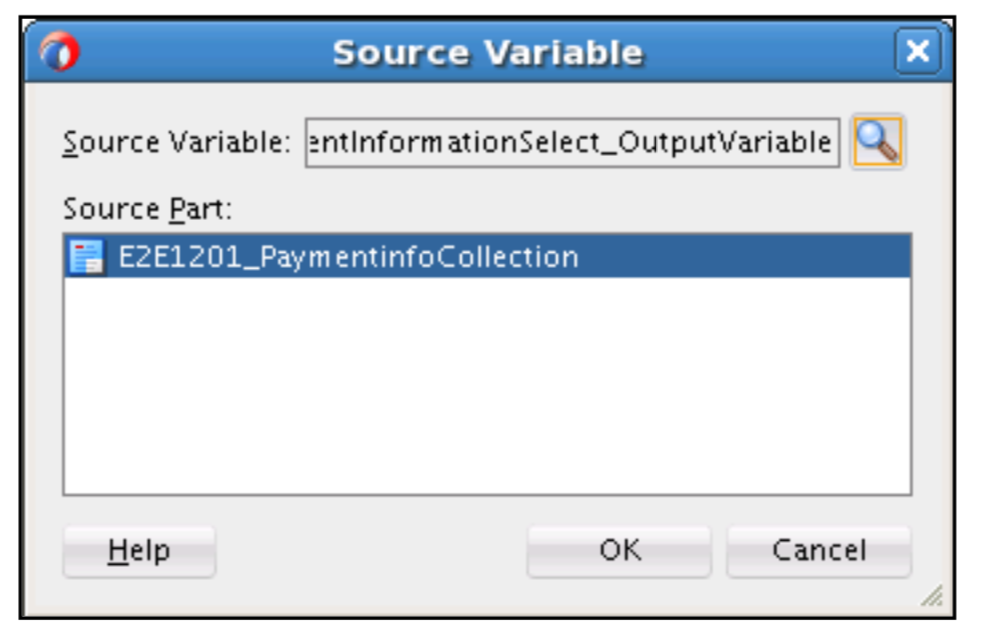

17. Click OK.
18. Repeat the same for the second source variable by replacing it with the process `inputVariable`.
19. To edit the target variable, click the browse button next to the Target Variable field.

   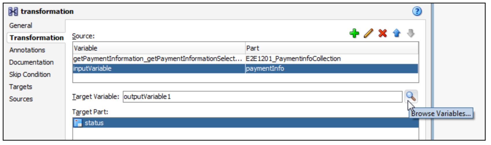

20. The Variable Chooser dialog will be displayed. Select the scope variable outputVariable. This variable will include the payment validation status.
   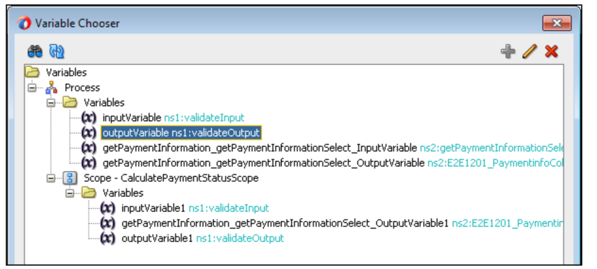

   After modifying the variables :
   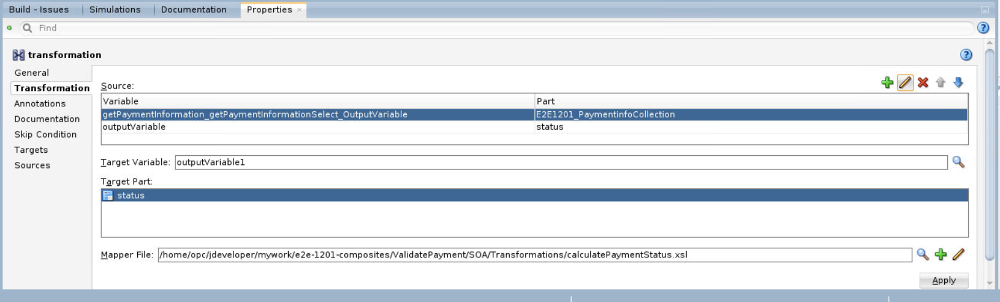

21. Click Ok. Now you can delete the scope variables.

22. Next, open the Variables window by clicking the Property Structure icon on top of the BPEL process and choosing Variables.

   

23. Delete the three scope variables by choosing the variables one by one and clicking the red “X” icon:

   

24. Confirm the delete action by clicking ‘Yes’ in the Delete Variables window.

   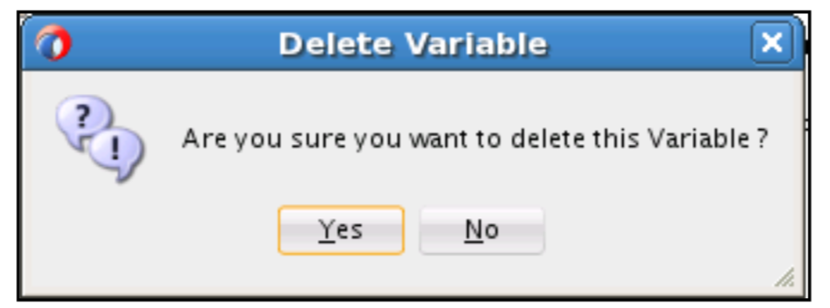

25. Repeat for all three scope variables.

   

26. Close the variables window.

27. Save all changes by clicking the Save All icon on top of JDeveloper.

   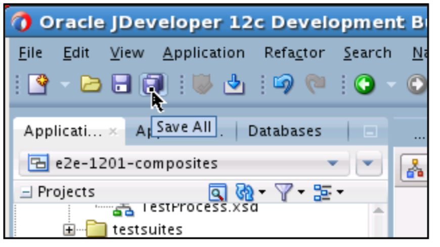

28. Build your project by choosing Build – Makes `ValidatePayment.jpr` in the JDeveloper main menu.

   

29. Should errors appear in the Messages - Log window at the bottom, indicating that a variable doesn’t exist, **make sure the transformation uses the three global variables instead of the scope variables you deleted.**

The expected output is “Successful compilation: 0 errors, 0 warnings”

   

## Task 6:  Deploy and Test the Composite and its Project.
The first design iteration is complete and you are now ready to deploy the composite. This deployment will take place on the embedded Weblogic service in JDeveloper.

**IMPORTANT:** The server was started in *Lab: Initialize Environment* and should be RUNNING for this deployment to be successful. If your server is down for some reasons, please bring it back up before attempting deployment.

1. To start the integrated Weblogic server in JDeveloper -** choose Run – Start Server Instance (IntegratedWebLogicServer) in the main menu. Refer to *Lab: Initialize Environment* for more.

   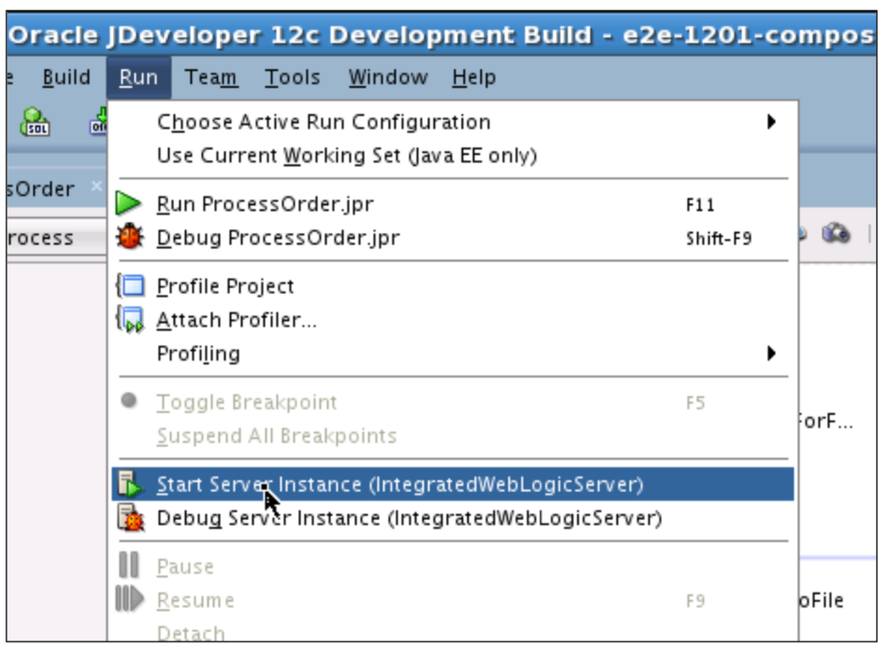

   You will see a new tab at the bottom Running: IntegratedWebLogicServer – Log, which shows the server log file

   

2. Right-click on the project name in the project menu - select Deploy and your project name. Make sure you have the project menu and not the application menu in order to see this option.

   

3. To Stop the integrated Weblogic server in JDeveloper: Click on the red Terminate icon on top of your JDeveloper window and choose `IntegratedWebLogicServer`

   

The server is stopped when you see [`IntegratedWebLogicServer` terminated]

   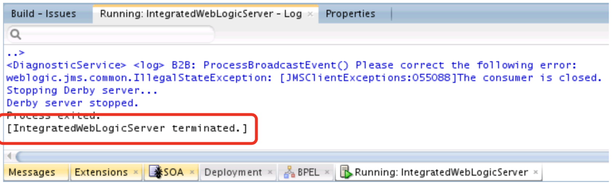

## Task 7: Optional - Use the Diagnostic Tool within JDeveloper
In SOA Suite 12c, there is facility to set breakpoints in the composite editor, BPEL process. You’re able to stop at breakpoints, look at the data, step into, step out and so on. In a BPEL process, you’re also able to change the value of a variable while debugging.

1. Set breakpoints in the composite by right clicking on an interface and create a Request or Reply Breakpoint or both. For one-directional interfaces, you only get one option.

   

The breakpoints are little red icons with an arrow pointing in the direction of the flow.

   

2. Watch on how to use diagnostic tool in JDeveloper

   

## Task 8: Optional: Add a Composite Sensor PaymentStatus Application

   

For more details of how to, please refer to Chapter 2, from **page 37 to 42** in the [SOAsuite 12c tutorial.pdf](https://oradocs-prodapp.cec.ocp.oraclecloud.com/documents/fileview/D62E7C999F2BB9C78C4D8085F6EE42C20DD5FE8D98D7/_SOASuite12c_Tutorial.pdf)

Congratulations! you have completed your first SOA composite app to validate payment service with orchestration approach.

You may now proceed to the next lab.

## Learn More
To find more detail about BPEL, Process manager - please go to this [SOA 12c link](https://docs.oracle.com/en/middleware/soa-suite/bpel/12.2.1.4/)

## Acknowledgements
* **Author** - Daniel Tarudji
* **Contributors** - Rene Fontcha, Meghana Banka, Kamryn Vinson, Sahaana Manavalan, Chethan BR
* **Last Updated By/Date** - Sahaana Manavalan, LiveLabs Developer, NA Technology, February 2022
