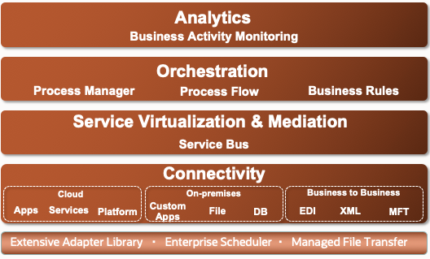
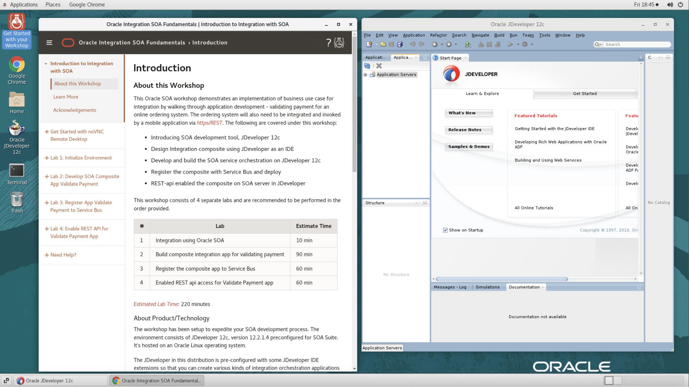
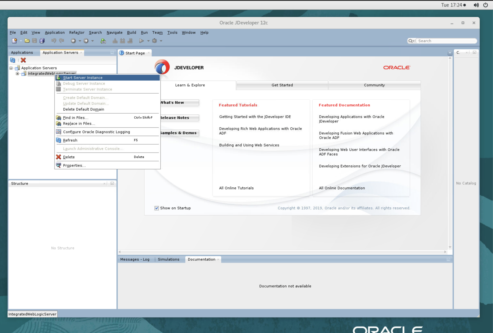
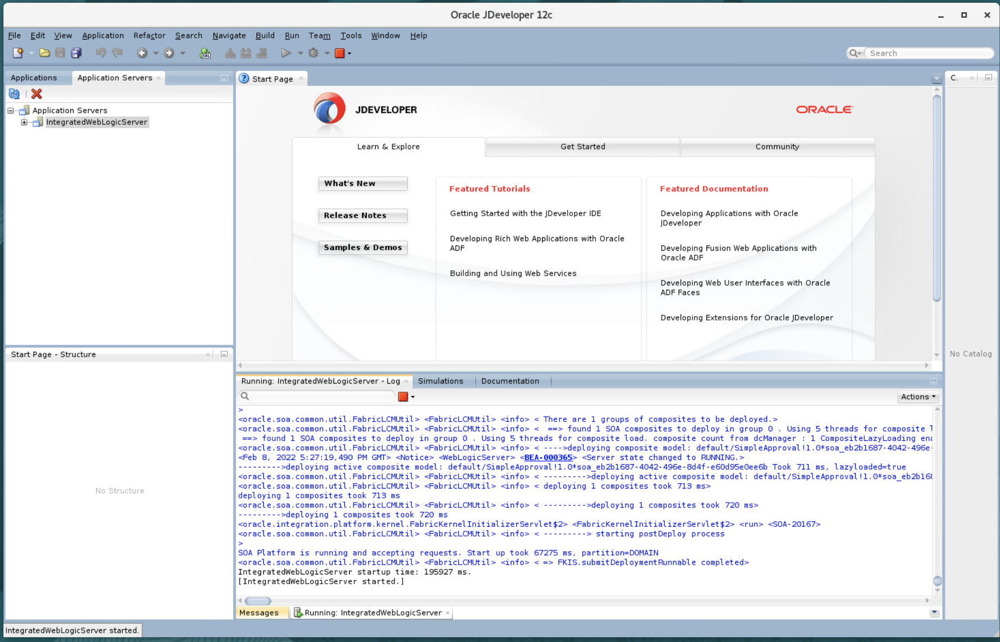
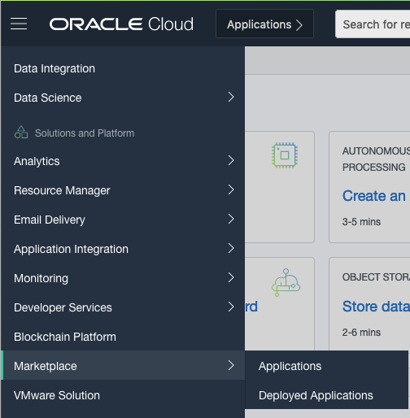
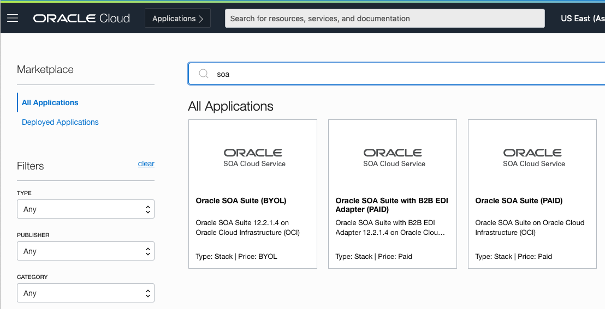
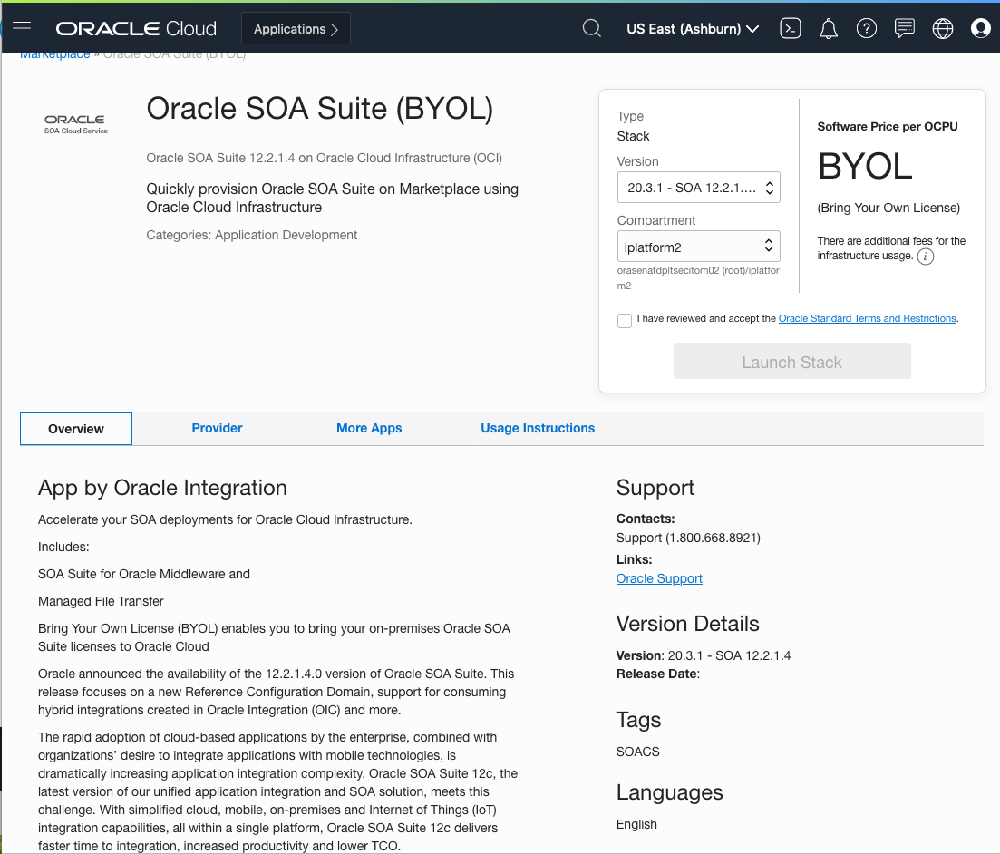

# Initialize Oracle SOA Suite

## Introduction

### What is Service Oriented Architecture, SOA?
SOA is a style of an enterprise IT design where services are provided to the other components by application components, through a communication protocol over a network. A SOA service is a discrete unit of functionality that can be accessed remotely and acted upon and updated independently, such as retrieving a credit card statement online. These services are representation of multiple applications that each delivers specific business functions. SOA is also an architectural approach to integration and orchestrating these service. Together, the services perform end to end business flow task. SOA is also intended to be independent of vendors, products and technologies

### About Oracle SOA Suite
SOA suite is a comprehensive, standards-based software suite to build, deploy and manage integration following the concepts of service-oriented architecture(SOA). The components of the suite benefit from consistent tooling, a single deployment and management model, end-to-end security and unified metadata management you can skip this module and go straight to Module 2 by clicking the navigation menu icon, in the upper-left corner of the header.

Oracle SOA Suite provides easy-to-use, reusable, and unified application development tooling and life cycle management support to further reduce development and maintenance costs and complexity. Businesses can improve efficiency and agility through rules-driven, process connectivity and automation with Oracle SOA Suite.

SOA Suite functional architecture

  

Critical business services, such as customer, financial, ordering information, and others that were previously accessible only in packaged application user interfaces can now be rapidly repurposed for digital-enabled channel such as: smart phone and tablets.

*Estimated Lab Time*: 15 minutes

### Objectives
- This lab shows JDeveloper12c as a development platform to construct integration service orchestration. 

### Prerequisites
This lab assumes you have:
- A Free Tier, Paid or LiveLabs Oracle Cloud account
- You have completed:
    - Lab: Prepare Setup (*Free-tier* and *Paid Tenants* only)
    - Lab: Environment Setup

<!-- ## Task 1: Running your Lab
### Access the graphical desktop
For ease of execution of this workshop, JDeveloper 12c (12.2.1.4) has been pre-installed on your VM instance and can be accessed using any modern browser on your laptop or workstation and the details below
  -->

## Task 1: Start Weblogic Server from JDeveloper 12c for SOA Suite Development

Now with access to your remote desktop session, Follow these steps to initialize your environment for SOA development using JDeveloper 12c. Oracle JDeveloper offers complete end-to-end development for Oracle's platform and Oracle's applications.

1. JDeveloper 12c has been prelaunched to window on the right.

  

2. From the application server tab, click on the `+` sign to list App Servers, the Right-Click on *IntegratedWebLogicServer* and select *Start Server Instance*.

  

3. Once the Weblogic App Server start completed, the following would appear:

  

You may now proceed to the next lab.

<!-- comment out paragraph
### Prerequisites

* An Oracle Free Tier, Always Free, Paid or LiveLabs Cloud Account

 **STEP**: SOA Deployment on Oracle Cloud

1. From within your Oracle Cloud environment, you can create an instance of Oracle SOA suite.

    From the Cloud Dashboard, select the navigation menu icon in the upper left-hand corner and then select **Marketplace -> Applications**.

    

2. Click **Search for SOA**.

    

3. Select the **appropriate** option, enter **based on license type or subscription** that you may already have
    * SOA suite BYOL
    * SOA suite with B2B EDI platform
    * SOA suite with OCI as consumption

4. After clicking **SOA suite BYOL**, you will be redirected to the SOA Details page for provisioning new instance.

    Continue when the status changes from:

    

-->

## Learn More
More details about JDeveloper can be found on [JDeveloper12c](https://www.oracle.com/application-development/technologies/jdeveloper.html)

At this point, you're ready to start building amazing enterprise-grade orchestration and integration, rapidly.

## Acknowledgements
* **Author** - Daniel Tarudji
* **Contributors** - Meghana Banka, Tom McGinn, Kamryn Vinson, Rene Fontcha, Sahaana Manavalan 
* **Last Updated By/Date** - Sahaana Manavalan, LiveLabs Developer, NA Technology, February 2022 
