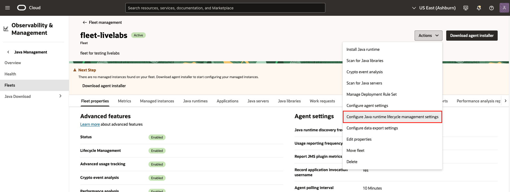

# Apply Deployment Rule Set

## Introduction

This lab will guide you through the process of applying Deployment Rule Set (DRS) on your managed Java 8 instances. It's important to note that DRS functionality is only supported up to JDK 8.

Estimated Time: 20 minutes

### Objectives

In this lab, you will:

   * Upload a signed DRS JAR file to manage rules across all the managed instances in a fleet
   * Manage the DRS for selected instances
   * Verify DRS actions has been applied on the managed instances

### Prerequisites

   * You have signed up for an account with Oracle Cloud Infrastructure and have received your sign-in credentials.
   * You are using an Oracle Linux image or Windows OS on your Managed Instance for this workshop
   * Access to the cloud environment and resources configured in Lab 1.
   * Have a signed DRS JAR file ready for use in this lab.
   * Your managed instances should have JDK 8 to see the effects of DRS on them.
   * For more in-depth information about DRS, you can explore the official Oracle documentation: [Deployment Rule Set](https://docs.oracle.com/javase/8/docs/technotes/guides/deploy/deployment_rules.html)

## Task 1: Upload and Manage DRS for All Host Machines in Fleet

1. Prior to starting this lab, ensure that lifecycle management is enabled. Open the navigation menu, navigate to **Observability & Management**, Under **Java Management**, select **Fleets**.
   
      

   In order to ensure the DRS can be applied to your fleet, make sure that **Lifecycle management** is enabled in your fleet.
   
      

2. Open the navigation menu, click **Observability & Management**. Under **Java Management**, select **Fleets**.
   
      

3. Under **More actions**, select **Configure Java runtime lifecycle management setting**. The **Lifecycle management settings** window should appear.
   
      

4. Under the **Lifecycle management settings** window, select the **Deployment Rule Set** tab. Upload your signed DRS JAR file. Note that an unsigned DRS JAR file will be invalid.
   
      

5. Click **Upload** to apply the DRS across all your managed instances in this fleet.
   
      

6. A **Work Request** will be submitted.
   
      

7. After the **Work Request** you will be able to see that the DRS file is uploaded successfully. Click save.
   
      

8. In order to manage DRS in all the managed instances in this fleet, under **More actions**, select **Manage Deployment Rule Set**.
   
      

9. Under **Manage Deployment Rule Set**, you can choose to **Distribute DRS** or **Remove DRS** for all the managed instances observed in the fleet. In this example we will be demonstrating **Distribute DRS**. After selecting the option, click **Submit**
   
     

10. You will be able to see the work request that is submitted. Note that this might take up to **15 mins**. While waiting for it to complete, you might want to consider progressing to the next task and revisiting the work request status at a later time.
   
      

11. After the work request has completed all the settings have been applied to your managed instances in the fleet.
   
      

## Task 2: View the Uploaded DRS file in Object Storage

1. Open the navigation menu, click **Observability & Management**. Under **Java Management**, select **Fleets**.
   
      

2. In the fleet details, click on object storage bucket link.
   
      

3. The uploaded DRS file is stored in **LCM** > **DRS** > **unique-id** > **file-name.jar**. 
   
      

## Task 3: (Optional) Managing DRS for a Single Managed Instance in a Fleet

1. Open the navigation menu, click **Observability & Management**. Under **Java Management**, select **Fleets**.
   
      

2. In the fleet details, under **Resources** part click on **Managed instances** and select the instance you want to manage DRS on.
   
      

3. Click on **Manage Deployment Rule Set** 
   > **Note:** Make sure that you have already uploaded your DRS file successfully before proceeding with the task
   
   

4. Under **Manage Deployment Rule Set**, you can choose to **Distribute DRS** or **Remove DRS** for this managed instance. In this example we will be demonstrating **Distribute DRS**. After selecting **Distribute DRS** click **Submit** and a work request will be submitted.
   
      

5. You will be able to see the work request that is submitted. Note that this might take up to **15 mins**. While waiting for it to complete, you might want to consider progressing to the next task and revisiting the work request status at a later time.
   
      

6. After the work request has completed all the settings have been applied to your managed instance in the fleet.
   
      

## Task 4: (Optional) Managing DRS for Selected Instances in a Fleet

1. Open the navigation menu, click **Observability & Management**. Under **Java Management**, select **Fleets**.
   
      

2. In the fleet details, under **Resources** part click on **Managed instances** to view the managed instances. Select the instances you want to apply DRS on. Next, under **More actions**, select **Manage Deployment Rule Set**.
   > **Note:** Make sure that you have already uploaded your DRS file successfully before proceeding with the task
   
   

3. Under **Manage Deployment Rule Set**, you can choose to **Distribute DRS** or **Remove DRS** for the selected instances. In this example we will be demonstrating **Distribute DRS**. After selecting **Distribute DRS** click **Submit** and a work request will be submitted.
   
      

4. You will be able to see the work request that is submitted. Note that this might take up to **15 mins**. While waiting for it to complete, you might want to consider progressing to the next task and revisiting the work request status at a later time.
   
      

5. After the work request has completed all the settings have been applied to your managed instance in the fleet.
   
      

 You may now **proceed to the next lab.**

## Troubleshoot DRS issues

**For this lab**

   If you run into issues while setting up the DRS features, verify that the required policies are enabled. If you followed the instructions in workshop 1, these policies should already be in place. To confirm, open the navigation menu, click on **Identity & Security**, and select **Policies**.

   

   In the **Root Compartment**, select **JMS Policy** and ensure that the policies listed below are included in **JMS Policy**.

   

   ```
    <copy>
    ALLOW GROUP FLEET_MANAGERS TO MANAGE fleet IN COMPARTMENT ${compartmentName}
    </copy>
   ```

   In your fleet compartment, select **JMS-Advanced-Features** and ensure that the policies listed below are included in **JMS-Advanced-Features**.

   

   ```
    <copy>
    ALLOW dynamic-group JMS_Advanced_Features_Dynamic_Group to MANAGE object-family in compartment ${compartmentName}
    ALLOW resource jms SERVER-COMPONENTS to MANAGE object-family in compartment ${compartmentName}
    ALLOW group FLEET_MANAGERS to MANAGE object-family in compartment ${compartmentName}
    </copy>
   ```

## Learn More
* Refer to the [Advanced Features](https://docs.oracle.com/en-us/iaas/jms/doc/advanced-features.html), [Work Requests](https://docs.oracle.com/en-us/iaas/jms/doc/using-java-management-service.html#GUID-77AEEBC0-93A5-4E99-96D6-BEE0FEE4539F) sections of the JMS documentation for more details.

* Use the [Troubleshooting](https://docs.oracle.com/en-us/iaas/jms/doc/troubleshooting.html#GUID-2D613C72-10F3-4905-A306-4F2673FB1CD3) chapter for explanations on how to diagnose and resolve common problems encountered when installing or using Java Management Service.

* If the problem still persists or it is not listed, then refer to the [Getting Help and Contacting Support](https://docs.oracle.com/en-us/iaas/Content/GSG/Tasks/contactingsupport.htm) section. You can also open a support service request using the **Help** menu in the OCI console.

## Acknowledgements

* **Author** - Chan Wei Quan, Java Management Service
* **Last Updated By** - Siqi Liu, November 2023