# Configure post install actions and install Java Runtimes

## Introduction

This lab walks you through the steps to install the Java Runtimes and configuring the post installation actions to be carried out.

Estimated Time: 20 minutes

### Objectives

In this lab, you will:

   * Create a set of post Java installation actions, consisting of security, network and logging configurations.
   * Create a Install Java Runtime Work Request using the Java Management Service console interface.
   * Verify Java Runtime installation and post Java installation actions.

### Prerequisites

   * You have signed up for an account with Oracle Cloud Infrastructure and have received your sign-in credentials.
   * You are using an Oracle Linux image or Windows OS on your Managed Instance for this workshop.
   * Access to the cloud environment and resources configured in [Lab 1](?lab=set-up-and-enable-advanced-features-on-java-management-service).
   * Advanced feature - Lifecycle management is enabled.

## Task 1: Enable and Setup Post Java Installation Actions

1. Open the navigation menu, click **Observability & Management**. Under **Java Management**, select **Fleets**. 
   

2. Select the fleet with the advanced feature, **Lifecycle management** enabled. Refer to  [Lab 1](?lab=set-up-and-enable-advanced-features-on-java-management-service).
   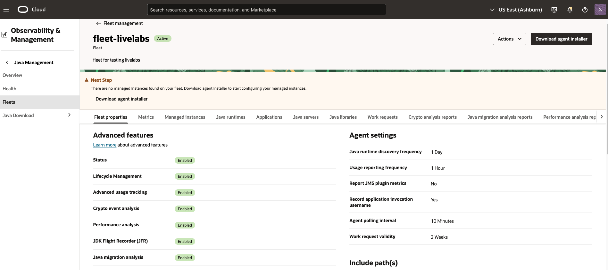

3. Under **More actions**, select **Modify Java runtime lifecycle management setting**. The **Lifecycle management settings** window should appear.
 

4. In the **Lifecycle management settings**, there is a combo box containing the placeholder "Select an action". 

   

5. Click on the combo box. A drop-down list of available security configurations will be shown.

   

   There are a total of 6 different security configurations to choose from.
   | Actions                                | Options   |
   |----------------------------------------|-----------|
   | Replace JDK root certificates with default operating system certificates (only on Linux)| N/A |
   | Disable TLS                            | TLS 1.0 , TLS 1.0 and TLS 1.1 |
   | Change minimum key length for EC       | 256 bits|
   | Change minimum key length for RSA      | 2048 bits |
   | Change minimum key length for DSA      | 2048 bits |
   | Change minimum key length for Diffie-Hellman | 2048 bits |
   {: title="Available Security Configurations"}

6. This lab will simulate the setting up of 2 different installation actions as follows:
      * Minimum key length for RSA > 2048 bits (e.g. for signed jars)
      * Disable TLS 1.0 and TLS 1.1
  
7. Select the  **Change minimum key length for RSA** option from the dropdown list. Another combo box will appear to the right. This contains the new minimum key length (in bits) that will be set for RSA signed jars. Click on the combo box that appeared on the right. Select **2048**.

   

8. Click on the **+ another action** button to add an additional post Java installation action. Another combo box with the placeholder "Select an action" should appear in the next line. 

   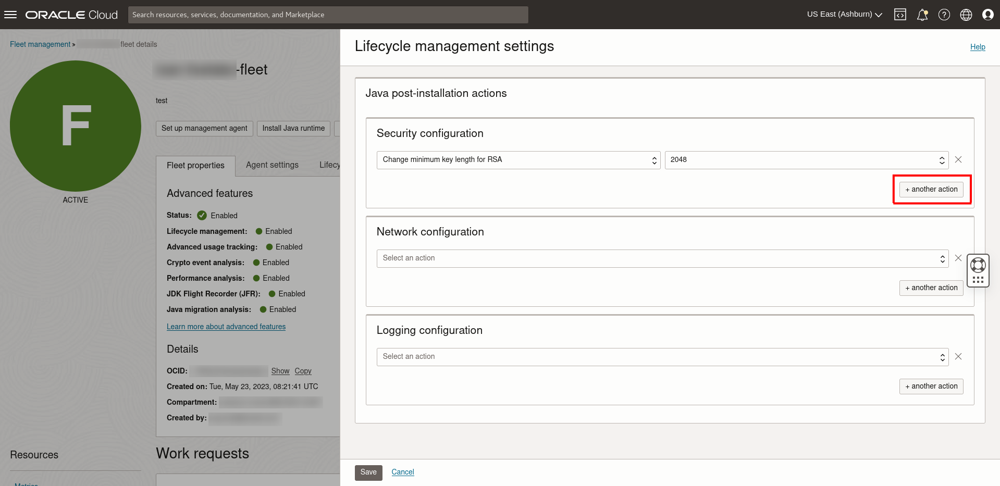

9. Click on the combo box and select the **Disable TLS** option. 

   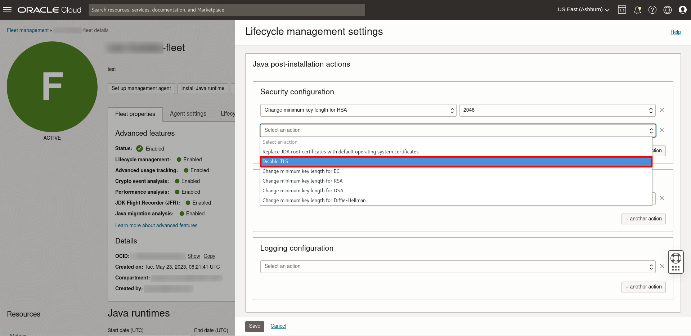

   Click on the combo box that appeared on the right. Select **TLS 1.0 and TLS 1.1**.

   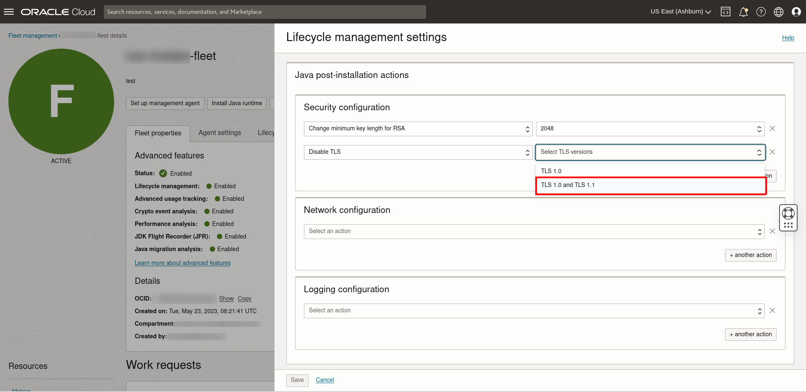

10. Click on the combo box under **Network configuration**. Select **Default to System Proxy settings when they do exist**.
    
    There are a total of 5 different network configurations to choose from.
    | Actions                                | Options   |
    |----------------------------------------|-----------|
    | Default to System Proxy settings when they do exist| N/A |
    | Set HTTP Proxy                         | Host, Port (default is 80)|
    | Set HTTPS Proxy                        | Host, Port (default is 80)|
    | Set FTP Proxy                          | Host, Port (default is 80)|
    | Set Socks Proxy                        | Host, Port (default is 80)|
    {: title="Available Network Configurations"}

11. Click on the combo box under **Logging configuration**

   

12. Add the following actions:

      * **Add FileHandler to Log Handler classes**.
      * **Change global logging level**, select **ALL** option.

   There are a total of 2 different logging configurations to choose from.
   | Actions                                | Options   |
   |----------------------------------------|-----------|
   | Add FileHandler to Log Handler classes | N/A |
   | Change global logging level            | ALL, SEVERE, WARNING, INFO, CONFIG, FINE, FINER, FINEST(lowest value), OFF |
   {: title="Available Logging Configurations"}

13. Click on the **Save** button below. This should save all the defined post Java installation actions.

    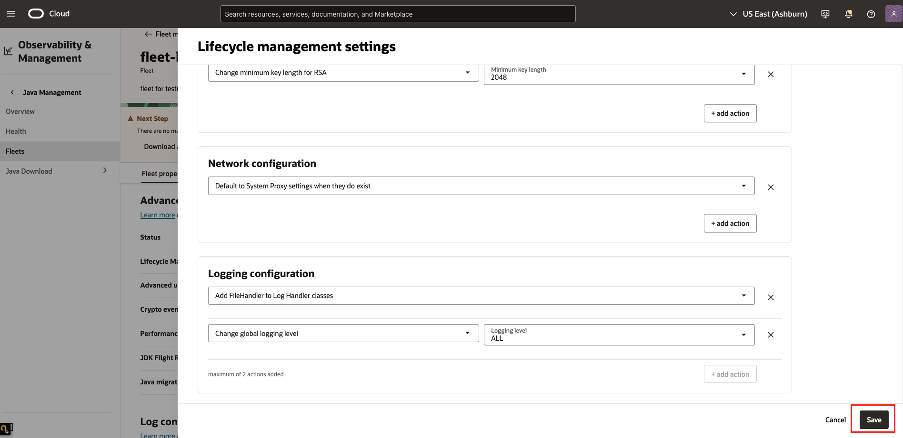

14. The post Java installation actions can be configured differently based on different requirements.

   Return to the fleet details page, click on the tab **Lifecycle management settings**. The post Java installation actions that had been defined earlier will be shown.

   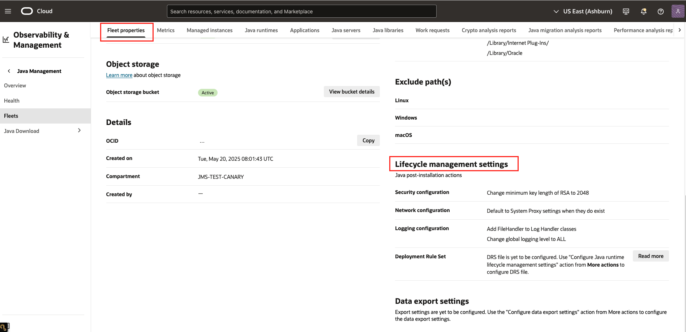

## Task 2: Submit Install Java Runtime Work Request

1. On the fleet details page. Click **Install Java Runtime**.

  

2. You will see an Install Java runtime window with current and archive releases of the Oracle Java Runtimes. You will also see a Summary table that lists the metadata, including **Release versions**, **Security state**, **End of service life**, **Release date** and **Release notes**. You may click the link under Release notes to open the details page in a new window.

    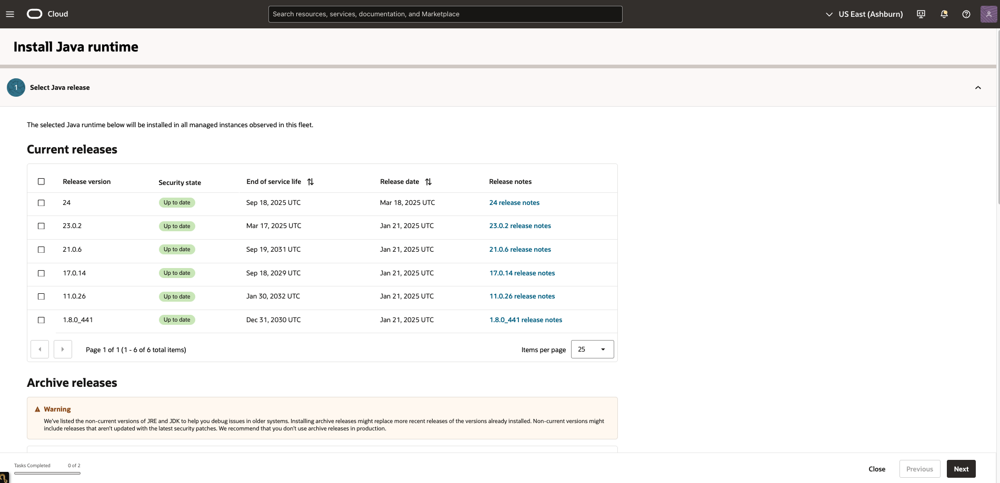

3. Select the Java Runtime version you want to install. Click **Next**.

   

4. The next page should display the advanced options for installing Java. There are two options for installing Java.

      * To install using the Java installer to standard locations, follow **Step 5**.
      * If you prefer to extract Java to a customized location, skip to **Step 7**.

5. Click **Install Java using Installer**, which will install Java to standard locations using executable installers.

   

6. You can choose the type of Java installation by selecting the drop down list. Select **Headful**. Click **Next**.

   

7. You can also choose to extract Java to a customized location. Click **Extract Java from compressed archive**.

   

   Enter a valid and absolute directory path without any environment variables, for example /opt/for-demo. Click **Next**.

   

8. The next page should display a list of post Java installation actions which had been defined previously in [Task 1](#Task1:EnableandSetupPostJavaInstallationActions). Select the post Java installation you want to perform. 

   

   >**Note:** If no post Java installation action is selected, no post-install action will be executed after the Java installation

9. Click **Install Java runtime** to confirm the installation and submit a request for installation. This request is termed as a **Work Request**.

   

   If your request is submitted successfully, you should receive a notification in green as seen below:
   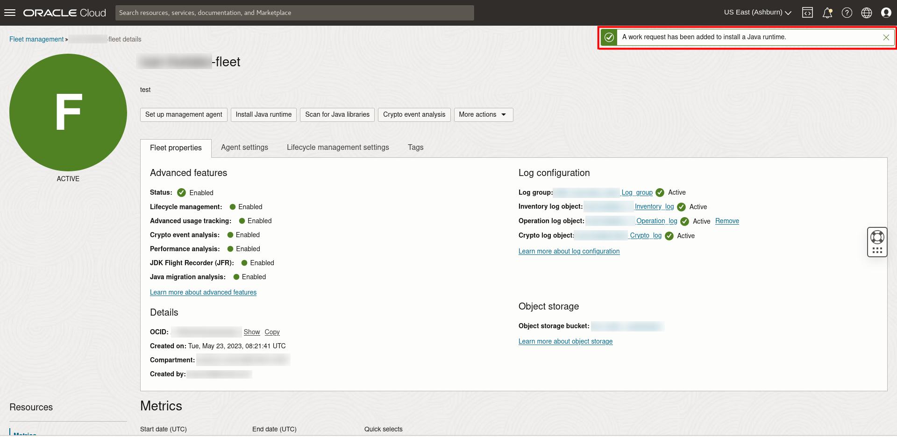

## Task 3: Verify Java Runtime Installation and Post Java Installation Action

1. Return to the fleet details page. Scroll down to the **Resources** menu and select **Work Requests**. You should see the Install Java Runtime Work Request you submitted in Task 2. Click on the Work Request to view its details.
 

2. If your request has been accepted, the status will change to **In Progress**. It will take some time to complete.
  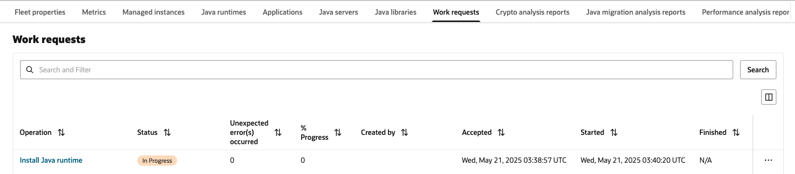

   >**Note:** Install Java runtime work request will take around 15-30 minutes to complete

3. If your request has completed successfully, the status will change to **Completed Without Errors**.
  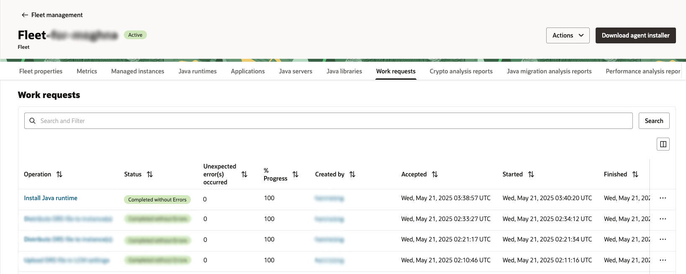

4. Click the **Log Message** under the **Resources** section. A series of logs will be displayed. Check that the Java runtime has been installed.

   

   Check that the post Java installation actions has been executed successfully.

   

5. Return to the fleet details page. Under the **Resources** menu, select **Java Runtimes**. This should display all the Java runtimes found in the fleet. The installed Java runtime should be indicated after next scanning. You can also check the installation manually on your Managed Instance.
  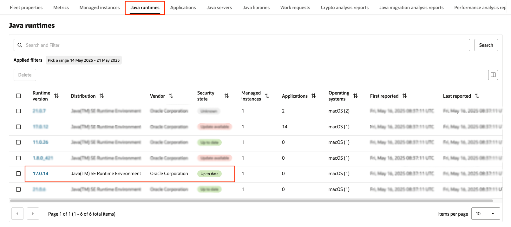

## Task 4: (Optional) Modifying/Removing Post Java Installation Action
1. This task is applicable if changes are to be made to the post Java installation action.

2. On the fleet details page, click on **More actions** and select **Modify Java runtime lifecycle management setting**. 

   

   The **Lifecycle management settings** window should appear. It should show a list of actions defined earlier in [Task 1](##task-1:-Defining-Post-Java-Installation-Actions). 
   

3. To add another action, click on the **+ another action** button. Another combo box with the placeholder "Select an action" should appear in the next line. 

   

   Select an action from the dropdown list. There should be a new action added.

   

4. To modify an existing action, click on the combo box of the action and select a new action. A list of available actions should appear

   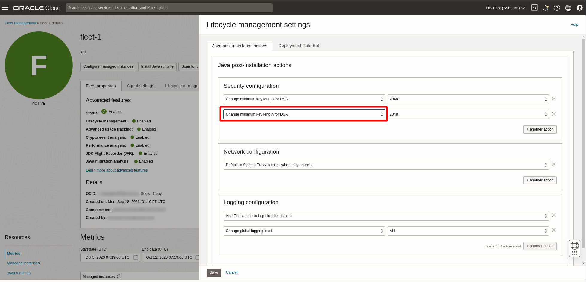

   

5. To remove an existing action, click on the **X** beside the action to remove it.
   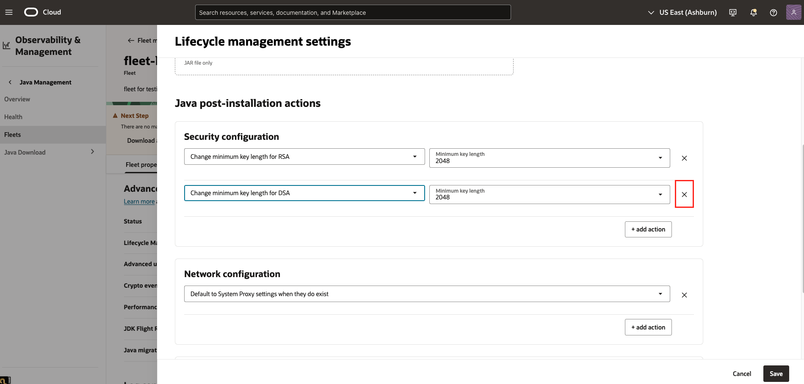

   >**Note:** To remove all existing action, click on the **X** beside all of the actions until no action remains

6. Once all the modifications are made, click on the **Save** button below to save all the changes

7. Return to the fleet details page, click on the tab **Lifecycle management settings** to view the updated post Java installation actions.

 You may now **proceed to the next lab.**

## Learn More
* Refer to the [Advanced Features](https://docs.oracle.com/en-us/iaas/jms/doc/advanced-features.html), [Work Request](https://docs.oracle.com/en-us/iaas/jms/doc/getting-started-java-management-service.html#GUID-47C63464-BC0C-4059-B552-ED9F33E77ED3) and [Fleet Work Requests](https://docs.oracle.com/en-us/iaas/jms/doc/fleet-work-requests.html) sections of the JMS documentation for more details.

* Use the [Troubleshooting](https://docs.oracle.com/en-us/iaas/jms/doc/troubleshooting.html#GUID-2D613C72-10F3-4905-A306-4F2673FB1CD3) chapter for explanations on how to diagnose and resolve common problems encountered when installing or using Java Management Service.

* If the problem still persists or it is not listed, then refer to the [Getting Help and Contacting Support](https://docs.oracle.com/en-us/iaas/Content/GSG/Tasks/contactingsupport.htm) section. You can also open a support service request using the **Help** menu in the OCI console.

## Acknowledgements

* **Author** - Yixin Wei, Java Management Service
* **Last Updated By** - Ivan Eng, June 2023
