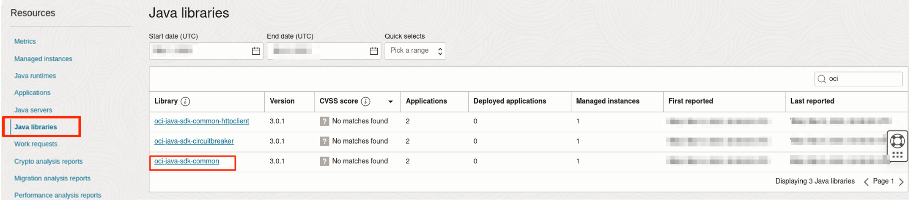
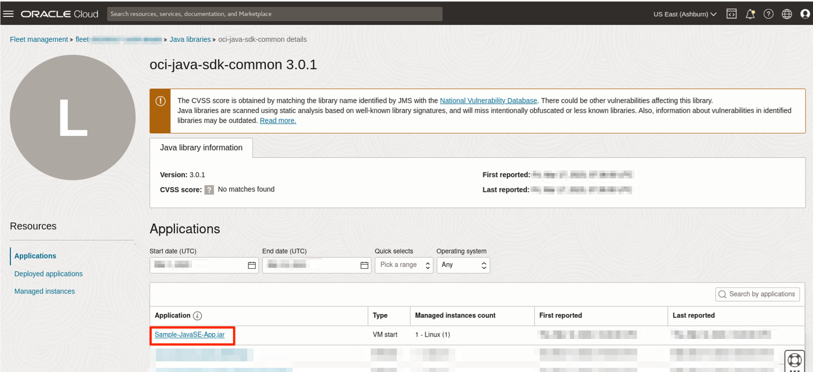
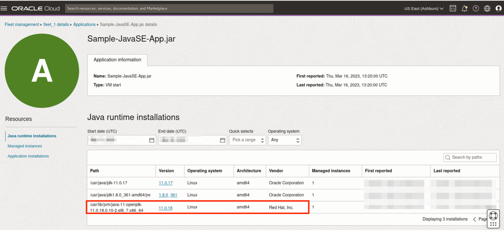

# Detect Java Libraries

## Introduction

Advanced usage tracking allows you view the list of **Java libraries** associated with the deployed Java Applications on an application/http server and standalone Java applications.
This lab walks you through the steps to detect **Java libraries** in your fleet.

Estimated Time: 30 minutes

### Objectives

In this lab, you will:

* Detect Java libraries for deployed Java Web Application on a running Java Server and Java SE application on a managed instance.
* Verify Java libraries detection result.


### Prerequisites

* You have signed up for an account with Oracle Cloud Infrastructure and have received your sign-in credentials.
* You are using an Oracle Linux image on your Managed Instance for this workshop.
* Access to the cloud environment and resources configured in [Lab 5](?lab=track-java-servers).
* Familiarity with Building and Running a Java SE Application

## Task 1: Detect Java libraries in deployed Java Web Application

1. This task assumes a sample Java Web Application has been deployed on a running WebLogic server in a managed instance.
  * Refer to **Lab 5, Task 2** to restart the WebLogic server with sample application if it has stopped.

2. Open the navigation menu, click **Observability & Management**. Under **Java Management**, select **Fleets**.  
     
       Select the fleet with the advanced feature, **Lifecycle management** enabled. Refer to  [Lab 1](?lab=set-up-and-enable-advanced-features-on-java-management-service).

3. On the Fleet details page, click **Scan for Java libraries**.
     
    Select the **Scan** button to send a work request.
     

4. Scroll down the Fleet details page, under **Resources** menu, select **Work Request**. You should see the Scan for Java libraries Work Request you submitted in step 2. Wait for the work request to complete.
     

5. If your request is successful, you should see that the Status of the request is marked as **Completed without errors**. 

     > **Note:** It will take approximately 10 minutes for the request to be completed.

     

6. In the same Fleet details page, under **Resources** menu, select **Java libraries** you should see the Java libraries included in the deployed sample Java Web Application in Lab 4.
    
    The [CVSS](https://www.oracle.com/security-alerts/cvssscoringsystem.html) score are provided by the National Vulnerability Database and denote the following: 
  - 7 - 10: This library has vulnerabilities with High severity. 
   - 4 - 6.9: This library has vulnerabilities with Medium severity. 
   - 0.1 - 3.9: This library has vulnerabilities with Low severity. 
   - 0: This library has no vulnerabilities.
   - Unknown: The severity of the vulnerabilities in this library is unknown. There could be a lack of information needed to determine the CVSS scores, but this doesn't guarantee that there are no vulnerabilities. 

  When the Java library is not found in the NVD, No matches found will be shown under the CVSS score column.
  > Note: Java library detection is not supported for JBoss/Wildfly webservers.

7. You can stop the WebLogic server now by pressing **CTRL + c**.
    


## Task 2: Run Sample Java SE Application

1. You must build a Sample Java SE Application if it does not exist in your managed instance.
2. The Sample Java SE Application used in this task is called **Sample-JavaSE-App** packaged in executable Java Archive (JAR) file. An example of the sample Java SE application's pom.xml configuration file is shown below, indicating its dependency on Java libraries.
	```xml
	...
		<dependency>
			<groupId>com.oracle.oci.sdk</groupId>
			<artifactId>oci-java-sdk-common</artifactId>
			<version>3.0.1</version>
		</dependency>
	...
	```
	Please take note that **Oracle Cloud Infrastructure SDK** Java library is included in the Java SE sample application.

3. Run the Sample Java SE Application with following command.
	```
	<copy>
	sudo java -jar <path-to-sample-app>/<filename.jar>
	</copy>
	```
> **Note:** Please make sure the sample Java SE application is **continuously running** without interruption during **Library Scanning** in the subsequent task.

## Task 3: Detect Java libraries for Java SE Application

1. Open the navigation menu, click **Observability & Management**. Under **Java Management**, select **Fleets**.

    
    Select the fleet with the advanced feature, **Lifecycle management** enabled. Refer to  [Lab 1](?lab=set-up-and-enable-advanced-features-on-java-management-service).

2. On the Fleet details page, click **Scan for Java libraries**.
    

3. Scroll down the Fleet details page, under **Resources** menu, select **Work Request**. You should see the Scan for Java libraries Work Request you submitted in step 2. Wait for the work request to complete.  

4. If your request is successful, you should see that the Status of the request is marked as **Completed without errors**. It will take approximately 10 minutes for the request to be completed.

     > **Note: **Might take a bit longer to complete

     

5. On the Fleet details pages, scroll down to the **Resources** menu and select **Java libraries**. You should be able to see a list of libraries detected. The result list includes additional Java libraries, along with oci-java-sdk-common and its dependency libraries.

  
> **Note:** The Java libraries detected in the list vary according to the dependencies of your sample application.

6. In the same Fleet details page, click the **oci-java-sdk-common** library; you should see details of selected library and list of applications that were run with the selected library. 
	

7. In the same page, click **Sample-JavaSE-App.jar**; you should see the details of the sample Java SE Application that was run previously.
	

> **Note:** Tracking of Java Application that is running with **Non-Oracle JDKs** in the fleet is also supported.

8. You can stop the Java SE application by pressing **CTRL + c**.  

You may now **proceed to the next lab.**

## Learn More
* Refer to the [Advanced Features](https://docs.oracle.com/en-us/iaas/jms/doc/advanced-features.html), [Work Requests](https://docs.oracle.com/en-us/iaas/jms/doc/using-java-management-service.html#GUID-77AEEBC0-93A5-4E99-96D6-BEE0FEE4539F) sections of the JMS documentation for more details.

* Use the [Troubleshooting](https://docs.oracle.com/en-us/iaas/jms/doc/troubleshooting.html#GUID-2D613C72-10F3-4905-A306-4F2673FB1CD3) chapter for explanations on how to diagnose and resolve common problems encountered when installing or using Java Management Service.

* If the problem still persists or it is not listed, then refer to the [Getting Help and Contacting Support](https://docs.oracle.com/en-us/iaas/Content/GSG/Tasks/contactingsupport.htm) section. You can also open a support service request using the **Help** menu in the OCI console.

## Acknowledgements

* **Author** - Youcheng Li, Java Management Service
* **Last Updated By** - Siqi Liu, October 2023
