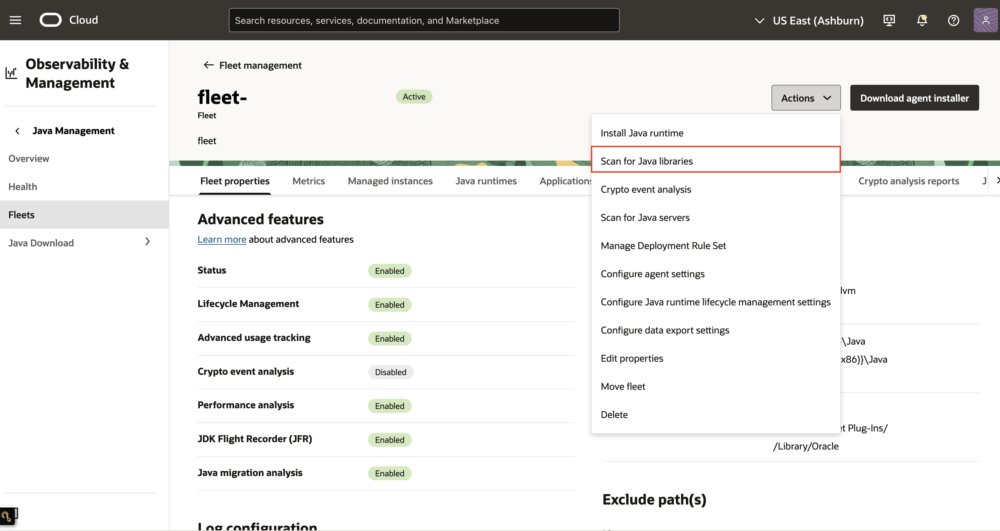
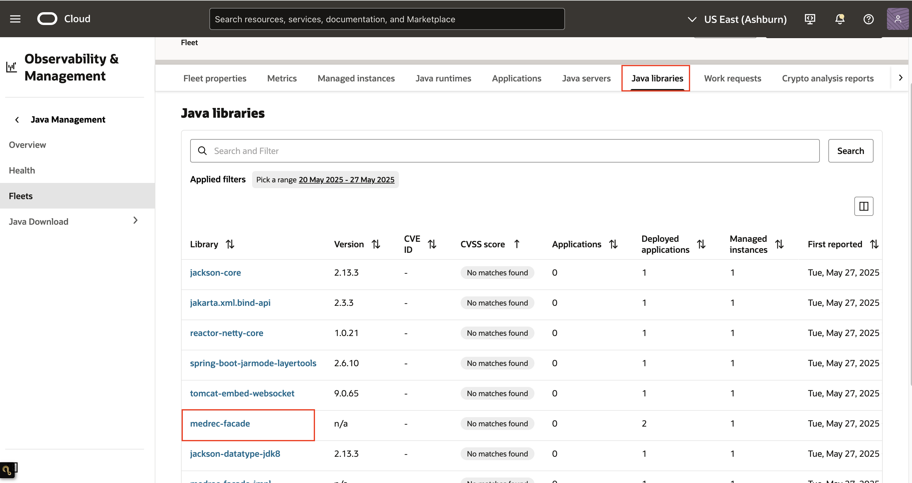
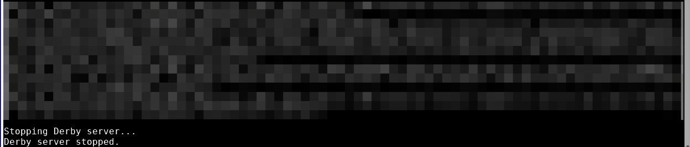

# Detect Java Libraries

## Introduction

Advanced usage tracking allows you view the list of **Java libraries** associated with the deployed Java Applications on an application/http server and standalone Java applications.
There are 2 types of libraries scan:

* Static scanning: Detect libraries through static scan at classpath for both your standalone applications and application servers.
* Dynamic scanning: Detect libraries being loaded dynamically at runtime for your standalone applications.

> **Note:** Dynamic scanning is only applicable for standalone applications.

This lab walks you through the steps to detect **Java libraries** in your fleet.

Estimated Time: 30 minutes

### Objectives

In this lab, you will:

* Detect static Java libraries for deployed Java Web Application on a running Java Server on a managed instance.
* Detect static and dynamic Java libraries for standalone Java applications on a managed instance.
* Verify Java libraries detection result.

### Prerequisites

* You have signed up for an account with Oracle Cloud Infrastructure and have received your sign-in credentials.
* You are using an Oracle Linux image on your Managed Instance for this workshop.
* Access to the cloud environment and resources configured in [Lab 5](?lab=track-java-servers).
* JDK 17 installed on your Managed Instance. You can refer to [Lab 3](?lab=configure-post-install-actions-and-install-java-runtimes) on how to set this up
* Familiarity with Building and Running a Java SE Application

## Task 1: Detect Java libraries in deployed Java Web Application

1. This task assumes a sample Java Web Application has been deployed on a running WebLogic server in a managed instance.

  * Refer to **Lab 5, Task 2** to restart the WebLogic server with sample application if it has stopped.

2. Open the navigation menu, click **Observability & Management**. Under **Java Management**, select **Fleets**.  
     
       Select the fleet with the advanced feature, **Advanced usage tracking** enabled. Refer to  [Lab 1](?lab=set-up-and-enable-advanced-features-on-java-management-service).

3. On the Fleet details page, click **Scan for Java libraries**.
     
    Select **Perform static scan** and **Submit request** , then click on the **Submit** button to send a work request.
     

4. Click on the **Work requests** tab. You should see the Scan for Java libraries Work Request you submitted in step 3. Wait for the work request to complete.
     

5. If your request is successful, you should see that the status of the request is marked as **Completed without errors**. 

     > **Note:** It will take approximately 10 minutes for the request to be completed.

     

6. In the same Fleet details page, click on the **Java libraries** tab. You should see the Java libraries included in the deployed sample Java Web Application in Lab 4.
    
    The [CVSS](https://www.oracle.com/security-alerts/cvssscoringsystem.html) score are provided by the National Vulnerability Database and denote the following: 
  - 7 - 10: This library has vulnerabilities with High severity. 
   - 4 - 6.9: This library has vulnerabilities with Medium severity. 
   - 0.1 - 3.9: This library has vulnerabilities with Low severity. 
   - 0: This library has no vulnerabilities.
   - Unknown: The severity of the vulnerabilities in this library is unknown. There could be a lack of information needed to determine the CVSS scores, but this doesn't guarantee that there are no vulnerabilities. 

  When the Java library is not found in the NVD, No matches found will be shown under the CVSS score column.
  > Note: Java library detection is not supported for JBoss/Wildfly webservers.

7. You can stop the WebLogic server now by pressing **CTRL + c**.
    


## Task 2: Create sample standalone applications for library scanning

In this task, we will create 2 simple Java applications using the provided helper scripts in preparation for the library scan features in upcoming Task 3 and 4. 

1. This task will require you to ssh into your managed instance to create and run the 2 sample Java applications.

     * Refer to point 1 from **Lab 5, Task 2** to connect to your instance.

2. Once you are connected to your instance, copy and execute the following to:

     * Create the ~/libscan directory in your managed instance.
     * Create a helper script **libscandemo.sh** to create and compile two java applications.
     
     ```
     <copy>
     mkdir -p ~/libscan && cd ~/libscan && echo -e '#!/bin/bash
     set -e
     # Stop function at the start, only used if "stop" argument is passed
     if [ "$1" = "stop" ]; then
     stop_java_tests() {
     STOPPED=0
     for CLASS in NormalJavaTest DynamicJavaTest; do
          # Find processes running the exact class as the main java class
          PIDS=$(ps -eo pid,cmd | grep "java " | grep "$CLASS\$" | awk '\''{print $1}'\'')
          if [ -n "$PIDS" ]; then
          echo "Stopping $CLASS [PIDs: $PIDS]..."
          kill $PIDS
          for PID in $PIDS; do
               wait $PID 2>/dev/null || true
          done
          STOPPED=1
          else
          echo "No running process found for $CLASS."
          fi
     done
     if [ $STOPPED -eq 1 ]; then
          echo "Both Java test applications (NormalJavaTest and DynamicJavaTest) are stopped if they were running."
     else
          echo "No Java test applications to stop."
     fi
     }
     stop_java_tests
     exit 0
     fi
     # 1. Create directory for package
     mkdir -p foo/bar/test
     # 2. Create TestUncorrelatablePackage.java in the correct package structure
     cat > foo/bar/test/TestUncorrelatablePackage.java <<'\''EOF'\''
     package foo.bar.test;
     public class TestUncorrelatablePackage {
     public void printMessage(String caller) {
          System.out.println("Invoked by " + caller + ": invoked a method from uncorrelatable class file");
     }
     }
     EOF
     # 3. Create NormalJavaTest.java
     cat > NormalJavaTest.java <<'\''EOF'\''
     import foo.bar.test.TestUncorrelatablePackage;
     public class NormalJavaTest {
     public static void main(String[] args) throws Exception {
          long pid = ProcessHandle.current().pid();
          TestUncorrelatablePackage helper = new TestUncorrelatablePackage();
          while (true) {
               System.out.println("*********************************************");
               System.out.println("Testing NormalJavaTest in a loop. NormalJavaTest PID: " + pid);
               System.out.println("NormalJavaTest invoking a method from uncorrelatable class file.");
               helper.printMessage("NormalJavaTest");
               System.out.println("*********************************************");
               Thread.sleep(120000);
          }
     }
     }
     EOF
     # 4. Create DynamicJavaTest.java using reflection only for Commons Collections 4
     cat > DynamicJavaTest.java <<'\''EOF'\''
     import foo.bar.test.TestUncorrelatablePackage;
     import java.util.*;
     public class DynamicJavaTest {
     public static void main(String[] args) throws Exception {
          long pid = ProcessHandle.current().pid();
          TestUncorrelatablePackage helper = new TestUncorrelatablePackage();
          while (true) {
               System.out.println("*********************************************");
               System.out.println("Testing DynamicJavaTest in a loop. DynamicJavaTest PID: " + pid);
               System.out.println("DynamicJavaTest invoking a method from uncorrelatable class file.");
               helper.printMessage("DynamicJavaTest");
               System.out.println("DynamicJavaTest invoking a method from Apache Commons Collections 4 via reflection.");
               List<String> list1 = Arrays.asList("a", "b", "c");
               List<String> list2 = Arrays.asList("d", "e");
               try {
                    Class<?> listUtilsClass = Class.forName("org.apache.commons.collections4.ListUtils");
                    java.lang.reflect.Method unionMethod = listUtilsClass.getMethod("union", List.class, List.class);
                    @SuppressWarnings("unchecked")
                    List<String> union = (List<String>) unionMethod.invoke(null, list1, list2);
                    System.out.println("DynamicJavaTest invoked union method. Result: " + union);
               } catch (ClassNotFoundException e) {
                    System.out.println("Apache Commons Collections 4 is not available at runtime.");
               }
               System.out.println("*********************************************");
               Thread.sleep(120000);
          }
     }
     }
     EOF
     # 5. Compile Java files
     javac foo/bar/test/TestUncorrelatablePackage.java
     javac -cp . NormalJavaTest.java
     javac -cp . DynamicJavaTest.java

     # Find commons-collections4 library for runtime
     COLLECTIONS4_JAR=$(ls commons-collections4-*.jar 2>/dev/null | head -n1)
     if [ ! -f "$COLLECTIONS4_JAR" ]; then
     echo "Error: commons-collections4-*.jar not found in the current directory."
     echo "Please download Apache Commons Collections 4 and place the jar here."
     exit 1
     fi
     # 6. Run Java applications in the background (classpath includes commons-collections4-*.jar at runtime)
     CP=".:$COLLECTIONS4_JAR:*"
     echo "Starting NormalJavaTest in the background..."
     java -cp "$CP" NormalJavaTest &
     PID_NORMAL=$!
     echo "Starting DynamicJavaTest in the background..."
     java -cp "$CP" DynamicJavaTest &
     PID_DYNAMIC=$!
     echo
     echo "Both Java applications are running."
     ' > libscandemo.sh && chmod +x libscandemo.sh
     </copy>
     ```

3. You should see the helper script **libscandemo.sh** being created in the ~/libscan directory in your managed instance. The helper script does the following:

     * Creates TestUncorrelatablePackage.java: A helper class with a simple message-printing method.
     * Creates NormalJavaTest.java: Prints its Process ID (PID) and uses the helper in a loop, pausing between iterations.
     * Creates DynamicJavaTest.java: Like NormalJavaTest, but additionally in every loop, it actually loads and run a method from the apache commons-collections4 library.
     * Compile both applications, and launches both NormalJavaTest and DynamicJavaTest as background processes, setting their classpath to include the commons-collections4 library.

4. Before running the script, ensure that the commons-collections4 library is available in the ~/libscan directory. You can download this from Maven central onto your machine, then transfer it over to your managed instance using scp.

     ```
     <copy>
          scp -i <your-private-key-file> /path/to/Downloads/commons-collections4-4.4.jar opc@<x.x.x.x>:/home/opc/libscan
     </copy>
     ```

5. Verify that you have both the **commons-collections4** library and **libscandemo.sh** in the **/home/opc/libscan** directory.
	
     ```
     [opc@instance libscan]$ pwd
     /home/opc/libscan
     [opc@instance libscan]$ ls
     commons-collections4-4.4.jar  libscandemo.sh
	```

6. Execute the helper script **libscandemo.sh** to compile and run both Java applications. You should see something similar to the following:

     ```
     [opc@instance libscan]$ sh libscandemo.sh
     Starting NormalJavaTest in the background...
     Starting DynamicJavaTest in the background...

     Both Java applications are running.
     *********************************************
     *********************************************
     Testing DynamicJavaTest in a loop. DynamicJavaTest PID: 99390
     DynamicJavaTest invoking a method from uncorrelatable class file.
     Testing NormalJavaTest in a loop. NormalJavaTest PID: 99389
     NormalJavaTest invoking a method from uncorrelatable class file.
     Invoked by DynamicJavaTest: invoked a method from uncorrelatable class file
     DynamicJavaTest invoking a method from Apache Commons Collections 4 via reflection.
     Invoked by NormalJavaTest: invoked a method from uncorrelatable class file
     *********************************************
     DynamicJavaTest invoked union method. Result: [a, b, c, d, e]
     *********************************************

     ```

7. **Note:** Both java application needs to be running for the next Task 3 and 4. You can leave the screen as it is.

## Task 3: Detect Java libraries in standalone application using static scanning

> Note: You will need the Java applications created in Task 2 to complete this task.

1. On the Fleet details page, click **Scan for Java libraries**.
     
    Select **Perform static scan** and **Submit request** , then click on the **Submit** button to send a work request.
     

2. Click on the **Work requests** tab. You should see the Scan for Java libraries Work Request you submitted in step 1. Wait for the work request to complete.
     

3. If your request is successful, you should see that the status of the request is marked as **Completed without errors**. 

     > **Note:** It will take approximately 10 minutes for the request to be completed.

     


4. On the Fleet details pages, click on the **Java libraries** tab. You should be able to see a list of libraries detected. The result list includes additional Java libraries.

     
> **Note:** The Java libraries detected in the list will vary depending on the Java applications running in your managed instance.

5. In the same Fleet details page, click the **Applications** tab. You should see both Java applications, **NormalJavaTest** and **DynamicJavaTest**  created from Task 2 showing up here.
     

6. Click into each application to reach the application details page. Then click on the **Java libraries tab**. You should see the **commons-collections4** library of version 4.4 showing up for both applications.
	
     


## Task 4: Detect Java libraries in standalone application using dynamic scanning

> Note: You will need the Java applications created in Task 2 to complete this task.

In Task 3, you have seen that the Apache Commons Collections library was detected by static scanning for both **NormalJavaTest** and **DynamicJavaTest**. This is because the library was referenced in the classpath for both applications.

```
     # 6. Run Java applications in the background (classpath includes commons-collections4-*.jar at runtime)
     CP=".:$COLLECTIONS4_JAR:*"
     echo "Starting NormalJavaTest in the background..."
     java -cp "$CP" NormalJavaTest &
     PID_NORMAL=$!
     echo "Starting DynamicJavaTest in the background..."
     java -cp "$CP" DynamicJavaTest &
```

However, if you examine the code for **NormalJavaTest** inside **libscandemo.sh**, you will notice that the Apache Commons Collections library is not actually used by **NormalJavaTest**. Although the library is referenced in the classpath and detected through static scanning, it is not required and could potentially be removed.

In such situations, you can use the dynamic scanning feature to determine which libraries are actually loaded and used by the application at runtime. Dynamic scanning works by monitoring active applications over time to identify the packages (groups of classes) in use, thereby revealing which libraries the application truly depends on. If dynamic scanning cannot determine which library provides a specific package, this information is recorded as uncorrelated packages. By combining the results from dynamic scanning and the list of uncorrelated packages, you can gain a complete understanding of your application's dependencies.

To detect Java libraries in standalone application using dynamic scanning,

1. On the Fleet details page, click **Scan for Java libraries**.
     
    For this task, select **Perform dynamic scan** and **Submit request** , then click on the **Submit** button to send a work request.
     

2. Click on the **Work requests** tab. You should see the Dynamic scan for Java libraries Work Request you submitted in step 1. Wait for the work request to complete.  

4. If your request is successful, you should see that the status of the request is marked as **Completed without errors**. It will take approximately 10 minutes for the request to be completed.

     > **Note: **Might take a bit longer to complete

     

5.  Now click on the Applications tab, then click into the **DynamicJavaTest** application to reach the application details page. Then click on the **Java libraries tab**. You should now see the **commons-collections4** library of version 4.4 being marked as **Detected dynamically** for **DynamicJavaTest** application.

     

6. The Java libraries tab also provides a summary of the dynamic libraries detection state of the application over the last 90 days. If you look at the summary panel for **DynamicJavaTest** application, it will indicate 1 library as being detected dynamically. When looking at the summary panel for **NormalJavaTest** application, you would see that there are 0 libraries detected dynamically. 

	

7. To get information about uncorrelated packages, click on the **View details** button next to the **Uncorrelated package count**.

     

8. Here you will see that **foo.bar.test** package is marked as an uncorrelated package. If you look at the sample java code in **libscandemo.sh**, **TestUncorrelatablePackage.java** is actually a class from **foo.bar.test** package that we have created specifically just for this lab. It has a method **printMessage()** used by **NormalJavaTest** and **DynamicJavaTest**. In this example, dynamic scanning has detected the use of **foo.bar.test** package but since it does not come from any libraries and cannot be associated to any libraries by the service, it is marked as an "uncorrelated package".

```
     import foo.bar.test.TestUncorrelatablePackage;
     ...
     TestUncorrelatablePackage helper = new TestUncorrelatablePackage();
     ...
     helper.printMessage("NormalJavaTest");
```

8. This concludes the Detect Java Libraries lab. You can terminate both Java applications on your managed instance by executing **sh libscandemo.sh stop**

> **Note:** Tracking of Java Application that is running with **Non-Oracle JDKs** in the fleet is also supported.

You may now **proceed to the next lab.**

## Learn More
* Refer to the [Advanced Features](https://docs.oracle.com/en-us/iaas/jms/doc/advanced-features.html), [Work Requests](https://docs.oracle.com/en-us/iaas/jms/doc/using-java-management-service.html#GUID-77AEEBC0-93A5-4E99-96D6-BEE0FEE4539F) sections of the JMS documentation for more details.

* Use the [Troubleshooting](https://docs.oracle.com/en-us/iaas/jms/doc/troubleshooting.html#GUID-2D613C72-10F3-4905-A306-4F2673FB1CD3) chapter for explanations on how to diagnose and resolve common problems encountered when installing or using Java Management Service.

* If the problem still persists or it is not listed, then refer to the [Getting Help and Contacting Support](https://docs.oracle.com/en-us/iaas/Content/GSG/Tasks/contactingsupport.htm) section. You can also open a support service request using the **Help** menu in the OCI console.

## Acknowledgements

* **Author** - Youcheng Li, Java Management Service
* **Last Updated By** - Teck Kian Choo, September 2025
