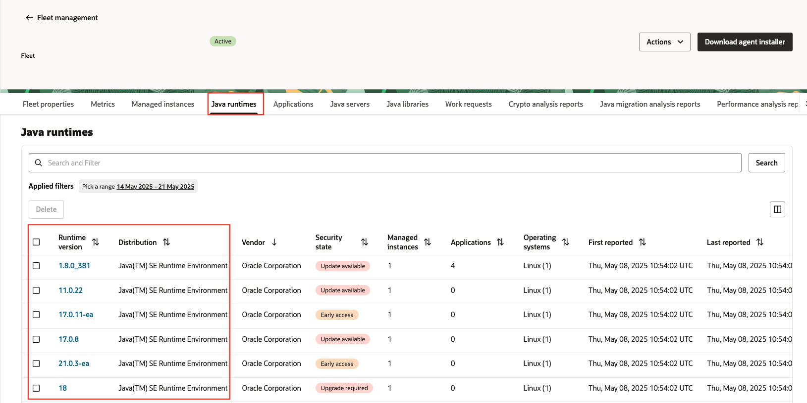
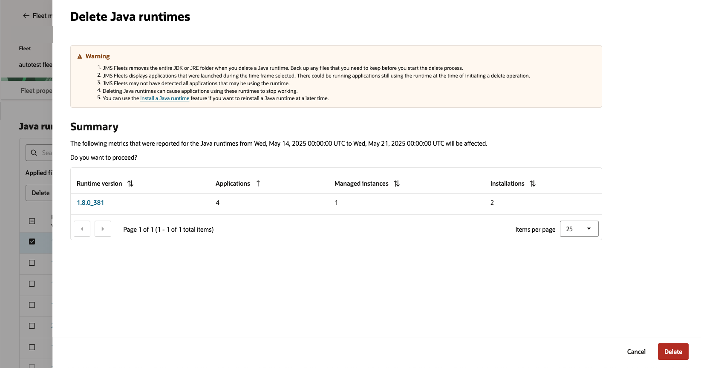
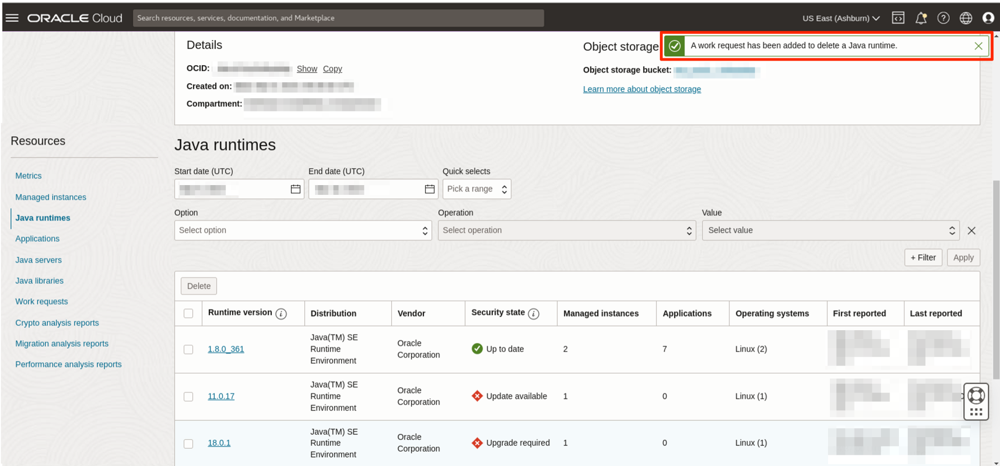
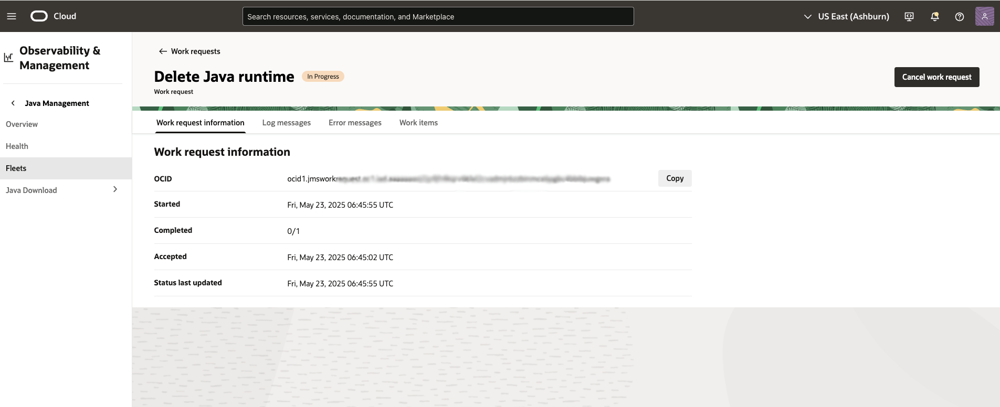
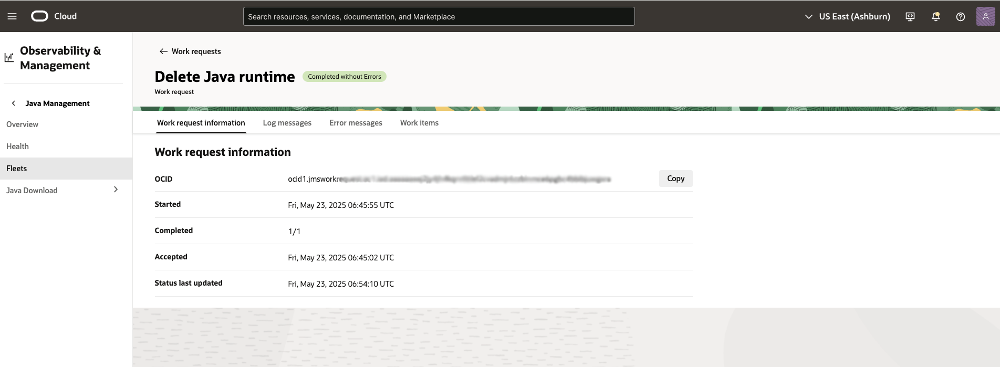
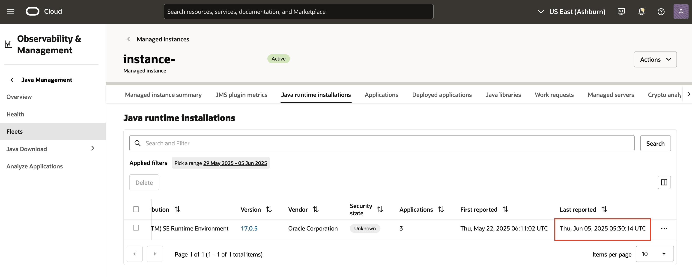

# Remove Java Runtimes

## Introduction

This lab walks you through the steps to remove Java Runtimes on your Fleet.

Estimated Time: 15 minutes

### Objectives

In this lab, you will:

* Create a Delete Java Runtime Work Request using the Java Management Service console interface.
* Verify Java Runtime deletion.

### Prerequisites

* You have signed up for an account with Oracle Cloud Infrastructure and have received your sign-in credentials.
* You are using an Oracle Linux image or Windows OS on your Managed Instance for this workshop.
* Access to the cloud environment and resources configured in [Lab 1](?lab=set-up-and-enable-advanced-features-on-java-management-service).

## Task 1: Submit Delete Java Runtime Work Request

1. First, open the navigation menu, click **Observability & Management**, and then click **Fleets** under **Java Management**. Select the fleet with the advanced feature, **Lifecycle management** enabled. Refer to  [Lab 1](?lab=set-up-and-enable-advanced-features-on-java-management-service).
 

2. Under the **Resources** menu, select **Java Runtimes**. You should see a list of the Java Runtimes that are currently in your Fleet.
 

3. Select the Runtime that you would like to remove from your fleet and click **Delete**.

    > **Note:** Currently, OpenJDKs cannot be removed through Lifecycle Management.

  

4. The Delete Java Runtimes summary window will open. You will see a message with an archives link to the Oracle Java Runtime Download. You will also see a Summary table that lists the affected resources, including **Applications, Runtime versions, Managed Instances** and **Installations**. By default, the Summary table is sorted by applications, so the runtimes are presented in the order of least invoked to most invoked in the time frame selected. You may also click the link under Runtime version to open its details page in a new window.

  Click **Delete** to confirm the deletion and submit a request for removal. This request is termed as a **Work Request**.

  

  If your request is submitted successfully, you should receive a notification in green as seen below:
  

## Task 2: Verify Java Runtime Deletion

1. In the same **Java Management** page, under **Resources**, select **Work Requests**. You should see the Remove Java Runtime Work Request you submitted in Task 1. Click on the Work Request to view its details.
 

2. If your request has been accepted, the status will change to **In Progress**. It will take some time to complete.
  

3. If your request has completed successfully, the status will change to **Completed without Errors**.
  

4. Return to your fleet page, under **Java Runtimes**, the deleted java runtime should not be reported after next scanning. You can also check the installation manually on your Managed Instance.
  

 You may now **proceed to the next lab.**

## Learn More
* Refer to the [Advanced Features](https://docs.oracle.com/en-us/iaas/jms/doc/advanced-features.html), [Work Request](https://docs.oracle.com/en-us/iaas/jms/doc/getting-started-java-management-service.html#GUID-47C63464-BC0C-4059-B552-ED9F33E77ED3) and [Viewing a Work Request](https://docs.oracle.com/en-us/iaas/jms/doc/fleet-views.html#GUID-F649F0E5-DD54-4DEC-A0F1-942FE3552C93) sections of the JMS documentation for more details.

* Use the [Troubleshooting](https://docs.oracle.com/en-us/iaas/jms/doc/troubleshooting.html#GUID-2D613C72-10F3-4905-A306-4F2673FB1CD3) chapter for explanations on how to diagnose and resolve common problems encountered when installing or using Java Management Service.

* If the problem still persists or it is not listed, then refer to the [Getting Help and Contacting Support](https://docs.oracle.com/en-us/iaas/Content/GSG/Tasks/contactingsupport.htm) section. You can also open a support service request using the **Help** menu in the OCI console.

## Acknowledgements

* **Author** - Xin Yi Tay, Java Management Service
* **Last Updated By** - Sherlin Yeo, March 2023
