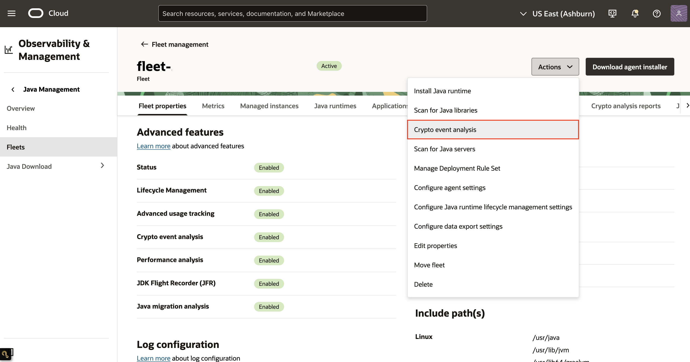
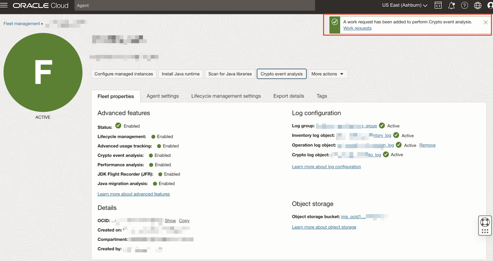
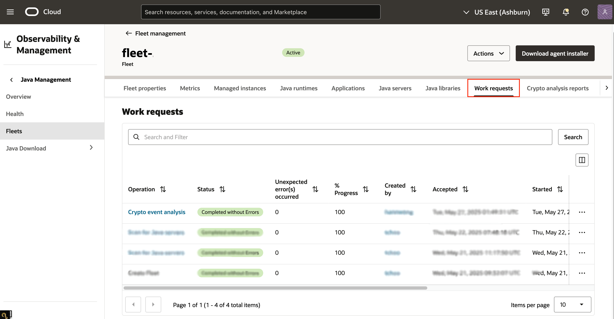
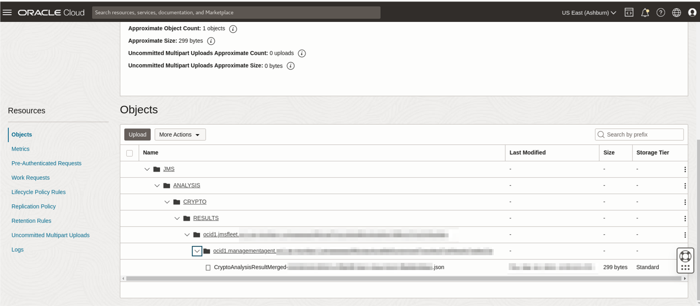

# Run Crypto Event Analysis

## Introduction

This lab walks you through the steps to run a Crypto Event Analysis on your Fleet.

Estimated Time: 20 mins

### Objectives

In this lab, you will:

* Create a Crypto Event Analysis Work Request using the Java Management Service console interface.
* View and monitor the status of Work Requests created using the Java Management Service console interface.
* View/download the generated Crypto Event Analysis report.


### Prerequisites

* You have signed up for an account with Oracle Cloud Infrastructure and have received your sign-in credentials.
* You are using an Oracle Linux image or Windows OS on your Managed Instance for this workshop.
* Access to the cloud environment and resources configured in [Lab 1](?lab=set-up-and-enable-advanced-features-on-java-management-service).

## Task 1: Submit Crypto Event Analysis Work Request

1. First, open the navigation menu, click **Observability & Management**, and then click **Fleets** under **Java Management**. Select the fleet that you have configured in [Lab 1](?lab=set-up-and-enable-advanced-features-on-java-management-service).
  
    

2. Click the button labeled **Crypto event analysis**.
  
    

3. Under the **Recording duration in hours**, set the recording duration to 5 minutes. Click the **Start** button.
  
    

    

4. On the Fleet details page, scroll down to the **Resources**, menu. Select **Work requests**.

    You should see a list of the **Work Requests** that are currently in your Fleet. **Crypto event analysis** that was started should be at the top of the list.
  
    

5. Wait for the work request to be processed. If the work request has been completed successfully, the status will change to **Completed without Errors**.
  
    

    >**Note:** It will take approximately 15 minutes for the request to be completed.

6. Once the work request status shows **Completed without Errors**, scroll down to the **Resource** menu and select **Analysis reports**. 

    You should see a list of Crypto analysis reports that have been conducted in your Fleet. The latest **Crypto event analysis** that has been completed should be displayed at the top of the list.

    If there are no issues found, the **Crypto event analysis** result should say **No warnings found**. 
  
    

    Otherwise it'll show **Action needed**.

    

7. You can click on the **Name** of the **Analysis report** and scroll down to get more details about the issue.

    


## Task 2: (Optional) Download Crypto Event Analysis Report

1. To access the report, navigate to the **Fleet** details page and click on the **Object storage bucket** name under **Object storage**.

    

2. The raw copy of the **Crypto event analysis** report is stored in the file: **JMS** > **ANALYSIS** > **CRYPTO** > **RESULTS** > **fleet-ocid** > **instance-ocid** > **CryptoAnalysisResult** json.
  
    

    <details>
      <summary>JSON schema of Crypto Analysis Result</summary>

      ```javascript
      {
        timeAnalyzed: date-time,
        cryptoRoadmapVersion: string,
        jvmVendor: string,
        jvmVersion: string,
        jvmDistribution: string,
        applicationName: string,
        applicationCommand: string,
        events: [
          {
            eventType: string,
            occurrences: int32,
            fields: [
              {
                key: string,
                value: string
              }
            ],
            findings: [
              {
                detectorName: string,
                detectorCategory: string,
                severity: string,
                detailsLink: url
              }
            ]
          }
        ]
      }
      ```
    </details>

    <details>
      <summary>JSON schema for merged Crypto Analysis Result per Managed Instance</summary>

      ```javascript
      {
        timeAnalyzed: date-time,
        cryptoRoadmapVersion: string,
        managedInstanceOcid: OCID,
        managedInstanceName: string,
        applications: [{
          name: string,
          command: string,
          events: [{
            eventType: string,
            occurrences: int32,
            fields: [{
              key: string,
              value: string
            }],
            findings: [{
              detectorName: string,
              detectorCategory: string,
              severity: string,
              detailsLink: url
            }]
          }]
        }]
      }
      ```
    </details>


You may now **proceed to the next lab.**

## Learn More
 * Refer to the [Advanced Features](https://docs.oracle.com/en-us/iaas/jms/doc/advanced-features.html), [Work Request](https://docs.oracle.com/en-us/iaas/jms/doc/getting-started-java-management-service.html#GUID-47C63464-BC0C-4059-B552-ED9F33E77ED3) and [Viewing a Work Request](https://docs.oracle.com/en-us/iaas/jms/doc/fleet-views.html#GUID-F649F0E5-DD54-4DEC-A0F1-942FE3552C93) sections of the JMS documentation for more details.

 * Use the [Troubleshooting](https://docs.oracle.com/en-us/iaas/jms/doc/troubleshooting.html#GUID-2D613C72-10F3-4905-A306-4F2673FB1CD3) chapter for explanations on how to diagnose and resolve common problems encountered when installing or using Java Management Service.

 * If the problem still persists or it is not listed, then refer to the [Getting Help and Contacting Support](https://docs.oracle.com/en-us/iaas/Content/GSG/Tasks/contactingsupport.htm) section. You can also open a support service request using the **Help** menu in the OCI console.

## Acknowledgements

* **Author** - Somik Khan, November 2022
* **Last Updated By** - Sherlin Yeo, March 2023
