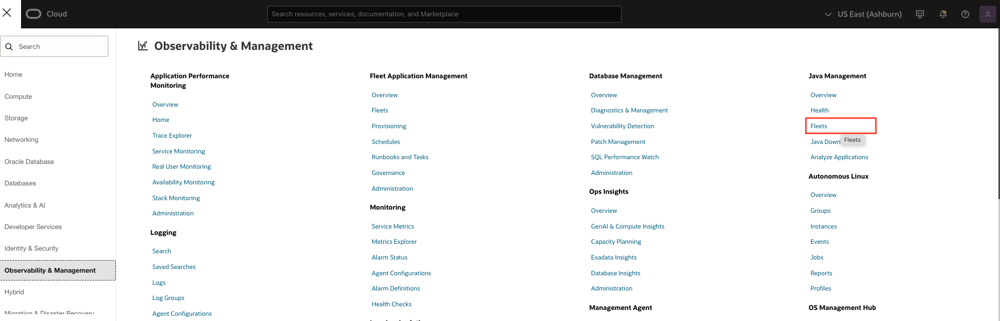
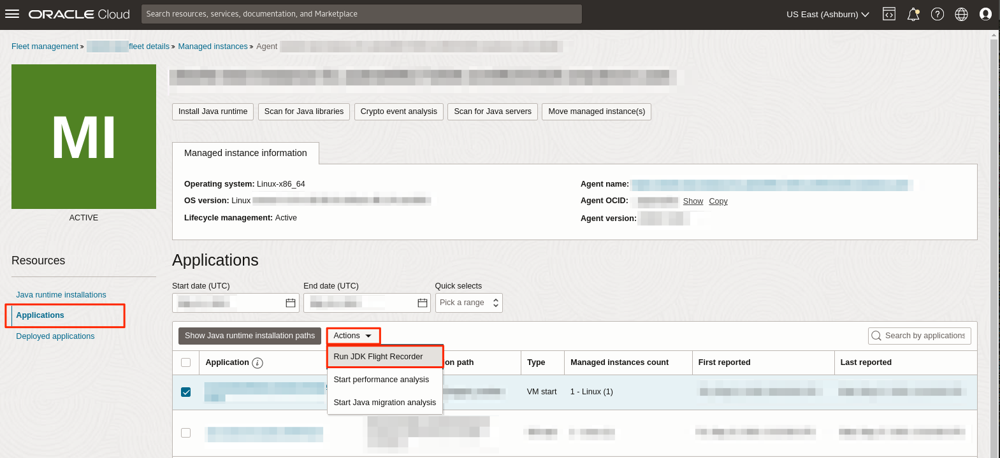
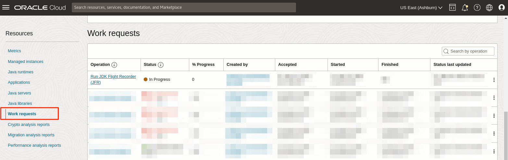
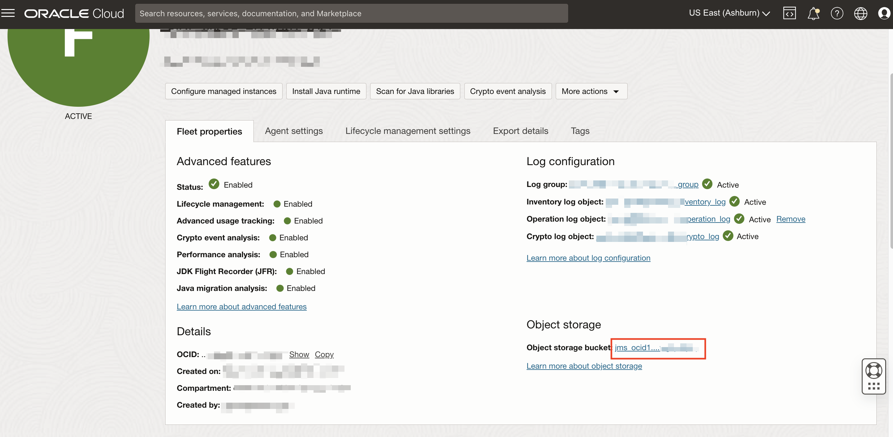

# Run JDK Flight Recorder (JFR)

## Introduction

This lab walks you through the steps to run JDK Flight Recorder (JFR) on any Java application in your fleet, including Java applications running inside containers that are part of Kubernetes clusters.

Estimated Time: 20 mins

### Objectives

In this lab, you will:

* Create a JDK Flight Recorder Work Request using the Java Management Service console interface with the "Default.jfc" profile.
* View and monitor the status of Work Requests created using the Java Management Service console interface.
* Download the generated JFR file for further analysis.

### Prerequisites

* You have signed up for an account with Oracle Cloud Infrastructure and have received your sign-in credentials.
* You are using an Oracle Linux image or Windows OS on your Managed Instance for this workshop.
* Access to the cloud environment and resources configured in [Lab 1](?lab=set-up-and-enable-advanced-features-on-java-management-service).
* JDK Flight Recorder (JFR) is enabled on the fleet.
* Have a Java application capable of running longer than 15 mins in your instance.
* Have a Managed Instance running a Kubernetes agent with access to the clusters.

## Task 1: Run JDK Flight Recorder on a Java Application

1. First, open the navigation menu, click **Observability & Management**, and then click **Fleets** under **Java Management**. Select the fleet that you have configured in [Lab 1](?lab=set-up-and-enable-advanced-features-on-java-management-service).

    

2. Under **Managed instances** on the **Fleet** details page.

   You should see a list of Managed instances that are currently in your Fleet. Select the Managed instance you are interested in.

   

3. Under **Applications**. You should see a list of Java applications running in this managed instance. Select the long running Java application you want to run with JFR.  Click on **Actions** and select **Run JDK Flight Recorder**. JFR will be captured for all the containers running that application, resulting in as many JFR recordings as the number of containers.

    

4. In the **JDK Flight Recorder** (JFR) Window, select **Recording option**: **Select from default profiles**.

    Under the **Select default profiles**, click the dropdown menu and select **Default.jfc**.

    Lower the **Max recording duration** to **15 mins** and keep **Max recording size** at **500MB**. Click **Submit** to begin the JFR recording.

    > Note: Ensure your application runs longer than the duration specified.

    

    If your request is submitted successfully, you should receive a notification as seen below:
    

    > **Note:** You can also schedule JDK Flight Recorder (JFR) by selecting the **Schedule for later** and setting the schedule preference. Once submitted, you should see a new Scheduled task been created. To view/manage the scheduled task, refer to [Lab 12](?lab=view-and-manage-scheduled-tasks)
    > 

5. Under **Work requests**. You should see a list of the Work Requests related to the selected managed instance. **JDK Flight Recorder** that was started should be at the top of the list.

    

6. Wait for the work request to be processed. If the work request has been completed successfully, the status will change to **Completed without Errors**.

    > **Note:** It will take approximately 15 minutes for the request to be completed.

    

7. To access the report, navigate to the **Fleet** details page and click the **View bucket details** name under **Object storage**.

    

8. The raw copy of the **JDK Flight Recorder** report is stored in the file: **JMS** > **JFR** > **fleet-ocid** > **instance-ocid** > **application-name.jfr**

    

9. You can open the **JDK Flight Recorder** recording in your favorite JFR viewer or you can use the Oracle's **JDK Mission Control** to view the files. 

    JMC download link: https://www.oracle.com/java/technologies/jdk-mission-control.html

> **Note:** You can trigger JFR recording at the application level for a containerized application as well. In such a case, the JFR will be captured for all the applicable containers running the particular application. If you want to capture the JFR for specific containers , head to **Task 2**

## Task 2: Submit JDK Flight Recorder for Java Containers

1. Under **Managed Instances**, select the managed instance running the kubernetes agent.

    

2. Under **Active Java Containers**, you can see a list of all running Java containers. This list will be refreshed if any change is detected in the Kubernetes cluster.

   

3. From the container list, select the containers you want to run the JFR recording on, and then click the **Run JDK Flight Recorder** button.

   

4.  A configuration panel will open. After applying the desired settings, click the **Submit** button.

   

   If your request is submitted successfully, you should receive a notification as seen below:
   

   > **Note:** You can also schedule JDK Flight Recorder (JFR) by selecting the **Schedule for later** and setting the schedule preference. Once submitted, you should see a new Scheduled task been created. To view/manage the scheduled task, refer to [Lab 12](?lab=view-and-manage-scheduled-tasks)
   > 

5. Under **Work requests**. You should see the **JFR Recording** work request you submitted. Click on the Work Request to view its details.

   

6. Click **Work Items** to see details including **Container name**, **Pod name** and **Node name**. If multiple containers spanning different applications are selected for a JFR request, the number of work items will match the number of applications.

   

7. Click **Download JDK Flight Recoring** to download the jfr file.

   

You may now **proceed to the next lab.**

## Learn More

* Refer to the [Advanced Features](https://docs.oracle.com/en-us/iaas/jms/doc/advanced-features.html), [Work Requests](https://docs.oracle.com/en-us/iaas/jms/doc/using-java-management-service.html#GUID-77AEEBC0-93A5-4E99-96D6-BEE0FEE4539F) sections of the JMS documentation for more details.

* Use the [Troubleshooting](https://docs.oracle.com/en-us/iaas/jms/doc/troubleshooting.html#GUID-2D613C72-10F3-4905-A306-4F2673FB1CD3) chapter for explanations on how to diagnose and resolve common problems encountered when installing or using Java Management Service.

* If the problem still persists or it is not listed, then refer to the [Getting Help and Contacting Support](https://docs.oracle.com/en-us/iaas/Content/GSG/Tasks/contactingsupport.htm) section. You can also open a support service request using the **Help** menu in the OCI console.

## Acknowledgements

* **Author** - Somik Khan, November 2022
* **Last Updated By** - Satish Sarakanam, October 2025
