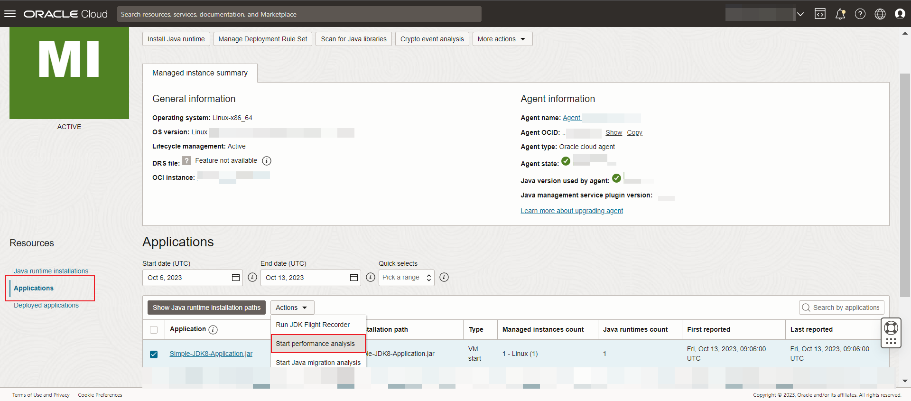
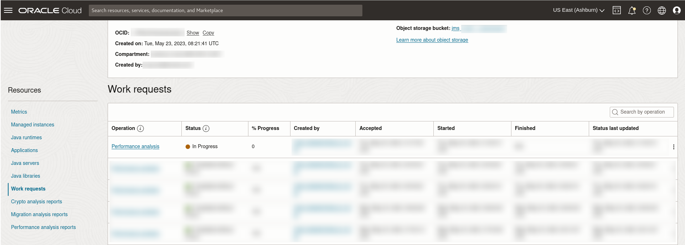
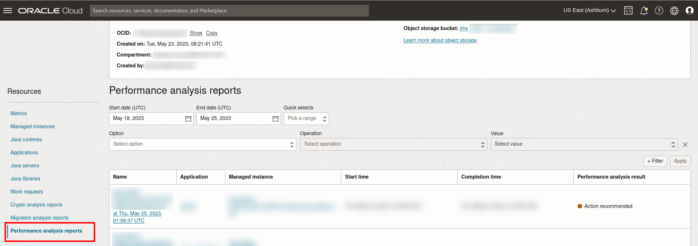
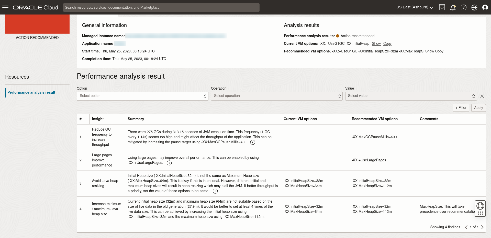
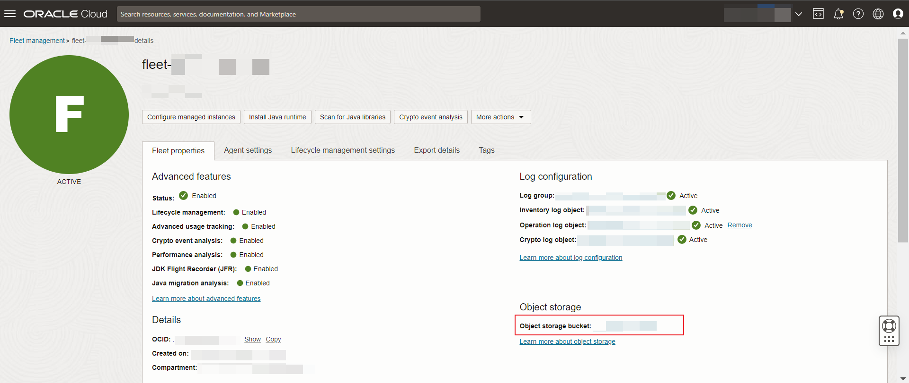
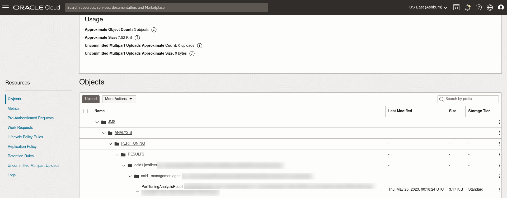

# Run Performance Analysis

## Introduction

This lab walks you through the steps to run Performance analysis on a Java application on your Fleet.

Estimated Time: 30 mins

### Objectives

In this lab, you will:

* Create a performance analysis work request using the Java Management Service on a Java application.
* View and monitor the status of the Work Request created using the Java Management Service console interface.
* View the performance analysis results of your Java application.

### Prerequisites

* You have signed up for an account with Oracle Cloud Infrastructure and have received your sign-in credentials.
* You are using an Oracle Linux image or Windows OS on your Managed Instance for this workshop.
* Access to the cloud environment and resources configured in [Lab 1](?lab=set-up-and-enable-advanced-features-on-java-management-service).
* Have a Java application that is run with Java command line arguments.

## Task 1: Submit Performance Analysis Work Request

1. Open the navigation menu, click **Observability & Management**. Click **Fleets** under **Java Management**. Select the fleet that you have configured in [Lab 1](?lab=set-up-and-enable-advanced-features-on-java-management-service).

   

2. Scroll down the **Fleet** details page. Under the **Resources** menu, select **Managed instances**.

   You should see a list of Managed instances that are currently in your Fleet. Select the Managed instance you are interested in.

   

3. Scroll down and under **Resources**, select **Applications**. You should see a list of Java applications running in this Managed instance. Select a long running Java application that is run with Java command line arguments. Click the **Actions** drop-down menu and click **Start performance analysis** button.

   

4. In the Performance analysis panel, lower the **Maximum recording duration** for each detected running application to 2 mins. Click **Start** to submit the work request.

   > Note: Ensure your application runs longer then the duration specified.

   

   If your request is submitted successfully, you should receive a notification in green as seen below:

   

5. Click on the **fleet** name at the top of the **Managed Instance** page. This should navigate back to the **Fleet** details page.

   

6. Scroll down to the **Resources** menu and select **Work requests**. You should see a list of the Work Requests that are currently in your Fleet. **Performance analysis** that was started should be at the top of the list.

   

7. Wait for the work request to be processed. If the work request has been completed successfully, the status will change to **Completed without Errors**.

   

   >**Note:** It will take approximately 20 minutes for the request to be completed.

8. Once the work request status shows **Completed without Errors**, scroll down to the **Resources** menu and select **Performance analysis reports**.

   You should see a list of Performance analysis reports that have been conducted in your Fleet. The latest **Performance analysis** that has been completed should be displayed at the top of the list.

   

9. Click on the **Name** of the **Performance analysis report** and scroll down to get more details.

   our

   The performance analysis result details are shown under **Performance analysis result**.

10. You can hover over the information icon, and click **Learn more** to read more about the recommendation.

    

## Task 2: (Optional) Download Performance Analysis Report

1. To access the report, navigate to the **Fleet** details page and click on the **Object storage bucket** name under **Object storage**.

   

2. The raw copy of the **Performance analysis** report is stored in the file: **JMS** > **ANALYSIS** > **PERFTUNING** > **RESULTS** > **fleet-ocid** > **managed-instance-ocid** > **PerfTuningAnalysisResult-** json.

   

    <details>
      <summary>JSON schema of Performance Analysis Result</summary>

      ```javascript
      {
        applicationName: string,
        applicationId: string,
        applicationInstallationId: string,
        jfrFileName: string,
        timeAnalyzed: date-time,
        summary: {
            warnings: [
                {
                    key: int,
                    code: string,
                    description: string,
                    message: string,
                    currentVMOptions: string,
                    recommendedVMOptions: string,
                    detailsLink: url,
                    comment: string
                }
            ]
        },
        version: string
      }
      ```
    </details>

## Learn More

* Refer to the [Advanced Features](https://docs.oracle.com/en-us/iaas/jms/doc/advanced-features.html), [Work Request](https://docs.oracle.com/en-us/iaas/jms/doc/getting-started-java-management-service.html#GUID-47C63464-BC0C-4059-B552-ED9F33E77ED3) and [Fleet Work Requests](https://docs.oracle.com/en-us/iaas/jms/doc/fleet-work-requests.html) sections of the JMS documentation for more details.

* Use the [Troubleshooting](https://docs.oracle.com/en-us/iaas/jms/doc/troubleshooting.html#GUID-2D613C72-10F3-4905-A306-4F2673FB1CD3) chapter for explanations on how to diagnose and resolve common problems encountered when installing or using Java Management Service.

* If the problem still persists or it is not listed, then refer to the [Getting Help and Contacting Support](https://docs.oracle.com/en-us/iaas/Content/GSG/Tasks/contactingsupport.htm) section. You can also open a support service request using the **Help** menu in the OCI console.

## Acknowledgements

* **Author** - Ivan Eng, Java Management Service
* **Last Updated By** - Ivan Eng, June 2023
