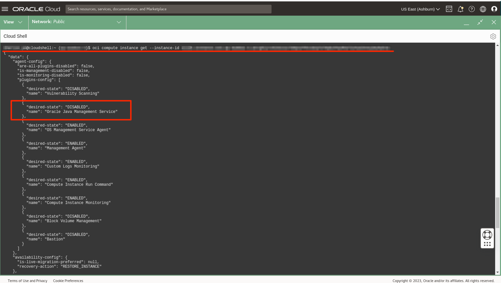
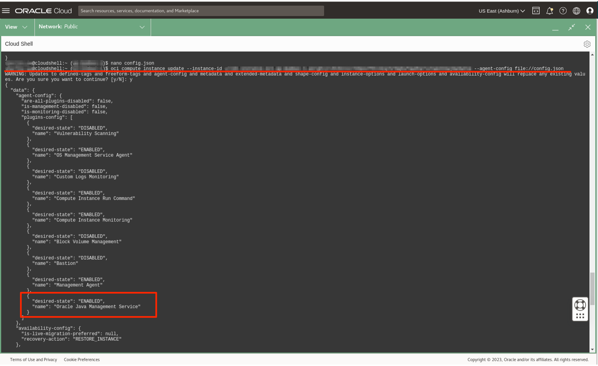
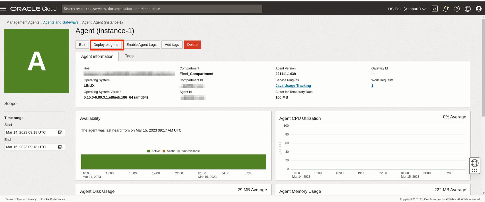

# Set up and enable advanced features on Java Management Service

## Introduction

Before using JMS advanced features, you must ensure that your Oracle Cloud Infrastructure environment is set up correctly by following the workshop [Manage Java Runtimes, Applications and Managed Instances Inventory with Java Management Service](https://apexapps.oracle.com/pls/apex/dbpm/r/livelabs/view-workshop?wid=912). These OCI Resources allow the communication between all the required components and cloud services.

Estimated Time: 30 minutes

### Requirements to use advanced features
* Run applications or Java servers using **JDK 11** or higher.
* If the application or Java server uses **Java SE 8**, then it needs to use at least **Oracle JDK 8u361** or higher.
* Management Agent should use either **Oracle JDK 8u361** or higher for on-premises environment or **Oracle JDK 11** for OCI compute instances.
* Lifecycle Management is supported only for Oracle JDKs.

### Objectives

In this lab, you will configure:

  *  A fleet to enable advanced features.
  *  An OCI Managed Instance to enable advanced features.
  *  A non-OCI Managed Instance to enable advanced features.

### Prerequisites

 * You have signed up for an account with Oracle Cloud Infrastructure and have received your sign-in credentials.
 * You are using an Oracle Linux image or Windows OS on your Managed Instance for this workshop.
 * You have successfully completed the installation of the Management Agent on your OCI or non-OCI Managed Instances following steps in [Manage Java Runtimes, Applications and Managed Instances Inventory with Java Management Service](https://apexapps.oracle.com/pls/apex/dbpm/r/livelabs/view-workshop?wid=912).
 * **JDK Flight Recorder** and by extension **Crypto Event Analysis** and **Performance Analysis** are commercial features  available only in the commercial packages based on Java Platform Standard Edition (Oracle Java SE Advanced and Oracle Java SE Suite). By selecting any of these features, you are agreeing to unlock this commercial feature in your JVM that will run the **JDK Flight Recorder**. For more details, go to [About JDK Flight Recorder](https://docs.oracle.com/javacomponents/jmc-5-4/jfr-runtime-guide/about.htm#JFRUH170)
 * **Proceed to Task 2 or 3 if the management agent was installed manually (i.e. using the management agent software or enabled using the Management Agent plugin on your OCI compute instance's Oracle Cloud Agent) and not using the installation script.**

## Task 1: Configure a fleet to enable advanced features

1. In the Oracle Cloud Console, open the navigation menu, click **Observability & Management**, and then click **Fleets** under **Java Management**. Select the fleet that you are interested in.
   
   
   > **Note:** You can also use the search bar to navigate around the Oracle Cloud Console.
   
   

2. Click **Edit Properties**. A separate edit fleet properties window should appear
   

3. The advanced features section should display the 6 different advanced features:
    * Lifecycle management
    * Advanced usage tracking
    * Crypto event analysis
    * JDK Flight Recorder (JFR)
    * Java migration analysis
    * Performance analysis

4. For the purpose of this workshop, click **Select all advanced features**. This will select all individual features.

    

    Click **Save changes** to confirm the modification.

    If the **Select all advanced features** is checked, click **cancel** to close the window.

    > **Note:** To enable only certain advanced features, select the check box next to the desired advanced feature and save your changes. Only advanced features that have been enabled can be used.

## Task 2: Enable Advanced Features on Managed Instance (OCI Compute)

> **Note:** Please refer to this task if the **installation script was not used** to install the management agent. The management agent should have been enabled using the Management Agent plugin on your OCI compute instance's Oracle Cloud Agent (OCA).

After you have installed the Management Agent, follow the steps below to verify required plugins and enable Java Management Service.

### **Managed Instance on OCI Compute**
Follow these steps to enable Oracle Java Management plugin and verify the OCA installation package version on the OCI compute instance having OCA installed and Java Usage Tracking plugin deployed:

1. There are two ways to verify and enable `Oracle Java Management Service` plugin.

    **Using OCI Console:**

     * In the Oracle Cloud console, click **Instances** under **Compute**, and select the instance that you are interested in.
       

     * Click the **Oracle Cloud Agent** tab. The list of plugins is displayed. Verify that the **Oracle Java Management Service** OCA plugin is enabled. If it is disabled, toggle the Oracle Java Management Service plugin switch and ensure the status is **Running**. This may take 5 to 10 minutes. This will enable the advanced features for the chosen OCI Compute Instance.
      

    **Using Cloud Shell:**
     * Alternatively, you can use Cloud Shell to verify and enable `Oracle Java Management Service` plugin. Click the Cloud Shell icon in the Console header. You can access this icon from all OCI console pages.
       
     The Cloud Shell will open and may look something like this.
      

       You can use the icons in the upper right corner of the Cloud Shell window to minimize, maximize, and close your Cloud Shell session. 
       

     * In Cloud Shell add the following to get the Instance details. You can copy the Instance OCID from Instance detail page.
         ```
         <copy>
        oci compute instance get --instance-id <INSTANCE OCID>
         </copy>
         ```

       The response may look like this.

       

     * JMS Agent plugin is controlled through this JSON tag.
         ```
         <copy>
         {
           "desired-state": "DISABLED",
           "name": "Oracle Java Management Service"
         }        
         </copy>
         ```

         If the `desired-state` is `DISABLED` then proceed to next step to change the state to `ENABLED`, else you can skip to Step 2.


     * Create a configuration json file and add the following json code in it.
         ```
         <copy>
         nano config.json  
         </copy>
         ```

         ```
         <copy>
         {
           "are-all-plugins-disabled": false,
           "is-management-disabled": false,
           "is-monitoring-disabled": false,
           "plugins-config": [
           {
             "desired-state": "DISABLED",
             "name": "Vulnerability Scanning"
           },
           {
             "desired-state": "ENABLED",
             "name": "OS Management Service Agent"
           },
           {
             "desired-state": "DISABLED",
             "name": "Custom Logs Monitoring"
           },
           {
             "desired-state": "ENABLED",
             "name": "Compute Instance Run Command"
           },
           {
             "desired-state": "ENABLED",
             "name": "Compute Instance Monitoring"
           },
           {
             "desired-state": "DISABLED",
             "name": "Block Volume Management"
           },
           {
             "desired-state": "DISABLED",
             "name": "Bastion"
           },
           {
             "desired-state": "ENABLED",
             "name": "Management Agent"
           },
           {
             "desired-state": "ENABLED",
             "name": "Oracle Java Management Service"
           }
           ]
         }
         </copy>
         ```

       To save the file, press **CTRL+x**. Before exiting, nano will ask you if you wish to save the file: Type **y** to save and exit, type **n** to abandon your changes and exit.


      * Now, in Cloud Shell add the following to update the `Oracle Java Management Service` plugin state from `DISABLED` to `ENABLED`.

       ```
       <copy>
       oci compute instance update --instance-id <INSTANCE OCID> --agent-config file://config.json
       </copy>
       ```

       If you see the response like this, the `Oracle Java Management Service` plugin has been enabled. Else in case of any error, refer to this link [Using CLI](https://docs.oracle.com/en-us/iaas/Content/API/SDKDocs/cliusing.htm).

       


2. Next, in the Oracle Cloud Console, open the navigation menu, click **Observability & Management**, and under **Management Agent**, click **Agents**. Select the agent you are interested in.

   

   In your agent, click **Deploy plug-ins**.
   

   Ensure that the **Java Usage Tracking** box is checked.
   

   If you have verified that both the **Oracle Java Management Service OCA plugin** and **Java Usage Tracker service plugin** have been deployed, proceed to verify the OCA installation package version and update it.

3. Access OCI Compute Instance via SSH.

4. Check the version of the current OCA installation package.
    ```
    <copy>
    sudo yum info oracle-cloud-agent
    </copy>
    ```
   If current version of the OCA installation package is the latest one, then no further steps are required. It should look like this:
   

   Else you should see output something like this:
  

5. Update the OCA Installation Package.
    ```
    <copy>
    rpm -qa | grep oracle-cloud-agent

    sudo yum update oracle-cloud-agent -y
    </copy>
    ```

## Task 3: Enable Advanced Features on Managed Instance (Non-OCI hosts)

> **Note:** Please refer to this task if the **installation script was not used** to install the management agent. The management agent should have been installed using the management agent software.

### **Managed Instance on Non-OCI host**
If you are using a Managed Instance that is not on OCI and you have installed the Management Agent by following the steps in the workshop [Manage Java Runtimes, Applications and Managed Instances Inventory with Java Management Service](https://apexapps.oracle.com/pls/apex/dbpm/r/livelabs/view-workshop?wid=912), you just need to make a few changes to start using advanced features.


1. Open the `/etc/sudoers` file.
    ```
    <copy>
    sudo nano /etc/sudoers
    </copy>
    ```

    Add the following lines to the end of the file:

    ```
    <copy>
    #To change ownership of the Java Management Service plugin to root
    mgmt_agent ALL=(ALL) NOPASSWD:/opt/oracle/mgmt_agent/agent_inst/bin/chown_recursive_ep.sh
    #To run the Java Management Service plugin under root user
    mgmt_agent ALL=(root) NOPASSWD: ALL
    </copy>
    ```

2. To save the file, press **CTRL+x**. Before exiting, nano will ask you if you wish to save the file: Type **y** to save and exit, type **n** to abandon your changes and exit.

3. Login to OCI Console.

4. In the Oracle Cloud Console, open the navigation menu, click **Observability & Management**, and then click **Agents** under **Management Agent**.
  

5. From the Agents list, select for the agent that was recently installed.
   

6. In order to enable advanced features, enable `Java Management Service` plug-in. Check `Service Plug-ins` field and ensure both `Java Management Service` and `Java Usage Tracker` plug-ins are available. If `Java Management Service` plug-in is missing follow the next step, else you can move to the next Task.

  

7. To enable `Java Management Service` plug-in, click **Deploy plug-ins**, check `Java Management Service` option and click **Update**. Verification can be achieved from service plug-ins after 5-10 minutes, you should see the `Java Management Service` plug-in enabled under `Service Plug-ins` field.

  

You may now **proceed to the next lab.**

## Learn More

* Refer to the [Managing Plugins with Oracle Cloud Agent](https://docs.oracle.com/en-us/iaas/Content/Compute/Tasks/manage-plugins.htm#console).
* Refer to the [Installing a Management Agent](https://docs.oracle.com/en-us/iaas/jms/doc/installing-management-agent.html). It has details of installation of Management Agent on various Operating Systems.


## Acknowledgements

* **Author** - Bhuvesh Kumar, Java Management Service
* **Last Updated By** - Chan Wei Quan, October 2023
