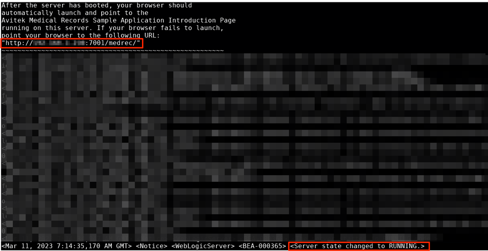
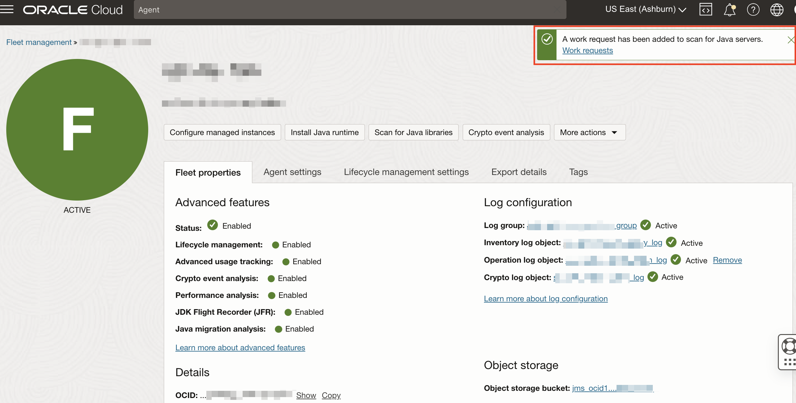
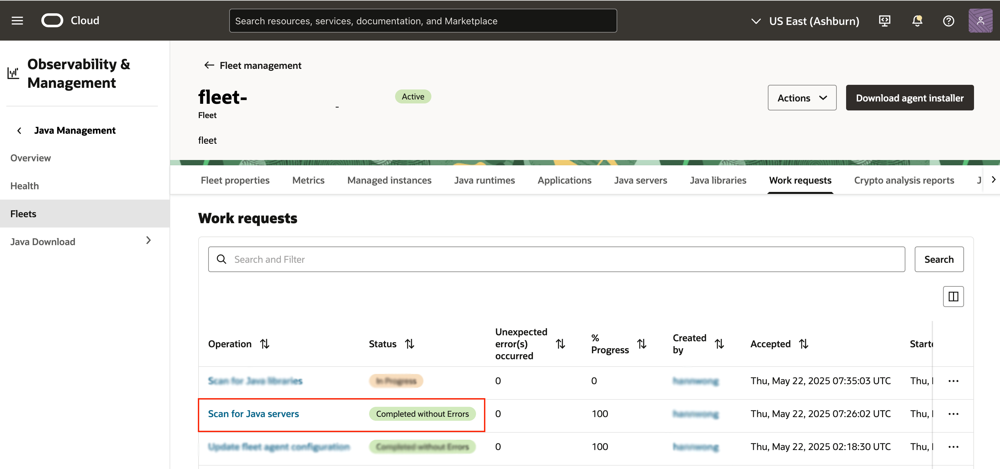
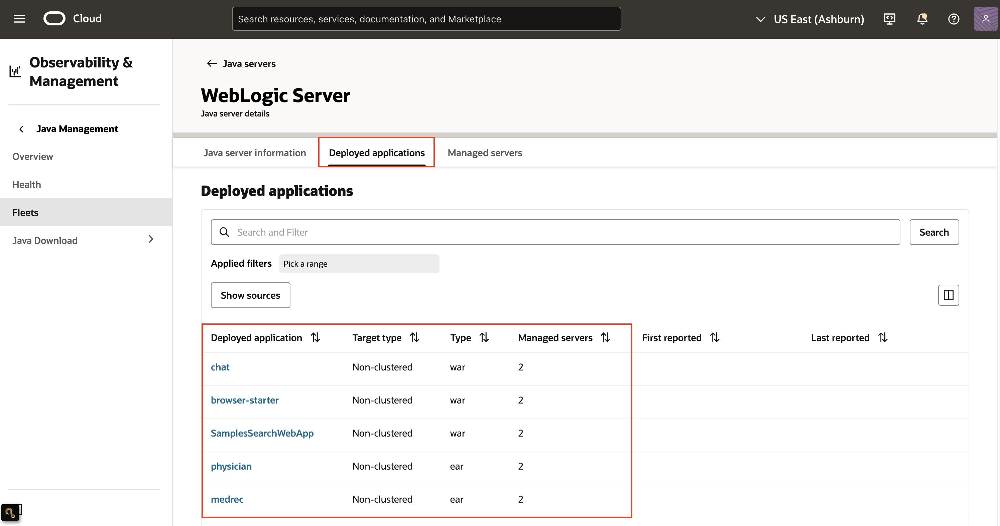
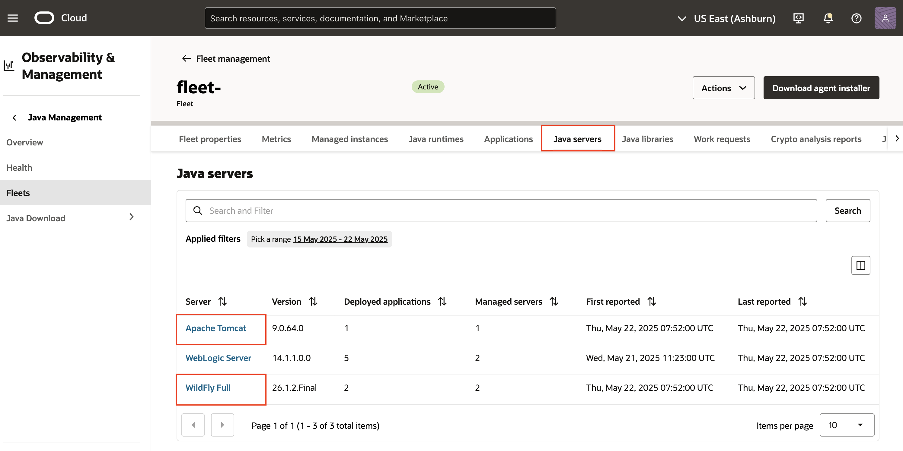

# Track Java Servers

## Introduction

Advanced usage tracking allows you to monitor the usage of Java servers in your fleet which includes the applications deployed on the Java server, the managed server and managed instances on which an application is deployed. 

This lab walks you through the steps to track Java servers in a managed instance.

Estimated Time: 30 minutes

### Objectives

In this lab, you will:

* Configure WebLogic server in a managed instance.
* Run WebLogic Server with Sample Java Web Application.
* Scan running Java server with deployed Java Web Application in a managed instance.
* Verify Java server scanning result.

### Supported Versions of Java Servers
* WebLogic: 14.1.1.0.0, 12.2.1.4.0
* JBoss: 7.0 to 7.4
* Tomcat: 8.5 to 10

### Prerequisites

* You have signed up for an account with Oracle Cloud Infrastructure and have received your sign-in credentials.
* You are using an Oracle Linux image on your Managed Instance for this workshop.
* Access to the cloud environment and resources configured in [Lab 1](?lab=set-up-and-enable-advanced-features-on-java-management-service).
* Familiarity with configuration of WebLogic server.

## Task 1: Ensure WebLogic Server is installed and configured

1. If you do not have WebLogic server installed and configured in your managed instance, please refer to following steps.
    * [Download WebLogic Server](https://www.oracle.com/middleware/technologies/weblogic-server-installers-downloads.html)
    * [Install WebLogic Server with Sample Applications](https://docs.oracle.com/en/middleware/standalone/weblogic-server/14.1.1.0/intro/examples.html#GUID-F9F246B1-E186-46C7-846C-DA510295582F)

2. Avitek Medical Records (also known as **MedRec**) is a comprehensive educational sample application installed with the WebLogic Server installation (Complete with Examples). Please take note of the **absolute path to the domain directory created for MedRec Application**. This path will be required for the subsequent task.

  For example: **/home/opc/Oracle/Middleware/Oracle\_Home/user\_projects/domains/medrec**

## Task 2: Start WebLogic Server with Sample MedRec Application

1. Connect to your instance with SSH if you are using an OCI Compute Instance.  
    Open a Terminal or Command Prompt window. Change into the directory where you stored the SSH encryption keys you created. To use SSH command, you need to change the read and write permissions to your key with this command.
    ```
      <copy>
        chmod 400 ./<your-private-key-file>
      </copy>
      ```
    Connect to your instance with this SSH command
    ```
      <copy>
        ssh -i <your-private-key-file> opc@<x.x.x.x>
      </copy>
    ```
2. Start WebLogic Server with sample MedRec Application with following command.
    ```
      <copy>
        sudo <path-to-created-domain-for-MedRec>/startWebLogic.sh
      </copy>
    ``` 
    You should see a similar output message after the server has successfully started.
    

## Task 3: Initialize a Java server scan

1. Open the navigation menu, click **Observability & Management**. Under **Java Management**, select **Fleets**.
    
    Select the fleet with the advanced feature, **Lifecycle management** enabled. Refer to  [Lab 1](?lab=set-up-and-enable-advanced-features-on-java-management-service).
    
2. On the Fleet details page, click **Scan for Java servers**.
    
    If your request is submitted successfully, you should receive a notification in green as seen below: 
    

3. Scroll down the Fleet details page, under **Resources** menu, select **Work Request**. You should see the Scan for Java servers Work Request you submitted in step 1. Wait for the work request to complete.
    

4. If your request is successful, you should see that the Status of the request is marked as **Completed without errors**.  
It will take approximately 10 minutes for the request to be completed.
    
5. In the same Fleet details page, under **Resources** menu, select **Java servers**. You should be able to see all the Java servers present in the fleet.
    

6. Click **WebLogic Server** under **Java servers**, you should be able to see a series of applications deployed for **MedRec** and their target types (clustered / non-clustered) under **Deployed applications**.
    

## Task 4: (Optional) Tracking other Java Servers with Deployed Applications
* Task 1 to 3 highlights the process of tracking a running Java server with deployed sample application using WebLogic server as an example. The Java server scan is able to detect the latest versions of a variety of Java Servers including:
    * WebLogic
    * Tomcat
    * JBoss (JBoss EAP, JBoss AS/WildFly)
    
    
* Additionally, the Java server scan is also able to detect applications that have been deployed in a standalone (non-clustered) or clustered mode.

* Setting up of Java application servers including configuring cluster mode is beyond the scope of this workshop. You may wish to deploy the Java Applications using above mentioned Java servers on your own and scan it using our features.

You may now **proceed to the next lab.**
## Learn More
* Refer to the [Advanced Features](https://docs.oracle.com/en-us/iaas/jms/doc/advanced-features.html), [Work Request](https://docs.oracle.com/en-us/iaas/jms/doc/getting-started-java-management-service.html#GUID-47C63464-BC0C-4059-B552-ED9F33E77ED3) and [Viewing a Work Request](https://docs.oracle.com/en-us/iaas/jms/doc/fleet-views.html#GUID-F649F0E5-DD54-4DEC-A0F1-942FE3552C93) sections of the JMS documentation for more details.

* Use the [Troubleshooting](https://docs.oracle.com/en-us/iaas/jms/doc/troubleshooting.html#GUID-2D613C72-10F3-4905-A306-4F2673FB1CD3) chapter for explanations on how to diagnose and resolve common problems encountered when installing or using Java Management Service.

* If the problem still persists or it is not listed, then refer to the [Getting Help and Contacting Support](https://docs.oracle.com/en-us/iaas/Content/GSG/Tasks/contactingsupport.htm) section. You can also open a support service request using the **Help** menu in the OCI console.

## Acknowledgements

* **Author** - Youcheng Li, Java Management Service
* **Last Updated By** - Sherlin Yeo, June 2023
