# View and monitor Work Requests

## Introduction

This lab walks you through the steps to view and monitor the Work Requests you have created.

Estimated Time: 20 minutes

### Objectives

In this lab, you will:

  * Understand the different components of a Work Request view
  * View and monitor the status of Work Requests created using the Java Management Service console interface
  * Cancel a Work Request using the the Java Management Service console interface

### Prerequisites

  * You have signed up for an account with Oracle Cloud Infrastructure and have received your sign-in credentials.
  * You are using an Oracle Linux image or Windows OS on your Managed Instance for this workshop.
  * Access to the cloud environment and resources configured in [Lab 1](?lab=set-up-and-enable-advanced-features-on-java-management-service).

## Task 1: Overview of Work Request detailed views
1. First, open the navigation menu, click **Observability & Management**, and then click **Fleets** under **Java Management**. Select the fleet that you are interested in.
 

2. Under **Resources**, select **Work Requests**. You should see a list of the Work Requests that you have created. Select a **Work Request** that you are interested to view in detail.
 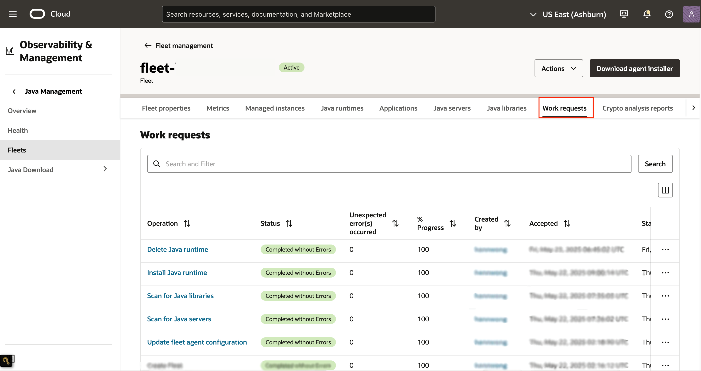

3. The detailed view of a Work Request is divided into two sections:
    * Information about the Work Request, including:
        * The **OCID** of the Work Request.
        * **Date and time** when the Work Request **started**, **accepted** and **last updated**.
        * **Number of sub-tasks** completed for the Work Request.
    * A list of resources from which you can view the individual metrics for the Work Requests:
        * Associated Resources
        * Log Messages
        * Error Messages

  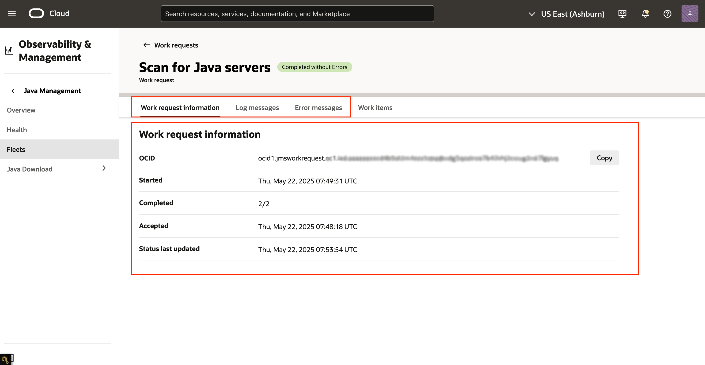

4. For the list of resources which include **Associated Resources**, **Log Messages** and **Error Messages**, each list displays **50** rows at a time. You may click the header of a column to sort the list based on the title of the column, or use the text field to search the contents of the table.

  For the list of **Associated Resources**, you may find the following information:
    * **Managed instance**: Name of the managed instance affected by the Work Request.
    * **Path**: The Java runtime installation path in the managed instance affected by the operation.
    * **Status**: Status of the operation at the associated resource.
    * **Last updated**: Date and time when the status for this associated resource was last updated.

  

  For the list of **Log Messages**, you may find the following information:
    * **Message**: Log message reported by the agent while carrying out the Work Request.
    * **Timestamp**: Date and time when the message was generated.

  

  For the list of **Error Messages**, you may find the following information. Note that error messages can be observed if your Work Request was not successful.
    * **Message**: Error message reported by the agent while carrying out the Work Request.
    * **Timestamp**: Date and time when the message was generated.

  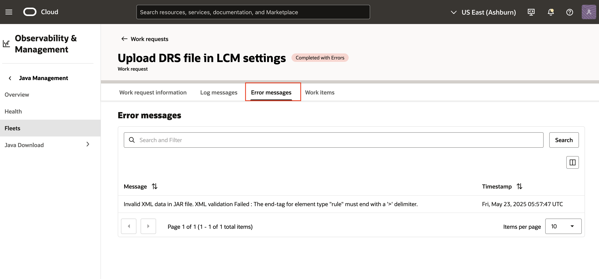

## Task 2: View status and logs of a Work Request
1. In the **Fleet** page, under **Resources**, select **Work Requests**. Click on the Work Request you are interested in to view its details.
 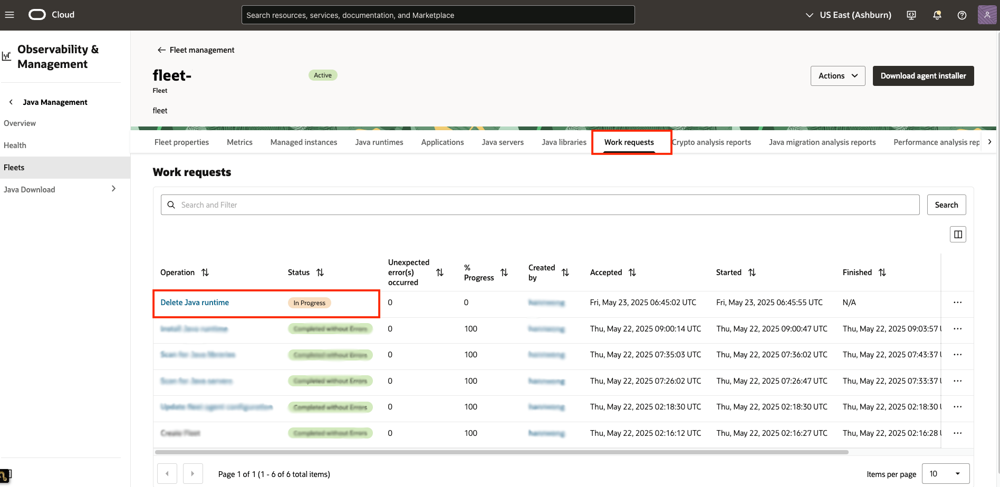

2. If your request was successful, you should see that the **Status** of the request is marked as **Succeeded** and **Completed without errors**.
 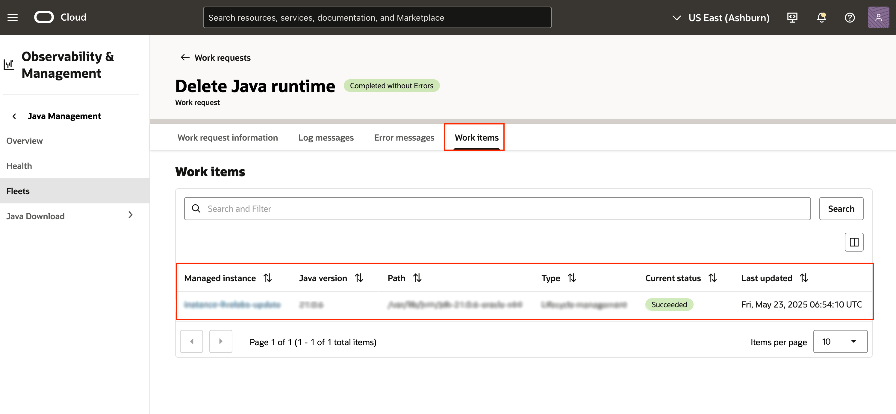

3. If you would like to view the log messages for the Work Request, select **Log Messages** under **Resources**. You should see the log messages in detail.
 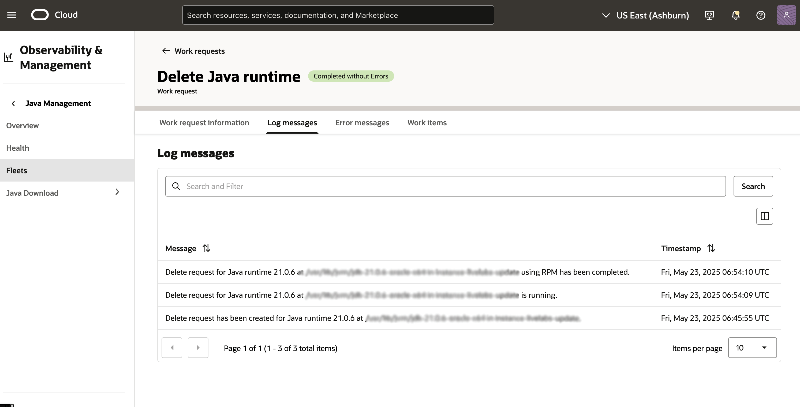

4. If your Work Request was unsuccessful, you may view the error messages by selecting **Error Messages** under **Resources**. You should see the status as **Completed with errors** and the corresponding error messages.
  

## Task 3: Cancel a Work Request
1. In the **Fleet** page, under **Resources**, select **Work Requests**. You should see the Work Requests you submitted. Click on the Work Request to view its details.
 

2. If your Work Request is still in progress and you would like to cancel it, click **Cancel Work Request**.
  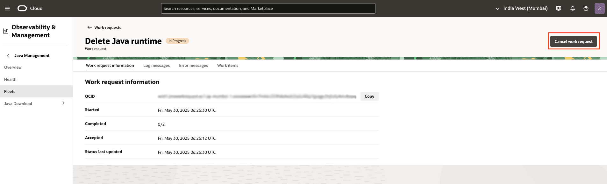

3. Click **Cancel work request** again to confirm.
  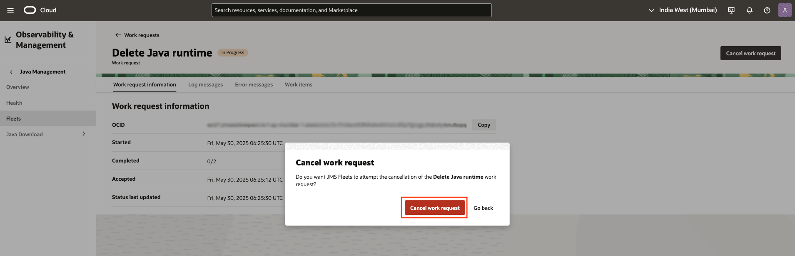

4. Alternatively, you may cancel your Work Request on the **Fleet** page by clicking on the icon at the right corner and selecting **Cancel Work Request**. Click **Cancel work request** again to confirm.

   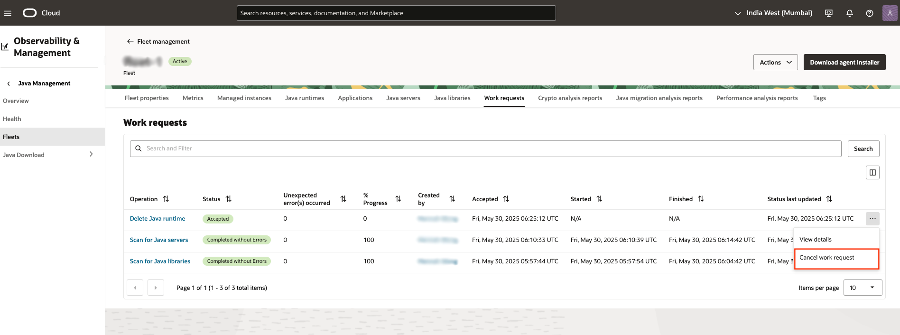

   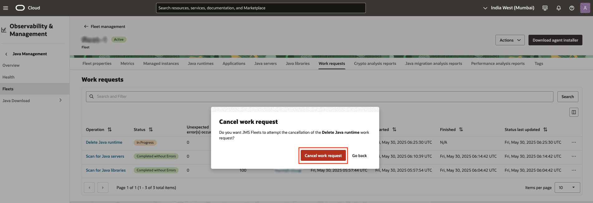

5. If your request has been canceled successfully, you should see that the **Status** of the request is marked as **Canceled**.
  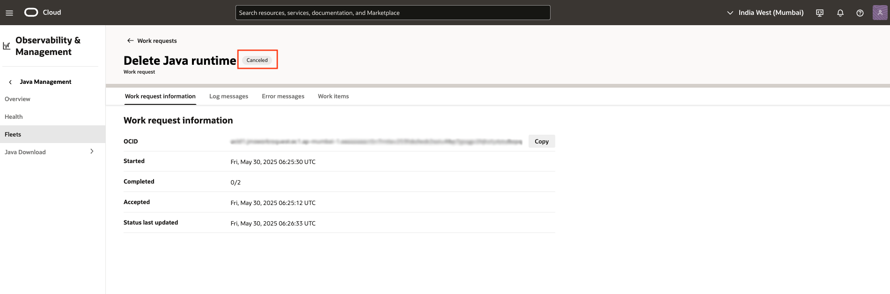

## Learn More
 * Refer to the [Advanced Features](https://docs.oracle.com/en-us/iaas/jms/doc/advanced-features.html), [Work Request](https://docs.oracle.com/en-us/iaas/jms/doc/getting-started-java-management-service.html#GUID-47C63464-BC0C-4059-B552-ED9F33E77ED3) and [Viewing a Work Request](https://docs.oracle.com/en-us/iaas/jms/doc/fleet-views.html#GUID-F649F0E5-DD54-4DEC-A0F1-942FE3552C93) sections of the JMS documentation for more details.

 * Use the [Troubleshooting](https://docs.oracle.com/en-us/iaas/jms/doc/troubleshooting.html#GUID-2D613C72-10F3-4905-A306-4F2673FB1CD3) chapter for explanations on how to diagnose and resolve common problems encountered when installing or using Java Management Service.

 * If the problem still persists or it is not listed, then refer to the [Getting Help and Contacting Support](https://docs.oracle.com/en-us/iaas/Content/GSG/Tasks/contactingsupport.htm) section. You can also open a support service request using the **Help** menu in the OCI console.

## Acknowledgements

 * **Author** - Xin Yi Tay, Java Management Service
 * **Last Updated By** - Sherlin Yeo, June 2023
