# Create Java Migration Analysis

## Introduction

OCI Java Management Service (JMS) Java Migration Analysis evaluates application and runtime compatibility to plan safe, low-risk moves to newer JDKs (e.g., Oracle JDK 17/21). It flags deprecated/removed APIs, third‑party library risks, and runtime behaviors, then generates prioritized remediation guidance and testing recommendations to streamline upgrades at scale.

Java Migration Analysis requires you to provide an artifact file (JAR, WAR, EAR, ZIP) containing the Java classes to be analyzed.

Estimated Time: 30 minutes

### Objectives

In this lab, you will:

* Launch Java Migration Analysis.
* View and interpret the results from the Java Migration Analysis.

### Prerequisites

* You have signed up for an account with Oracle Cloud Infrastructure and have received your sign-in credentials.
* You have configured The Analyze Application feature using the **Setup Analyze Application on Java Management Service** [Lab](?lab=setup-analyze-applications-on-java-management-service).

## Task 1: Prepare a jar file to be analyzed

1. Get a jar to be analyzed. If you do not have one, you can navigate to Maven central and download a jar. For example, in this lab we will use [Log4j-core 2.6](https://mvnrepository.com/artifact/org.apache.logging.log4j/log4j-core/2.6).

## Task 2: Launch Java Migration Analysis

1. In the Oracle Cloud Console, open the navigation menu, click **Observability & Management**, and then click **Overview** under **Java Management**.

2. In the **Analyze Applications** section, **Applications** tab, click on **Create Analysis** button.

3. In the form, introduce a report name, choose **Java Migration analysis** as analysis type and click Next.
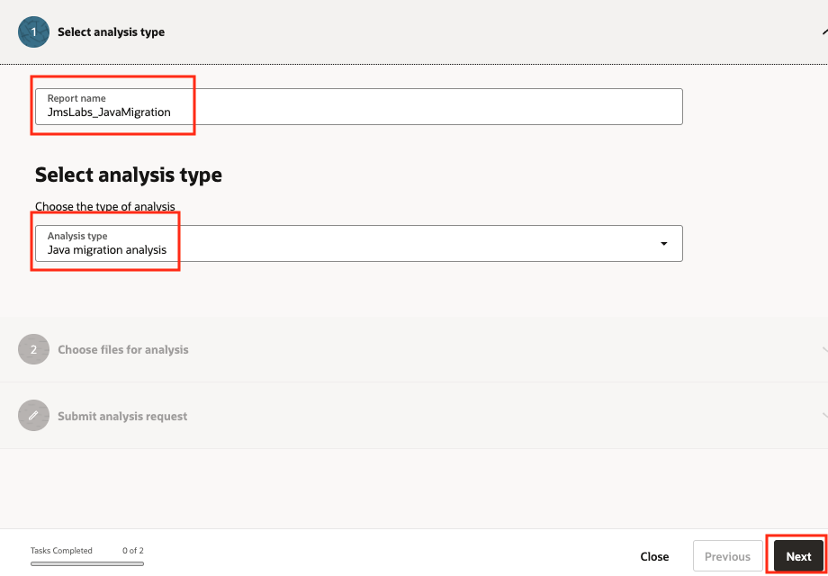
4. Select **Upload a file from local system** and drop or select the jar file generated in the [Task 1](#task1prepareajarfiletobeanalyzed). Click **Upload** to upload the file and then click Next.
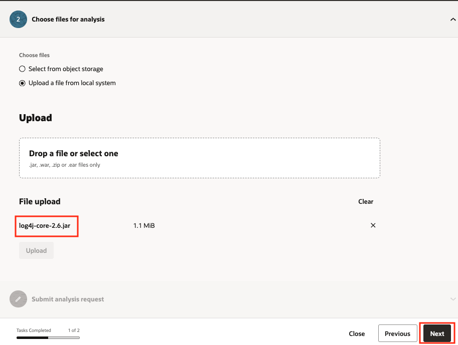
5. In the configuration Screen choose the **Target JDK for Java Migration analysis** and optionally _include/exclude_ package prefixes. Click **Analyze**.
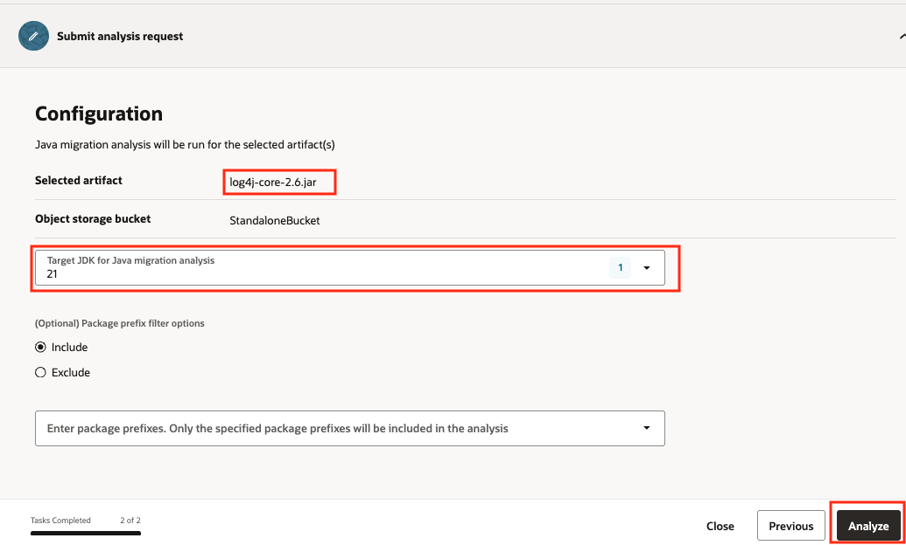
6. Navigate to the **Work Requests** tab and visualize the Java Migration Analysis request. The request will progress and should be completed within a few minutes (typically 2 or 3).
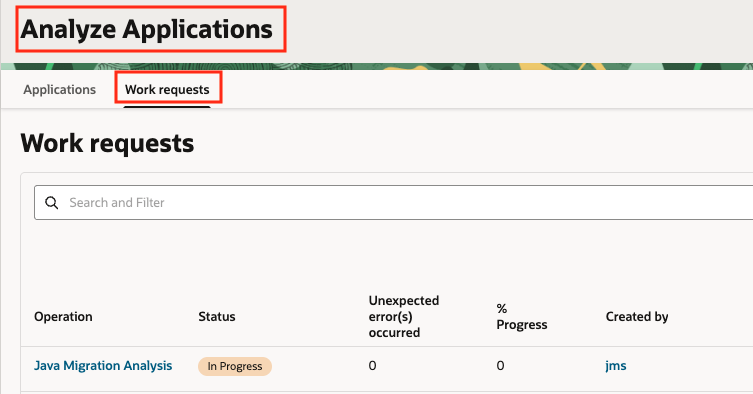
7. Click on the specific work request to obtain information about its status, log and error messages and Work Items.
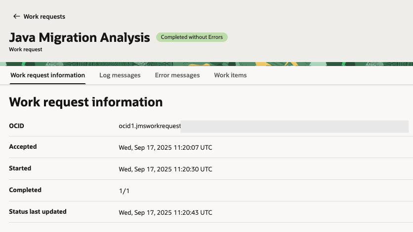

## Task 3: Visualize the Java Migration Analysis Result

1. In the Oracle Cloud Console, open the navigation menu, click **Observability & Management**, and then click **Overview** under **Java Management**.

2. In the **Analyze Applications** section, **Applications** tab, navigate to the **Analysis reports** section and click on the Analysis Result you generated in the previous Task.

3. Observe the Java Migration Report Information screen:

* **Header tabs**: _Migration report Information, Report summary, Detailed summary, Mandatory changes, Recommended changes, Archive summary, API View_.
* **Buttons**: _Download_ to download the report in HTML format and _View_ to visualize the Maven recommendations.

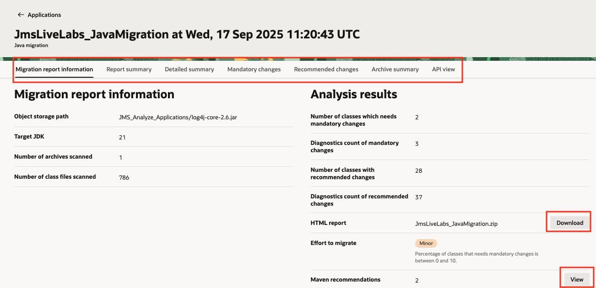
4. Click on the **Report summary** tab to visualize the number of classes affected in mandatory and recommended changes. Clicking on the class links will navigate to the _Mandatory_ or _Recommended_ changes screens.
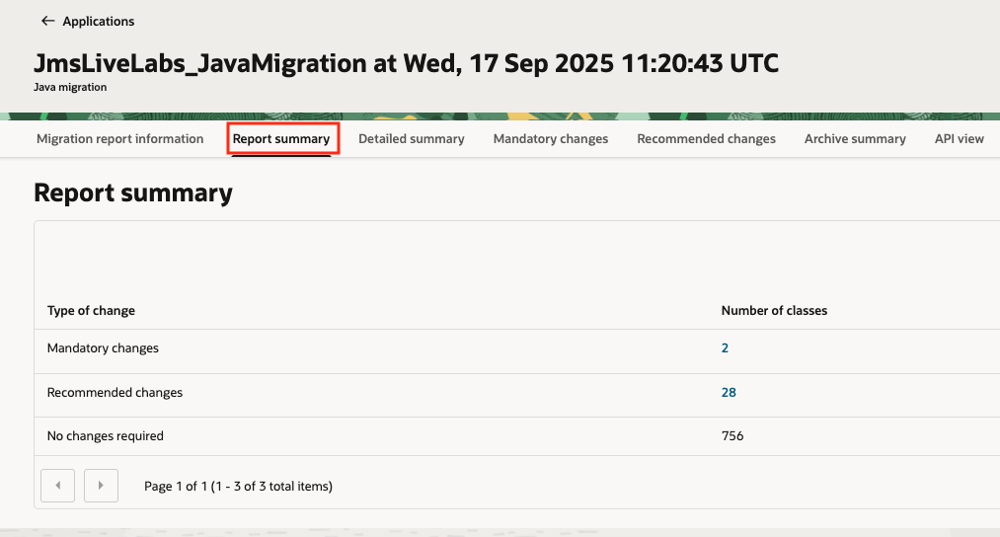
5. Click on the **Detailed summary** tab to visualize a detailed summary including the **Category** of changes and the **Diagnostic Count**. Clicking on the class links will navigate to the _Mandatory_ or _Recommended_ changes screens.
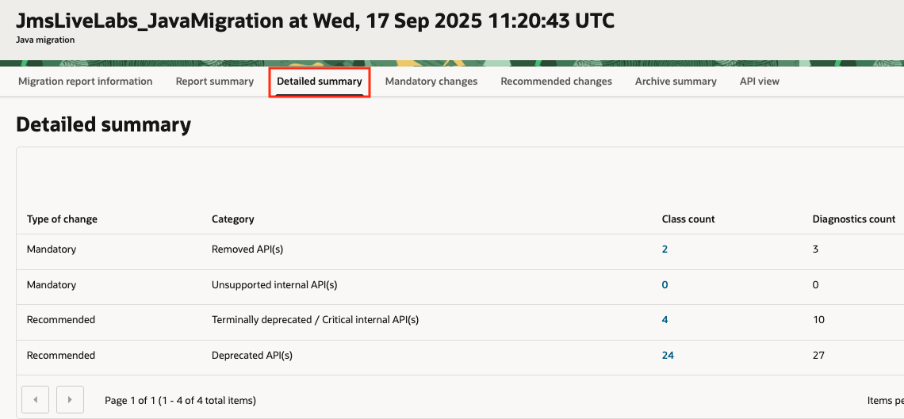
6. Click on the **Mandatory changes** tab to visualize the list of classes with mandatory changes.
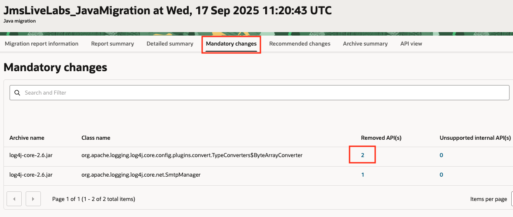
Clicking on the number of findings on **Removed API(s)** and **Unsupported internal API(s)** will visualize a detailed view of the affected APIS.
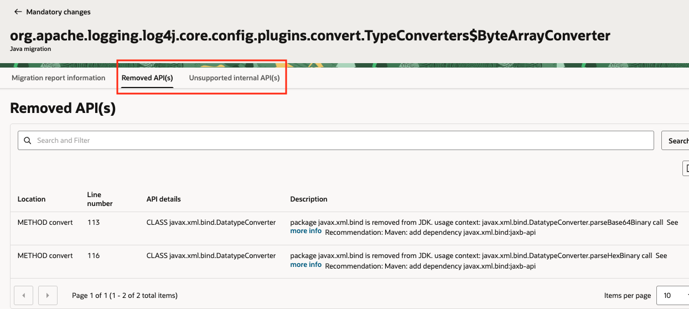
7. Click on the **Recommended changes** tab to visualize the list of classes with recommended changes.
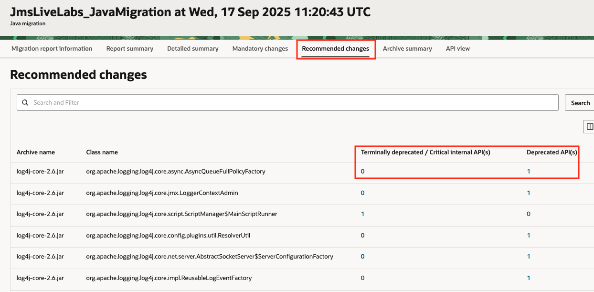
Clicking on the number of findings on **API columns** will visualize a detailed view of the affected APIS.
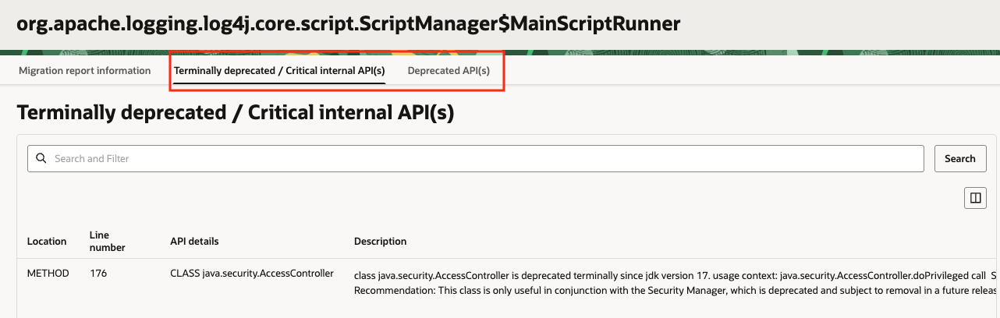
8. Click on the **Archive summary** tab to visualize the summary of API changes in the whole class archive (JAR, WAR, EAR, ZIP).
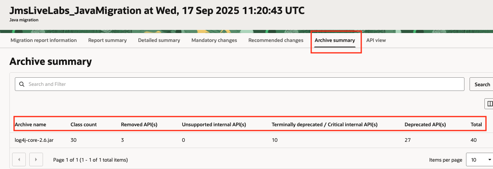
9. Click on the **API view** tab to visualize the summary of diagnostics per API change category.
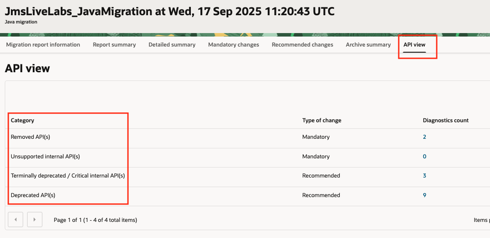
Clicking on the number links on the **Diagnostics count** column will navigate to an API occurrence details view.
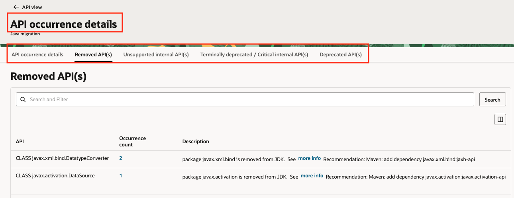
10. Clicking on **Occurrence count** will show details about the location where the API is used in the selected archive.
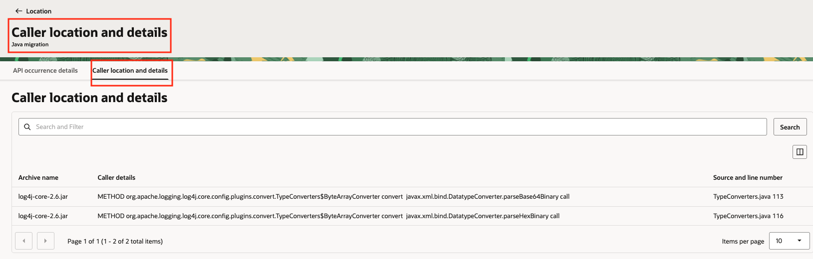

## Task 4: Download the Java Migration Analysis Result

1. In the Oracle Cloud Console, open the navigation menu, click **Observability & Management**, and then click **Overview** under **Java Management**.

2. In the **Analyze Applications** section, **Applications** tab, navigate to the **Analysis reports** section and click on the Analysis Result you generated in the previous Task.

3. In the **Migration report information** tab, click on the **Download** button next to **HTML report** to download a copy of the report to your local desktop.
4. Uncompress the downloaded archive and open the **index.html** file with a browser. You can navigate to visualize the report in an standalone HTML format.

## Task 5 (optional): Delete the Java Migration Analysis Result

1. In the Oracle Cloud Console, open the navigation menu, click **Observability & Management**, and then click **Overview** under **Java Management**.

2. In the **Analyze Applications** section, **Applications** tab, navigate to the **Analysis reports** section. Click on the three dots to the right of the report to be deleted and then click **Delete**. The report will be deleted from JMS and from your object storage bucket.
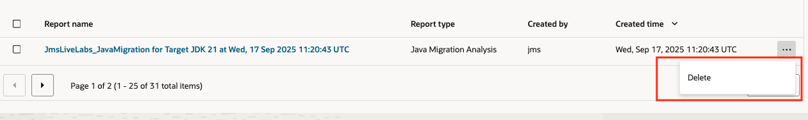

Congratulations, you have completed the lab. You may now [proceed to the next lab](#next).

## Learn More

* [Java Management Service](https://docs.oracle.com/en-us/iaas/jms/index.html)
* [Java Management Service - Java Migration Analysis](https://docs.oracle.com/en-us/iaas/jms/doc/java-migration-analysis.html)
* [Oracle JDK Migration Guide](https://docs.oracle.com/en/java/javase/25/migrate/index.html)

## Acknowledgements

* **Author** - Marcos Pindado, Java Management Service
* **Last Updated By** - Marcos Pindado, September 2025
