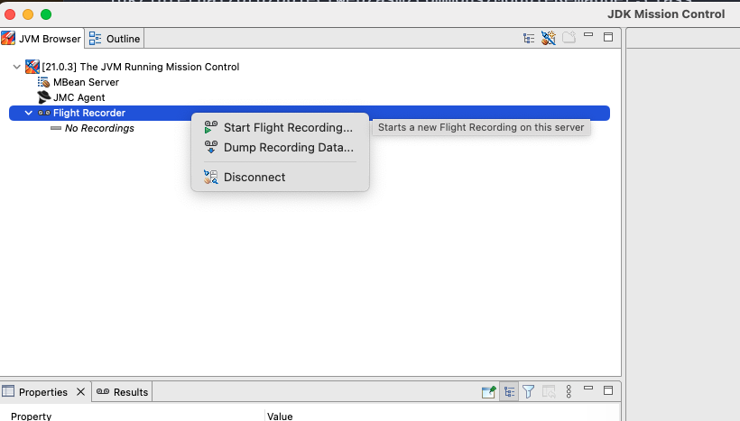
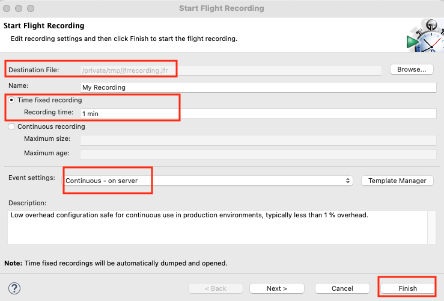
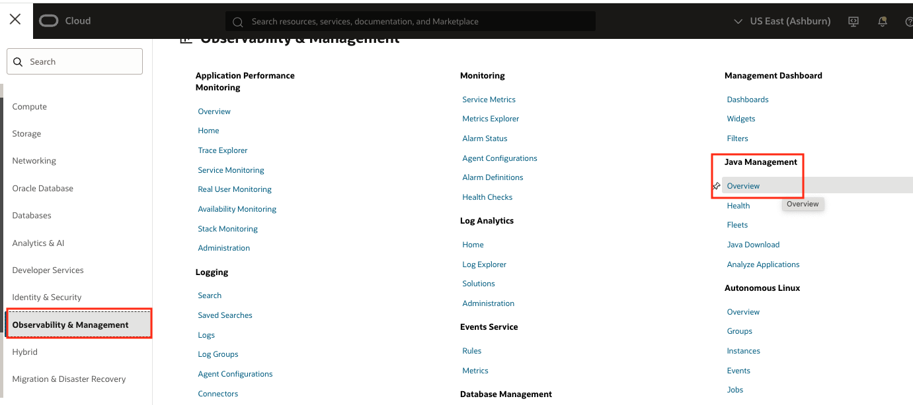
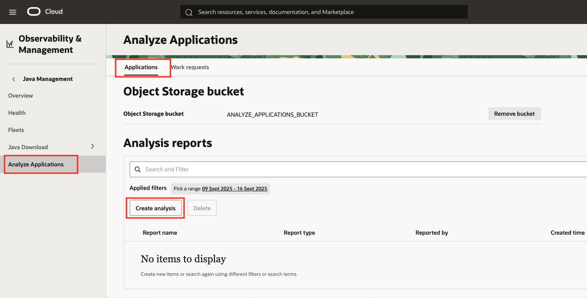
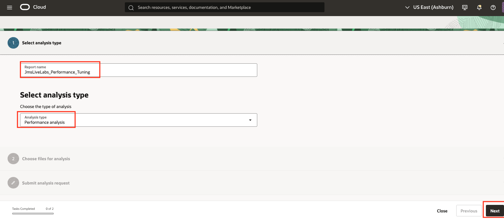
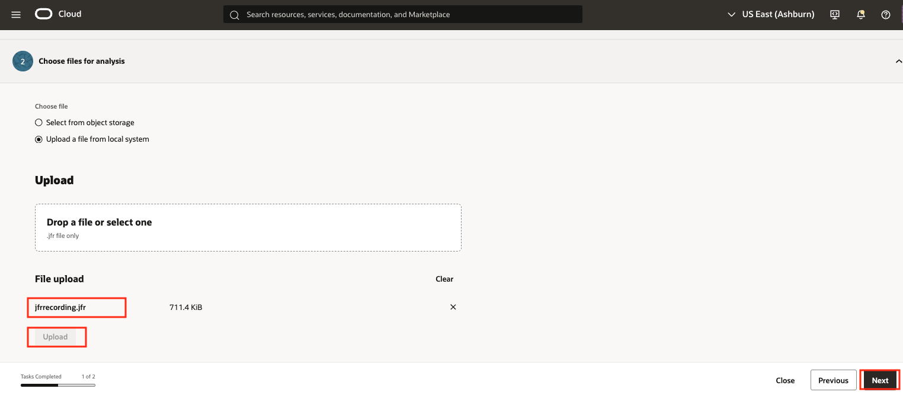
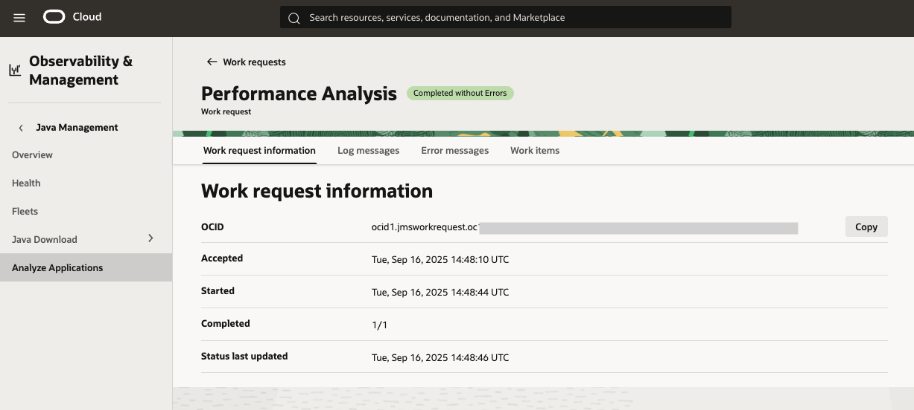
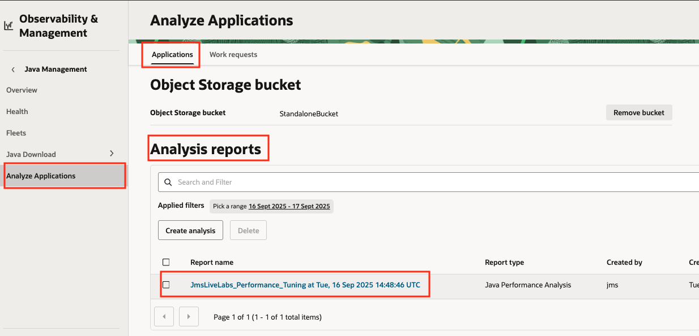
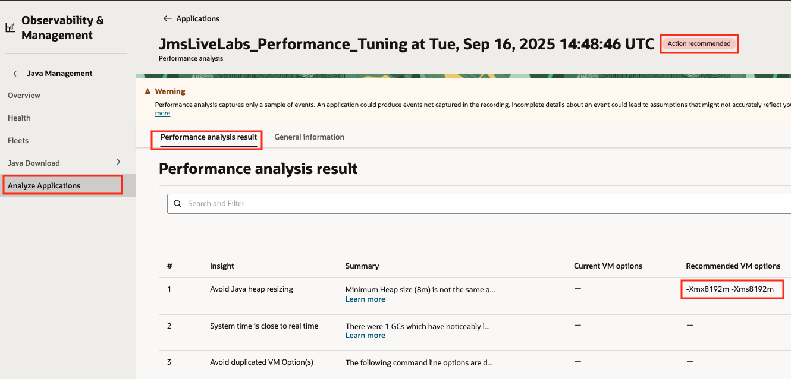
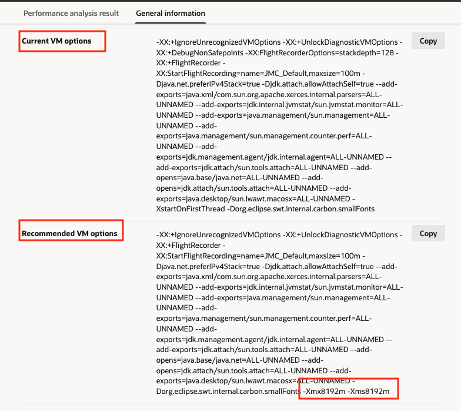

# Create Performance Analysis

## Introduction

The Performance Analysis feature allows you to obtain recommendations on how to run your Java application using insights obtained from a JFR recording of your application.

Estimated Time: 30 minutes

### Objectives

In this lab, you will:

* Learn about JFR recordings and how to generate them.
* Launch Performance Tuning Analyses.
* View and interpret the results from the Performance Tuning Analysis.

### Prerequisites

* You have signed up for an account with Oracle Cloud Infrastructure and have received your sign-in credentials.
* You have configured The Analyze Application feature using the **Setup Analyze Application on Java Management Service** [Lab](?lab=setup-analyze-applications-on-java-management-service).

## Task 1: Download and install Oracle JDK Mission Control

1. Download and install the corresponding version of [Oracle JDK Mission control](https://www.oracle.com/java/technologies/jdk-mission-control.html) for your desktop environment.

> **Note:** The Oracle JDK Mission Control is available under the Oracle Universal Permissive License Agreement.

## Task 2: Capture a JFR recording

1. Open the Oracle JDK Mission Control application.
2. Locate a running JVM in your system, it can be the very same JMC instance that you are executing.

3. Expand the application tree and right click on the Flight Recording node and click on **Start Flight Recording**.

4. Configure the recording settings: The output file name and location, the recording duration (1 min), the Event Settings (Continuous on Server) and click **Finish**.

   > **Note:** The default JFR profile should be enough to generate recommendations.

5. After the duration is elapsed, the JFR recording is displayed on the right panel of JMC.

## Task 3: Create a Performance Analysis in Java Management Service

1. In the Oracle Cloud Console, open the navigation menu, click **Observability & Management**, and then click **Overview** under **Java Management**.

2. In the **Analyze Applications** section, **Applications** tab, click on **Create Analysis** button.

3. In the form, introduce a report name, choose **Performance analysis** as analysis type and click Next.

4. Select **Upload a file from local system** and drop or select the JFR file generated in the [Task 2](#task-2-capture-a-jfr-recording). Click **Upload** to upload the file and then click Next.

5. Navigate to the **Work Requests** tab and visualize the Performance Analysis request. The request will progress and should be completed within a few minutes (typically 2 or 3).

6. Click on the specific work request to obtain information about its status, log and error messages and Work Items.

## Task 4: Visualize the Performance Analysis Result

1. In the Oracle Cloud Console, open the navigation menu, click **Observability & Management**, and then click **Overview** under **Java Management**.

2. In the **Analyze Applications** section, **Applications** tab, navigate to the **Analysis reports** section and click on the Analysis Result you generated in the previous Task.

3. In the **Performance Analysis** view, note the **Action recommended** status. In the **Performance Analysis result** tab, check each of the **Insights** produced by your JFR file. Each insight has a summary and a set of **Recommended VM options**.

4. Switch to the **General information** tab. Notice the two sets of options, **Current VM options** as the set of VM options used by your program and **Recommended VM options** recommended by the analysis.

## Task 5 (optional): Delete the Performance Analysis Result

1. In the Oracle Cloud Console, open the navigation menu, click **Observability & Management**, and then click **Overview** under **Java Management**.

2. In the **Analyze Applications** section, **Applications** tab, navigate to the **Analysis reports** section. Click on the three dots to the right of the report to be deleted and then click **Delete**. The report will be deleted from JMS and from your object storage bucket.

Congratulations, you have completed the lab. You may now [proceed to the next lab](#next).

## Learn More

* [Java Management Service](https://docs.oracle.com/en-us/iaas/jms/index.html)
* [Java Management Service - Performance Analysis](https://docs.oracle.com/en-us/iaas/jms/doc/performance-analysis-definition.html)
* [Oracle JDK Mission Control](https://www.oracle.com/java/technologies/jdk-mission-control.html)

## Acknowledgements

* **Author** - Marcos Pindado, Java Management Service
* **Last Updated By** - Marcos Pindado, September 2025
