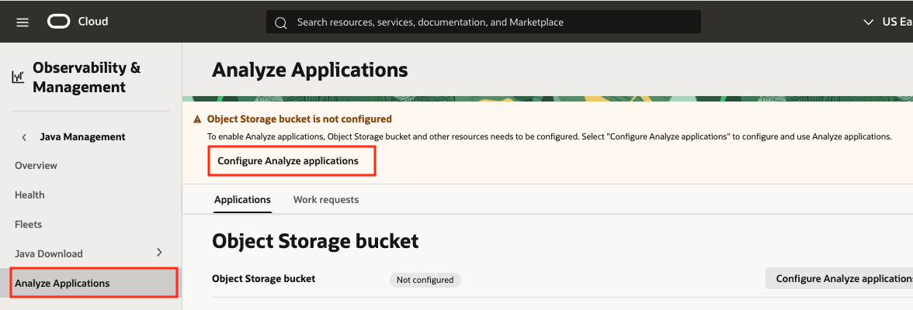
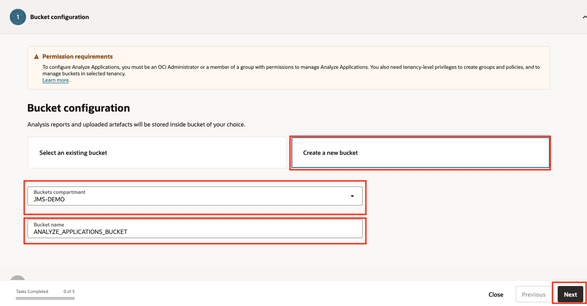
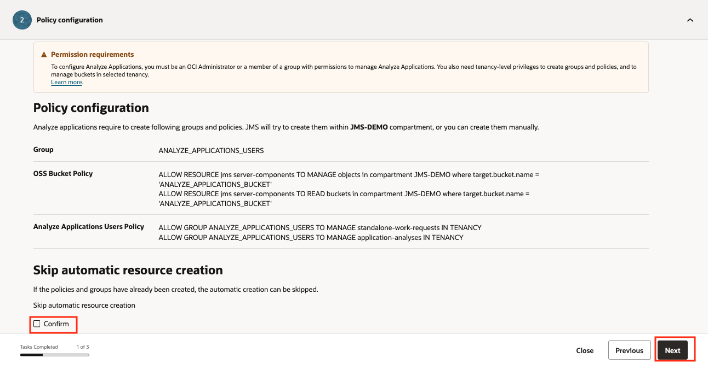
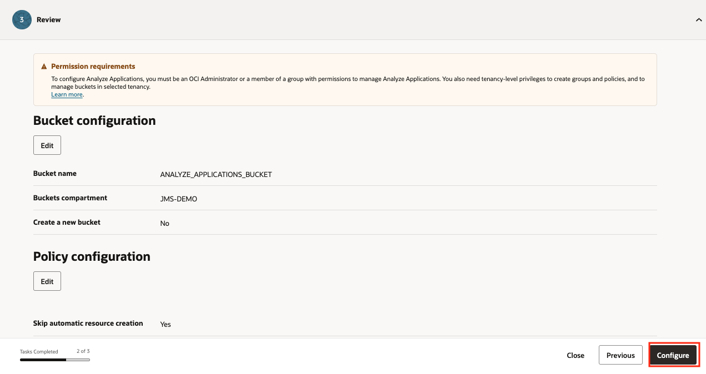
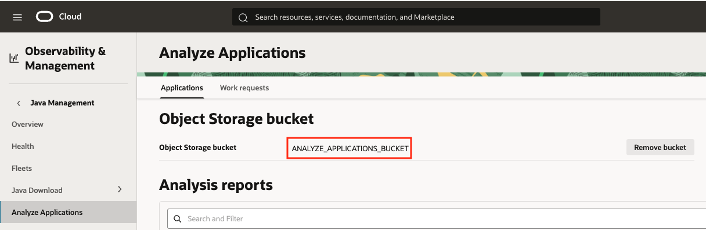
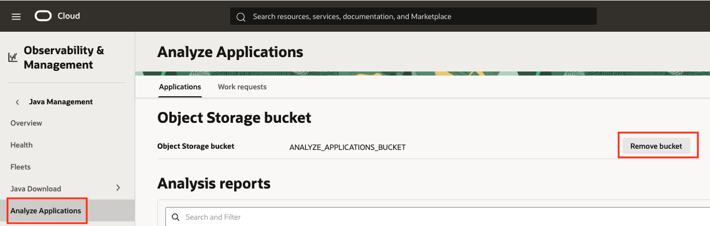
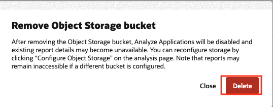
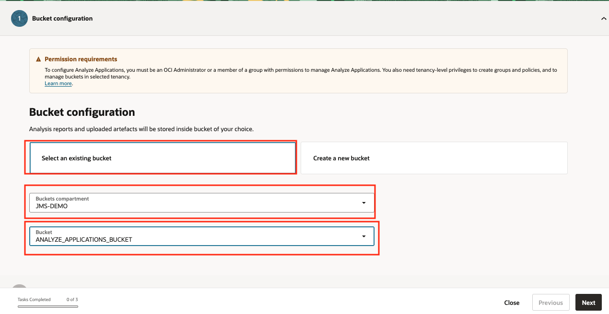

# Setup Analyze Application on Java Management Service

## Introduction

The Analyze Application feature makes use of an OCI Object Storage bucket to upload files to be analyzed and provide results.
The Java Management Service provides a wizard to create the necessary resources and permissions to use the feature.

Estimated Time: 10 minutes

### Objectives

In this lab, you will:

* Create an OCI Object Storage Bucket.
* Configure the necessary permissions.
* Configure the Analyze Applications Feature.

### Prerequisites

* You have signed up for an account with Oracle Cloud Infrastructure and have received your sign-in credentials.

## Task 1: Configure Java Management Service to use Analyze Applications Feature

1. In the Oracle Cloud Console, open the navigation menu, click **Observability & Management**, and then click **Overview** under **Java Management**.
   
2. Click on **Analyze Applications** and then on **Configure Analyze Applications** under the Analyze Applications Header.
   
3. In **Bucket Configuration** select **Create a new bucket** and choose a compartment and a Bucket name. Click next.
   
4. Review the policy configuration and leave the **Confirm** option (Skip automatic resource creation) unchecked. Click next.
   
5. Review the configuration and click **Configure**.
   
6. When the process is finished, check that the Analyze Applications feature is configured with the specified bucket.
   

## Task 2: Replace Object Storage Bucket (Optional)

1. In the Oracle Cloud Console, open the navigation menu, click **Observability & Management**, and then click **Overview** under **Java Management**.
   
2. Click on **Analyze Applications** and then on **Remove bucket** under the Object Storage bucket section.
   
3. On the confirmation screen, click **Delete**.

> **Note:** Only the bucket configuration is deleted, the bucket itself will continue to exist.

   
4. To create another bucket, follow the previous Task. To replace with an existing bucket, continue.
5. Click on  **Configure Analyze Applications** and then on **Select an existing bucket**. Select the compartment and the bucket.
   
6. Continue with the process as explained in the previous Task to replace the bucket configuration.

## Task 3: Assign users to utilize the Analyze Applications feature (Optional)

1. In the previous tasks, a group **ANALYZE\_APPLICATIONS\_USERS** is created in the tenancy. Optionally, assign users from the tenancy to the group, by following [Adding a User to a Group](https://docs.oracle.com/en-us/iaas/Content/Identity/users/assign-groups-user-account.htm).

Congratulations, you have completed the lab. You may now [proceed to the next lab](#next).

## Learn More

* Refer to the [Java Management Service Documentation](https://docs.oracle.com/en-us/iaas/jms/index.html).

## Acknowledgements

* **Author** - Marcos Pindado, Java Management Service
* **Last Updated By** - Marcos Pindado, September 2025
