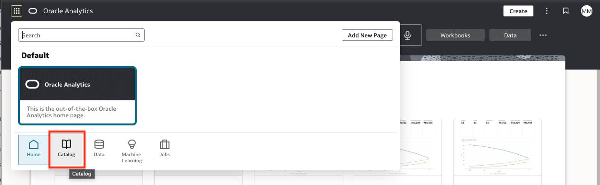
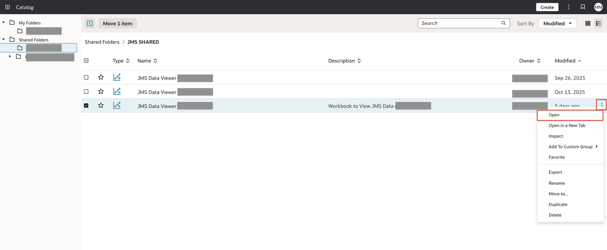
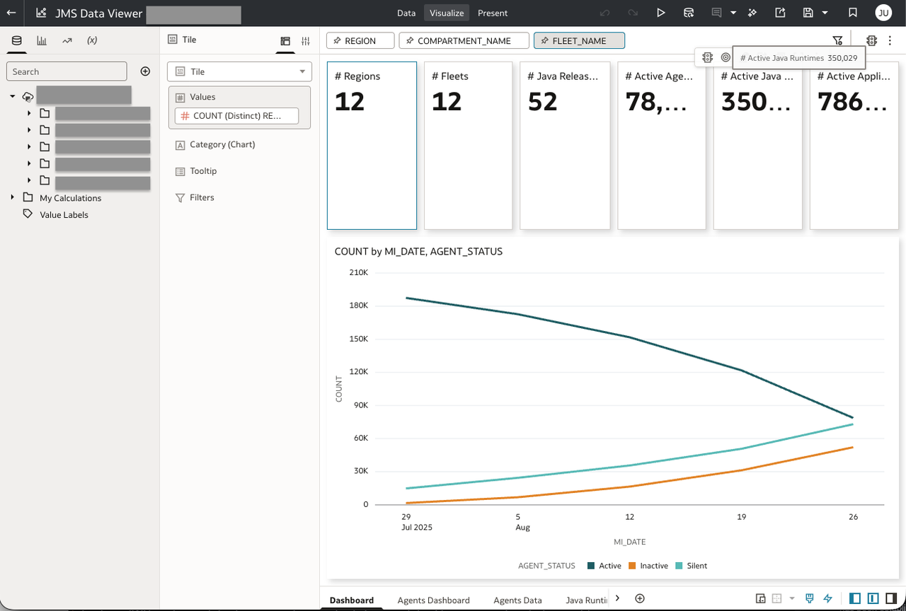
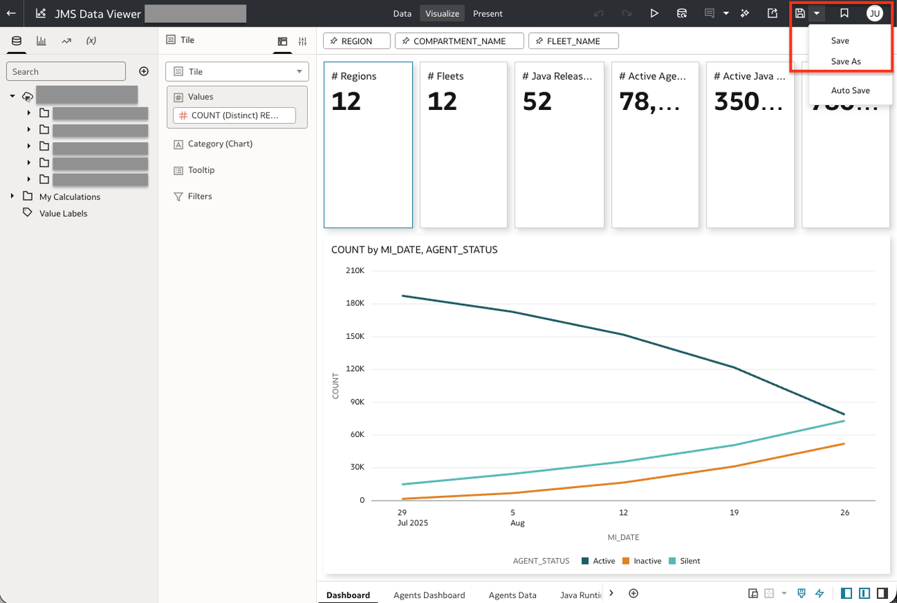

# Lab 6: Build a Custom Inventory Dashboard

## Introduction

In this lab, you will open the imported JMS inventory workbook in Oracle Analytics Cloud (OAC) and learn how to customize the dashboard to better visualize and analyze your Java inventory data.

*Estimated Time:* 10 minutes

### Objectives

* View the imported inventory workbook and understand its components.
* Customize the dashboard by modifying visuals, filters, or layout to meet your analysis needs.

### Prerequisites

* JMS inventory template imported into your OAC environment.
* Access to your OAC instance with permissions to view and edit dashboards.
* Connection to your Autonomous Database has been established.

## Task 1: View the Imported Inventory Workbook

1. Log in to your Oracle Analytics Cloud (OAC) environment.
2. From the home page, click **Catalog** in the navigation menu.
   
3. Find and open the JMS Inventory workbook you previously imported and click on it.
   
4. Explore the dashboard tabs, visualizations, and filters provided in the default template.
   

## Task 2: Customize the Inventory Dashboard

1. With the inventory workbook open, click **Edit** to enter dashboard editing mode.
   
2. Modify or add new visualizations (charts, tables, maps) to highlight metrics important to your use case.
3. Change filters, dashboard layout, colors, or visual properties to match your organization’s style or focus.
4. Save your changes as a new version or overwrite the existing workbook as needed.
   

## Next Steps

* Continue refining your dashboards and analytics based on feedback from stakeholders.
* Explore OAC’s advanced features, such as calculations, data flows, or automated insights.
* Proceed to the next lab for publishing and scheduling dashboards if available.

Congratulations, you completed the lab! You may now [proceed to the next lab](#next).

## Learn More

* [Build Reports and Dashboards](https://docs.oracle.com/en/cloud/paas/analytics-cloud/build-reports-and-dashboards.html)

## Acknowledgements

* **Author** - Maria Antonia Merino, Java Management Service
* **Last Updated By/Date** - Maria Antonia Merino, January 2026
