# Lab 7: Connect Oracle Analytics Cloud (OAC) to Autonomous AI Database

## Introduction

In this lab, you will configure Oracle Analytics Cloud (OAC) to connect to your Autonomous AI Database. This connection enables real-time analytics, dashboards, and reporting using data from your Autonomous AI Database instance.

*Estimated Time:* 10 minutes

### Objectives

* Configure OAC to securely connect to your Autonomous AI Database.
* Test the database connection from OAC.

### Prerequisites

* Autonomous AI Database instance available with appropriate privileges and credentials.
* Oracle Analytics Cloud (OAC) instance, set up in the prior labs.
* OAC user account with data modeling or connection privileges.

## Task 1: Prepare Autonomous AI Database Connection Credentials

1. In the Oracle Cloud Console, open the navigation menu, click **Oracle AI Database**, then select **Autonomous AI Database** .
   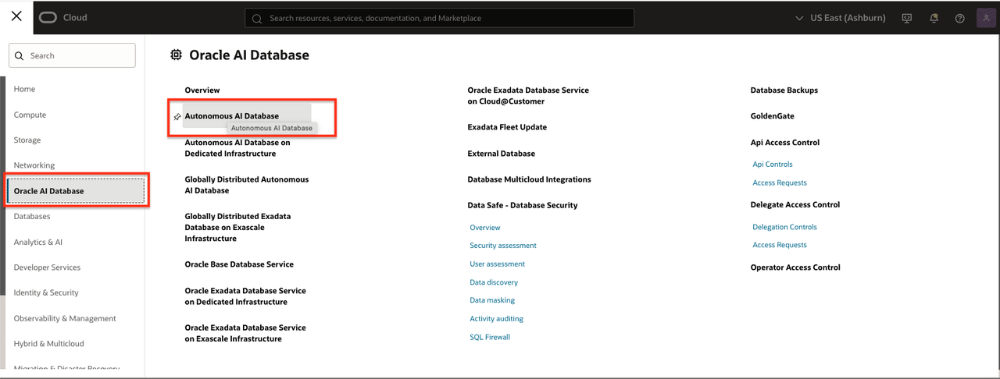
2. In the database list, locate your Autonomous AI Database and click the name to view its details.
   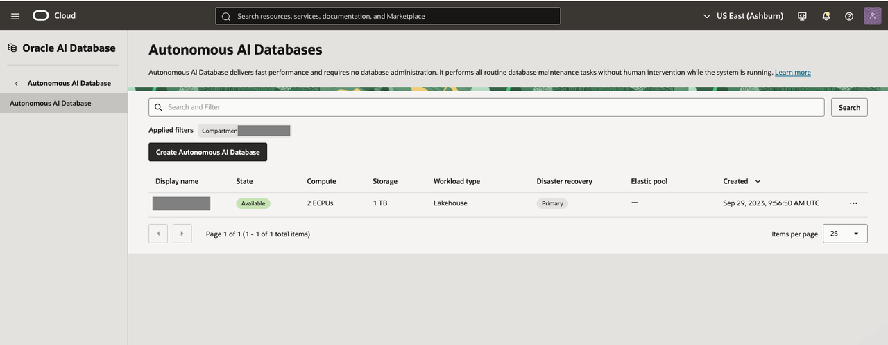
3. Click **Database Connection**
   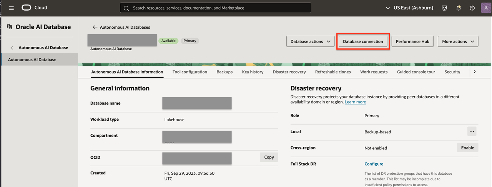
4. Click **Download Wallet** to start the download for the client credentials zip file.
   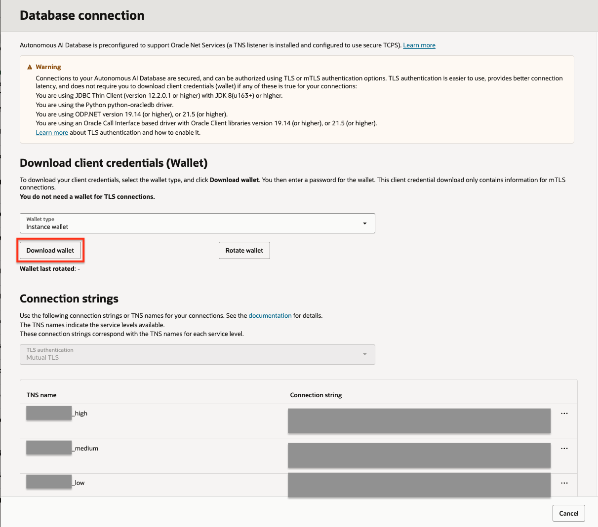
5. When prompted, create and enter a strong password in **Password** and **Confirm password** fields.
   *(You will use this password to access the wallet when configuring the OAC connection.)*
6. Click **Download** to save the wallet (.zip) file to your computer.
   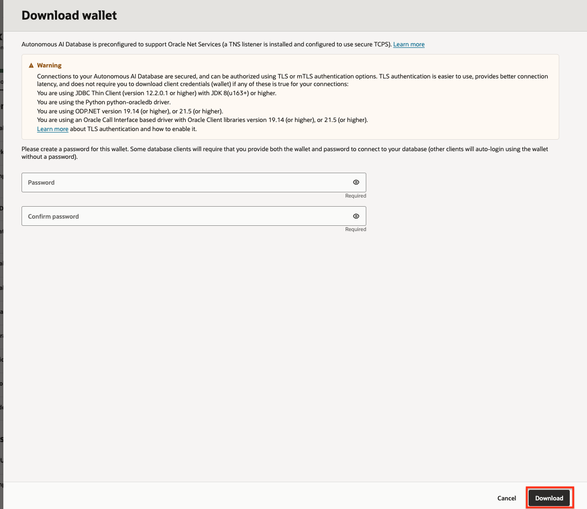

*Keep your downloaded wallet and password safe. You will use these in the next steps to connect OAC to your Autonomous AI Database.*

## Task 2: Create a Database Connection in OAC

1. On the OAC home page, click page menu in the upper left side.
2. Select **Data**.
   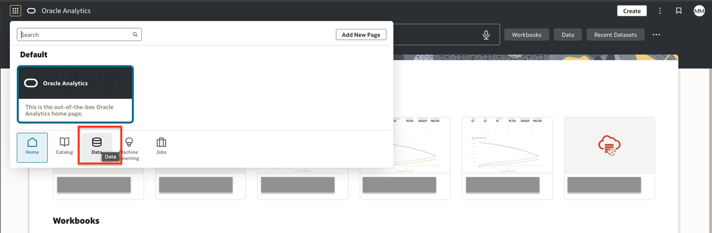
3. Over the imported connection, on the right side, click actions menu and click **Inspect** to view details.
   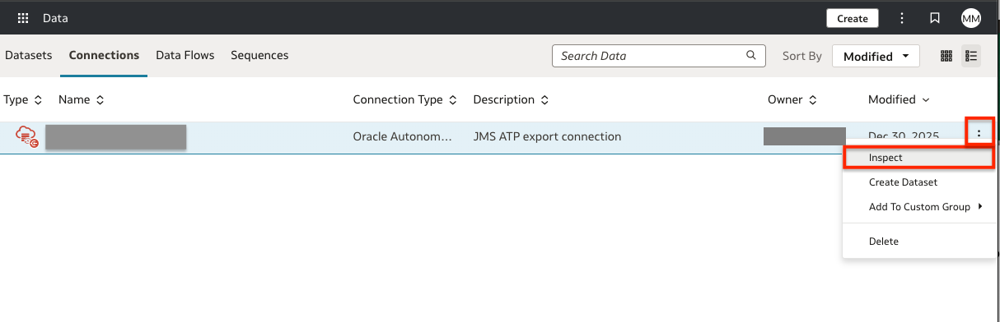
4. Complete the connection form:
   * **Connection Name**: Enter a name (e.g., `JMS_AAID_EXPORT`).
   * **Description**: (Optional) Add a brief description.
   * **Username**: Enter your database user (e.g., `JMS_EXPORT` or schema user).
   * **Password**: Enter your database user’s password.
   * **Client Credentials**: Upload the wallet (.zip) you downloaded earlier.
   * **Wallet Password**: Enter the password you set when downloading the wallet.
   * **Service Name**: Select the appropriate TNS alias for your workload (`HIGH`, `LOW`, or `TP`).
   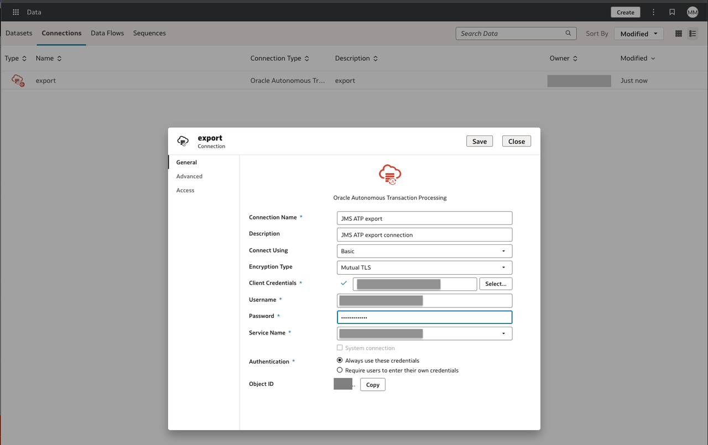
5. Click **Save** to create the connection.

## Task 3: Verify connection to AI Database reloading data

1. Go to Datasets.
2. Over the imported dataset, on the right side, click actions menu and click **Inspect** to view details.
   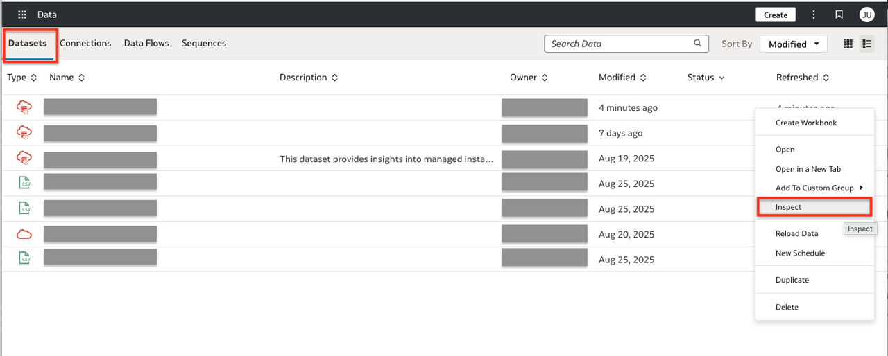
3. On the left panel click **Reload Data**.
4. Click the button **Run Now**.
   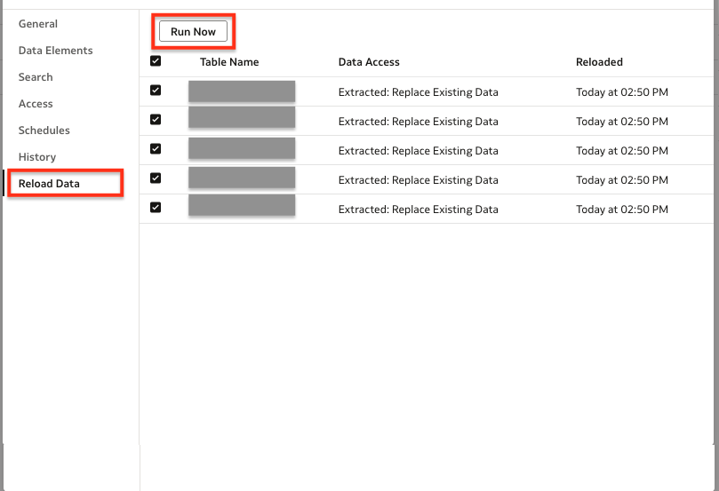
5. The Dataset is queued for reloading and will complete in the background. Click **Close**.
   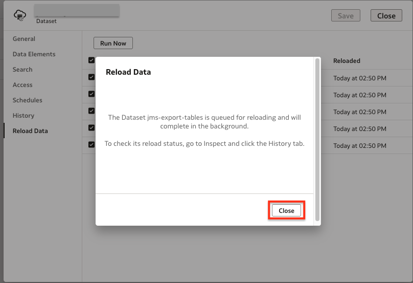
6. On the left panel click **History**. The Status could be **In Queue** or **Running**.
   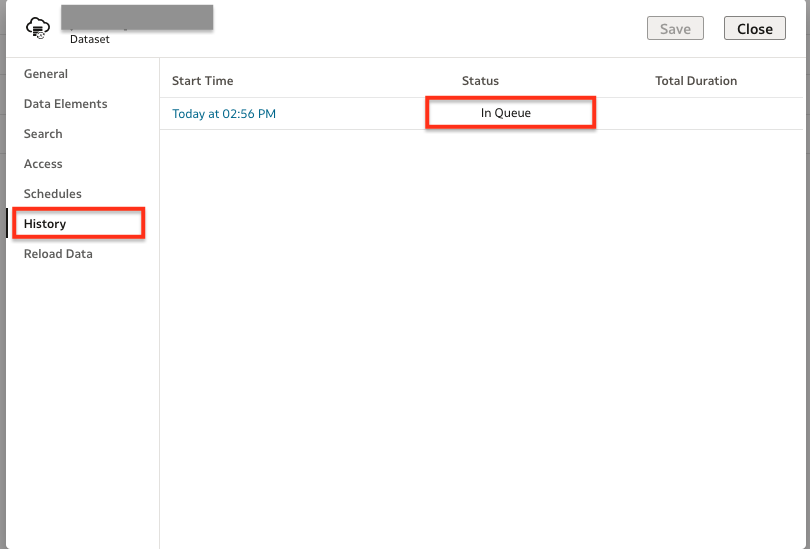
7. Wait until the execution ends and the status is **Completed**.
   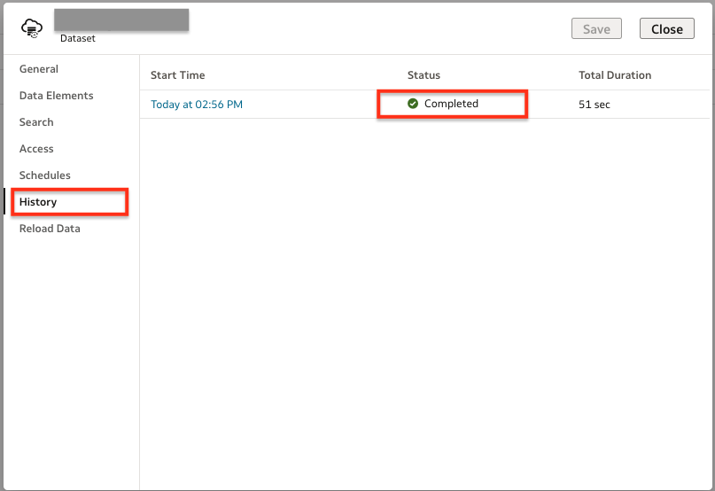

## Next Steps

* Use the established connection to create interactive workbooks and dashboards.
* Explore available Autonomous AI Database tables and columns to design your analytics.
* Proceed to the next lab to further refine and customize your analytics environment.

Congratulations, you completed the lab! You may now [proceed to the next lab](#next).

## Learn More

* [Connect to Oracle Autonomous AI Transaction Processing](https://docs.oracle.com/en/cloud/paas/analytics-cloud/acsds/connect-oracle-autonomous-transaction-processing.html)

## Acknowledgements

* **Author** - Maria Antonia Merino, Java Management Service
* **Last Updated By/Date** - Maria Antonia Merino, January 2026
