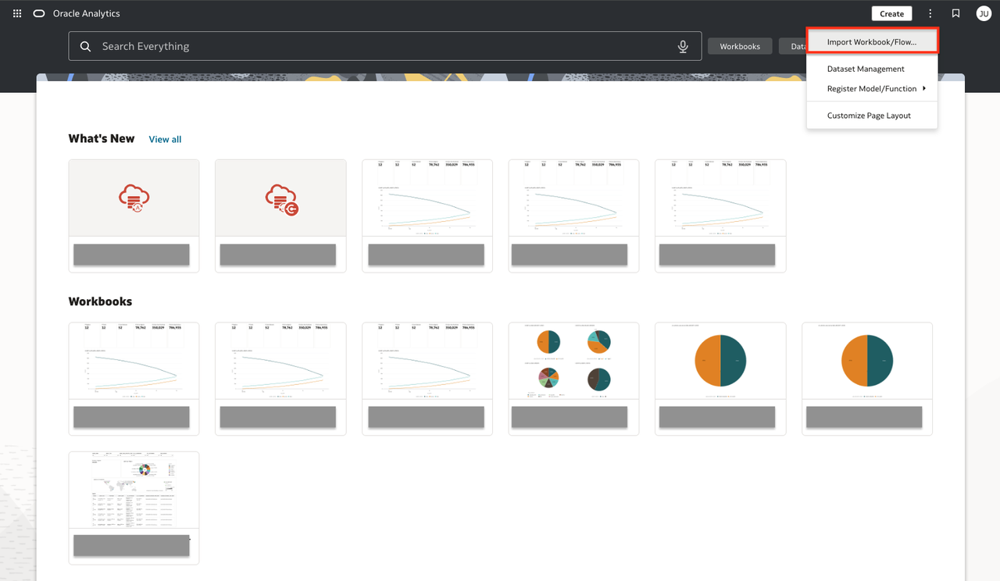
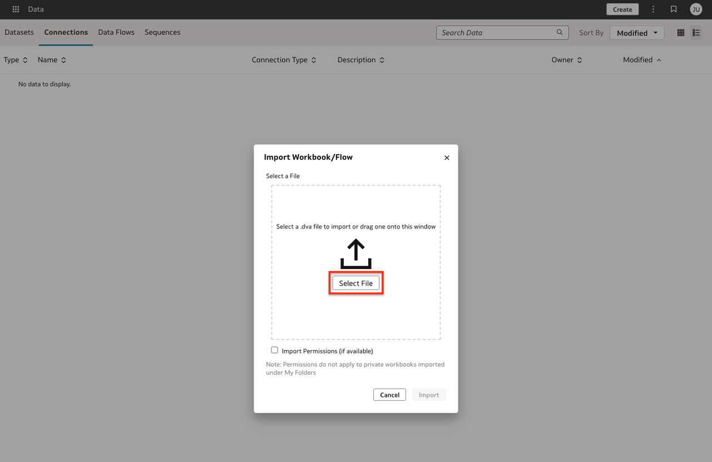
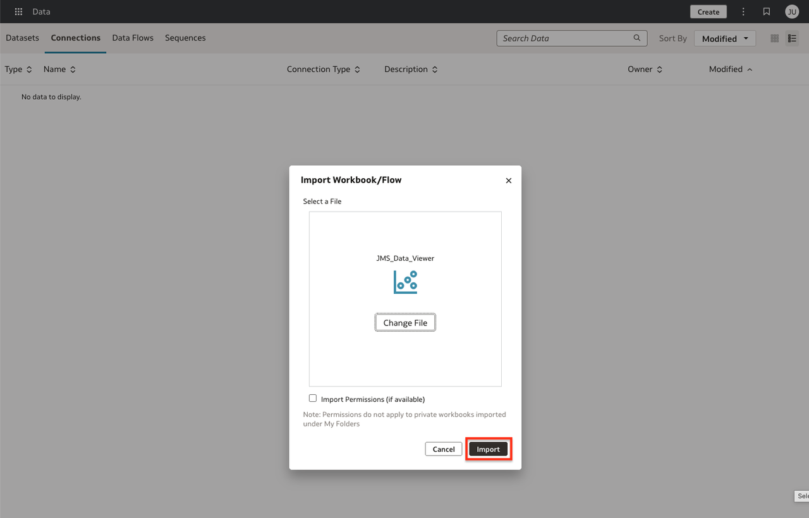
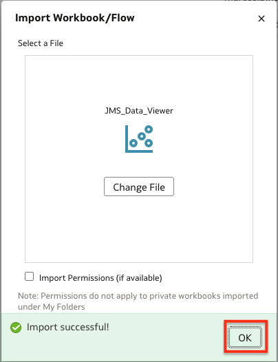

# Lab 4: Import JMS OAC Template

## Introduction

In this lab, you will connect to your Oracle Analytics Cloud (OAC) environment and import a pre-built analytics workbook template that accelerates your analysis of Java Management Service (JMS) data.

*Estimated Time:* 5 minutes

### Objectives

* Import the provided JMS OAC analytics template.

### Prerequisites

* All previous labs completed, especially [Lab 3: Oracle Analytics Cloud Instance Setup](?lab=oac-instance-setup) (OAC instance, user, and custom role must be set up).
* Credentials for an OAC user who has the "Author" (or equivalent) application role assigned which enables importing and editing workbooks.
* Access to the JMS OAC template file (`.DVA` or `.zip`) provided.

## Task 1: Access Your OAC Instance

1. In the Oracle Cloud Console, open the navigation menu, click **Analytics & AI**, then under **AI Data Platform** select **Analytics Cloud**.
   
2. On the Analytics Cloud page, select your OAC instance.
   
3. Under **Access Information**, click the OAC instance URL to launch OAC in your browser.
   
4. Sign in with the user created and assigned the appropriate role in [Lab 3: Oracle Analytics Cloud Instance Setup](?lab=oac-instance-setup).
   

## Task 2: Download the JMS OAC Template

You must download the JMS Data Viewer OAC template to your local computer.

[Download JMS Data Viewer](https://c4u04.objectstorage.us-ashburn-1.oci.customer-oci.com/p/EcTjWk2IuZPZeNnD_fYMcgUhdNDIDA6rt9gaFj_WZMiL7VvxPBNMY60837hu5hga/n/c4u04/b/livelabsfiles/o/labfiles/jms_data_viewer.dva)

The JMS Data Viewer (.dva) file provides pre-built dashboards for visualizing Java Management Service data in Oracle Analytics Cloud. Save it in an accessible location to use in the next step.

## Task 3: Import the JMS OAC Workbook Template

1. On the OAC home page, locate and click the **Page Menu** (three dots or lines, usually upper-right).
2. Select **Import Workbook/Flow**.
   
3. Click **Select File**, then locate and select the provided JMS OAC template file (`.DVA` or `.zip`).
   
4. Click **Import**.
   
5. When the "Import successful" message appears, click **OK**.
   

## Next Steps

You have now imported the JMS OAC workbook template. You can:

* Update the data connection settings to point to your own Autonomous Database instance or schema.

Congratulations, you completed the lab! You may now [proceed to the next lab](#next).

## Learn More

* [Import, Export, and Share](https://docs.oracle.com/en/cloud/paas/analytics-cloud/acubi/import-export-and-share.html)

## Acknowledgements

* **Author** - Maria Antonia Merino, Java Management Service
* **Last Updated By/Date** - Maria Antonia Merino, January 2026
