# Lab 2: JMS Data Export Integration with Autonomous AI Database

## Introduction

In this lab, you will configure Java Management Service (JMS) on Oracle Cloud Infrastructure (OCI) to export inventory, Java runtime, application, and managed instance data to an Autonomous AI Database. This database is essential for integrating with Oracle Analytics Cloud (OAC) in subsequent labs.

*Estimated Time:* 15 minutes

### Objectives

* Provision an Autonomous AI Database instance.
* Create a database user/schema for JMS export.
* Download Autonomous AI Database credentials and wallet.
* Configure JMS to export data to Autonomous AI Database.
* Validate and troubleshoot the export process.

### Prerequisites

* JMS Fleet and Managed Instance setup complete.
* Permissions to create/modify Autonomous AI Database and access OCI resources.
* Access to Oracle Cloud Console and SQL Developer/Database Actions.

## Task 1: Provision an Autonomous AI Database

1. In the Oracle Cloud Console, open the navigation menu, click **Oracle AI Database**, then select **Autonomous AI Database** .
   
2. Click **Create Autonomous AI Database**. In the form, fill out:
    * **Display Name**: Enter a unique, descriptive name for your database (e.g., `jmsexporttargetdb`)
    * **Database Name**: Use the same or a similarly concise name (e.g., `jmsexporttargetdb`)
    * **Compartment**: Select the compartment where the database should be created
    * **OCPU Count**: Choose the number of CPUs (e.g., `1 OCPU`)
    * **Storage**: Specify the storage size (e.g., `1 TB`)
    * **Workload Type**: Select **Transaction Processing**
    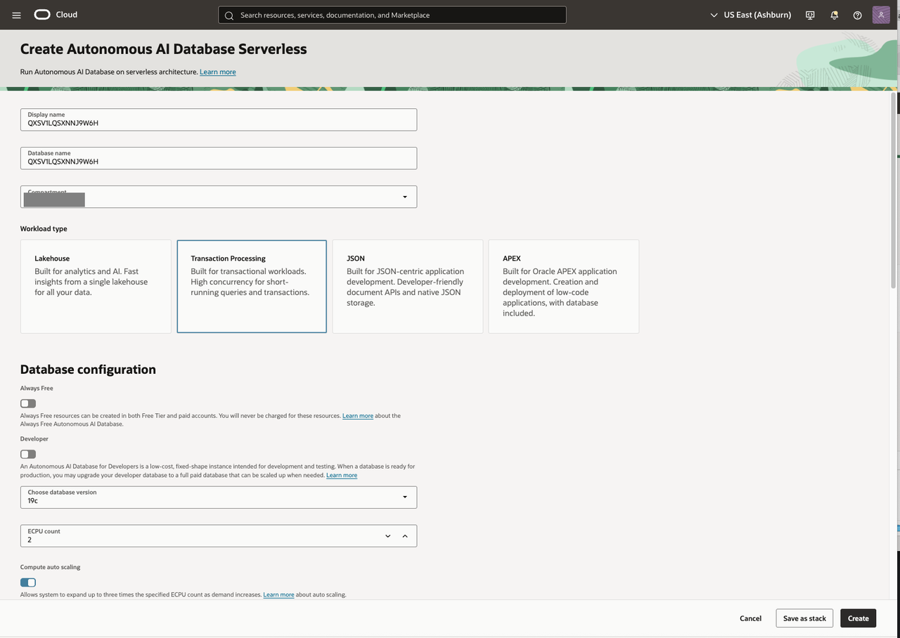
    * Continue by filling in additional configuration options displayed in the wizard.
    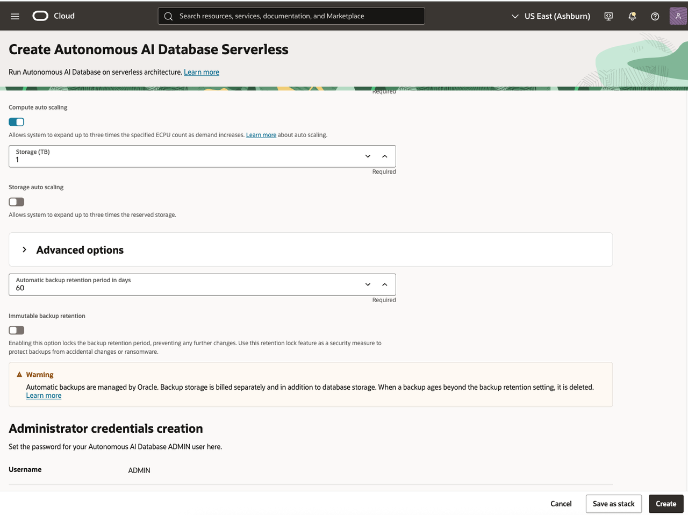
    * Review and click **Create**.
    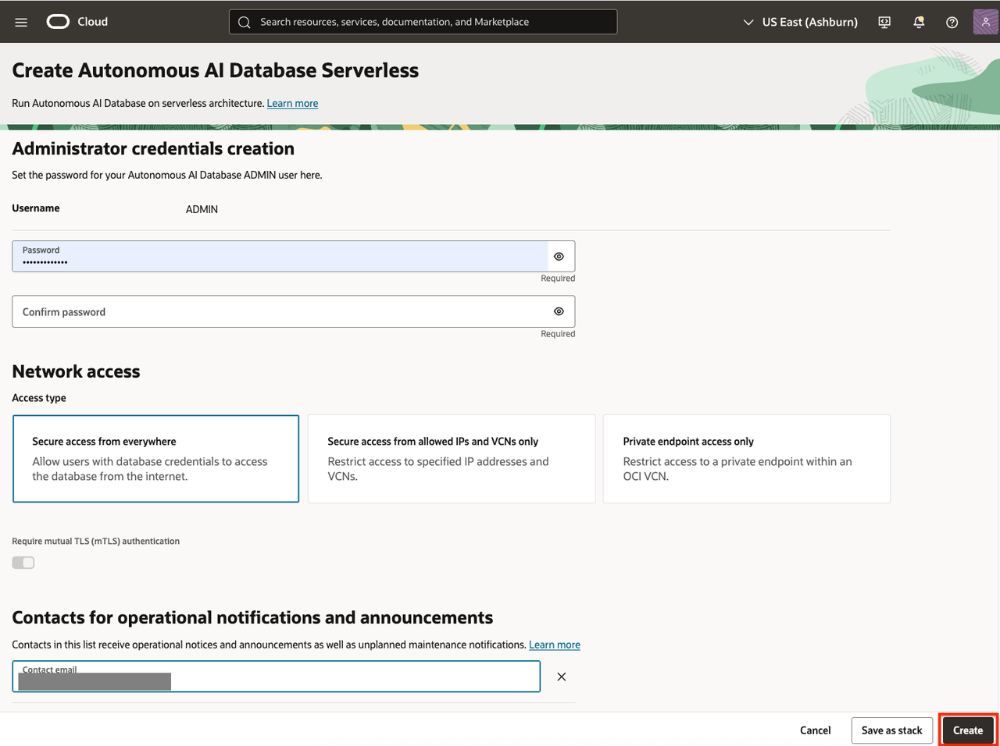
3. Wait until the status of your Autonomous AI Database is **Available**.
   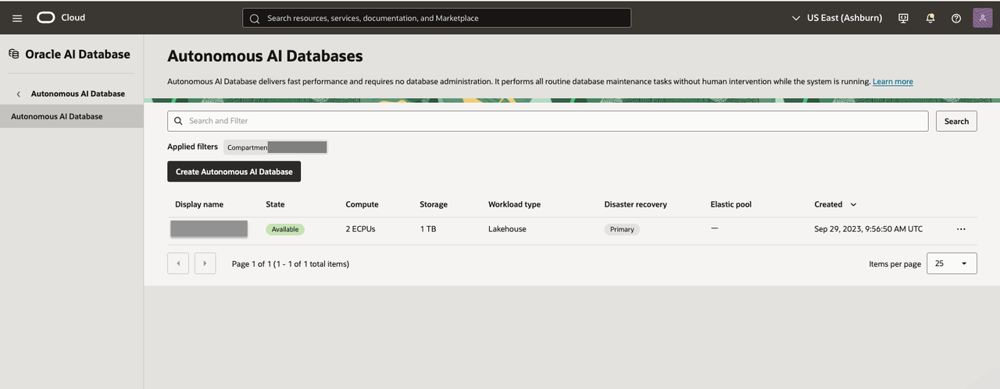

## Task 2: Create a Database User for JMS Export

1. Go to your Autonomous AI Database instance page. Click **Database Actions** and then select **Database Users**.
   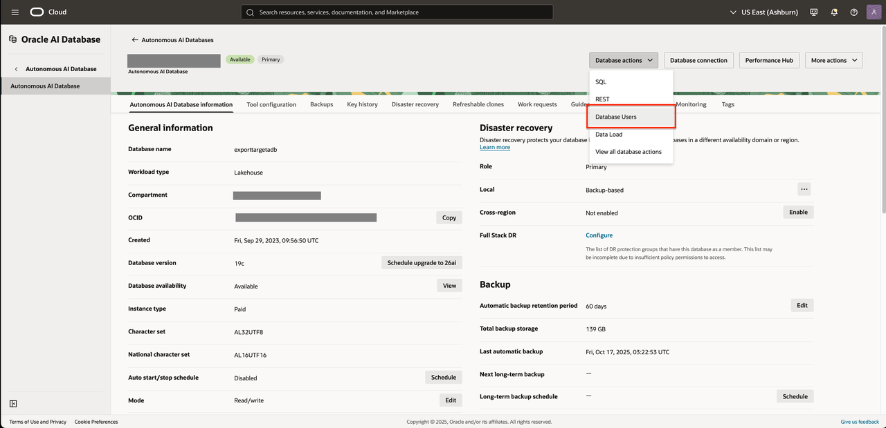
2. Click on **Create User**.
   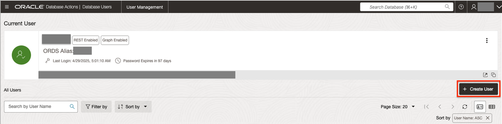
3. In the User tab, complete the form:
   * **User Name**: enter a clear, lowercase username (e.g., `jms_export`)
   * **Password**: supply a strong password
   * **Confirm Password**: enter it again
   * **Quota on tablespace DATA**: enter `unlimited` or your organization’s policy
   * (Optional advanced) Enable:
     * **Graph**: checked if you want graph features
     * **OML**: for Oracle Machine Learning
     * **REST, GraphQL, MongoDB API, Web access**: check as needed
   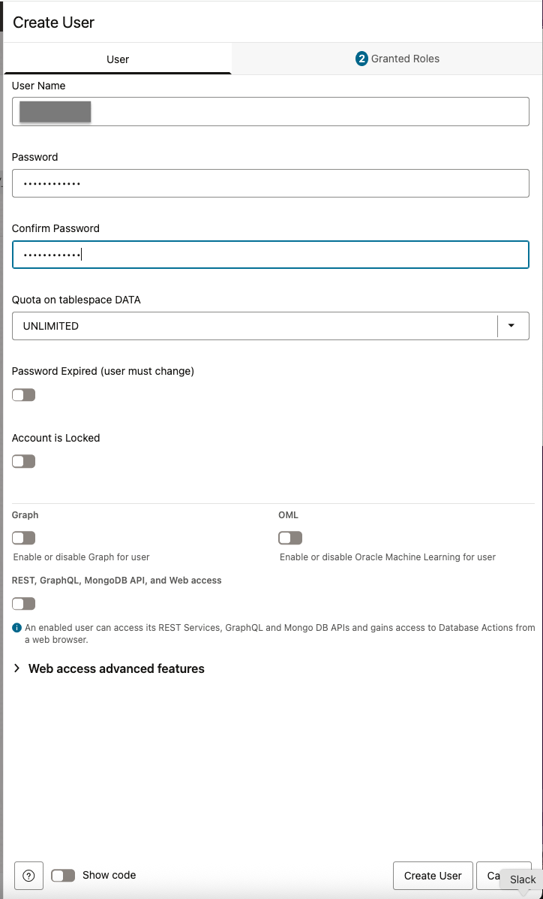
4. Click **Create User**.
   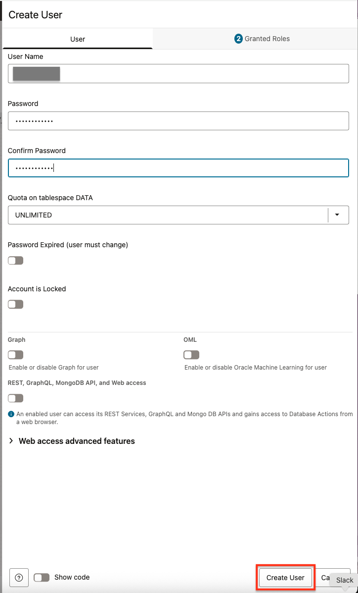
5. Confirm your user appears in the **User Management** listing.
   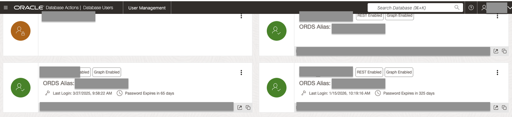

## Task 3: Grant permissions and modify some config settings for the user previously created

1. Go to your Autonomous AI Database instance page. Click **Database Actions** > **SQL** to access the SQL Worksheet.
    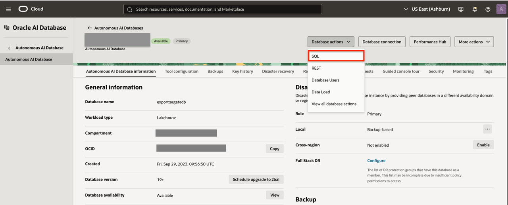
2. Connect using the **ADMIN** account.
3. Run the following SQL code to create the export user:

   ```sql
    <copy>
    GRANT EXECUTE ON DBMS_CLOUD_PIPELINE TO [database_user];
    GRANT READ,WRITE ON DIRECTORY DATA_PUMP_DIR TO [database_user];
    GRANT CREATE JOB TO [database_user];
    EXEC DBMS_CLOUD_ADMIN.ENABLE_RESOURCE_PRINCIPAL(username => '[database_user]');
    </copy>
   ```

   > Replace `[database_user]` for the username previously created.

   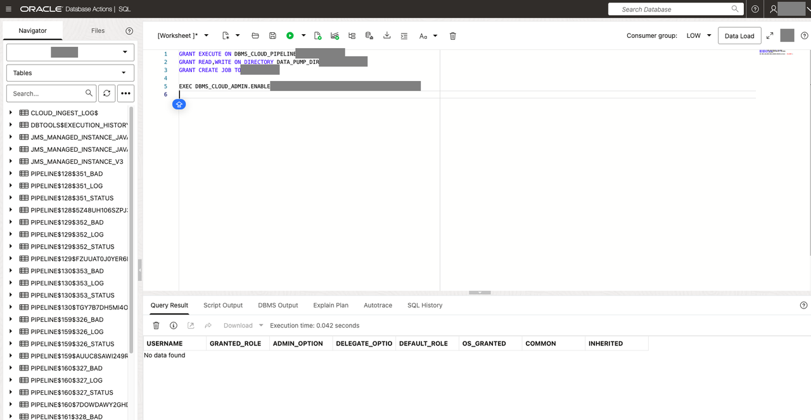

## Task 4: Create policy for database to read CSV files from bucket

* You can follow [Export Data to Autonomous Database](https://docs.oracle.com/en-us/iaas/jms/doc/set-and-run-load-pipelines-exported-data.html#GUID-3A872067-D563-406B-BF7A-AD716A7FEFA2) and create a dynamic group with policies (steps 3 and 4).
* If you have no permissions to create groups, you can create a policy in a root compartment for concrete autonomous database by OCID.

1. In the Console, open the navigation menu, click **Identity & Security**. Under Identity, click **Policies**.
   
2. Click **Create policy**. In the form, fill out:
    * **Name**: Type a concise, memorable policy name (e.g., `jms_export`)
    * **Description**: Clearly state the policy's intent, such as:  `Policy required for JMS Fleets to export data to object storage`
    * **Compartment**: Pick the same compartment where your database and export bucket reside
3. Click **Show Manual Editor**.
   
4. Copy and paste the following policy (edit placeholders accordingly):

   ```text
    <copy>
    ALLOW any-user TO READ objects IN compartment [compartment_name] where request.principal.id='[ocid_autonomous_ai_database]'
    </copy>
    ```

   > Replace `[compartment_name]` which the compartment name where is the bucket where configure the JMS data exports and `[ocid_autonomous_ai_database]` with the ocid of the autonomous AI database previously created.

5. Click **Create**.
   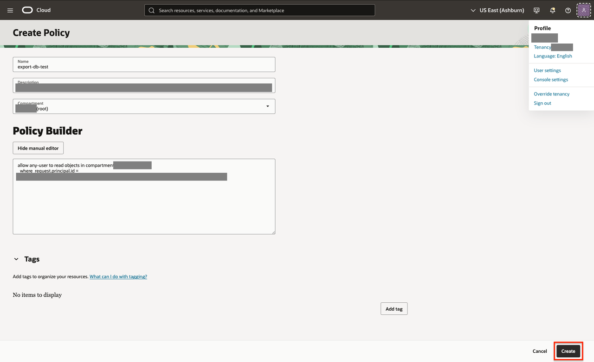

## Task 5: Configure JMS Data Export to Autonomous AI Database

1. Go to your Autonomous AI Database instance page. Click **Database Actions** > **SQL** to access the SQL Worksheet.
   
2. Connect using the **[database_user]** account, where `[database_user]` is the username of the database user previously created.
3. Open the Autonomous Database load pipeline script you downloaded in **Integrate Oracle Analytics Cloud with Java Management Service**, on the last step of [Task 4](?lab=jms-fleet-data-to-object-storage#Task4:ConfigureDataExportforyourfleet): **Configure Data Export for your fleet**.
4. Copy the script onto the SQL worksheet and execute it.
   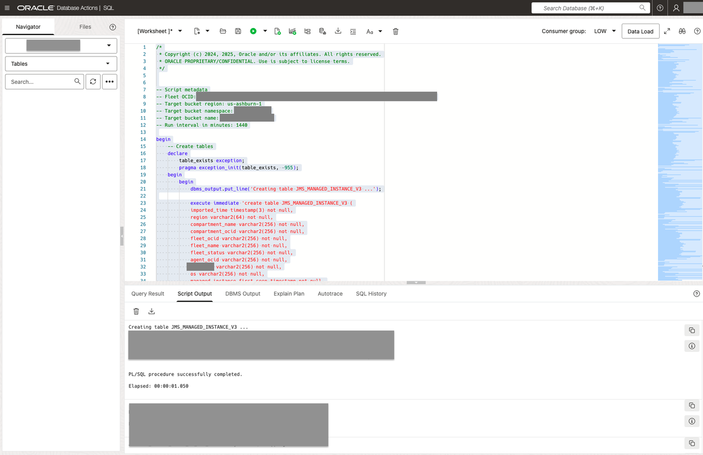

## Task 6: Validate Export Configuration

1. Go to your Autonomous AI Database instance page. Click **Database Actions** and select **View All Database Actions** to check your pipelines were created successfully.
   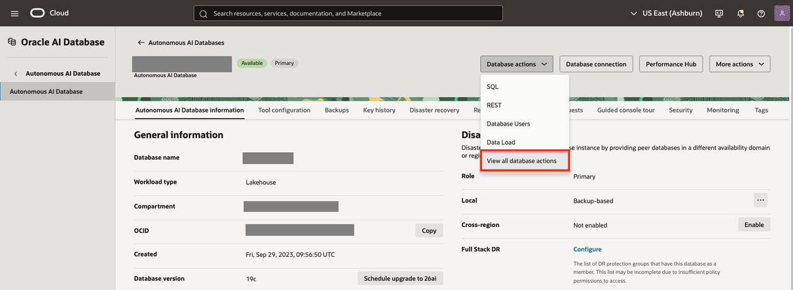
2. Navigate to the **Development** tab.
3. Click on **Scheduling**
   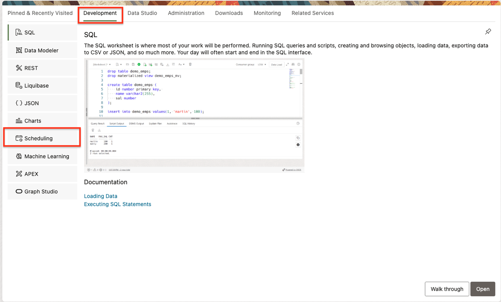
   * Your pipelines (named in the format PIPELINE$xxx)
   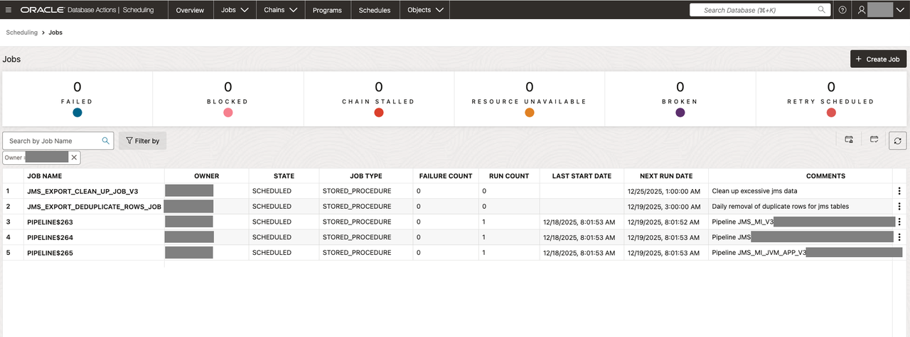
4. Click Selector to display the navigation menu. Under Development, select **SQL**
   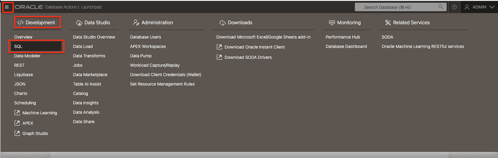
5. On Navigator tab select your schema, it was created in [Task 2](#Task2:CreateaDatabaseUserforJMSExport) (e.g, `jms_export`)
   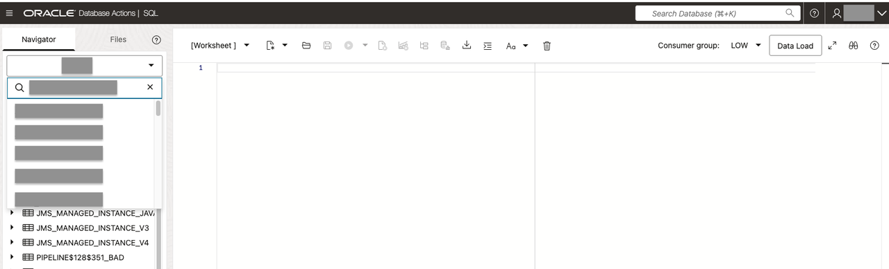
   * It will display saved objects for the selected schema.
   * Pipeline script created 3 new tables:
      * JMS\_MANAGED\_INSTANCE\_JAVA_RUNTIME\_APPLICATION\_V3
      * JMS\_MANAGED\_INSTANCE\_JAVA\_RUNTIME\_V3
      * JMS\_MANAGED\_INSTANCE\_V3
    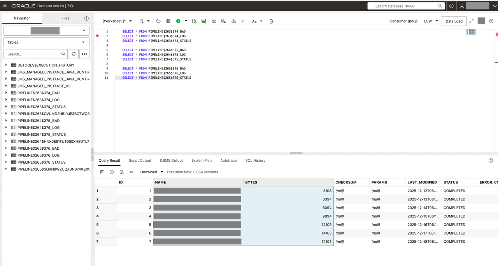
   * Ensure values are present in the table associate with the export option. If you selected resources **Managed instances, Java runtimes, applications** your date will be present on table JMS\_MANAGED\_INSTANCE\_JAVA\_RUNTIME\_APPLICATION\_V3.
   * Check that are not issue on $BAD, $STATUS and $LOG tables that are identified by your user.

## Learn More

* [Export Data to Autonomous Database](https://docs.oracle.com/en-us/iaas/jms/doc/set-and-run-load-pipelines-exported-data.html)

## Next Steps

Set up Oracle Analytics Cloud (OAC) and connect it to the exported JMS data in Autonomous AI Database.

Congratulations, you completed the lab! You may now [proceed to the next lab](#next).

## Acknowledgements

* **Author** - Maria Antonia Merino, Java Management Service
* **Last Updated By/Date** - Maria Antonia Merino, January 2026
