# Export JMS Fleet Data to Object Storage

## Introduction

This comprehensive lab guides you through:

* Create an Object Storage bucket.
* Configure data export from JMS Fleet to Object Storage.

Export JMS fleet data to Object Storage allows for easy analysis and collaboration, especially with administrators who do not have direct access to OCI or JMS. This feature streamlines data sharing and enables convenient loading of exported data into an Autonomous Database for further processing.

*Estimated Time:* 15 minutes

### Objectives

* Create and verify an Object Storage bucket for exports.
* Configure Fleet export policies and export settings.
* Validate the setup with troubleshooting steps.

### Prerequisites

* OCI account with required permissions.
* Access to necessary compartments for JMS, Object Storage, and policy management.
* (Optional) Management Agent deployed on instance.

## Task 1:  Create a Bucket

1. In the Oracle Cloud Console, open the navigation menu, click **Storage**, then select **Buckets** under **Object Storage & Archive Storage**.
   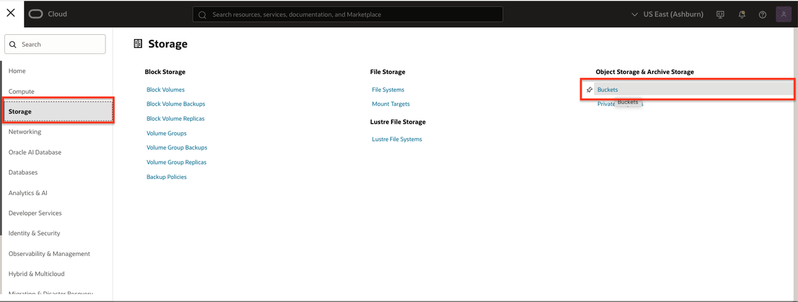
2. Choose the compartment where you wish to store JMS export data (e.g., `Fleet_Compartment`).
   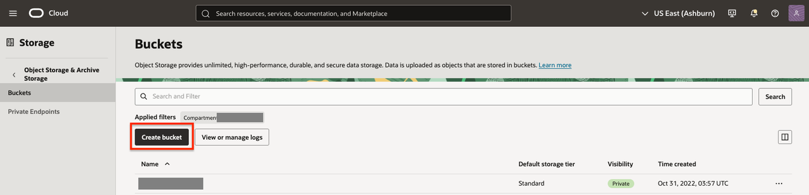
3. Click the **Create bucket** button.
4. In the form, enter a **Bucket name** following your team's naming policy (e.g., jms-export)
   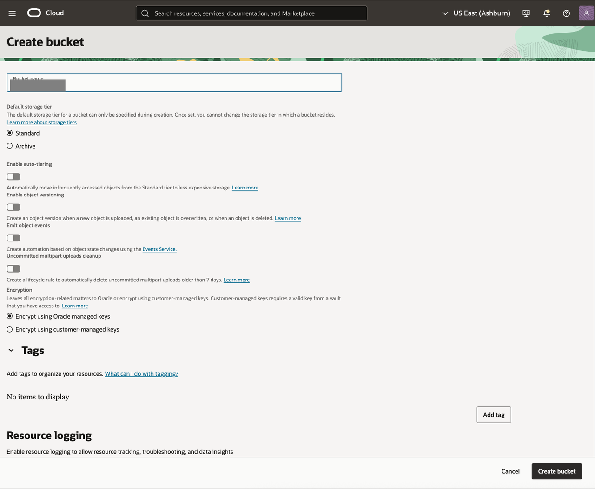
5. Click **Create bucket** to confirm creation.
   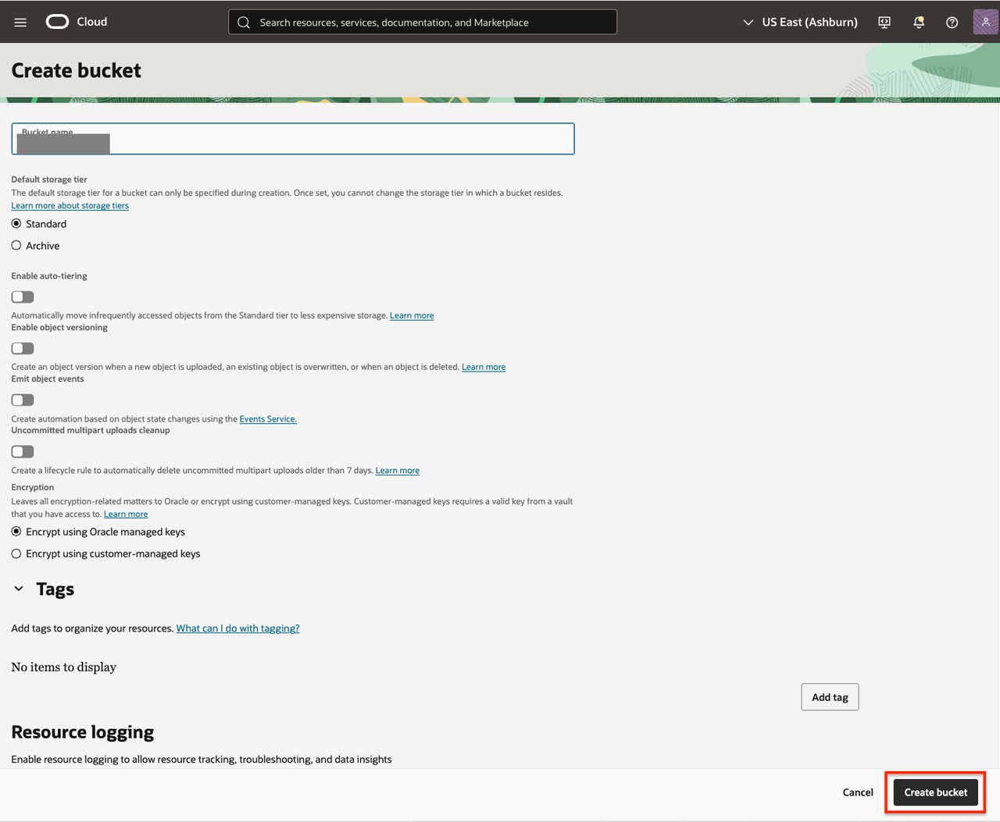

## Task 2: Verify Bucket Creation

1. Ensure your new bucket appears in the bucket listing for the selected compartment.
  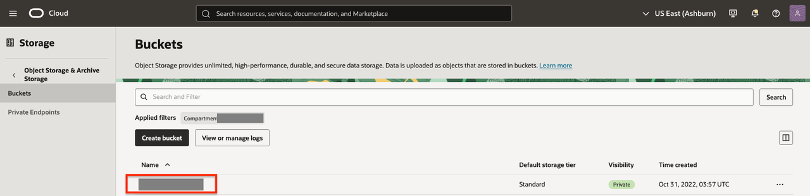

## Task 3: Set up Policies for Fleet Data Export

1. In the Console, open the navigation menu, click **Identity & Security**. Under Identity, click **Policies**.
   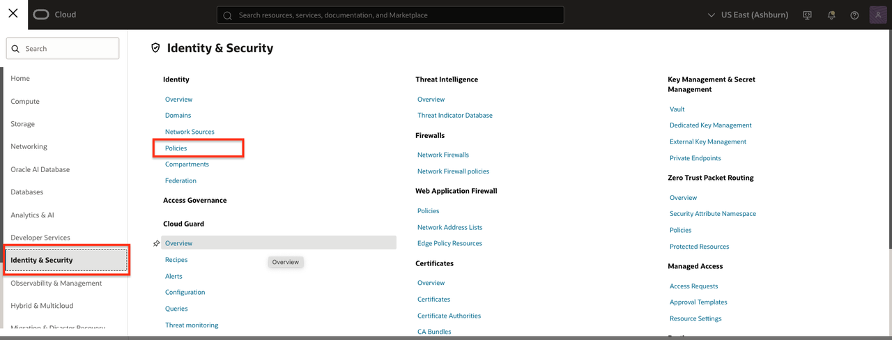
2. Click **Create policy** and complete:
   * **Name:** a descriptive name for your export (e.g., export-storage-bucket).
   * **Description:** a brief description of the policy (e.g., Policy required for JMS Fleets to export data to object storage).
   * **Compartment:** Select your own compartment.
3. Click **Show Manual Editor**.
   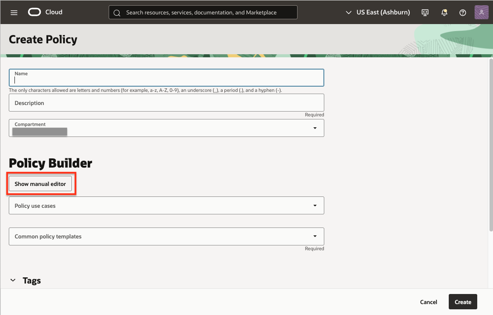
4. Copy and paste the following policy (edit placeholders accordingly):
   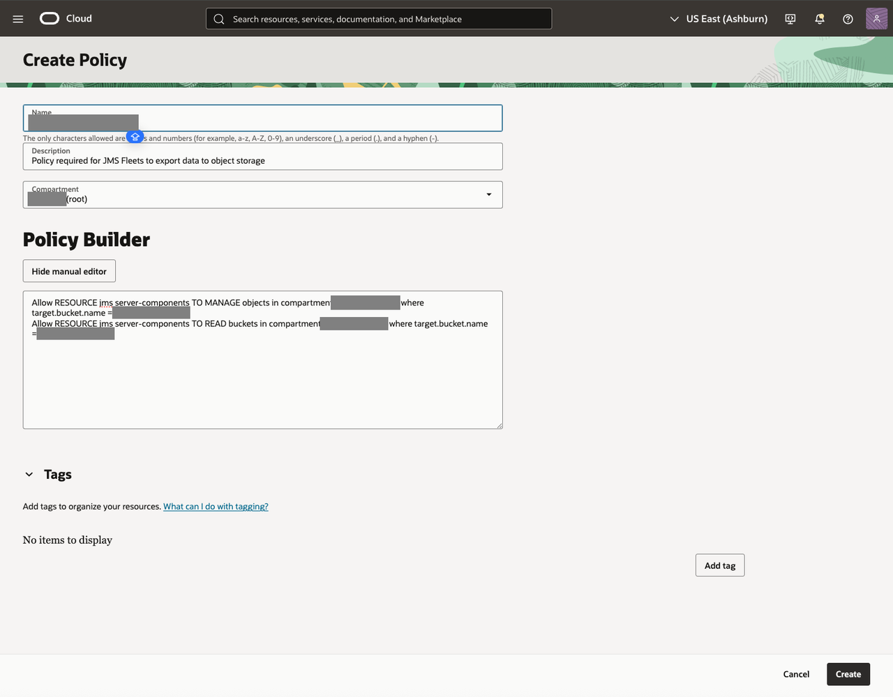

    ```text
   <copy>
    Allow RESOURCE jms server-components TO MANAGE objects in compartment [compartment_name] where target.bucket.name = [bucket_name]
    Allow RESOURCE jms server-components TO READ buckets in compartment [compartment_name] where target.bucket.name = [bucket_name]
   </copy>
   ```

   > Replace `[compartment_name]` and `[bucket_name]` as appropriate.

   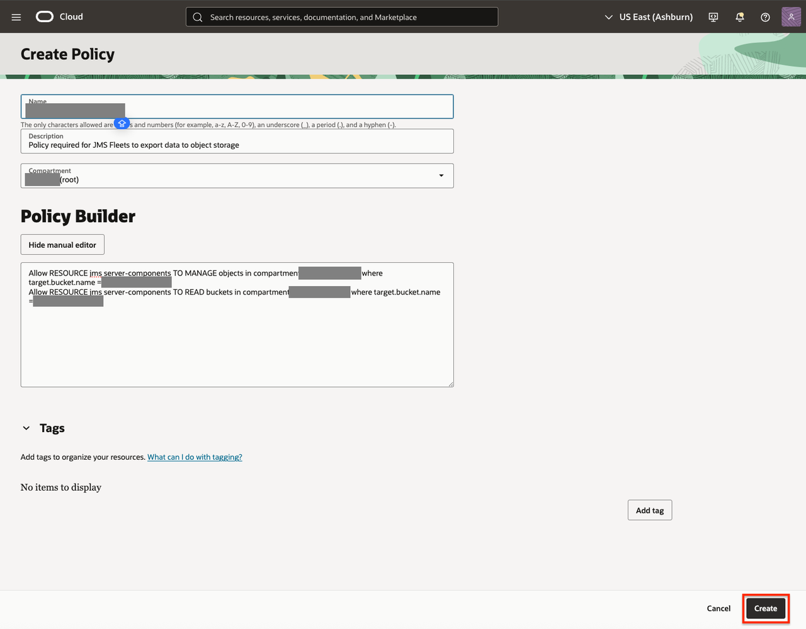
5. Click **Create**.

## Task 4: Configure Data Export for your fleet

1. In the Console, open the navigation menu, click **Observability & Management**, and then **Fleets** under **Java Management**.
   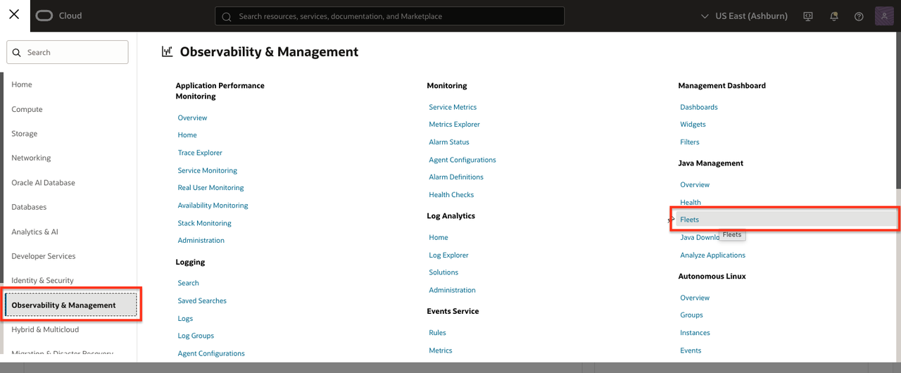
2. Select the compartment for JMS resources.
   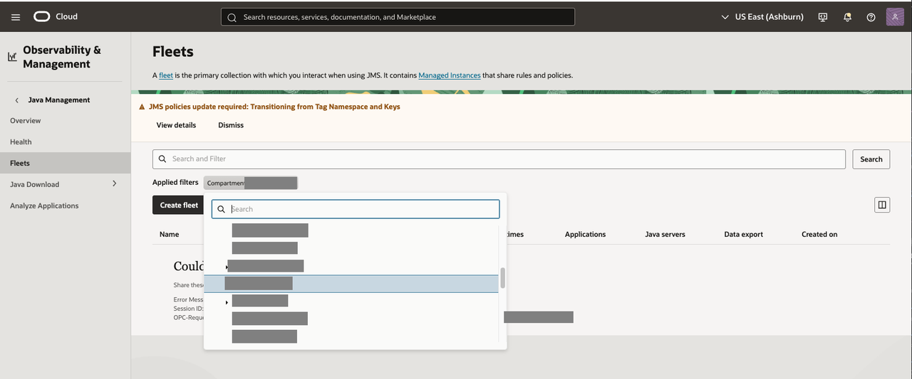
3. Select your fleet.
   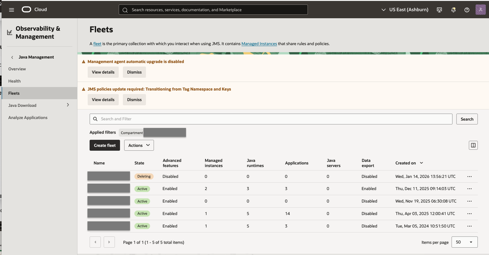
4. In the **Fleet properties** tab, go to **Data Export Settings**.
   * If export settings are unconfigured, click the **Configure** link.
   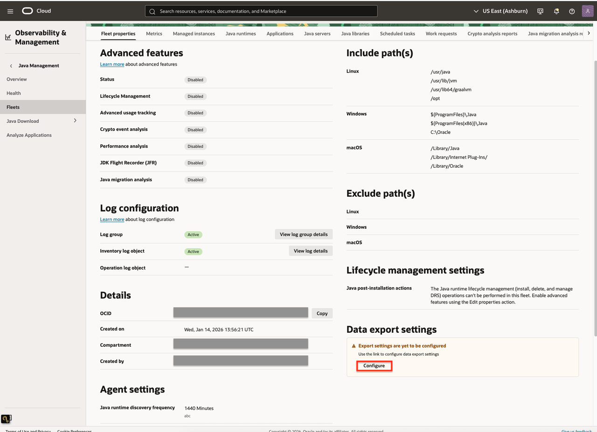
5. In the export settings, configure:
   * **Enable Export Settings**
   * **Resources:** Managed instances, Java runtimes, applications
   * **Duration:** 30, 60, or 90 days
   * **Target:** Select the previously created object storage bucket
   * **Schedule:** Daily, Weekly, or Monthly
   
6. Click **Save changes**.
   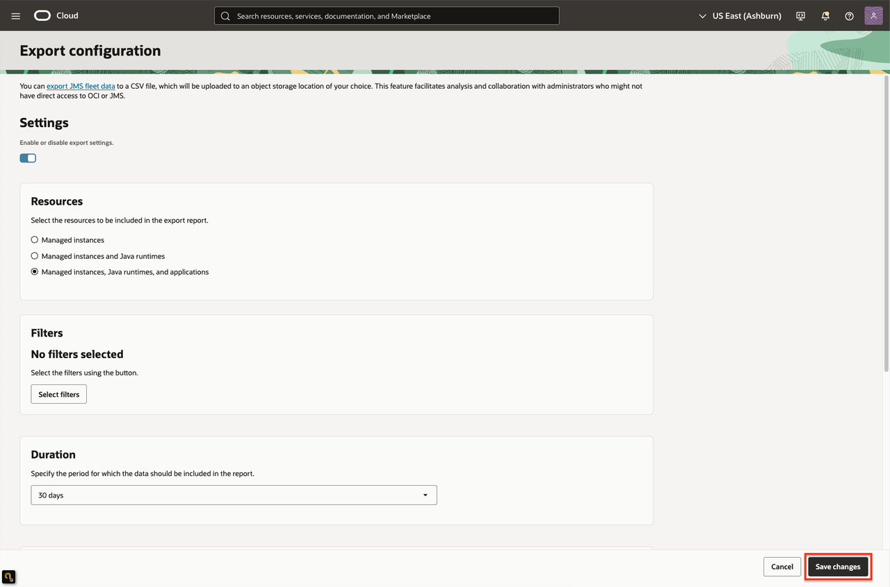
7. Download the pipeline script from Fleet settings (if prompted) to help automate or process exported data.
   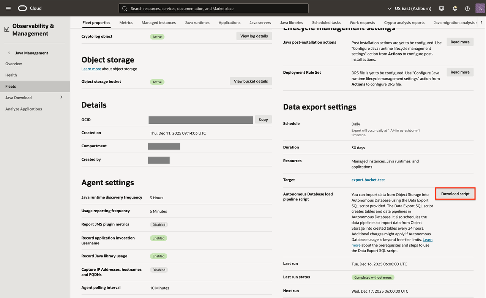

## Learn More

* [Configure Data Export Settings](https://docs.oracle.com/en-us/iaas/jms/doc/configure-export-settings.html)

## Next Steps

* If not already done, proceed to set up an Autonomous Database for deeper integration and export options.

Congratulations, you completed the lab! You may now [proceed to the next lab](#next).

## Acknowledgements

* **Author** - Maria Antonia Merino, Java Management Service
* **Last Updated By/Date** - Maria Antonia Merino, January 2026
