# Lab 3: Oracle Analytics Cloud Instance Setup

## Introduction

In this lab, you will provision and configure Oracle Analytics Cloud (OAC) to securely connect with your Autonomous Database instance containing Java Management Service (JMS) export data.  
This integration enables you to build interactive dashboards in OAC for real-time visualization of managed Java environments, supporting centralized visibility and streamlined management.

*Estimated Time:* 15 minutes

### Objectives

* Provision an Oracle Analytics Cloud (OAC) instance in Oracle Cloud Infrastructure (OCI).
* Configure OAC to securely connect to the Autonomous AI Database containing JMS export data.

### Prerequisites

* All prior labs (Autonomous AI Database, bucket configuration, JMS export) completed.
* Privileges to create Oracle Analytics Cloud instances in your OCI tenancy.
* Access to Oracle Cloud Console.
* OAC license or trial available in your region.
* An Identity Domain for users, roles and authentication settings.

## Task 1: Provision an Oracle Analytics Cloud (OAC) Instance

1. In the Oracle Cloud Console, open the navigation menu, click **Analytics & AI**, then under **AI Data Platform** select **Analytics Cloud**.
    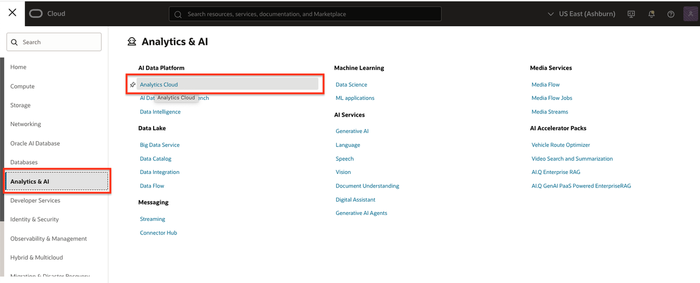
2. Click **Create Instance**.
    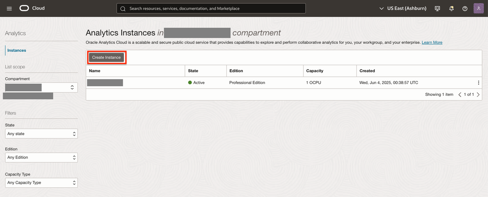
3. Complete the form:
    * **Name**: Name your instance (e.g., `jms-oac`)
    * **Description**: Brief description (e.g., `Enterprise analytics for JMS exports`)
    * **Compartment**: Choose target compartment
    * **Edition**: Select based on your subscription (for JMS Professional Edition is enough):
        * Enterprise Edition: Includes modeling, reporting, data visualization
        * Professional Edition: Data visualization only
    * **Capacity**: Set OCPU and memory as needed
    * **Licensing**: Choose based on your entitlement (Oracle/Non-Oracle)
    * **Software Updates**: Select Early or Regular
    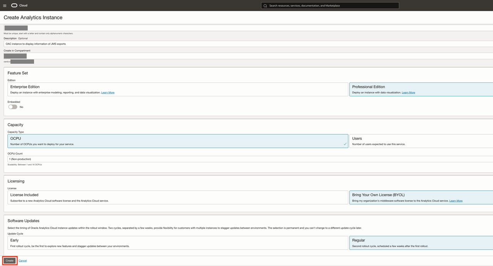
4. Click **Create**. Wait for your OAC instance to reach **Active** status.
    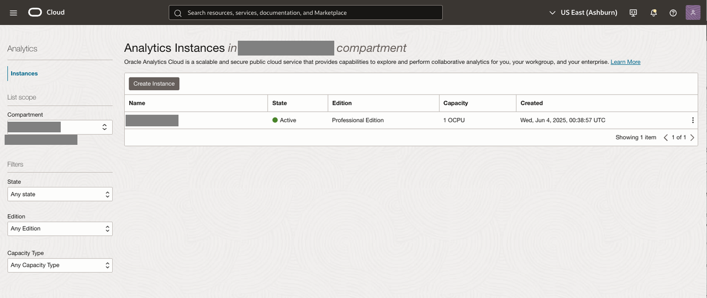
5. Once active, note the **URL** under Access Information for browser access.
    

## Task 2: (Optional) Create a User for Oracle Analytics

To allow additional users to access Oracle Analytics Cloud (OAC), you'll create a user in your Oracle Identity Domain and assign the necessary group(s). **You must have Identity Domain administrator privileges to complete this task.**

1. In the Oracle Cloud Console, open the navigation menu, click **Identity & Security**, then under **Identity** select **Domains**.
   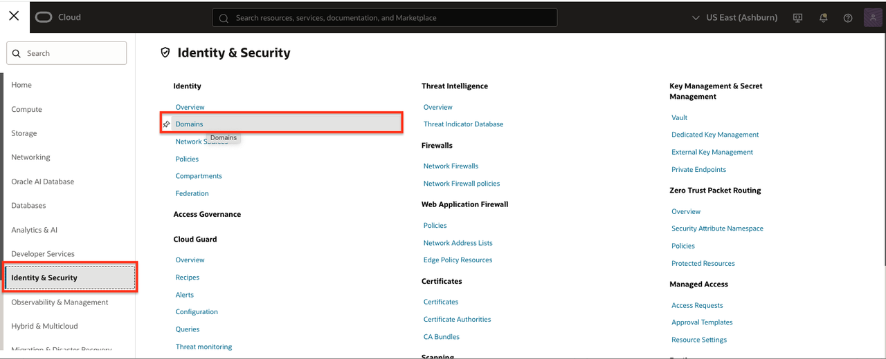
2. Use the **Compartment** filter to select your target compartment (the one containing your OAC instance).
   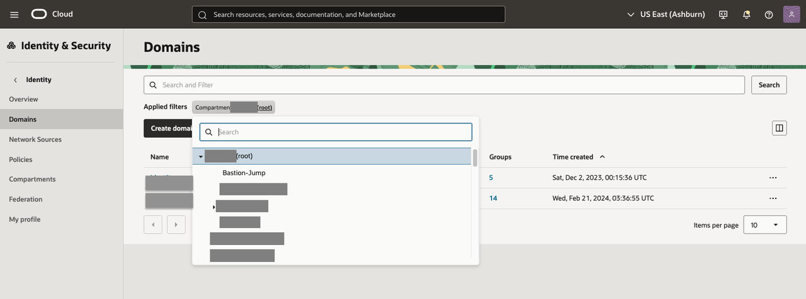
3. From the list, click the name of the relevant Domain to open it.
   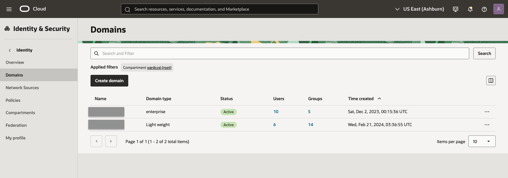
4. In the left menu, click the **User management** tab.
   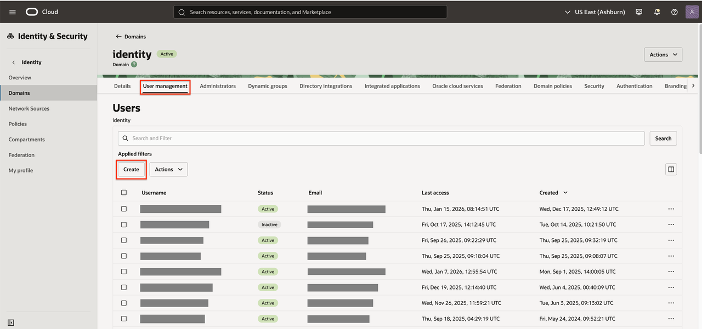
5. Click **Create** to add a new user.
6. Complete the user details form:
    * **First name** and **Last name**
    * **Username / Email** (an activation email will be sent to this address)
    * **Groups**: Assign at least one group needed for OAC access (for example, `oracle-analytics-users`).  
      *Ask your administrator which groups are required if unsure.*
   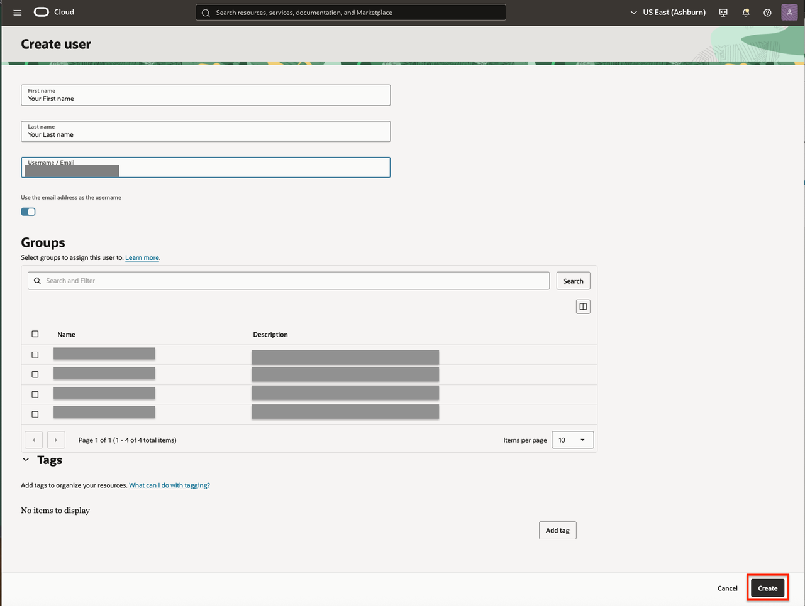
7. Click **Create**. The user will receive an activation email to finish setting up their password and account.
   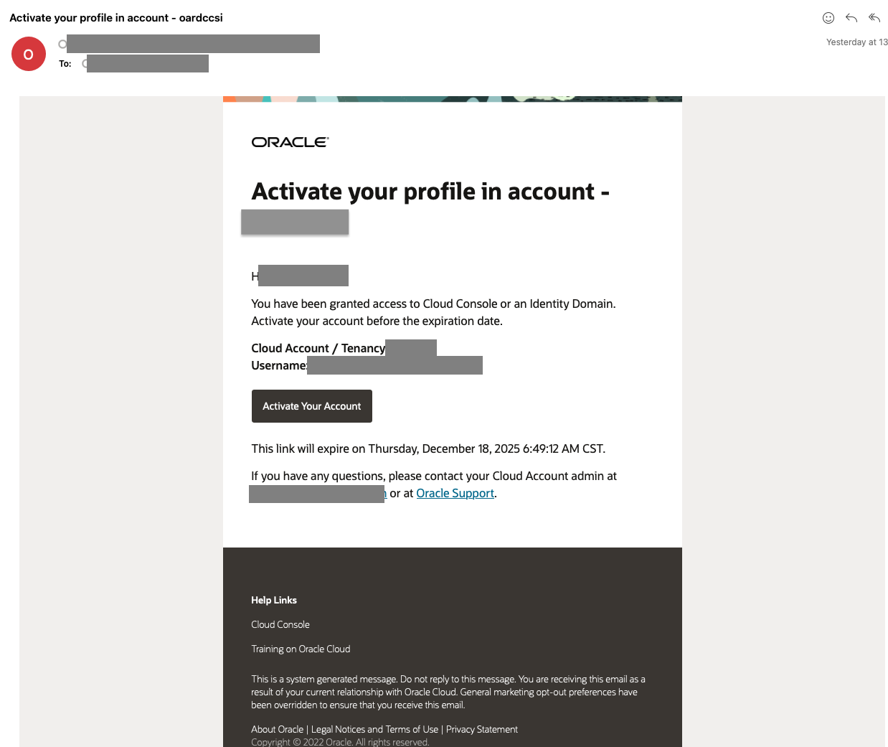
8. After the user activates their account, sign in as that user at the given login URL to confirm access.
   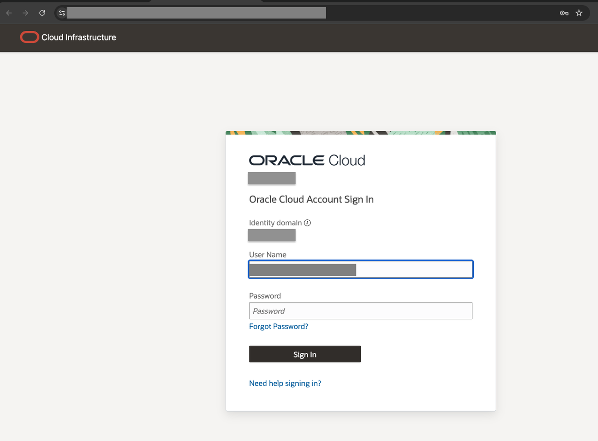

**Tip:** If you do not see the activation email, check your spam or junk folder.

## Task 3: Create a Custom Role in Oracle Analytics

To grant users specific privileges and streamline access control in Oracle Analytics Cloud (OAC), you can create a custom application role and assign it to individuals or groups.  
**Note:** Only OAC administrators may perform these steps.

1. In the Oracle Cloud Console, open the navigation menu, click **Analytics & AI**, then under **AI Data Platform** select **Analytics Cloud**.
   
2. In the Oracle Analytics Cloud page, select your OAC instance (e.g., the one you created earlier).
   
3. Locate and open the **URL** under Access Information to launch the OAC console in your browser.
   
4. Log in with an OAC account that has administrative privileges.
   
5. In the OAC interface, click the **Navigator** menu (upper left), then select **Console**.
   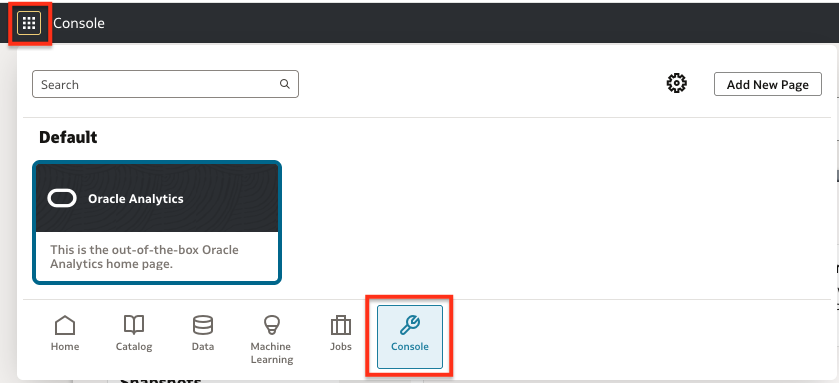
6. Click **Roles & Permissions**.
    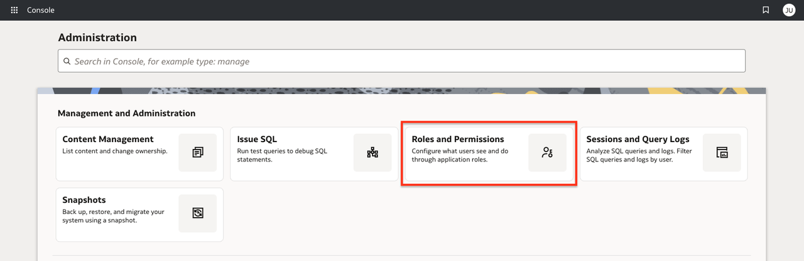
7. Click **Create Application Role**.
    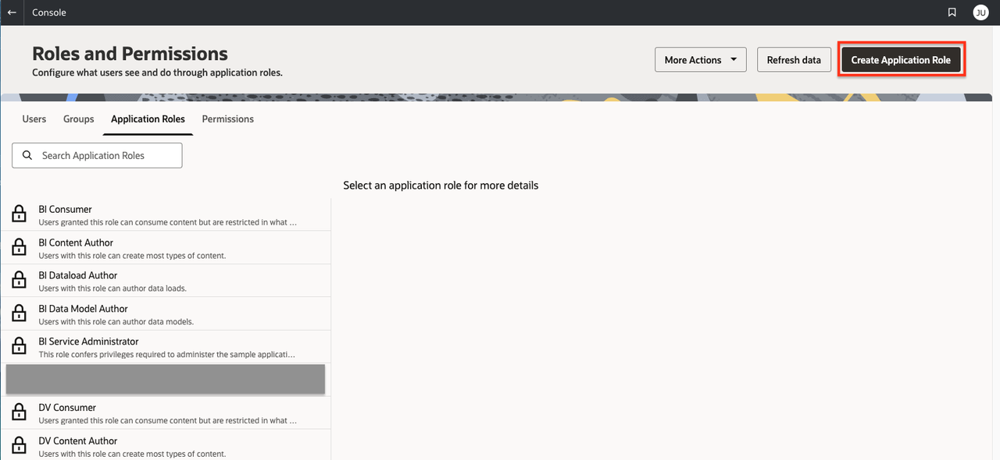
8. Complete the "Create Application Role" form:
    * **Name**: Enter a technical name for your role (e.g., `DV_JMS_Content_Author`). Use underscores for readability and to distinguish from display names.
    * **Display Name**: Enter a meaningful label for display in user interfaces (e.g., "JMS Content Author"). This is what administrators and users will typically see.
    * **Description**: Provide a concise summary of the role’s purpose and allowed actions (e.g., "Allows data visualization and content authoring for JMS exports.").
    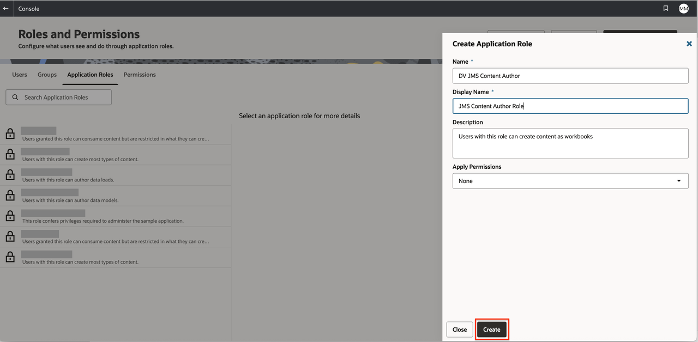
9. Click **Create**.
10. Select your new application role to configure permissions.
    * In the right pane, go to **Memberships** &rarr; **Application Roles**.
    * Click **Add Application Roles**, find and select **DV Content Author** (this grants standard data visualization authoring capabilities), then click **Add Selected**.
    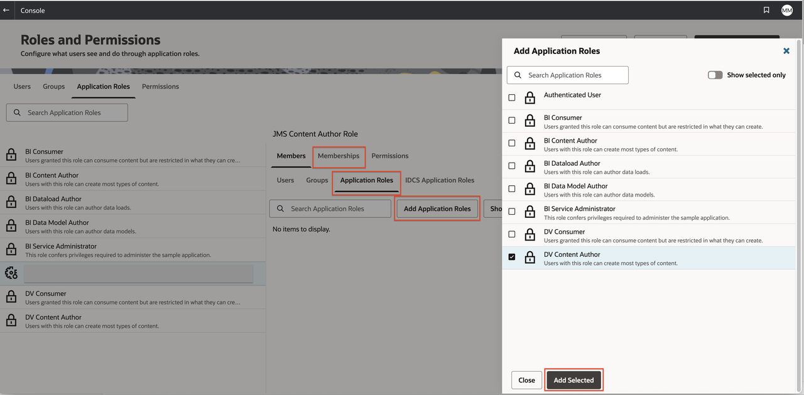
11. Assign the role to users or groups:
    * In **Application Roles**, select your new role.
    * On the right, go to **Members &rarr; Users**.
    * Click **Add User**, select the appropriate user(s), and click **Add Selected**.
    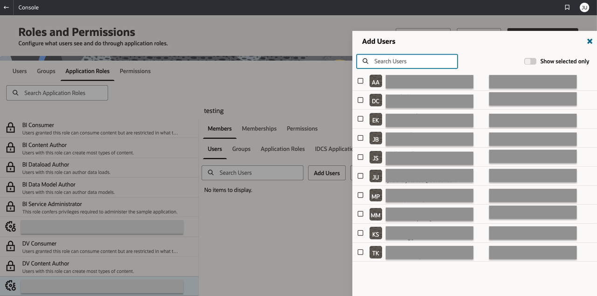

## Next Steps

You have successfully set up Oracle Analytics Cloud  instance . Proceed to the next lab to Access the OAC Environment to start building advanced dashboards and automate analytics workflows using OAC with your integrated JMS data.

Congratulations, you completed the lab! You may now [proceed to the next lab](#next).

## Acknowledgements

* **Author** - Maria Antonia Merino, Java Management Service
* **Last Updated By/Date** - Maria Antonia Merino, January 2026
