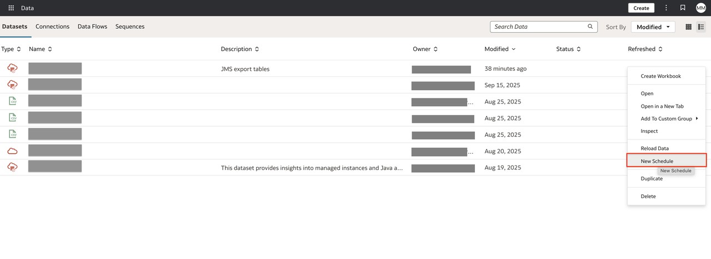
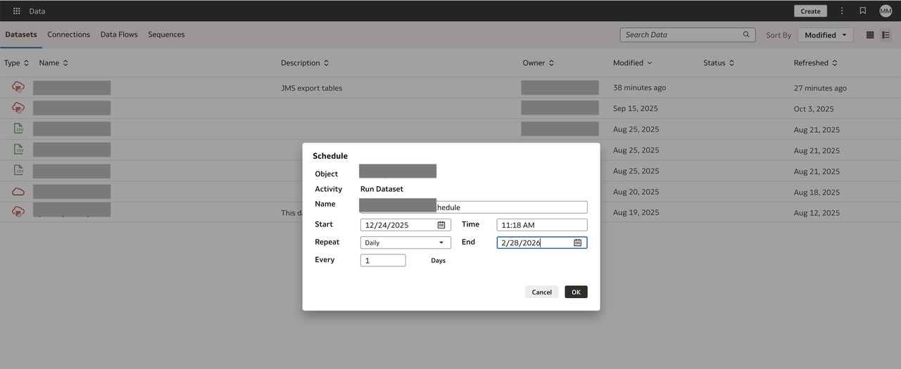
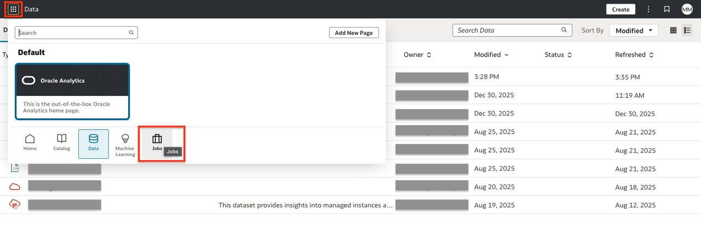
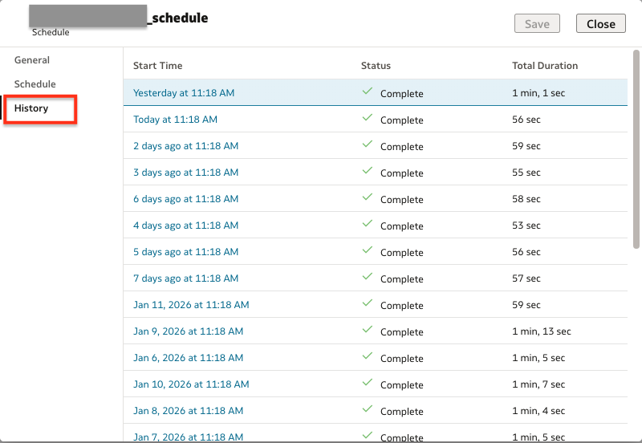

# Lab 7: Schedule JMS Export to Execute Periodically

## Introduction

In this lab, you will schedule the Java Management Service (JMS) export process to run automatically on a periodic basis, ensuring up-to-date Java inventory and usage data flows to downstream analytics.

*Estimated Time:* 10 minutes

### Objectives

* Configure scheduled execution for JMS export using Oracle Cloud Infrastructure (OCI) tools.
* Validate successful schedule and confirm automatic runs.

### Prerequisites

* Completed prior labs, including initial JMS export configuration.
* OCI permissions to manage schedules for JMS or associated services.
* An existing JMS export job you want to schedule.

## Task 1: Schedule the JMS Export

1. On the OAC home page, click page menu in the upper left side.
2. Select **Data**.
   
3. Over the imported dataset, on the right side, click actions menu and click **New Schedule**.
   
4. Specify schedule details to run dataset:
   * **Name**
   * **Start**, **Time** and **End**
   * **Repeat** (e.g., daily, weekly, ...), **Every**.
   
5. Click **OK** to schedule it.

## Task 2: Validate the Scheduled Export

1. Wait for the next scheduled interval and monitor the activity.
2. On the OAC home page, click page menu in the upper left side.
3. Select **Jobs**.
   
4. Select **Schedules** and localize your schedule.
5. Go to actions menu and click **Inspect**.
   
6. On left side select **History** and check the status of the runs.
   

## Task 3: Validate the data

1. Log in to your Oracle Analytics Cloud (OAC) environment.
2. From the home page, click **Catalog** in the navigation menu.
   
3. Find and open the JMS Inventory workbook you previously imported,let's double-click on it or click, select actions menu and then **Open**.
   

## Next Steps

* Monitor exports regularly and adjust the schedule as needed for your analytics SLAs.
* Continue refining automation and monitoring according to organizational requirements.

## Acknowledgements

* **Author** - Maria Antonia Merino, Java Management Service
* **Last Updated By/Date** - Maria Antonia Merino, January 2026
