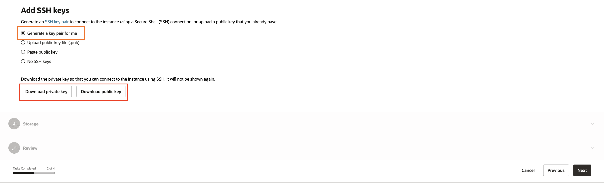

# Create a Java application

## Introduction

Java Management Service (JMS) is a native Oracle Cloud Infrastructure (OCI) service that monitors Java deployments on OCI instances and instances running in customer data centers. It enables you to observe and manage the use of Java in your enterprise.

This lab walks you through the steps to create a simple Java Application in a Compute Instance, which we will monitor using the Java Management Service.

Estimated Time: 10 minutes

### Objectives

In this workshop, you will:

* Create a Compute Instance
* Install Java on Compute Instance
* Create a simple Java application

### Prerequisites

* You have signed up for an account with Oracle Cloud Infrastructure and have received your sign-in credentials.
* You are using an Oracle Linux image on your Managed Instance for this workshop.
* Access to the cloud environment and resources configured in the previous workshop

## Task 1: Create a Compute Instance

1. Sign in to the Oracle Cloud Console as an administrator using the credentials provided by Oracle, as described in [Sign In for the First Time](https://docs.oracle.com/en-us/iaas/Content/GSG/Tasks/signingin.htm).
 

2. Use the **Create a VM Instance** wizard to create a new compute instance. The wizard performs the following tasks while installing an instance:
    * Creates and installs a Compute Instance running Oracle Linux.
    * Creates a VCN with the required subnet and components needed to connect your Oracle Linux instance to the internet.
    * Creates an `ssh` key pair you use to connect to your instance.


3. Follow these steps to install your Compute Instance using the **Create a VM Instance** wizard:
  From the main landing page, select **Create a VM Instance** wizard.
    

    The **Create Compute Instance** page is displayed. It has a section for **Placement**, **Image and shape**, **Networking**, **Add SSH keys**, and **Boot volume**.

    Choose the **Name** and **Compartment**. Select the compartment created previously.

    **Initial Options**
    * **Name**: `<name-for-the-instance>`
    * **Create in compartment**: `<your-compartment>`

      Ensure that you create the Compute Instance in a Compartment with correct set of Policies. Hence, in [Lab 2](?lab=set-up-oci-for-jms), if you had chosen Onboarding Wizard option, select `Fleet_Compartment` in **Create in compartment** field, else select the compartment that you have created.

      

    Enter a value in the **Name** field; else retain the default value.

    Review the Placement settings. Take the default values provided by the wizard. The following is sample data. The actual values change over time or differ in a different data center.

    **Placement**
    * **Availability domain**: AD-1 (For Free Tier, use **Always Free Eligible** option)
    * **Capacity type**: On-demand capacity
    * **Fault domain**: Oracle chooses the best placement

    Review the **Image and shape** settings. Take the default values provided by the wizard.

    **Image**
    * **Image**: Oracle Linux 8
    * **Image build**: Default image build
    * **Shape**: Any AMD or Intel shape
    * **OCPU count**: 1
    * **Memory (GB)**: 1
    * **Network bandwidth (Gbps)**: 0.48

    > **Note:** Usage of Ampere shapes is not recommended for Java Management Service as they are not supported.

    Click **Edit** to review the **Networking** settings. 

    

    If there are no VCNs available, click **Create new virtual cloud network**.

    
    
    Take the default values provided by the wizard.

    **Virtual cloud network**: vcn-'date'-'time'
    * **Subnet**: subnet-'date'-'time'
    * **Assign a public IPv4 address**: Yes

    Review the **Add SSH** keys settings. Take the default values provided by the wizard.

    Select the **Generate a key pair for me** option.

    Click **Save Private Key** and **Save Public Key** to save the private and public SSH keys for this compute instance.

    

    If you want to use your own SSH keys, select one of the options to provide your public key. Ensure that you store your private key and public key files in a secure location. You cannot retrieve keys again after the compute instance has been created.

    

    Review the **Boot volume** settings. Take the default values provided by the wizard.

4. Click **Create** to create the instance. Provisioning the system might take several minutes.

  

5. You have successfully created an Oracle Linux instance.

## Task 2: Access Instance via SSH

1. Open the navigation menu and click **Compute**. Under **Compute**, click **Instances**.

  

2. Click the link to the Instance you created in the previous step.

3. From the **Instance Access** section of the **Instance** Details page, note down the **Public IP address** generated by the system. Use this IP address to connect to your Instance.

  

4. Open a **Terminal** or **Command Prompt** window.
  Change into the directory where you stored the SSH encryption keys you created.
  To use the SSH command, change the read and write permissions of your key with this command
    ```
    <copy>
    chmod 400 ./<your-private-key-file>
    </copy>
    ```

5. Connect to your instance with this SSH command
    ```
    <copy>
    ssh -i <your-private-key-file> opc@<x.x.x.x>
    </copy>
    ```

6. You should be able to login to your instance now.

## Task 3: Install Java 8 and create a simple Java application

### For **Linux**

1. Install Oracle JDK 8 (64-bit) using `yum`.
    ```
    <copy>
    sudo yum -y install jdk1.8.x86_64
    java -version
    </copy>
    ```
    > **Note:** Management Agents require JDK 8 and superuser privileges for installation.

2. Build your Java application.

  In the **Terminal** window, create a Java file by entering this command:
    ```
    <copy>
    nano HelloWorld.java
    </copy>
    ```

  In the file, paste the following text:

    ```
    <copy>
    public class HelloWorld {
      public static void main(String[] args) throws InterruptedException{
        System.out.println("This is my first program in java");
        int number=15;  
        System.out.println("List of even numbers from 1 to "+number+": ");  
        for (int i=1; i<=number; i++) {  
          //logic to check if the number is even or not  
          //if i%2 is equal to zero, the number is even  
          if (i%2==0) {
            System.out.println(i);
            Thread.sleep(2000);
          }
        }  
      }//End of main
    }//End of HelloWorld Class
    </copy>
    ```

3. To save the file, type **CTRL+x**. Before exiting, nano will ask you if you want to save the file: Type **y** and **Enter** to save and exit.

### For **Windows**

1. Install Oracle JDK 8 in your instance. Download the x64 installer `jdk-8u<VERSION>-windows-x64.exe` from the [Java download](https://www.oracle.com/java/technologies/downloads/#java8-windows) page.

  Run the downloaded file and follow the instruction of installer. Leave default options, take note of the jdk installation path.

  Set environment variables on your system: Right-click on **My Computer** -> **Properties** -> **Advanced system settings** (on the top-left) -> **Environment Variables…** button on the bottom -> double-click on **Path** of **System variables** part of form. -> **New**-> paste paths for jdk and jre **bin** folder (for example: C:\Program Files\Java\jdk1.8.0\_161\bin; C:\Program Files\Java\jre1.8.0\_161\bin).

  Set the **JAVA\_HOME** environment variable. To set it, go to **System variables** form -> click **New** -> enter **JAVA\_HOME** for **Variable name:** and **path/to/jdk** for **Variable value:** (for example: C:\Program Files\Java\jdk1.8.0_161).

  To check if Java has been installed, in **Command Prompt** window, enter the following command. Make sure to open a new Command Prompt as the recent changes in environment variables may not be reflected in previous Command Prompt winodws.
    ```
    <copy>
    javac -help
    </copy>
    ```
    There should be a list of options. Now, enter the following:

    ```
    <copy>
    java -version
    </copy>
    ```

2. Build your Java application.

  In the **Command Prompt** window, create a java file by entering this command:
    ```
    <copy>
    notepad HelloWorld.java
    </copy>
    ```
  In the file, paste the following text:
    ```
    <copy>
    public class HelloWorld {
      public static void main(String[] args) throws InterruptedException{
        System.out.println("This is my first program in java");
        int number=15;  
        System.out.println("List of even numbers from 1 to "+number+": ");  
        for (int i=1; i<=number; i++) {  
          //logic to check if the number is even or not  
          //if i%2 is equal to zero, the number is even  
          if (i%2==0) {
            System.out.println(i);
            Thread.sleep(2000);
          }
        }  
      }//End of main
    }//End of HelloWorld Class
    </copy>
    ```

3. Go to the File option and click the Save button to save the file. Close the notepad window. Move to the command prompt window again.

> **Note:** To conserve resources and reduce charges, remember to stop your compute instance after completing the task.

You may now **proceed to the next lab.**

## Troubleshoot Java application creation issues

**For Task 3**

* If you encounter an error similar to the following:
    ```
    No match for argument: jdk1.8.x86_64
    ```
  Use a new instance with AMD or Intel shape instead of Ampere.

## Learn More

* Use the [Troubleshooting](https://docs.oracle.com/en-us/iaas/jms/doc/troubleshooting.html#GUID-2D613C72-10F3-4905-A306-4F2673FB1CD3) chapter for explanations on how to diagnose and resolve common problems encountered when installing or using Java Management Service.

* If the problem still persists or it is not listed, then refer to the [Getting Help and Contacting Support](https://docs.oracle.com/en-us/iaas/Content/GSG/Tasks/contactingsupport.htm) section. You can also open a support service request using the **Help** menu in the OCI console.


## Acknowledgements

* **Author** - Esther Neoh, Java Management Service
* **Last Updated By** - Ivan Eng, June 2023
