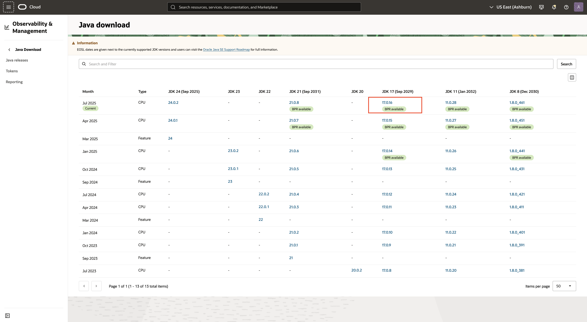
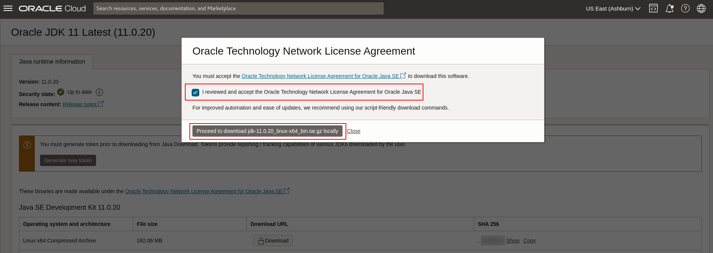
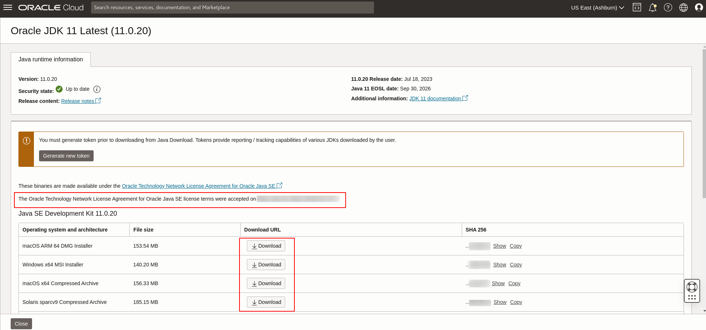
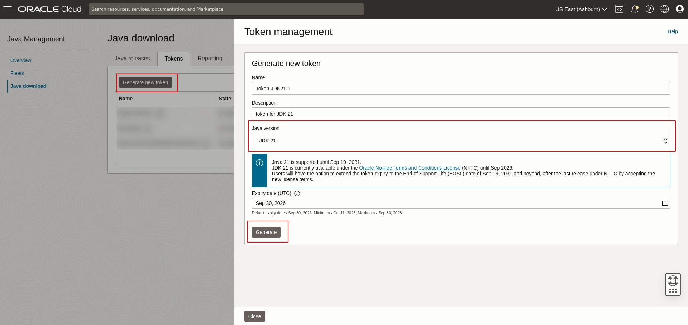
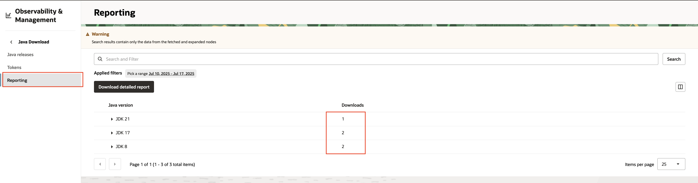
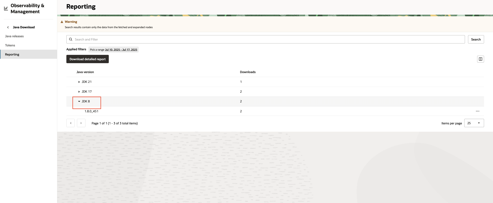
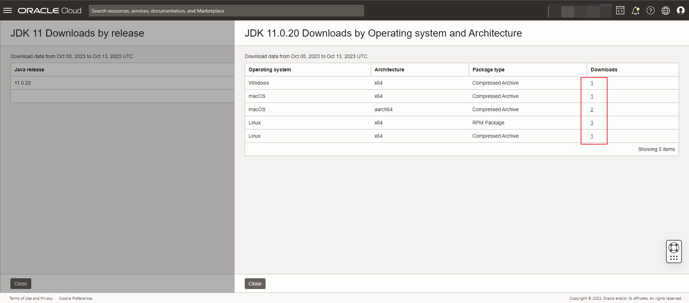
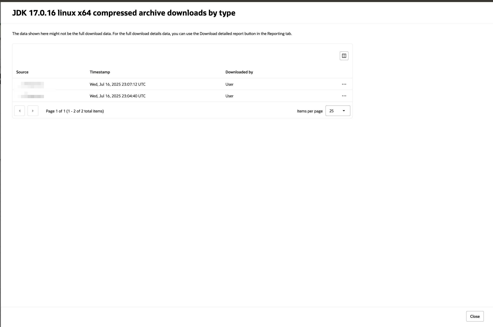
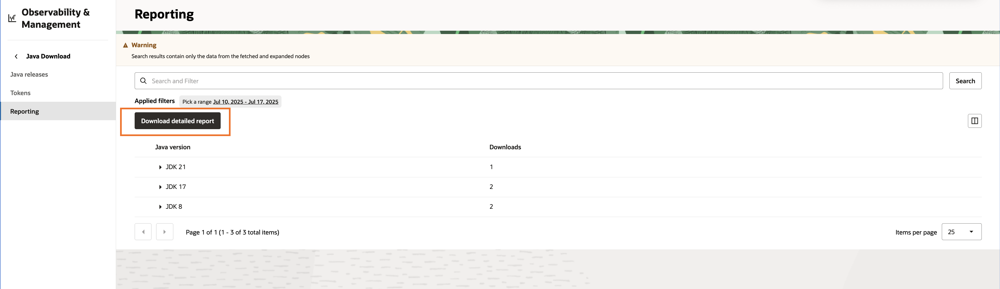

# Use Java Download

## Introduction

This lab walks you through the steps to download Java artifacts through JMS and script friendly URL while managing the download operations.

Estimated Time: 15 minutes

### Objectives

In this lab, you will:

* Download Java artifacts through JMS (OCI Console)
* Download Java artifacts through script friendly URL
* Monitor Java download reports in JMS (OCI Console)

### Prerequisites

* You have signed up for an account with Oracle Cloud Infrastructure and have received your sign-in credentials. 
* You are using an Oracle Linux image or Windows OS on your Managed Instance for this workshop. 
* Access to the cloud environment and resources configured in the previous workshop

## Task 1: Download Java artifacts through JMS (OCI Console)

1. In the Oracle Cloud Console, open the navigation menu, click **Observability & Management**, and then click **Java Download** under **Java Management**.

  

2. Select a JDK to download.

  

3. Detailed information of the JDK will be displayed. To download a JDK, click **Download**

  

4. **The Oracle Technology Network License Agreement** must be accepted before downloading. Click **Proceed** and your download will begin. You only have to accept the _Agreement_ once.

  
  
5. Once accepted, artifact download will be unlocked. Click **Download** to download the artifact directly.

  

## Task 2: (Optional) Download Java artifacts through script friendly URL

To download Java artifacts using script friendly URL, you must have an active token first.

1. Click **Generate new token** to generate token for the selected Java artifact.

  
  
2. Change the **Name**, **Description** and **Expiry date** to the desired value. Review and accept the **Oracle Technology Network License Agreement for Oracle Java SE** and click **Generate** to generate a new token for selected artifact.

  
  
3. Once the generate progress is done, you can **Show** or **Copy** a token, then click **Close** to close the page.

  
  
4. You can select an active token to be used in the script friendly download. Click **Copy download command** to use the download command in your console.

  
  
5. You can manage all generated tokens. Click **Tokens** in **Java download** page to see all generated tokens.

  

6. You can generate token for a specific Java artifact. You can select all available JDK version from the dropbox.

  

7. You can **Edit** or **Revoke** a token in the token page.

  
  
You can edit the **Name**, **Description** and **Expiry date** of a token. Click **Update** to submit the changes.

  
  
You can also **Revoke** a token to terminate any use of it. 

  

Click **Confirm** and you can see the state of the token change from **REVOKING** to **REVOKED**.

  
  
## Task 3: Monitor Java download reports in JMS (OCI Console)

1. In the **Java Download** under **Java Management**, click **Reporting** to see the reporting page.

  

2. Click the number of downloads to the details of a specific release of the Java artifact.

  

3. Click the number of downloads to the details of operating system and architecture.

 

4. You can check the **Source**, **Timestamp** and **Downloaded by** of a specific Java artifact.

  
  
5. You can download a detailed report by clicking **Download detailed report**

  

You may now **proceed to the next lab**.

## Learn More

* Refer to the [Java Download](https://docs.oracle.com/en-us/iaas/jms/doc/java-download.html) section of the JMS documentation for more details.

* If the problem still persists or it is not listed, then refer to the [Getting Help and Contacting Support](https://docs.oracle.com/en-us/iaas/Content/GSG/Tasks/contactingsupport.htm) section. You can also open a support service request using the **Help** menu in the OCI console.

## Acknowledgements

* **Author** - Yuan Chi Liu, Java Management Service
* **Last Updated By** - Yuan Chi Liu, October 2023
