# Monitoring Java applications in your Kubernetes cluster 

## Introduction

This guide will walk you through setting up and using Oracle Java Management Service (JMS) to monitor and manage Java applications running in Kubernetes clusters. JMS Kubernetes support extends your existing fleet management capabilities to containerized environments.

**Estimated Time:** 35 minutes

### Objectives

In this guide, you will:

* Set up JMS monitoring for Kubernetes clusters
* Monitor Java applications running in containers
* Manage your Kubernetes-based Java workloads through JMS

### Prerequisites

* Oracle Cloud Infrastructure account with appropriate permissions
* Access to a Kubernetes cluster 
* Java applications running in containers with JDK 
* Basic familiarity with Kubernetes concepts

## Task 1: Install the Kubernetes Agent

1. Open the navigation menu, navigate to **Observability & Management**. Under **Java Management**, click **Fleets**. Select the fleet that you have configured in [Lab 3](?lab=setup-a-fleet)

  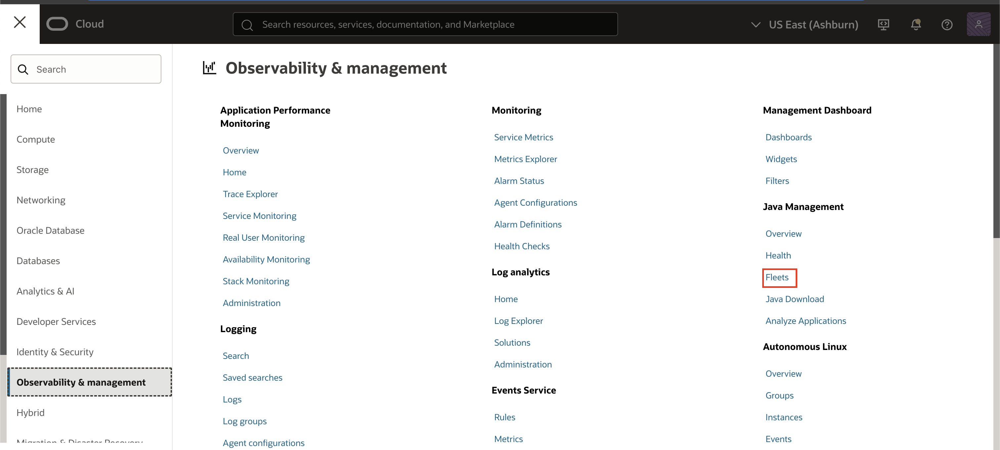

2. In your fleet details page, click **Download Agent Installer**.

   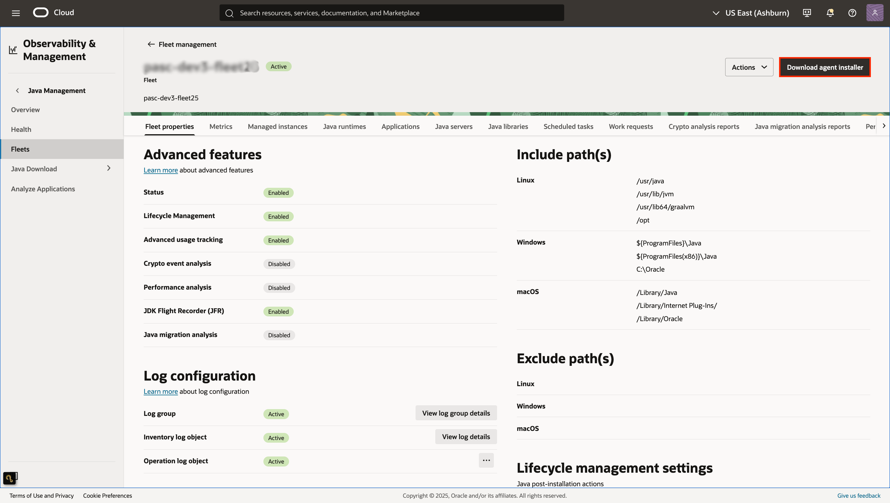

3. Select **Kubernetes Agent Installation**, and follow the steps provided in the panel.

   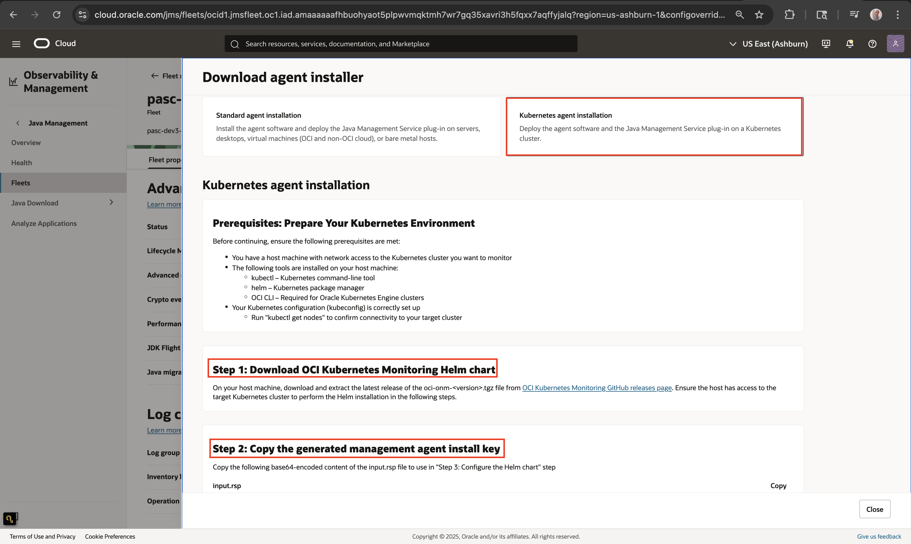

4. Under **Managed Instances**,once the installation is successfully completed, an entry for the newly added agent should appear.

   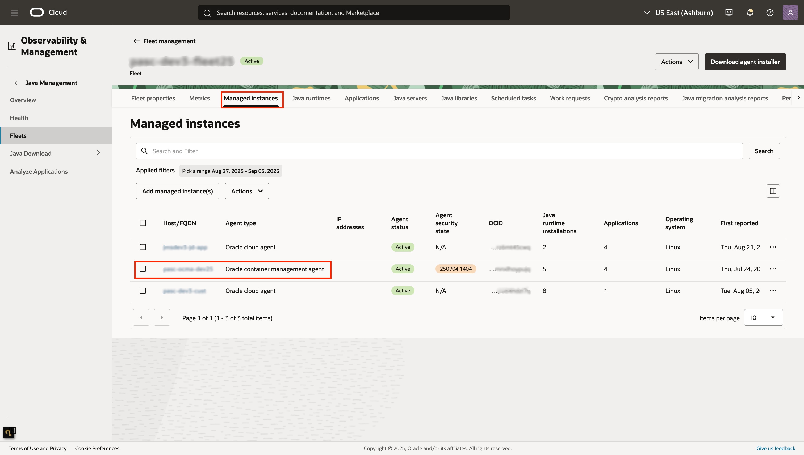

5. On the Managed instance details page, you can view cluster information, including the **type**, **container count** and **pod count**. The container count includes both Active Java and non-Java containers.

    > **Note:** Currently JMS has ability to detect Oracle Kubernetes Engine cluster(OKE). All other managed and unmanaged clusters will be listed as "Other".

   

6. Under **Active Java Containers**, you can see a list of all running Java containers. This list will be refreshed if any change is detected in the Kubernetes cluster.

   

## Task 2: Verify Management Agent installation

1. In your agent, click **Deploy plug-ins**.

   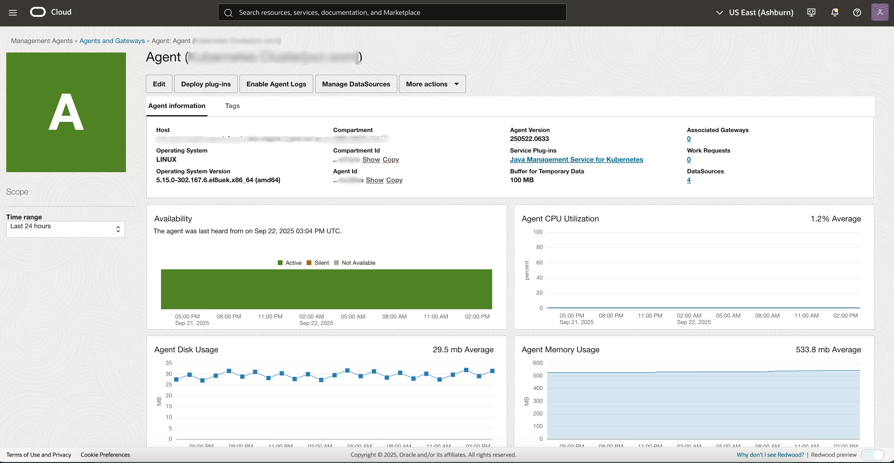

2. The **Java Management Service For Kubernetes** plug-in should be checked.

  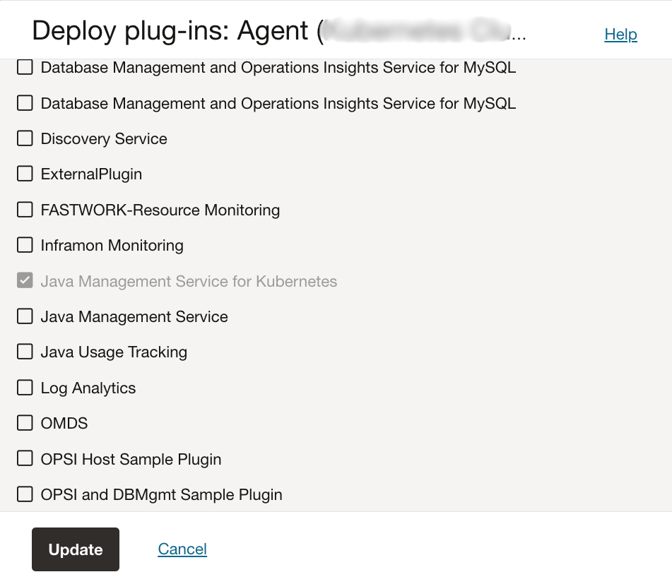

## Task 3: Verify the successful association of Managed Instance to your fleet

1. Navigate to the fleet that you have created in [Lab 3](?lab=setup-a-fleet), and click on the inventory log object.

   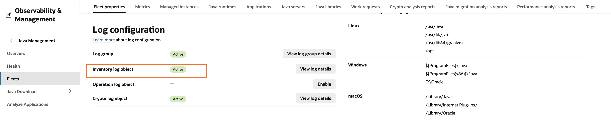

2. Inside the Fleet Inventory log page under the Explore Log section, you should see a new log entry **jms.agent.plugin.start.log** which has been emitted from your newly associated Managed Instance to your Fleet Inventory log.

   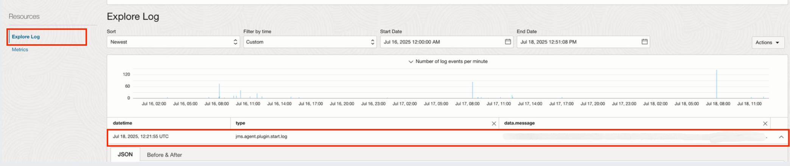

## Task 4: Verify detection of Java applications and runtimes

Before proceeding, make sure that the Java applications you want to verify are actually running inside containers in your Kubernetes cluster.

1. In the Oracle Cloud Console, open the navigation menu, click **Observability & Management**, and then click **Fleets** under **Java Management**.

   

2. Select the compartment containing the fleet, click on the fleet, and then select the managed instance under the fleet where the agent is deployed.

3. Click **Java Runtime Installations** in the navigation. You should now see Java runtimes belonging to your Managed Instances showing up in the Java runtimes table.

   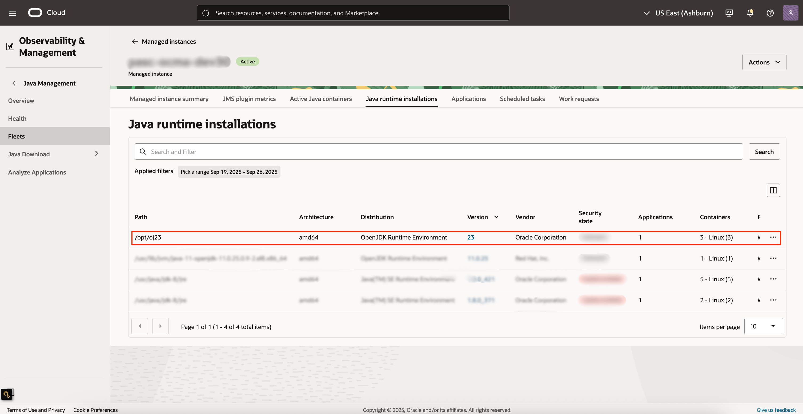

4. Click **Applications** in the navigation. You should see the application running inside your containres.

  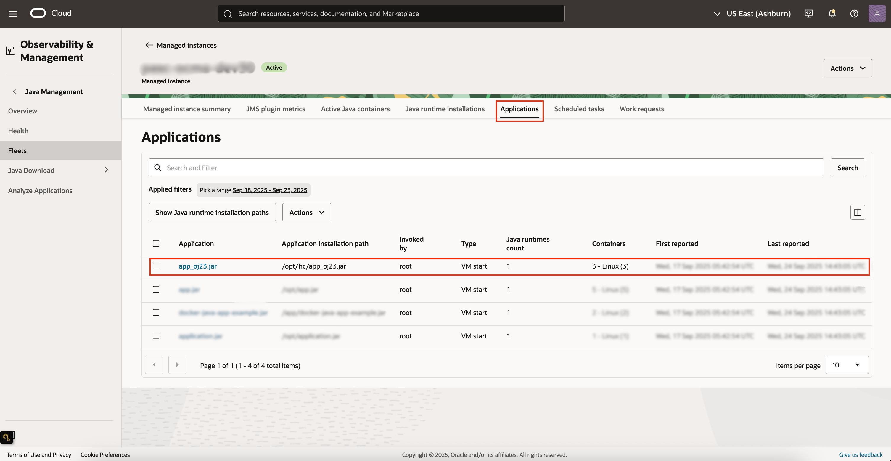

5. Click on the application to view its details. Click on **Application installations** to see the paths where the  application is installed, which will be displayed under **Application installation path**.

  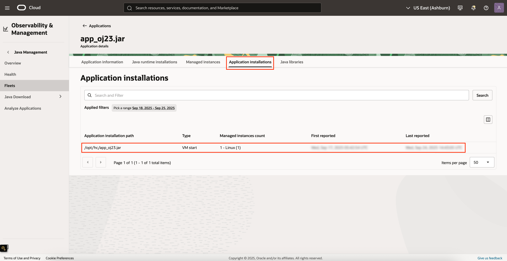

## Learn More

* [JMS Advanced Features Documentation](https://docs.oracle.com/en-us/iaas/jms/doc/advanced-features.html)
* [Kubernetes Monitoring Best Practices](https://docs.oracle.com/en-us/iaas/Content/ContEng/home.htm)
* [Java Flight Recorder Guide](https://docs.oracle.com/javacomponents/jmc-5-4/jfr-runtime-guide/)

## Acknowledgements

* **Author** - EL-MANANI Fatima, Java Management Service 
* **Last Updated By** - Fatima EL-MANANI, September 2025