# Set up multiple Managed Instances and Management Gateway

## Introduction
The Management Gateway provides a single point of communication between the Management Agents (or any other customer-side products) and the Oracle Cloud Infrastructure.

Using the Management Gateway as the single point for traffic to and from the Oracle Cloud Infrastructure means that the enterprise firewall only needs to allow HTTPS communication from the host where the Management Gateway resides. This scenario allows installing Management Agent on the hosts which do not need to have direct access to the internet. Oracle recommends to configure the Management Gateway first and then the Management Agent on the other hosts.


  
  
This lab walks you through the steps to install and configure Management Gateway on an on-premises host and have another on-premises host proxy through it to communicate with OCI network and JMS.

Estimated Time: 45 minutes

### Objectives

In this lab, you will:

* Install and configure Management Gateway on an on-premises host
* Verify the installation of Management Gateway
* Install Management Agent on another on-premises host and configure it to communicate to OCI network through Management Gateway


### Prerequisites

* You have signed up for an account with Oracle Cloud Infrastructure and have received your sign-in credentials.
* You are using an Oracle Linux image on your on-premises host machine to install Management Gateway.
* You are using an Oracle Linux image or Windows OS on your another on-premises host machine to install Management Agent.
* Access to the cloud environment and resources configured in the previous labs.
* The hosts, the one running Management Gateway and the one running Management Agent software, must be in same network.

## Task 1: Prepare gateway software and response file for Management Gateway installation

1. Sign in to the Oracle Cloud Console as an administrator using the credentials provided by Oracle, as described in [Sign In for the First Time](https://docs.oracle.com/en-us/iaas/Content/GSG/Tasks/signingin.htm).
&nbsp;

2. Open navigation menu, click **Observability & Management**, and then click **Downloads and Keys** under **Management Agent**.  

  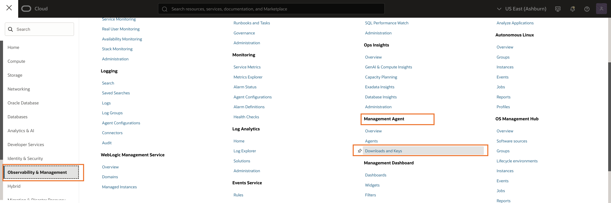
  

  The Software Download pane will display at the top of the page.

  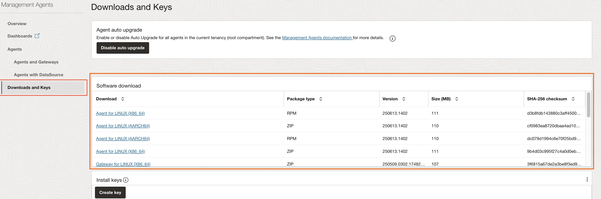

3. The Software Download pane lists all the software available to download for the Management Agent and Management Gateway. Select the operating system and architecture that the Management Gateway will be installed on from the Download column. In this case, click on **Gateway for LINUX (X84_64)** link to download the Management Gateway software file.
  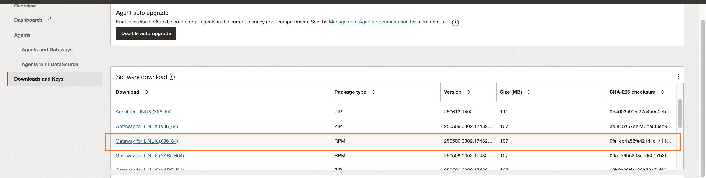

4. Alternatively, you can download **Management Gateway software for Linux** using OCI CLI. For details, see [Download the Gateway Software Using CLI](https://docs.oracle.com/en-us/iaas/management-agents/doc/install-management-gateway-main.html#GUID-52C54F84-020C-485D-B1A4-000AA796286B__GUID-DF8E9F65-944C-4EB3-B7CE-C74207D3099B).

5. On the same **Downloads and Keys** page, click on **Create key** to create a new **Install key**. An install key is issued against your identity domain and validates the authenticity of the installation. 
  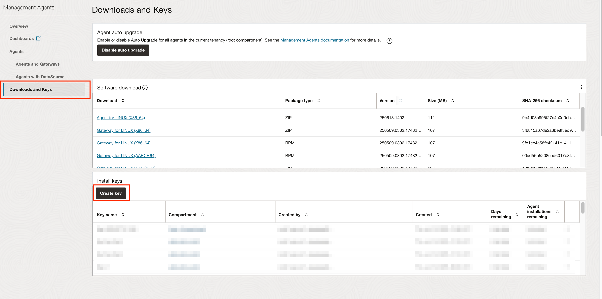

6. Enter the required details in Create Key window and click **Create** button.

  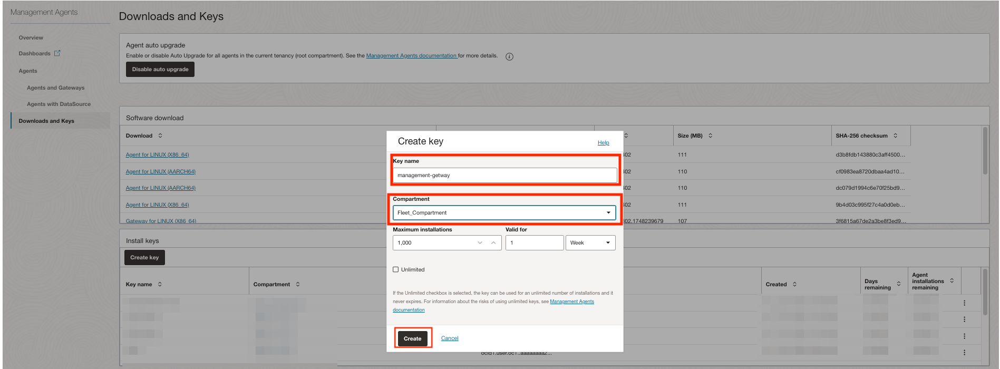

7. On the Install Keys pane select the newly created Install Key. Then on the right side of the selected key, click the action menu and select **Download Key to File** option. 
  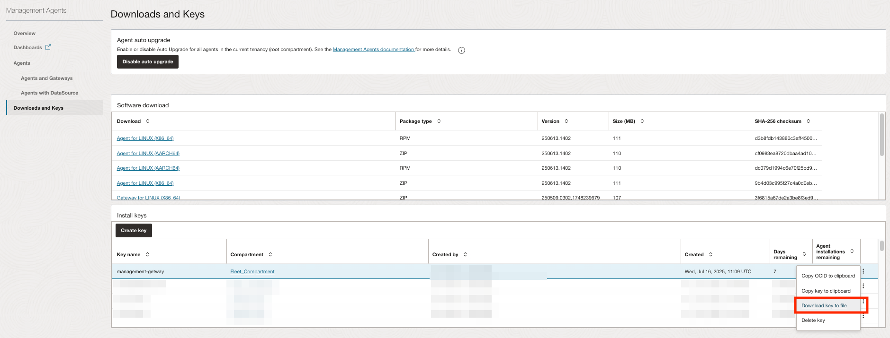

8. Create a gateway.rsp response file on your host. This will be used by the Management Gateway installation script to read the parameters specific to your environment.

    ```
    <copy>
    nano /tmp/gateway.rsp
    </copy>
    ```   

  Copy and paste the contents of the install key file downloaded from the previous step into the editor.

  Customize following parameters:
    * **AgentDisplayName**: Add a display name for Management Gateway 
    * **GatewayPort**: 4479
    * Remove the parameters starting with Service.plugin.* parameter.These are agent parameters which are only used for agent installations

     > **Note:** This lab will be using **GatewayPort** 4479, but you can choose any port recommended by your organization.

  A sample response file is included for reference, modify AgentDisplayName and GatewayPort parameters accordingly.
  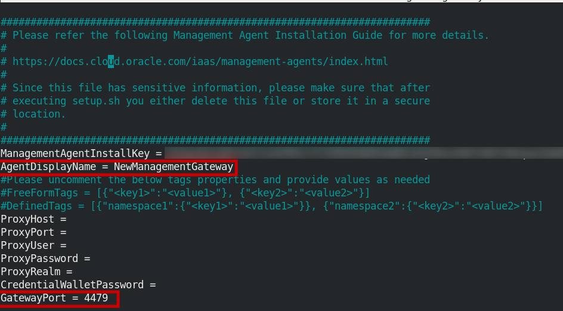

  To save the file, type CTRL+x. Before exiting, nano will ask you if you want to save the file: Type y to save and exit.

## Task 2: Configure Certificates for Management Gateway

  Communication between Agent, Gateway and OCI requires certificates. This task walks you though the steps to setup the automatic creation of the certificates and other required entities.

1. Create a dynamic group of name `Credential_Dynamic_Group` with the rule below:
    ```
    <copy>
    ALL {resource.type='certificateauthority', resource.compartment.id='<fleet_compartment_ocid>'}
    </copy>
    ```
2. Create a dynamic group of name `Management_Gateway_Dynamic_Group` with the rule below:
    ```
    <copy>
    ALL {resource.type='managementagent', resource.compartment.id='<fleet_compartment_ocid>'}
    </copy>
    ```
3. You should see two dynamic groups created.
  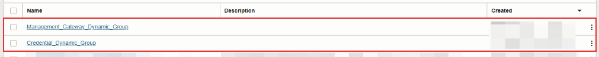

4. Create policies to allow for automatic certificate creation.
  * In the Oracle Cloud Console, open the navigation menu and click **Identity & Security**. Under **Identity**, click **Policies**.
  * Click **Create Policy**.
  * Enter a name (for example, `Management_Gateway`) and a description.
  * Select the **Fleet_Compartment** from the drop-down list.
  * Click **Show manual editor**.
  * In the text box, enter the following statements:
    ```
    <copy>
    Allow DYNAMIC-GROUP Credential_Dynamic_Group to USE certificate-authority-delegates in compartment Fleet_Compartment
    Allow DYNAMIC-GROUP Credential_Dynamic_Group to USE vaults in compartment Fleet_Compartment
    Allow DYNAMIC-GROUP Credential_Dynamic_Group to USE keys in compartment Fleet_Compartment
    Allow DYNAMIC-GROUP Management_Gateway_Dynamic_Group to READ certificate-authority-bundle in compartment Fleet_Compartment
    Allow DYNAMIC-GROUP Management_Gateway_Dynamic_Group to READ leaf-certificate-bundle in compartment Fleet_Compartment
    Allow DYNAMIC-GROUP Management_Gateway_Dynamic_Group to MANAGE certificate-authorities in compartment Fleet_Compartment where any{request.permission='CERTIFICATE_AUTHORITY_CREATE', request.permission='CERTIFICATE_AUTHORITY_INSPECT', request.permission='CERTIFICATE_AUTHORITY_READ'} 
    Allow DYNAMIC-GROUP Management_Gateway_Dynamic_Group to MANAGE leaf-certificates in compartment Fleet_Compartment where any{request.permission='CERTIFICATE_CREATE', request.permission='CERTIFICATE_INSPECT', request.permission ='CERTIFICATE_UPDATE', request.permission='CERTIFICATE_READ'}
    Allow DYNAMIC-GROUP Management_Gateway_Dynamic_Group to MANAGE vaults in compartment Fleet_Compartment where any{request.permission='VAULT_CREATE', request.permission='VAULT_INSPECT', request.permission='VAULT_READ', request.permission='VAULT_CREATE_KEY', request.permission='VAULT_IMPORT_KEY', request.permission='VAULT_CREATE_SECRET'} 
    Allow DYNAMIC-GROUP Management_Gateway_Dynamic_Group to MANAGE keys in compartment Fleet_Compartment where any{request.permission='KEY_CREATE', request.permission='KEY_INSPECT', request.permission='KEY_READ'}
    Allow DYNAMIC-GROUP Management_Gateway_Dynamic_Group to USE certificate-authority-delegates in compartment Fleet_Compartment
    Allow DYNAMIC-GROUP Management_Gateway_Dynamic_Group to USE key-delegate in compartment Fleet_Compartment
    </copy>
    ```

    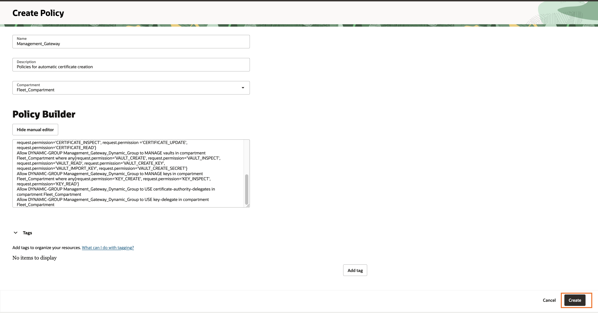


## Task 3: Install Management Gateway
1. Open the terminal. 

2. Navigate to the directory where you have downloaded the management gateway RPM file and run the following command to install the RPM file: 

    ```
    <copy>

    JDK_DIR=$(find /usr/bin/java)
    sudo bash JAVA_HOME="${JDK_DIR}" rpm -ivh <rpm_file_name.rpm>

    </copy>
    ```   

  The output will look similar to the following:
    ```
      Preparing...        ################################# [100%]
  Checking pre-requisites
      Checking if any previous gateway service exists        
  Checking if OS has systemd or initd
      Checking available disk space for gateway install
      Checking if /opt/oracle/mgmt_agent directory exists
      Checking if 'mgmt_agent' user exists
      Checking Java version
              Trying /usr/bin/java
              Trying default path /usr/bin/java
              Java version: 1.8.0_282 found at /usr/bin/java
      Checking gateway version
  Updating /  installing...
    1:oracle.mgmt_gateway-<VERSION>################################# [100%]

  Executing install
          Unpacking software zip
          Copying files to destination dir (/opt/oracle/mgmt_agent)
          Initializing software from template
          Checking if JavaScript engine is available to use
          Creating 'mgmt_gateway' daemon        
          Gateway Install Logs: /opt/oracle/mgmt_agent/installer-logs/installer.log.0

          Setup gateway using input response file (run as any user with 'sudo' privileges)
          Usage:
                  sudo /opt/oracle/mgmt_agent/agent_inst/bin/setupGateway.sh opts=[FULL_PATH_TO_INPUT.RSP]

          Gateway install successful
      ```   

3. Configure the management gateway by running the setupGateway.sh script using a response file. 

    ```
    <copy>
    sudo /opt/oracle/mgmt_agent/agent_inst/bin/setupGateway.sh opts=/tmp/gateway.rsp
    </copy>
    ```  


    The output will look similar to the following: 

    ```
    
Executing configure
       Parsing input response file
       Validating install key
       Generating communication wallet
       Generating security artifacts
       Registering Management Gateway
               Found service plugin(s): [GatewayProxy]

Starting gateway...
Gateway started successfully

Starting plugin deployment for: [GatewayProxy]
Deploying service plugin(s)......Done.
        GatewayProxy : Successfully deployed external plugin

Gateway setup completed and the gateway is running.
In the future gateway can be started by directly running: sudo systemctl start mgmt_gateway

Make sure that you delete <user_home_directory>/gateway.rsp or store it in secure location.

Creating gateway system properties file
Creating properties file
Creating or validating certificates

Waiting for Management Gateway to create or validate certificates...
Waiting for Management Gateway to create or validate certificates...
Waiting for Management Gateway to create or validate certificates...
Waiting for Management Gateway to create or validate certificates...

Creating Wallets
Wallets created successfully
Waiting for Management Gateway to start...
Management Gateway Plugin set up successfully.
   
    ``` 

4.  Delete the gateway.rsp file after successful configuration.

    ```
    <copy>
    sudo rm /tmp/gateway.rsp
    </copy>
    ```  

5. Since we have set the Gateway port to 4479, configure the host firewall to open this port.

    ```
    <copy>
    sudo firewall-cmd --zone=public --permanent --add-port=4479/tcp

    sudo firewall-cmd --reload
    </copy>
    ```

    > **Note:** This set of commands is specifically for Oracle Linux. Change the commands based on your Operating System and Setup.

6. Take note of IP address of the host by running following command.
    ```
    <copy>
    ifconfig
    </copy>
    ```  
    The output may look like this.

  

    This IP address will be used as value for `ProxyHost` in Management Agent response file in Task 4.
  
## Task 4: Verify the Management Gateway installation

### Using OCI Console:

1. Open navigation menu, click **Observability & Management**, and then click **Agents** under **Management Agent**.  

  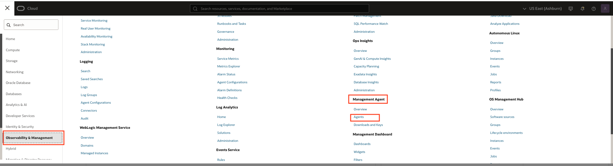

2. Select the correct compartment from left hand side panel. In this case it is `Fleet_Compartment`. You should be able to see newly created Management gateway in the **Agents and Gateways** list.

  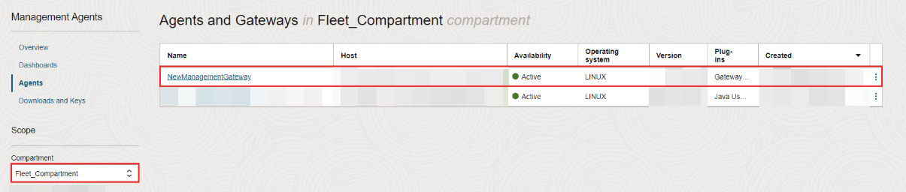

### Using Command Line Interface on Linux:

1. Login to the host using a user with sudo privileges.

2. Run the following command to check Management Gateway service status:

    For Oracle Linux 6: 
     ```
    <copy>
   sudo /sbin/initctl status mgmt_gateway
    </copy>
    ```  
    

    For Oracle Linux 7 or Oracle Linux 8: 
     ```
    <copy>
   sudo systemctl status mgmt_gateway
    </copy>
    ```
   
    If the Management Gateway is running, the output of the command should look like this.

    

    For more details, check the log file: 
    
     ```
    <copy>
     cat /opt/oracle/mgmt_agent/plugins/GatewayProxy/stateDir/log/mgmt_gateway.log
    </copy>
    ```
    The logs may look like this.

    


## Task 5:  Configure Management Agents after Management Gateway installation


After installing the Management Gateway, you will need to configure each Management Agent to use the Management Gateway **during the initial agent installation process**.

* A fleet, `fleet-1`, has already been setup during [Lab 3](?lab=setup-a-fleet) and you should have access to the install key file embedded in the downloaded installation script.

* To install Management Agent, follow [Task 2 of Lab 6](?lab=set-up-of-management-agent#Task2:InstallManagementAgentonanonOCIHost).

* Before running the installation script take note of the flags to configure the proxy:
    * **ProxyHost**: The IP address of host that is running Management Gateway
    * **ProxyPort**: 4479

  Enter the following command to pass flags to the installation script:
    ```
     <copy>
     sudo <path-to-installation-script>/<installation-script-name>.sh --proxy-host="<host-IP-address>" --proxy-port="4479"
     </copy>
     ```

* Follow [Task 3 - 6 to  of Lab 6](?lab=set-up-of-management-agent#Task3:VerifyManagementAgentInstallation) to verify Management Agent installation.

You can configure an existing Management Agent to use the Management Gateway. For details, see [Perform Postinstallation Tasks for Management Gateway](https://docs.oracle.com/en-us/iaas/management-agents/doc/perform-postinstallation-tasks-management-gateway-installation.html)

* Ensure the management agent is running. You can check by running the following command:
    ```
    <copy>
    systemctl status mgmt_agent
    </copy>
    ```
* If the Management Gateway is set up to require authentication, create a credentials file containing the username and password required to connect to the Management Gateway.

  For example, a file /opc/my\_cred\_file.json, could be created, containing the credentials to be configured.
    ```
    <copy>
    {
      "source":"agent.<OCID_OF_THE_AGENT>",  <---Prefix the OCID of the agent with "agent."
      "name":"ManagementAgent-Gateway",
      "type":"ProxyCreds",
      "description":"These credentials are used to connect to Management Gateway.",
      "tags":["GatewayServerHost:gatewayhost.myco.com","GatewayServerPort:3128"],
      "properties":
      [
        { "name":"ProxyUser", "value":"<USER_NAME>" },
        { "name":"ProxyPassword", "value":"<USER_PASSWORD>" }
      ]
    }
    </copy>
    ```
* Add the credentials specified in the /opc/my\_cred\_file.json file using the credential\_mgmt.sh script.
    ```
    <copy>
    cat /opc/my_cred_file.json | sudo -u mgmt_agent /opt/oracle/mgmt_agent/agent_inst/bin/credential_mgmt.sh -o upsertCredentials -s Agent
    </copy>
    ```
* Delete the credential file /opc/my\_cred\_file.json. 
* Stop the management agent by running the following command:
    ```
    <copy>
    systemctl stop mgmt_agent
    </copy>
    ```
* Update the management agent's emd.properties file by adding GatewayServerHost and GatewayServerPort parameters. 
The emd.properties file is located in the /opt/oracle/mgmt\_agent/agent\_inst/config directory.
For example: 
    ```
    <copy>
    GatewayServerHost=<host-ip-address>
    GatewayServerPort=4479
    </copy>
    ```
The bottom of the emd.properties file should look like this:
  

* Start the management agent by running the following command:
    ```
    <copy>
    systemctl start mgmt_agent
    </copy>
    ```

## Task 6: Verify detection of Managed Instance
1. In the Oracle Cloud Console, open the navigation menu, click **Observability & Management**, and then click on **Fleets** under **Java Management**.

  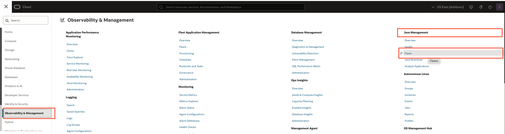

2. Select the compartment that the fleet is in and click the fleet.

3. Click **Managed Instance** in the navigation menu. If tagging, installation of management agents, and communication between the Management Gateway and Management Agent are successful, the Managed Instance will be displayed on the Fleet Main Page.

    You should be able to see the new Managed Instance with the latest timestamp.

    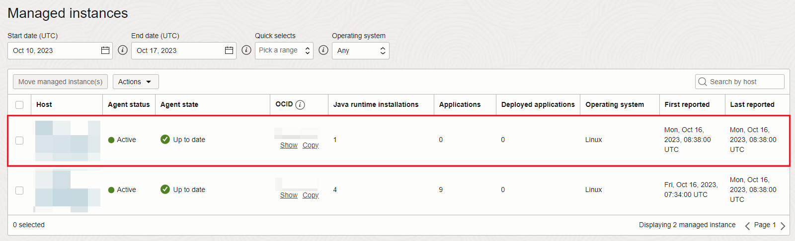
You may now **proceed to the next lab.**

## Troubleshoot Management Gateway issues

**For Task 3 Step 2**

* If you encounter an error similar to the following:
    ```
    Gateway only supports JDK 8 with a miniumum upgrade version JDK 8u281 -b02. Set your preferred path in JAVA_HOME.
    ```
    Enter the following command to check if jdk1.8.x exists, and select it as the default JDK:
    ```
    <copy>
      sudo update-alternatives --config java
    </copy>
    ```

**For Task 3 Step 3**
* If you encounter an error similar to the following:
    ```
    Could not resolve hostname <hostname> in the installation environment. Resolve the hostname or provide the GatewayCertCommonName in the response file and rerun the gateway setup script.
    ```
    Add the parameter **GatewayCertCommonName** = test.gateway.com (or other Fully Qualified Domain Name of your choice) in the gateway.rsp response file created earlier in [Task 1](?lab=multiple-managed-instances#task1preparegatewaysoftwareandresponsefileformanagementgatewayinstallation).


## Learn More

* Refer to the [Management Gateway Documentation](https://docs.oracle.com/en-us/iaas/management-agents/doc/management-gateway.html) for more details.

* Use the [Troubleshooting](https://docs.oracle.com/en-us/iaas/management-agents/doc/troubleshoot-management-gateway-installation-issues.html) chapter for explanations on how to diagnose and resolve common problems encountered when installing or using Management Gateway.

* If the problem still persists or it is not listed, then refer to the [Getting Help and Contacting Support](https://docs.oracle.com/en-us/iaas/Content/GSG/Tasks/contactingsupport.htm) section. You can also open a support service request using the **Help** menu in the OCI console.


## Acknowledgements

* **Author** - Bhuvesh Kumar, Java Management Service
* **Last Updated By** - Eugene Kazlou, September 2025